# The Physical Layer

- 协议模型的最底层，是网络的基础
- 定义了 **bits** 在 channels 中传输的电路、时间以及其他接口
- 不同物理通道的表现: **throughput, latancy(delay), error rate**

## Theoretical Basis  

### Bandwidth-limited Signals

信号传输过程中会出现损失而导致失真。通常，频率从 $0$ 到 $f_c$ （截止频率 *cutoff frequency*，与传输介质有关，单位为 `cycles/second` 或 `Hz`）几乎没有损失。

> **Definition**
>
> 在传输过程中未遭受强烈衰减的频率范围的宽度称为**带宽(Bandwidth)**。

- **Baseband Signals**: 频率范围从0到最大值的信号
- **Passband Signals**: 信号经过频移处理以占据更高频率范围的信号

### Maximum Data Rate

>**Definition**
>
>在特定条件下，数据通过特定通信路径或信道传输的最高速率称为 **Channel Capacity** (bits/sec)

!!!Note
	Bandwidth是模拟信号下的量化，Maximum Data Rate是数字信号下的量化。

#### Four Related Concepts

- **Data Rate** (bps): 如果binary-input和binary-ouput都没有噪声，则data rate为1bps。
- **Bandwidth**: 传输介质的物理性质。
- **Noise**
- **Error Rate**: error指发送了1却接收了0或反之。

### Nyquist Bandwidth

- 对于bandwidth为 $B$ 的通道，最优脉冲波形为: $g(t)=\frac{\sin2\pi Bt}{2\pi Bt}$

> **Theorem**
>
> 假设每个采样点可以获取 $V$ 个不同的值，即每个采样点有 $\log_2V$ bits的信息，通道的bandwidth为 $B$，则 **maxmimun bit rate** 为
> $$
> C=2B\log_2V \text{ (bits/s)}
> $$
>  

### Shannon Capacity

> **Theorem**
>
> 对于一个 **bandlimited additive white Gaussian noise(AWGN)** 的通道，有**Shannon Capacity**，即理论最大可靠数据传输率：
> $$
> C=B\log_2(1+SNR)
> $$
> 其中 SNR = signal-to-noise ratio （线性规模，不是 $dB$），转换公式如下：
> $$
> SNR_{dB} = 10\log_{10}(SNR)
> $$
> 

对于高 SNR : $\text{capacity} \approx B\log_2(SNR)$ ， 大带宽提高capacity

对于低 SNR : 即 $SNR << 1,\ln(1+x)\approx x,$ $C=\frac{B}{\ln2}\centerdot \frac{S}{N}=\frac{B}{\ln2}\centerdot \frac{P}{N_0B}=\frac{B}{N_0\ln2}$ （$N_0$ 为 single-sided noise power spectral density(PSD)，$P$ 为 signal power）

## Transmission Media

### Guided Transmission Media

#### Persistent Storage

包括磁盘和固态存储等，是传统的数据传输方式。

- 在需求高数据传输速率或低开销是有成本效益
- 传输延迟大

##### Twisted Pairs 

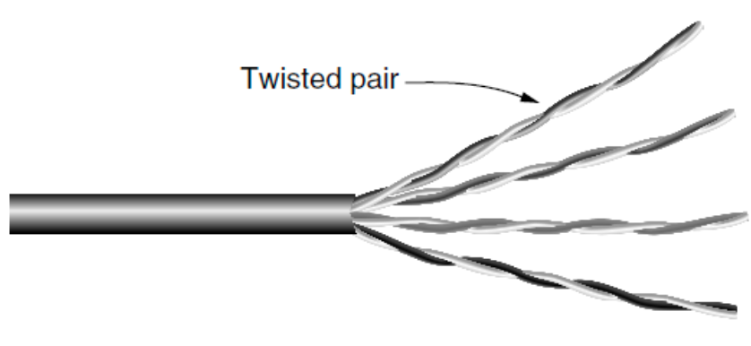

双绞线，通过一对线之间的电压差来传出数据（由于噪声会同时影响两条线，取差可以对噪声起到一定的免疫作用）。

双绞线既可以传输数字信号，也可以传输模拟信号。

带宽取决于线的厚度和传输距离，通常在几公里内可以达到 Megabits/sec 级别。

不同LAN标准中可能对双绞线的使用不同。

- **Full duplex** links: 1-Gbps Ethernet，四对线向同一方向传输
- **Half duplex** links: 100-Mbps Ethernet，两对线各朝一个方向传输
- **Simplex** links: 单向通道

**UTP**: Unshielded Twisted Pair (非屏蔽双绞线)

#### Coaxial Cable	

通常用于有线电视和城域网(MAN)。

现代电缆带宽可以达到 GHz 级。

#### Power Lines

把信号叠加到低频的电信号上。

- 不同房屋的电线电气特性各异，且随电器开关状态变化，导致数据信号在线路中反复反射。 
- 电器开关时的瞬态电流会在宽频段范围内产生电气噪声。

#### Fiber Optics

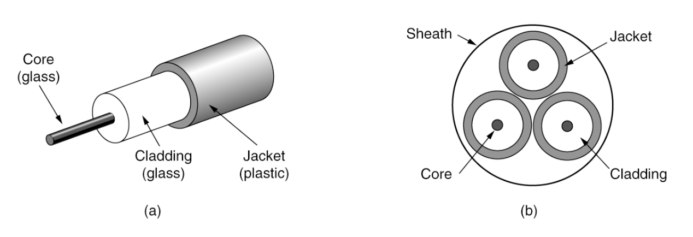

光纤本质上允许无限大的带宽，但是必须考虑成本。

通常被用于网络骨干的长途传输、高速LAN、高速Internet。

关键组成部分有 light source, transmission medium 和 detector

最常用的波段为 0.85, 1.30, 1.55$\mu m$ 附近。

**优点**

- 更高的带宽
- 不受电源浪涌、电磁干扰、断电及腐蚀性化学物质影响
- 纤薄轻巧
- 不泄漏光信号
- 难以窃听(tap)

**缺点**

- 技术门槛较高，需专业工程技能
- 过度弯折易导致光纤损伤

### Wireless

**Spectrum allocation**

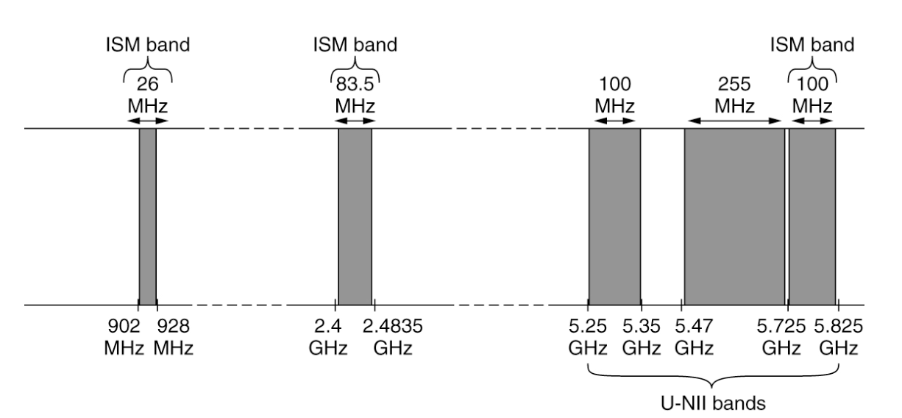

- ISM频段和U-NII（非授权国家信息基础设施）频段在美国由无线设备使用。
- 5 GHz频段相对未开发，但因其拥有最大带宽，且被802.11ac等WiFi标准采用。

#### Radio Transmission（无线电传播）

**Radio frequency(RF)** 波易于产生，可长距离传播，易穿透建筑物，广泛用于室内外通信。

无线电波具有全向性，对发射器和接收器没有严格要求。

无线电波的特性取决于频率

- 低频穿透能力强，但是功率衰减剧烈，在空气中衰减速率至少达到 $1/r^2$，这种现象为 path loss。
- 高频倾向于直线传播并在障碍物反射。

!!!Note
	光纤、同轴电缆和双绞线，信号每单位距离衰减的幅度相同，例如双绞线每100米衰减20dB。而无线电信号的衰减幅度随距离翻倍而保持不变。 这种特性意味着无线电波能够远距离传播，但用户间的干扰成为主要问题。

#### Microwave Transmission

100MHz以上，接近直线传播。

能量集中，波束小，要求发射天线和接收天线必须对准。

受地面障碍物影响，需要中继站，间距大致与基站高度平方根成正比。

- **multipath fading**: 延迟波与直达波产生相位差导致信号抵消。

#### Infrared Transmission（红外传播）

具有相对定向性，成本低易制造，但无法穿透固态物体。

操作红外不需要政府许可。

#### Light Transmission

光传输无需政府许可。

风、温度、雾等会干扰激光通信系统。

### Satellites

- **The principal satellite bands**

| Band | Downlink | Uplink  | Bandwidth | Problems                 |
| ---- | -------- | ------- | --------- | ------------------------ |
| L    | 1.5 GHz  | 1.6 GHz | 15 MHz    | Low bandwidth; crowded   |
| S    | 1.9 GHz  | 2.2 GHz | 70 MHz    | Low bandwidth; crowded   |
| C    | 4.0 GHz  | 6.0 GHz | 500 MHz   | Terrestrial interference |
| Ku   | 11 GHz   | 14 GHz  | 500 MHz   | Rain                     |
| Ka   | 20 GHz   | 30 GHz  | 3500 MHz  | Rain, equipment cost     |

#### MEO

Medium-Earth Orbit 卫星，高度位于两个 Van Allen belts 之间

- 经度方向缓慢移动（绕地球一周需6小时）
- 需要追踪其天空轨迹
- 地面覆盖范围较小
- 覆盖所需发射器功率低

用于导航系统

#### LEO

Low-Earth Orbit 卫星

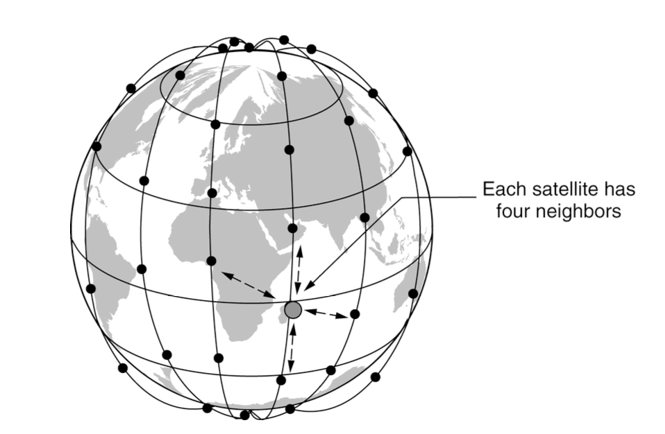

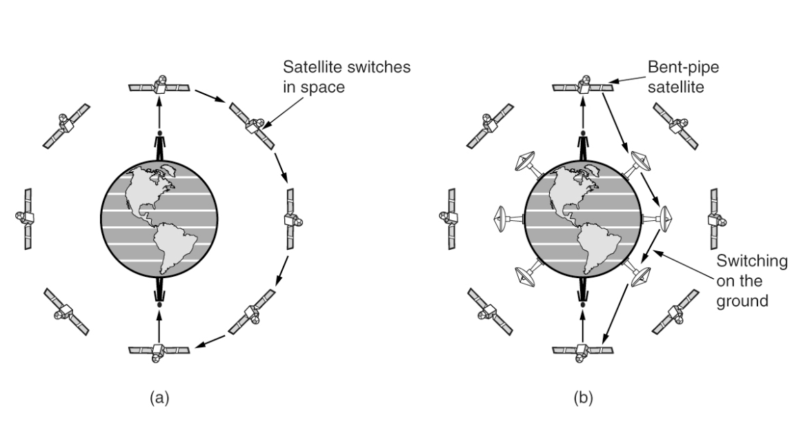

卫星通信相比于光纤通信的优势

- 快速部署能力
- 适用于地面基础设施欠发达地区的通信需求
- 满足关键广播传输需求

## Digital modulation and multiplexing

> **Definition**
>
> Bits 与其对应信号之间的转换过程称为**数字调制(digital modulation)**。

将 Bits 转换为信号主要有两种方案：

- Baseband transmission(有线通道): 信号频率范围从零起始，上限取决于传输速率
- Passband transmission(无线和光通信通道): 通过调节载波信号的振幅、相位和频率来传递比特。（信号占据载波频率周边的频带）

> **Definition**
>
> 通过单根导线传输多路信号称为**多路复用(Mutiplexing)**

### Baseband Transmission

- **NRZ**: 正电压/有光表示1，负电压/无光表示0。由于传输过程中的衰减可能会产生失真，接受端会将信号映射到近似值。信号每2bits可能会中正负切换，因此需要 bit rate 为 $B$ 时至少需要 $B/2$ Hz 的频率，即需满足Nyquist Bandwidth，$C=2B\log_2V$。

!!!Supplyment
	可以使用更高的信号级别来突破带宽限制（如2位信号）但是接收端需要有足够的识别能力。此时 <u>Bit rate = Symbol rate $\times$ the number of bits per symbol</u> (Baud rate = Symbol rate)。

!!!Supplyment
	NRZ存在时钟信号问题，即双方可能不同步。如果一直是0或1那过一段之间后就可能出现错位。可以通过单独发送时钟信号或与时钟信号XOR后发送来解决。

- **Manchester Encoding**: 用从低到高的转换表示0，从高到低的转换表示1。如图所示与时钟信号进行 XOR 操作可以转换回01序列，解决时钟信号问题，但是带宽开销增大一倍。 （很多Ethernet技术使用Manchester encoding）
- **NRZI**: 信号转变表示1，信号不变表示0。（USB标准使用NRZI）
- **Scrambling**: 在发送数据之前，用一个伪随机序列对信号进行XOR。不能保证完全不会出现一长串0或1，但减小出现的概率。
- **Balanced signals**: 即使在短时间里，正负电压也均等分布的信号。（平均值为0，没有直流分量）避免了某些通道由于物理特性而导致的直流分量强烈衰减。可以通过电容耦合(capacitive coupling) 来实现只通过交流分量。
- **bipolar encoding**: 使用正负两个电极来表示1（比如+1V和-1V），使用0V来表示0。这是一种balanced signals 的直接构造方式。

### Passband Transmission

通过调节信号的振幅、相位、频率来满足在任意频率传输信号（比如把带宽在 $0$ 到 $B$ Hz 的信号调节到 $S$ 到 $S$+$B$ Hz 来传输）

- **ASK** (Amplitude Shift Keying): 用两个不同的振幅来表示0和1（或更多位）。
- **FSK** (Frequency Shift Keying): 用不同的频率来表示码元。
- **PSK** (Phase Shift Keying): 将信号偏移一定相位来表示信号。如**BPSK** (Binary PSK): 使用0和180度表示1位信号；**QPSK** (Quadrature PSK): 用45, 135, 225和315度表示2位信号。

可以结合几种方法让每个码元表示更多bits，如 **constellation diagram**

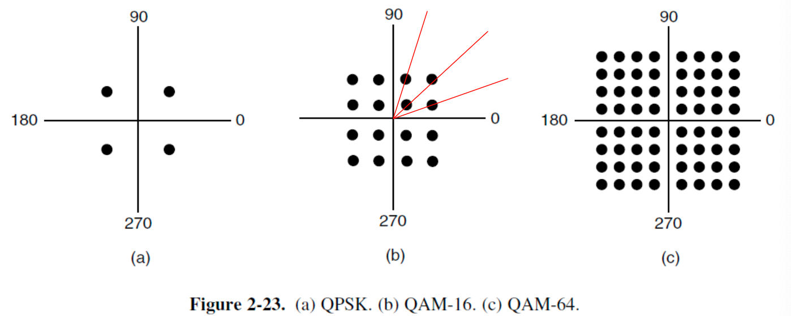

如图使用不同相位来表示不同信号，位于同一条直线上的用不同振幅来表示。可以使用 **Gray Code** 来减少噪声带来的影响。

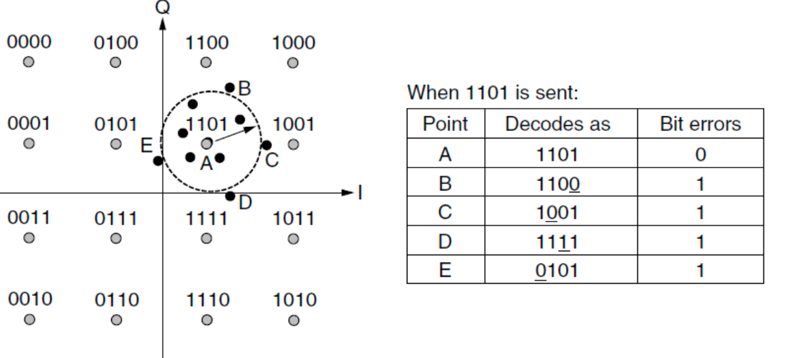

### FDM

**Frequency Division Multiplexing**。通过调制让不同的用户占据不同的频段，每个频段之间保持一定间距来防止互相干扰。

### OFDM

**Orthogonal FDM**。信道带宽被划分为多个子载波，这些子载波独立传输数据。每个子载波的频率响应经过设计，使其在相邻子载波中心处为零。为实现这一目标，需要设置保护间隔，在时间上重复部分符号信号，从而获得所需的频率响应特性。

### TDM

**Time Division Multiplexing**。每个用户可以在不同时间段占用整个带宽。需要添加guard time。

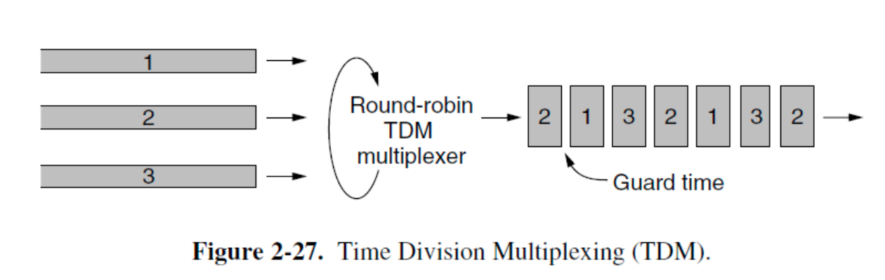

### CDM

**code Division Multiplexing**。把信号拓展到更宽的频段上，可以每一个station传输时信号都一直占满整个频段。

在 **CDMA** 中，每一个bit time被分成了$m$个 chips。通常每个bit有64或128个chips，每个station有自己独特的序列—**Walsh codes**。可以使每个sation的速率从 $b$ bits/s提升到 $mb$ bits/s，但是需要 $m$ 倍多带宽。（需要假设所有chips在接收端的时间是同步的）

- (a) chip sequences
- (b) chip sequences的信号表示
- (c) 六个传输序列的例子
- (d) C信号的恢复

多个chip sequences需要满足正交，在实际使用中需要让两个向量的点积绝对值尽量小。

## Communication Examples

### PSTN

**Public Switch Telephone Network**。

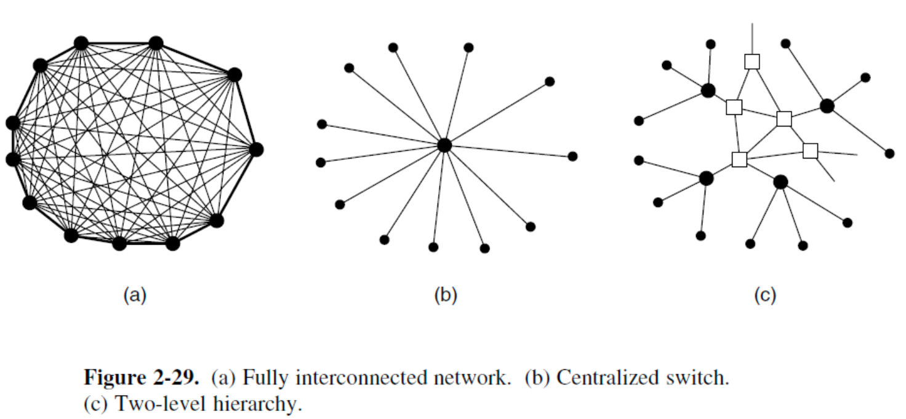

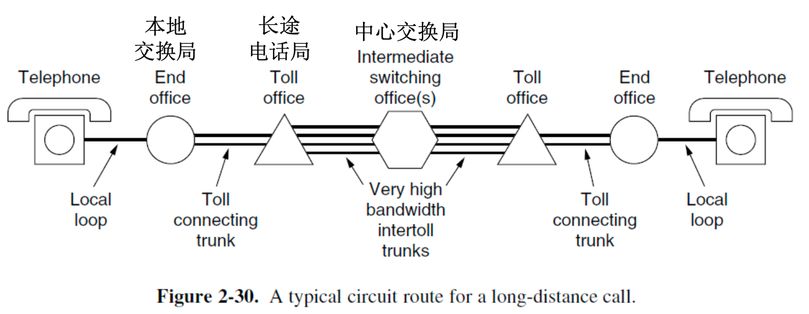

电话系统通常由三个主要部分组成：

- **Local loops**: telephone modem, ADSL, fiber
- **Trunks**(连接长途电话局的数字光纤链路): 主要考虑问题是多路复用(FDM和TDM)
- **Switching offices**(呼叫中不同trunk的转移):

#### Local Loop 

##### **Telephone modems**

调制解调器，用于比特流和模拟信号之间的转换。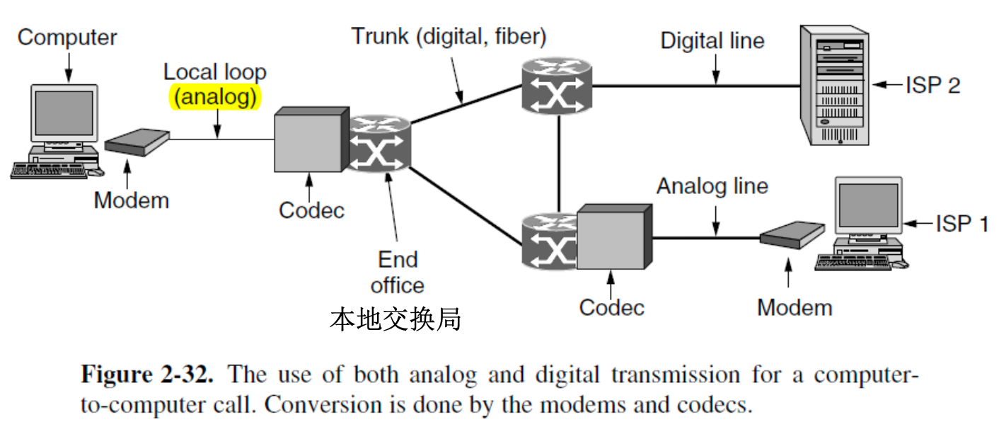

> **Theorem**
>
> 若采样频率达到原始频率的两倍，则不会产生Aliasing—— **the Nyquist Sampling Limit**。和带宽共同约束 baud rate 的上现。

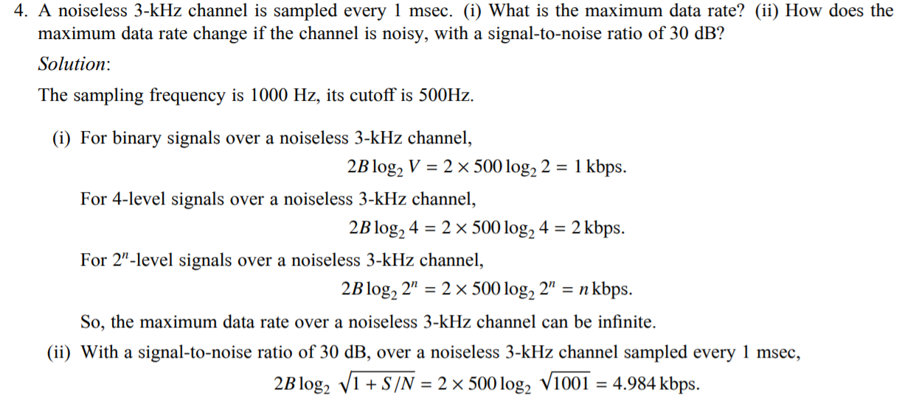

##### **Digital Subscriber Lines**

电话用于传输人声，因此只需要传输300Hz到3400Hz(通常使用4000Hz)的信号。而本地环路的物理性质可以支持大约1MHz，通过DSL可以充分利用带宽。

可以把可用的1.1MHz分成256个独立的大约为4kHz的通道，对这些通道使用 OFDM（中ADSL语境下通常叫做DMT (Dicrete MultiTone)）。其中 Channel 0 用于 POTS(Plain Old Telephone Service )，Channel 1-5 用于防止信号之间的互相干扰。剩下的250个通道中1个用于 upstream control，一个用于 downstream control，其余用于用户数据。

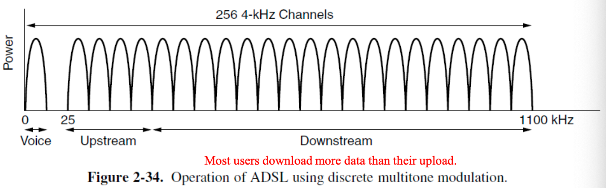

- 国际 ADSL 标准中: 8Mps downstream, 1Mbps upstream
- 第二代 ADSL 标准中: 12Mps downstream, 1Mbps upstream
- ADSL2+: 通过双绞线将带宽提升至2.2MHz，以此将downstream提升至24Mbps

##### **Fiber to the Home**

提供更快速、更优质的网络服务。通常将来自多户住宅的光纤汇聚，形成每百户共用单根光纤连接本地交换局。

- 下行方向采用光分路器将本地交换局信号分发至所有用户。若需限定特定用户解码信号，则需实施加密措施。
- 上行方向中，光合波器将各户信号汇聚为单一信号传输至终端办公室。

**PON(Passive Optical Network)**:  通常采用一种波长用于所有用户户内的下行传输，另一种波长用于上行传输。

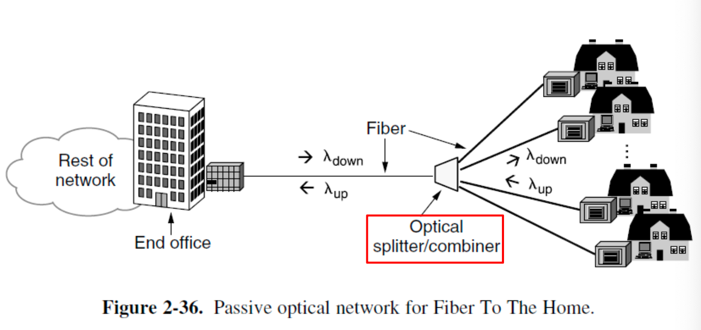

#### Trunks

相比local loops更快，而且有以下不同：

- 电话网络的核心传输数字信号而非模拟信号
- trunks同时承载大量通话，通常使用 TDM 和 FDM。（**SONET**: 光纤通信采用的TDM；**wavelength division multiplexing: **光纤通信中的FDM）

根据**Nyquist Theorem**，对带宽为4kHz的电话信号需要进行8000Hz的采样，然后将个样本分为8个bits，这种标准为 **PCM**，此时满足：

- Data rate = 8000 samples/sec = 64 kbps
- Sample rate = 125 µsec/sample

##### TDM

- **T1/E1**

<!DOCTYPE html>
<html lang="zh-CN">
<head>
</head>
<body>
  <table>
    <colgroup>
      <col style="width:12%">
      <col style="width:44%">
      <col style="width:44%">
    </colgroup>
    <thead>
      <tr>
        <th>特性</th>
        <th>T1 (北美/日本)</th>
        <th>E1 (欧洲/国际)</th>
      </tr>
    </thead>
    <tbody>
      <tr>
        <td>总速率</td>
        <td>1.544 Mbps</td>
        <td>2.048 Mbps</td>
      </tr>
      <tr>
        <td>通道数</td>
        <td>24 × 64 kbps</td>
        <td>32 × 64 kbps</td>
      </tr>
      <tr>
        <td>帧结构</td>
        <td>193 bit/帧</td>
        <td>256 bit/帧</td>
      </tr>
      <tr>
        <td>结构</td>
        <td>每1帧由 24 channels ×8 bits 数据和 1 bit 的 framing code 组成</td>
        <td>32个通道中 TS0 用于控制/帧同步，TS16 用于电话呼叫控制，其余 30 个用于数据</td>
      </tr>
    </tbody>
  </table>
</body>
</html>

可以通过多层叠加达到更快的速率：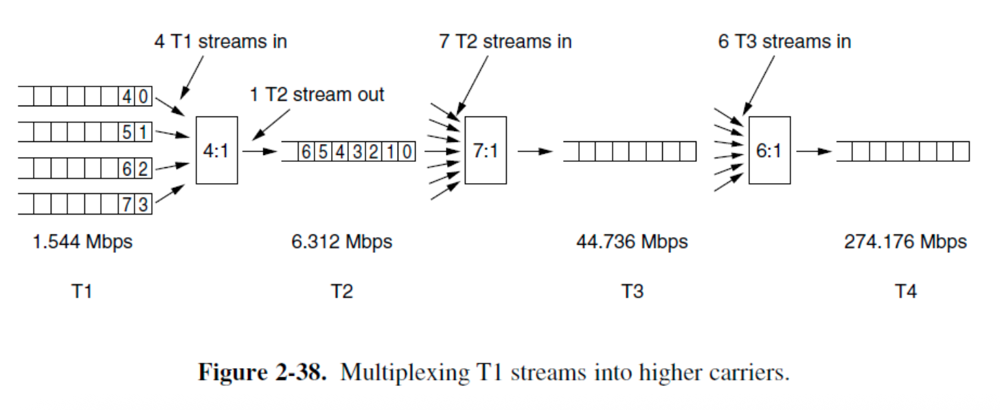

- **SONET(Synchronous Optics NETwork)**: 基本SONET帧为810bytes数据块，每125µs输出一次。810bytes可以视为90列$\times$9行的矩阵。data rate = $810\times 8\times 8000=51.84\text{Mbps}$。此布局构成基础SONET通道，称为**STS-1**，所有SONET trunks都是STS-1的倍数。

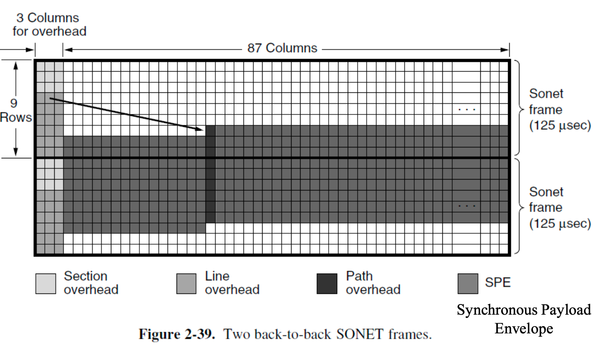

##### **WDM**

Wave-length Division Multiplexing

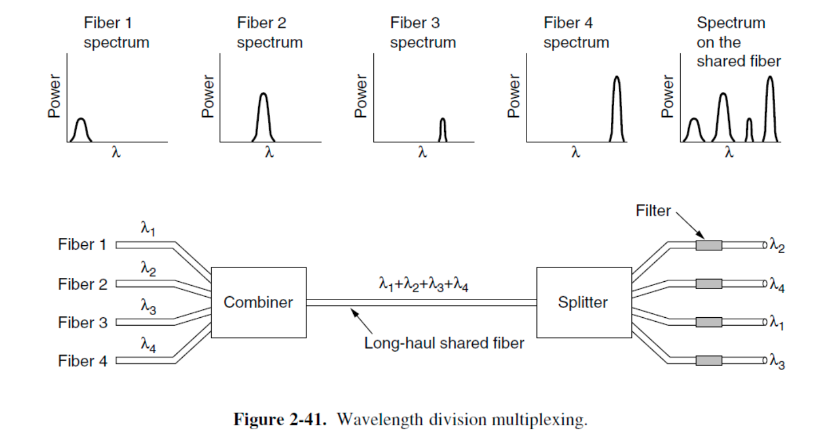

#### Switching

- **Circut Switching**: 一旦建立连接，双方之间便存在一条专用的物理路径，该路径将持续存在直至通话结束。传输数据前必须建立端到端路径。
- **Packet Switching**: 无需预先建立专用路径。路由器采用 **store-and-forward** 的方式来传输每个packet到指定目的地。存在排队延迟与拥塞问题。

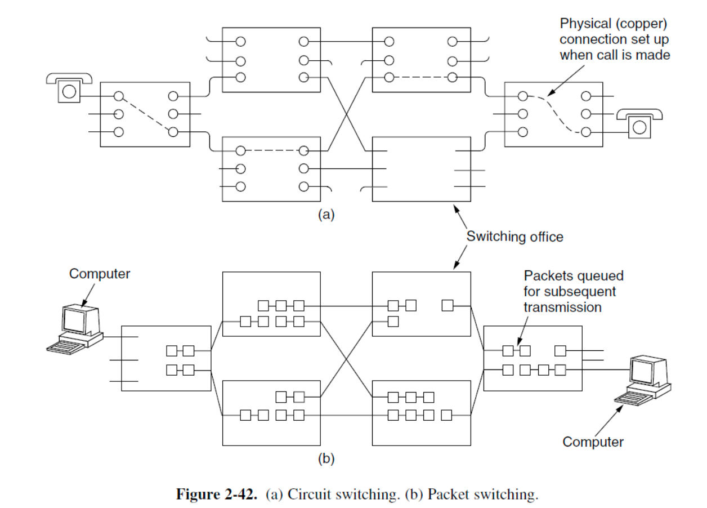

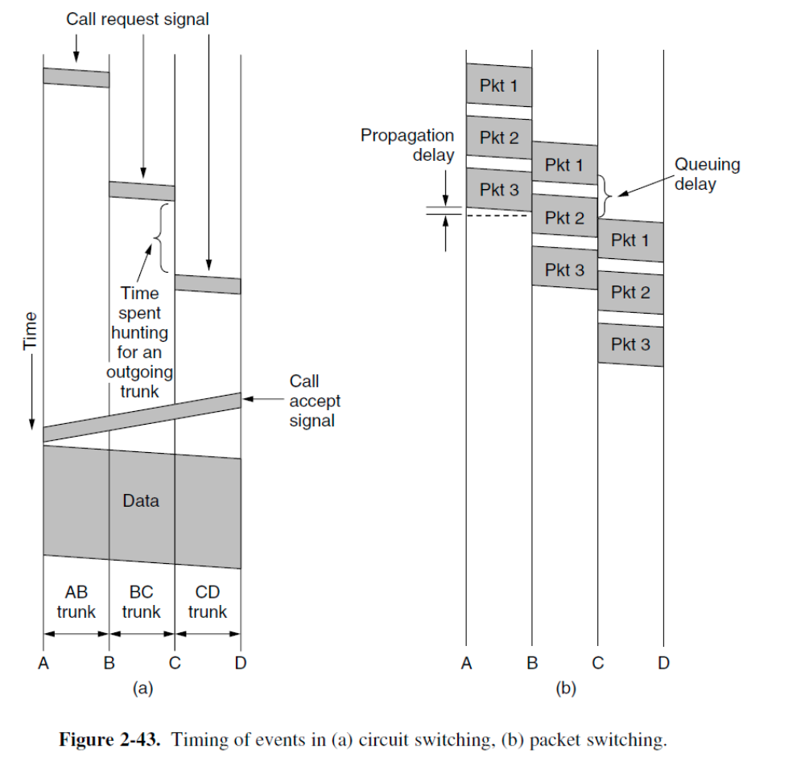

### Cellular Networks

#### GSM

**Global System for Mobile Communications**。

- **SIM card**: Subscriber Identity Module
- **VLR**: Visitor Location Register
- **HLR**: Home Location Regirter

#### CDMA

- Soft handoff

### Cable Networks

#### HFC

**Hybrid Fiber-Coax cable network**.

#### The fixed telephone system

HFC中很多houses共享一根cable，而the telephone syetem里每个house都有自己独立的local loop。