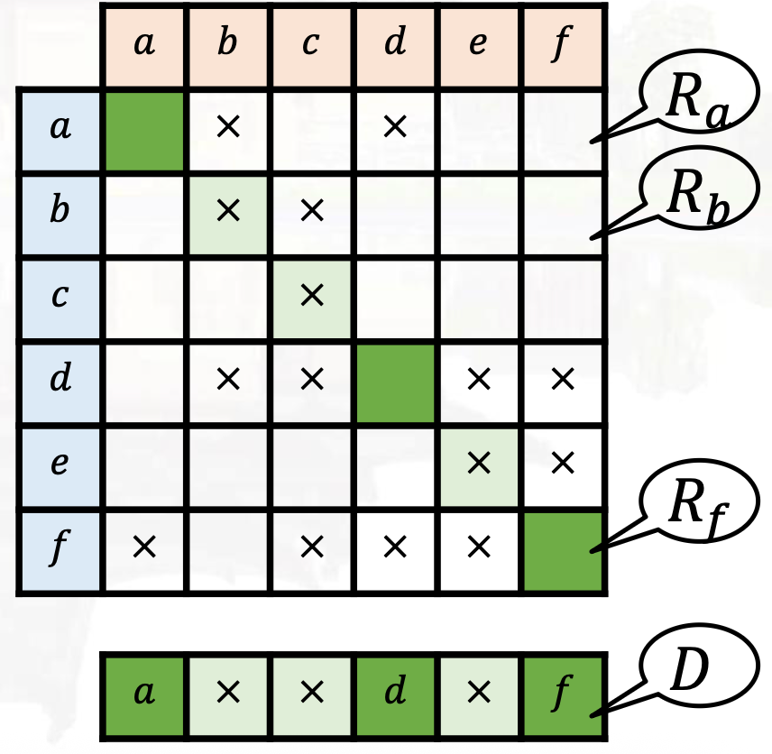

# Sets, Relations, and Language

## 1.1 Sets

### Power Set

$$
2^A=\{T|T\subseteq A\}
$$

### Partition

一个Power Set的子集 $\Pi$，满足：

- $\Pi \neq \phi$
- $\forall S,T\in \Pi,\text{and}~S\neq T,S\cap T=\phi$
- $\cup \Pi=A$

## 1.2 Relations and Functions

### Domain and Range

对于两个集合 $A,B$，定义一个关系$R=\{(a,b):a\in A,b\in B\}$

- **Domain**: $A$ 中的所有元素
- **Range**：$B$ 中的所有元素

### Function

定义函数 $f:A\rightarrow B$

- **Injection**: One-to-one function, $\forall a,b\in A~\wedge~a\neq b,~f(a)\neq f(b)$

- **Surjection**: Onto funtion, $\forall b\in B,~\exist a\in A,~\text{such that }f(a)=b$

- **Bijective**: 同时满足 Injection 和 Surjection

>**Note**
>
>存在函数即不是 Injection 也不是 Surjection。

## 1.3 Special Types of Binary Relations

- Directed Graph
- Matrix

### Properties of Relations

- **Reflexive**: $\forall a\in A\Rightarrow (a,a)\in R$ （需要对所有 $a$ 考虑）
- **Symmetric**: $(a,b)\in R ~\wedge~a\neq b\Rightarrow (b,a)\in R$ （不需要考虑所有，只对存在的关系考虑）
- **Antisymmetric**: $(a,b)\in R ~\wedge~a\neq b\Rightarrow (b,a)\notin R$ （不需要考虑所有，只对存在的关系考虑）

- **Transitive**: $(a,b)\in R,(b,c)\in R\Rightarrow (a,c)\in R$ （不需要考虑所有，只对存在的关系考虑）

### Equivalence Relation

定义：Reflexive, Symmetric, Transitive

用无向图表示，包括几个clusters，每个里面的点两两都有线相连。

#### Equivalence Classes

$[a]=\{b|(a,b)\in R\}$，即所有在同一个cluster内的点的集合。

如下图：

- $[a]=[b]=[c]=\{a,b,c\}$
- $[d]=[e]=\{d,e\}$
- $[f]=\{f\}$

>**Theorem**
>
>$𝑅$ 是空集 $𝐴$ 上的一个equivalence relation。则𝑅的等价类构成𝐴的一个partition。

### Partial Order

对于一个集合 $A$， 和一个二元关系 $\leq$，即 $(A,\leq)$ 满足：

- Reflexive: $\forall a\in A, a\leq a$
- Transitive: $a\leq b,b\leq c\Rightarrow a\leq c$
- Antisymmetric: $a\leq b, b\leq a\Rightarrow a=b$

#### Min/Max

- **Least/Greatest **element: $\forall b\in A,a\leq/\geq b$（唯一最小/最大，与所有点相比）
- **Minimal/Maximal ** element: $b\leq/\geq a \Rightarrow a=b$（局部最小/最大，允许无法比较的点）

### Total Order

- 满足 Partial Order
- $\forall a，b，\text{then }a\leq b\text{ or }b\leq a$（所有点对都可比较）

## 1.4 Finite and Infinite Sets

### Equinumerous

$A\sim B \Longleftrightarrow \exists \text{ bijection }f:A\rightarrow B$

满足 equivalentce relation

- Reflexivity: $A\sim A$
- Symmetry: $A\sim B \Rightarrow B\sim A$
- Transitivity: $A\sim B,~B\sim C\Rightarrow A\sim C$

### Cardinality

集合里元素的个数，用 $|A|$，$card(A)$，$\#A$ 表示

Equinumerous sets 有相同的cardinality。

###  Infinite Set

#### Countable Infinite 

与自然数集 $\N$ Equinumerous

**Example: ** $\N\times\N$

- Solution1:

  

- Solution2: find a bijection: $f((m,n))=\frac{1}{2}[(m+n)^2+3m+n]$

- Solution3: 构建两个映射 $f:\N\rightarrow \N\times \N$，$g:\N\times\N\rightarrow \N$

  然后证明 $|\N|\leq |\N\times\N|$ 和 $|\N\times\N|\leq |\N|$

  可以取 $f(n)=(n,0),g((m,n))=2^m3^n$

#### Uncountable Infinite 

与实数集 $\R$ Equinumerous

> **Theorem**
>
> $|\R|>|\N|$

### Cantor’s Theorem

记 $f: A\rightarrow P(A)\text{ or }2^A\text{(power set)}$，则对于任意集合 $A$ ，$card(A)<card(P(A))$

#### Proof

即证明 $f:A\rightarrow P(A)$ 不满足 surjective

Case1: $A$ 是有限集，显然。

Case2: $A$ 是无限集

- $|A|\leq|P(A)|$. $Proof$:  $f(x)={x},\forall x\in A$，则 

- $|A|\neq|P(A)|$. $Proof$: 假设存在一个surjection $f(x)$，构造 $B=\{x\in A|x\notin f(x)\}$，则存在 $t$，使得 $f(t)=B$ 

  如果 $t\in B$，则 $t\notin f(t)$ , 但是 $f(t)=B$，矛盾

  如果 $t\notin B$，则 $t\in f(t)$，但是 $f(t)=B$， 矛盾
  

!!!Note
	此处可以使用Diagonalization Principle证明，构造的 $B$  即为 diagonal set $D$ ，任意 $R_a$ 即为所有 $f(x)$，则可知 $B$ 与所有 $f(x)$ 都不同。

> **Theorem**
>
> $\N$ 的 power set 不可数

 

## 1.5 The Principle of Mathematical Induction

### The Principle of Mathematical Induction

数学归纳法

### The Pigeonhole Principle

如果 m 个物品放入 n 个箱子，且 m>n，则至少有一个箱子里有2个物品

### The Diagonalization Principle

对于一个集合 $A$ 有二元关系 $R$ ，记diagonal set $D=\{a|a\in A ~\wedge~(a,a)\notin R\}$。对于 $A$ 中的任意一个元素 $a$，记 $R_a=\{b|b\in A~\wedge (a,b)\in R\}$。则 $D$ 与任意一个 $R_a$都不同。

如下图:
- $D=\{a,d,f\}$
- $R_a=\{b,d\},R_b=\{b,c\},R_c=\{c\},R_d=\{b,c,e,f\},R_e=\{e,f\},R_f=\{a,c,d,e\}$

## 1.6 Closure

对于任意二元关系𝑅，可通过以下性质的任意组合形成closure：Reflexive, Symmetric, Transitive

!!!Note
	一个关系 $R$ 关于 Reflexive 和 Transitive 的 closure 记作 $R^*$
	一个关系 $R$ 关于 Transitive 的 closure 记作 $R^+$

 

## 1.7 Alphabet and Language

### Alphabet

任意有限集合被称为 alphabet (字母表)。alphabet 中的元素被称为 alphabet 的 symbols。

> alphabet 用符号 $\Sigma$ 表示

### Strings

alphabet $\Sigma$ 中符号的有限序列。

- $e$ 表示空string
- $\Sigma ^*$ 表示 $\Sigma$ 上的所有strings

#### Operation of Strings

- Concatenation: $x\circ y $ or $xy$ 
- String exponentiation: $w^0=e,w^{i+1}=w^i\circ w$

- Reversal

### Language

Strings 构成的集合。记 language $L\subseteq \Sigma^*$

!!!Note
	$\phi,\Sigma,\Sigma^*$ 都是 language

>**Theorem**
>
>如果 $\Sigma$ 是有限字母表，则 $\Sigma^*$ 是可数无限集合

- 非空字母表上的字符串数量为**可数无穷**
- 非空字母表上的任意语言都是**可数集合**（语言上所有字符串构成的集合的子集）
- 非空目标上的语言数量为 $|R|$ （数量为可数无穷集合的power set的数量）

#### Operations of Languages

- Union, Intersection, Difference, Complement($\overline L=\Sigma^*-L$)
- Exponentiation: $L^0=\{e\}, L^{i+1}=LL^{i}$
- Concatenation: $L_1L_2=\{w_1w_2|w_1\in L_1~\wedge~w_2\in L_2\}$
- 
