# Application Layer

## Overview

应用层协议通常就是应用程序的一部分，基于传输层构建分布式网络服务（DNS、Web）。

#### OSI Session/Presentasion Layers


#### Applications and Application Level Protocols

三个关键概念：

- Protocol
- Service model
- Interface

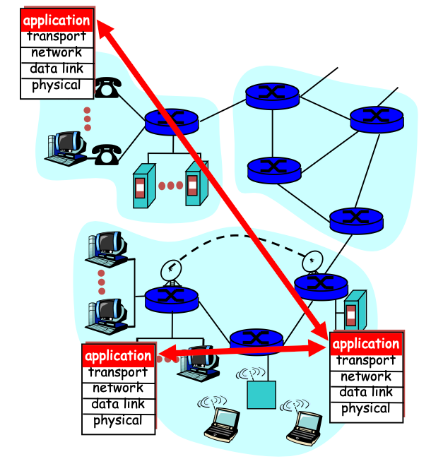

 网络应用不只是应用层协议，完整的网络应用包括三个部分：

- Client site
- Server site
- Application level protocol

不同应用对传输层（TCP/UDP）有不同的需求，主要取决于下面三个参数：

- **Data Loss**
- **Bandwidth**
- **Timing**


## DNS (Domain Name System)

IP地址难以记住，并且变化频繁，因此引入了高级可读名称，以实现机器名称与地址的解耦。

DNS的本质是实现一个**分层域式命名方案**并构建**分布式数据库**系统实现主机名与网络地址的转换。为将名称映射至IP地址，应用程序需调用名为**解析器(resolver)**的库程序，并将名称作为参数传递。

- **查询与响应消息均以UDP数据包形式发送。**

由于存在以下问题，DNS服务器不能采用集中式设计：

- Single Point of Failure（单点故障）
- Traffic Volume（流量太大）
- Distant Name Server = Slow Response（远距离查询导致高延迟）
- **Scalability（不可扩展性）**

### Hierarchy of DNS Servers

DNS服务器服务器可以划分成三大类：

- **root** DNS servers
- **top-level domain** (**TLD**) DNS servers
- **authoritative** DNS servers


### Root Nameservers

根域名服务器(Root Nameservers)位于 **DNS 层级最顶端**，负责告诉客户端顶级域名（TLD）服务器的位置。每个“服务器”实际上是 **由多个服务器集群组成**。

大多数服务器都使用 **IP Anycast** 技术提供服务外：

- 同一 IP 地址在 **多个地理位置**上部署
- 可以使用 **anycast routing** 到达
- 数据包会被路由到 **最近的服务器实例**

### The DNS Name Space

DNS 的命名空间是 **分层（Hierarchical）的**，从最顶层的 **根（`.`）** 开始。

**Top-Level domains(TLDs)** 主要有两类

- 22+ **generic TLDs**: Initially .com, .edu, .gov, .mil, .org, .net等
- ~250 **country code TLDs**: 两个字符


### DNS Zones

为了避免集中式信息源的问题，DNS 将命名空间划分为 **不重叠的区域（nonoverlapping zones）**。**区域(Zone)**是命名空间中连续的部分。每个区域由一个或多个域名服务器管理。


### Domain Resource Records

每个域名，无论是单个主机还是顶级域名，都可能关联一组资源记录。这些记录构成了**DNS数据库**。当解析器向DNS提供域名时，返回的是与该名称关联的资源记录。DNS的主要功能是将域名映射到资源记录。

资源记录(resource record)是五元组，格式为: `Domain_name, Time_to_Live, Class, Type, Value`。

- **Domain_name**: 标识该记录所适用的域名。通常每个域名存在多条记录，且每个数据库副本都包含多个域名的信息。因此该字段是满足查询需求的**首要检索键**。
- **Time_to_live**: 反应记录的稳定性。大值表示信息高度稳定；小值表示信息容易变化。
- **Class**: <u>对于Internet信息，始终为 IN</u>。对于其他信息用其他编码，现实中很少见，
- **Type**: 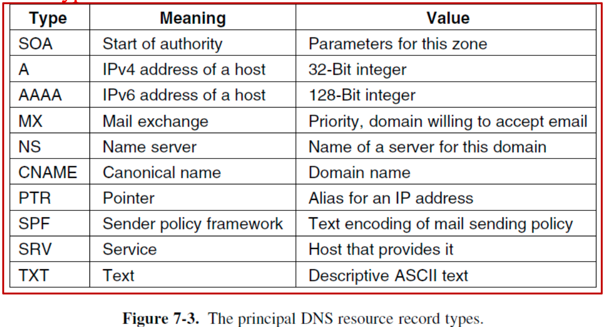
  - `SOA`: 提供区域信息的主要来源名称，告诉 DNS 哪台服务器是该 zone 的主服务器。
  - `A`: 某个主机的接口的32位IPv4地址。
  - `AAAA`: 128位IPv6地址。
  - `MX`: 指定可接收特定域名邮件的主机名称。
  - `NS`: 指定域或子域的name server。该主机持有域数据库的副本。
  - `CNAME`: 允许创建别名（宏定义）。
  - `PTR`: 用于将名称与IP地址关联，用于反向解析(**reverse lookups**)，将 IP 地址映射回域名。
  - `SRV`: 指定某个域内的主机提供特定服务，比MX更通用。
  - `SPF`(Sender Policy Framework): 指定该域允许哪些服务器发送邮件，用于防止邮件伪造 / 垃圾邮件。
  - `TXT`: 最初的设计目的是让域名能够以任意方式标识自己。
- **Value**: 可以是数字、域名或ASCII字符串。其语义取决于记录类型。


### DNS Resolution

DNS协议允许把任何主机域名转换成IP地址，若解析失败，则从根域名服务器开始逐级向下查询区域。


#### Recursive Queries

客户端（通常是主机上的解析器 resolver）向一个 递归 DNS 服务器（通常是本地 DNS 服务器）发送一个 DNS 查询。全部查询操作由递归 DNS 服务器完成，客户端只需发送一次查询请求然后等待结果。（如上图左侧部分）

> 适用于客户端→本地 DNS

**优点**

- 简化客户端DNS解析器的处理流程。
- 递归DNS服务器可通过缓存优化查询过程。

**缺陷**

- 递归DNS服务器可能因接收大量请求而过载。
- 递归DNS服务器存在安全风险，如果递归DNS服务器收到恶意攻击，会导致网络钓鱼或将用户重定向至恶意网站等问题。

#### Iterative Queries

DNS解析器（通常为客户端DNS服务器）向不同DNS服务器发送一系列请求直至获得所需答案的过程。当DNS解析器发起迭代查询时，会从根DNS服务器开始。（如上图右侧部分）

> 适用于本地 DNS→root/TLD/权威

**流程**

1. 本地DNS先查询根DNS，根DNS只知道级域名（TLD）服务器（如.edu服务器），因此返回TLD服务器的IP地址
2. 本地DNS查询TLD，TLD提供washtington.edu域名的权威DNS服务器的IP地址。
3. 本地DNS查询权威DNS服务器，最终提供www.cs.washington.edu的IP地址。

**优点**

- 减轻除根服务器和顶级域名服务器外的DNS服务器负载，因为本地DNS解析器承担了大部分追踪转发的工作。
- 本地DNS服务器可为多个客户端缓存数据，提升性能。

**缺点**

- 由于解析器需向不同服务器发起多次请求并等待响应，处理过程可能更耗时。

### DNS Caching vs. Freshness

- 缓存可降低DNS解析延迟
- 缓存可减轻服务器负载
- 缓存会延迟更新
- 缓存将在一定时间后失效
- 信息缓存时长介于5分钟至72小时（TTL）

### Local Nameservers

通常由IT部门管理（企业、高校、ISP）。 客户端需能连接本地域名服务器，通常通过DHCP配置。

### DNS Protocol

**Query and Response Messages**

- DNS 查询与响应都**基于 UDP**，使用 **端口 53**。
- 使用 ARQ 机制保证可靠性，DNS 服务器是 stateless（无状态）的，服务器不保留客户端状态。
- 利用 **16-bit ID 字段**匹配

**Service reliability via replicas(副本)**

- 为域名运行多个域名服务器。
- 返回服务器列表；客户端仅使用其中一个响应。
- 同时有助于负载均衡

**Security**

- DNSSEC (DNS Security Extensions)


## FTP (File Transfer)

用于在本地主机与远程主机之间传输文件。

**流程**

- 用户首先提供远程主机的主机名，本地主机上的 FTP 客户端进程将与远程主机上的 FTP 服务器进程建立 TCP 连接。
- 然后，用户提供用户名和密码，这些信息将作为 FTP 命令的一部分通过 TCP 连接发送。
- 服务器验证用户身份后，用户将一个或多个存储在本地文件系统中的文件复制到远程文件系统中（反之亦然）。

FTP 使用**两个并行的 TCP 连接**，一个用于控制连接，一个用于数据连接。

- 控制连接：传输控制信息，比如用户名、密码、远程路径转移命令、put/get命令。即FTP的控制信息采用**out-of-band**的方式传输，独立于数据信息，命令与响应采用 **7-bit ASCII**。（**端口21**）
- 数据连接：用于发送文件。（**端口20**）


## Email (Electronic Mail)

Email是一种**异步(asynchronous)**的通信媒介。主要有三个组成部分：

- 用户代理（客户端，例如 Outlook、Gmail 网页版）
- 邮件传输代理（邮件服务器）
- 简单邮件传输协议：SMTP

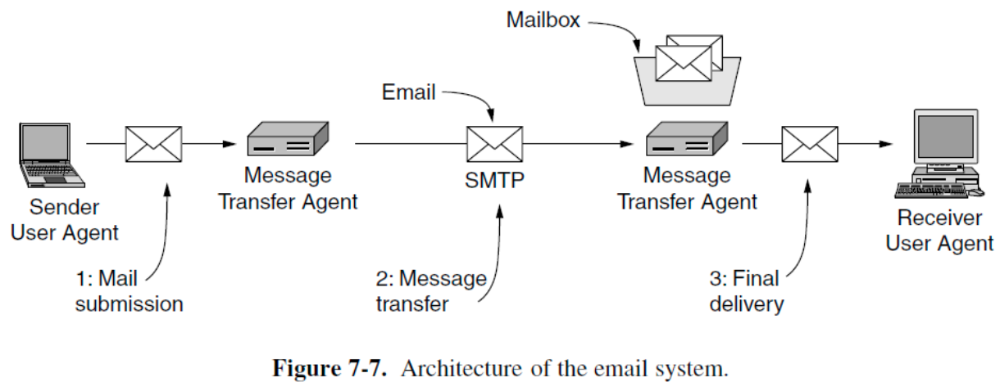

### SMTP

SMTP 是互联网电子邮件的主要应用层协议。使用 TCP 的可靠数据传输服务将邮件从发件人的邮件服务器传输到收件人的邮件服务器。

与大多数应用层协议一样，SMTP 分为两部分：

- 客户端：在发件人的邮件服务器上运行
- 服务端：在收件人的邮件服务器上运行

<u>SMTP 的客户端和服务器端都运行在每个邮件服务器上。</u>

SMTP要求邮件消息只能是**7位 ASCII**，因此二进制多媒体数据在通过 SMTP 发送之前编码为 ASCII，到达后需要进行解码。

SMTP 发送邮件时一般不使用中间邮件服务器转发，传输流程如下：

- 客户端 SMTP通过 **TCP** 协议与服务器 SMTP的 **25 端口**建立连接。（如果服务器宕机，则在一段时间后重试）
- 连接建立后，服务器和客户端会执行一些应用层握手。在 SMTP 握手阶段，SMTP 客户端会提供发件人的电子邮件地址和收件人的电子邮件地址。
- SMTP 客户端和服务器完成相互验证后，客户端会发送邮件。如果客户端还有其他消息要发送到服务器，则会通过同一 TCP 连接重复此过程，否则断开TCP连接。

### Email Message Format

- Envelope: 封装了消息。它包含传输消息所需的所有信息，例如目标地址、优先级和安全级别。**消息传输代理使用信封进行路由**。
- Message：分为 **header** 和 **body** 两个部分，header包含用户代理的控制信息，body是供对方查看的内容。


#### Internet Message Format


### User Agent

用户代理是一种程序（也称为“电子邮件阅读器”）,用于撰写、接收和回复邮件，以及操作邮箱，流行的用户代理有Google Gmail、Microsoft Outlook等。发送和接收的邮件存储在服务器上。

### MIME (The Multimedia Internet Mail Extension)


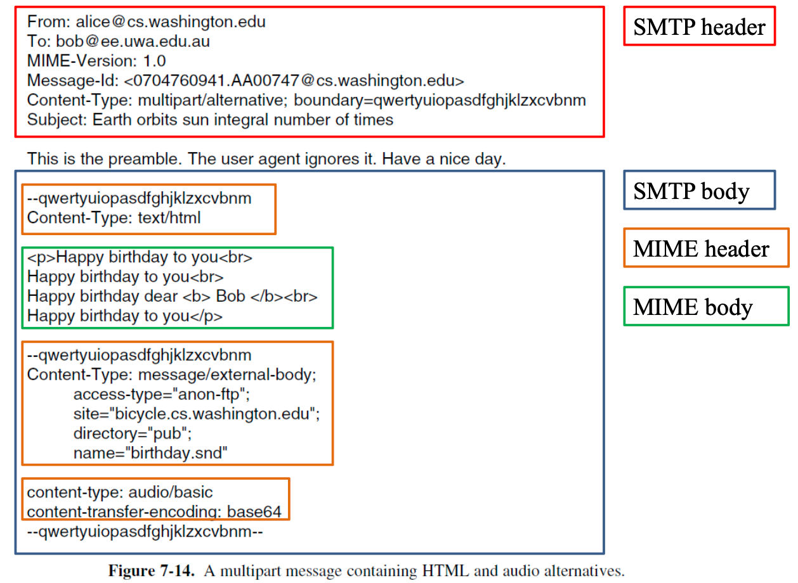

### Mail Access Protocols

SMTP 是 **推送（push）协议**，无法拉取(pull)信息。**Mail Access Protocol**用于**从收件服务器获取邮件**：

- **POP(端口110)**: 授权与下载，不维护会话状态，无法在服务器上直接管理邮件。
- **IMAP(端口143)**: 功能更强大，支持服务器端操作，可以操作服务器上的消息存储，维护用户状态（会话期间同步状态）。
- **HTTP**: 用户通过浏览器访问服务器，速度慢。


## HTTP (The HyperText Transfer Protocol)

Web的应用层协议，是Web的核心。

HTTP是一个简单的请求-响应协议，通常运行在 **TCP** 上运行。（HTTP 只负责传输数据，而不关心浏览器如何显示或执行网页内容）

**Web Page**（也称为document）由对象组成。对象就是一个文件，例如HTML文件、JPEG图像、Java小程序或视频片段等，可以通过单个URL访问。

### Web Context


### HTTP Context

HTTP是用于请求网页资源的请求-响应协议：

- 使用 **TCP** ，通常在 **端口80**
- 是浏览器/服务器应用程序的一部分，Web 浏览器（例如 Internet Explorer 和 Google 浏览器）实现了 HTTP 的客户端。
- HTTP 是一种无状态协议。（服务器将请求的文件发送给客户端，而不会存储任何关于客户端的状态信息。）


### Fetching a Web page with HTTP (the Client Side)

从网页的URL开始：

**流程：**

- 将服务器名称解析为 IP 地址（DNS）
- 建立与服务器的TCP连接
- 发送HTTP请求，等待HTTP响应
- 执行/获取嵌入式资源/渲染 (不只是展示网页中内容，可能还要运行程序等)
- 清理空闲的 TCP 连接

URL 设计具有开放性，这意味着浏览器可以轻松地使用多种协议来获取不同类型的资源。


### The Server Side

**流程：**

- 接受来自客户端（浏览器）的TCP连接
- 获取页面路径，即所请求的文件名称
- 从磁盘获取文件
- 向客户端发送文件内容
- 释放TCP连接


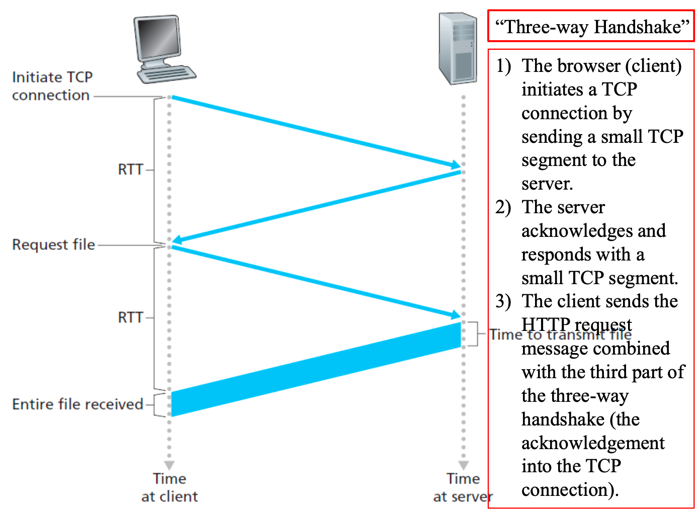

### Cookies

**HTTP Cookie**是一小段数据（最多 4KB），服务器会将其发送到用户的 Web 浏览器。通常，它用于判断两个请求是否来自同一浏览器，即保持用户登陆。cookie可以为**无状态**的HTTP协议记住状态信息。

Cookie主要有以下三个目的：

- Session management（会话管理）: 登陆信息、购物车信息或其他要记住的信息。
- Personalization：用户偏好、主题和其他设置。
- **Tracking**：记录和分析用户行为。

一个 Cookie 最多可以包含五个字段：

- **Domain**：指示 Cookie 的来源。
- **Path**：服务器目录结构中的一个路径，用于标识服务器文件树的哪些部分可以使用该 Cookie。
- **Content**：存储 Cookie 的内容。
- **Expires**：指定 Cookie 的过期时间。如果缺少该字段，则浏览器关闭时就丢弃cookie(**nonpersistent cookie**)；如果提供了时间和日期，则为 **persistent cookie**。
- **Secure**：用于指示浏览器只能通过安全传输方式将 Cookie 返回给服务器。此功能用于电子商务。


### **HTTP Performance**

使用 **PLT(Page Load Time)** 来衡量web的性能。减小PLT的方式主要有以下几种：

- 减小传输内容的大小（压缩技术）
- 优化 HTTP 以更好地利用可用带宽
- 优化 HTTP 以避免重复传输相同内容（缓存与代理）
- 将内容移至更靠近客户端的位置（CDNs, Content Distribute Networks)

#### Change HTTP: Parallel Connections

浏览器建立多个 TCP 连接，因此可以并行发送多个 HTTP 请求。

**优点**：能更好地填满带宽

**缺陷**：

- 每个 TCP 连接建立至少需要 1 个 RTT，TCP 连接释放也有成本。(**extra overhead**)
- 相互之间会发生网络资源的竞争。<u>TCP 独立地对每个连接执行拥塞控制</u>。因此，连接之间相互竞争，**导致丢包增加**，并且总体而言，它们比单个连接更消耗网络资源。

#### Change HTTP: Persistent Connections

HTTP 1.1 使用持久连接（连接重用）：

- 向单个服务器建立 1 个 TCP 连接
- 可将其用于**多个 HTTP 请求**
- 可以对请求进行**流水线处理**，即在请求 1 的响应到达之前发送请求 2。
- 持久连接的优势取决于页面结构，但对网络资源消耗较小。

!!!Note
	由于存在**资源竞争、头部信息处理复杂、连接管理开销、缓存策略干扰**的问题，persistent connection 可能会更慢。

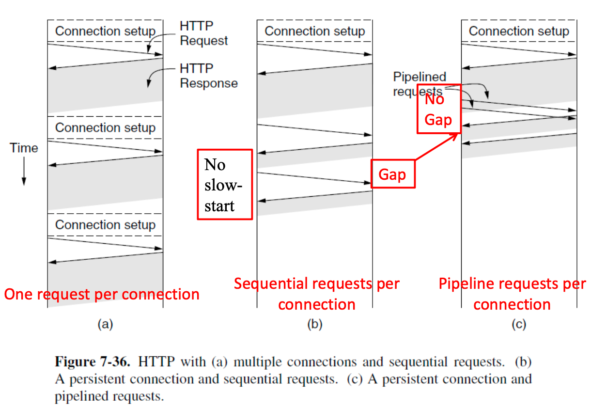

#### Change HTTP: HTTP/1.1 vs HTTP/2

1. Server Push：HTTP/2允许服务器推送
2. 在 HTTP/1.1 中，可以通过同一个 TCP 连接连续发送多个请求，但规则是这些请求必须按顺序处理，并且结果必须按顺序返回。而在 HTTP/2 中，响应可以以任意顺序返回。

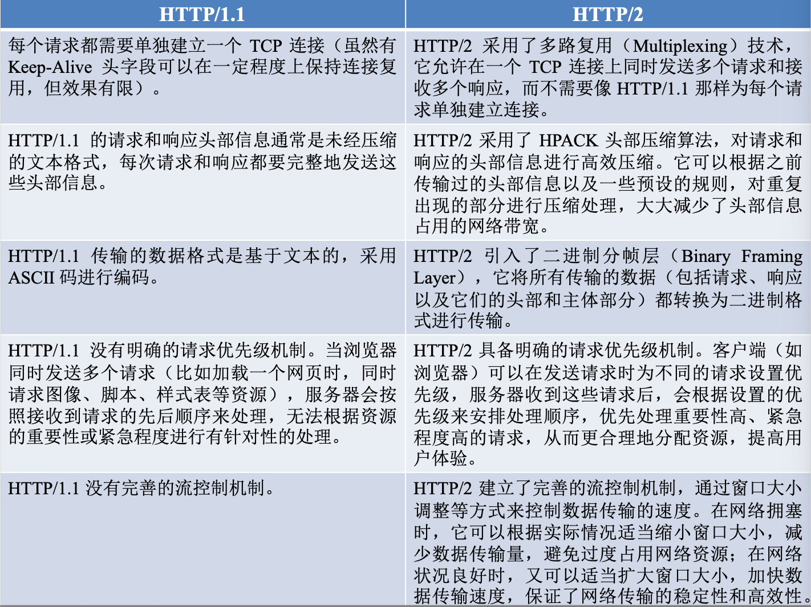

#### Change HTTP: HTTP/3

HTTP/3: HTTP-over-**QUIC**。HTTP/3 的主要优化在于它用于支持 HTTP 消息的传输协议：它不依赖于 TCP，而是依赖于称为 **QUIC(Quick UDP Internet Connection** 的增强版 UDP。

1. 建立连接的延迟低

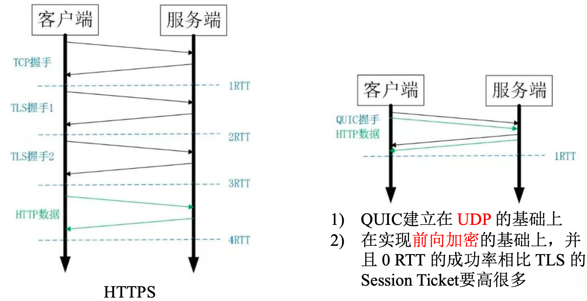

2. 改进拥塞控制方案，以及**plug-and-play**协议 (Reno, CUBIC, BBR)

3. 基于**单调递增打包数(monotonically increased packed number)**的可靠传输。

- 在 QUIC 中，packet 是 QUIC 协议定义的传输单元，封装在 UDP 数据报中。
- QUIC packet 是位于应用层之下、UDP 之上的协议数据单元。

!!!Note
	QUIC 的 ACK 和 TCP 的 ACK 在“形式和层次”上不同。TCP 是字节流协议，采用基于字节序号的确认；QUIC 是基于数据包的协议，采用基于 **QUIC packet** number 的确认。

仅凭数据包数量无法保证数据接收的顺序和传输的可靠性，需要使用**stream offset**。


4. 解决 “**Head-of-Line blocking” (HOL blocking) problem** (队头阻塞问题)

QUIC 的多路复用和 HTTP2 类似。在一条 QUIC 连接上可以并发发送多个HTTP 请求 (stream)。 多路复用是 HTTP2 最强大的特性，能够将多条请求在一条 TCP 连接上同时发出去。但也恶化了 TCP 的一个问题，队头阻塞，如下图示。


- QUIC 最基本的传输单元是 Packet，不会超过 MTU 的大小，避免IP分片。整个加密和认证过程都是基于 Packet 的，不会跨越多个 Packet。QUIC把TLS1.3集成进协议，把TLS消息直接封装在QUIC packet中，每个packet独立解密，不等待“前面的字节”，这样就能避免 TLS 协议存在的队头阻塞。
- Stream 之间相互独立，比如 Stream2 丢了一个 Packet，不会影响 Stream3 和 Stream4。不存在 TCP 队头阻塞。


5. 连接迁移

<u>任何一条 QUIC 连接不再以 IP 及端口四元组标识，而是以一个 64位的随机数作为 ID 来标识</u>，这样就算 IP 或者端口发生变化时，只要 ID 不变，这条连接依然维持着，上层业务逻辑感知不到变化，不会中断，也就不需要重连。

#### Web Caching

HTTP使用两个策略来处理缓存：

1. **Page freshness validation**：客户端在本地判断页面副本是否仍然有效

- 可以基于"**Expires**"头的时间信息来判断页面是否仍然有效。
- 也可以使用启发式方法进行猜测（cacheable, freshly valid, not modified recently）：使用 **Last-Modified** 头；页面可缓存性可能随时间变化
- 本地缓存的好处是内容可以立即可用。

2. **Revalidate copy** with remote server （conditional requests）

- 基于副本的**时间戳**，例如服务器端的“**Last-Modified**”头。如果客户端从“Last-Modified”标头中获取了缓存页面的最后更新时间，则可以使用“**If-Modified-Since**”标头将此时间发送给服务器，以便仅在页面在此期间发生更改时才请求该页面。
- 或者基于服务器返回的“**Etag**”标头等内容进行验证。“Etag”是页面内容的简称，类似于校验和，但更可靠（可以是加密哈希值）。客户端可以通过向服务器发送“**if-None-Match**”标头来验证缓存的副本，该标头列出了缓存副本的标签。如果任何标签与服务器响应的内容匹配，则可以使用相应的缓存副本。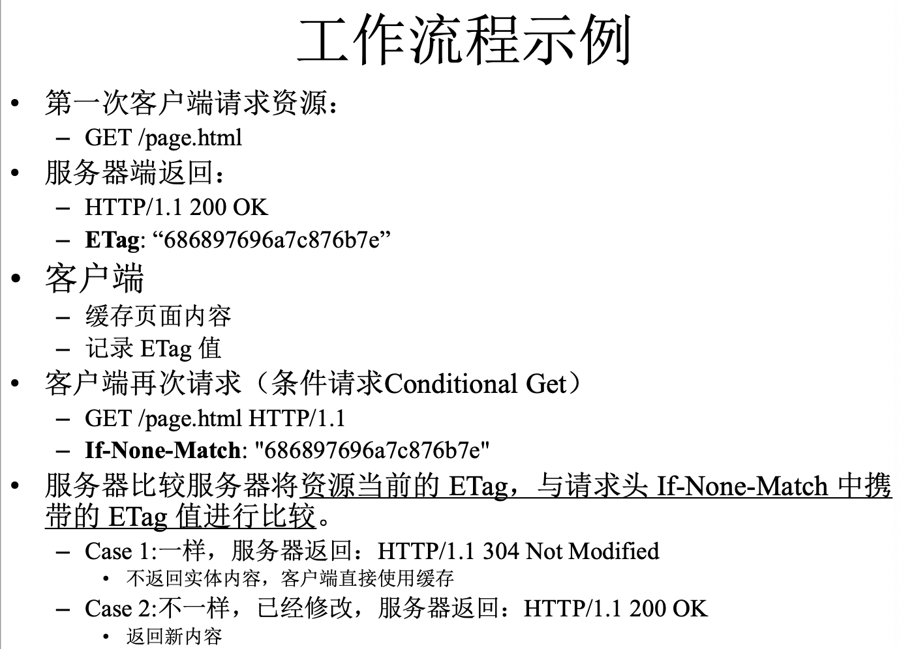
- 使用服务器远程验证的好处是内容在一个往返时间 (RTT) 后即可使用。

#### Web Proxies

客户端联系代理，由代理来联系服务器。


### HTTP Message Format

HTTP的消息格式为是基于文本的命令，包括request行和header行。

#### Request

request行由三个字段：**method**, **URL**, **HTTP version**。在请求中使用的Methods有


其中比较重要的方式为：

- **GET**: 请求服务器发送页面。
- **POST**: 用于用户填写表单时，将数据上传到服务器，服务器随后根据 URL 对数据进行处理。
- **PUT**: 用于用户填写表单时。它将数据上传到服务器。服务器随后根据 URL 对数据进行处理。

#### Request Headers

请求行后面会附加一些额外信息，这些信息被称为 **request headers**。


- **User-Agent**: 允许客户端告知服务器其浏览器实现(例如 Mozilla/5.0 和 Chrome/5.0.375.125)。此信息有助于服务器根据浏览器定制响应，因为不同的浏览器可能具有差异很大的功能和行为。
- **Accept**: 告知服务器，如果客户端可接受的内容有限，则客户端愿意接受哪些内容。(Accepy, Accept-Charset, Accept-Encoding, Accept-Language)
- **If-Modified-Since/If-None-Match**: 用于缓存，允许客户端仅在缓存的页面副本失效时才请求发送该页面。
- **Host**: 定服务器名称，取自 URL。Host是**必需**的。
- **Authorization**: 受保护页面所必需的。
- **Referer**: 提供指向当前请求 URL 的来源 URL，告诉服务器客户端是如何访问到该页面的。
- **Set-Cookie**: 服务器向客户端发送 Cookie 的方式。客户端需要保存 Cookie，并在后续请求中使用 Cookie 标头将其返回给服务器。
- **Last-Modified**: 指示页面上次修改的时间，用于页面缓存。
- **Expires**: 指示页面的有效期，用于页面缓存。
- **Location**: 由服务器用于通知客户端应尝试不同的 URL。如果页面已移动，或者允许多个 URL 指向同一页面（可能位于不同的服务器上），则可以使用此标头。也适用于拥有 .com 域名主页，但根据客户端的 IP 地址或首选语言将其重定向到国家/地区页面的公司。
- **Accept-Ranges**: 如果页面非常大，小型客户端可能不希望一次性获取整个页面。一些服务器接受字节范围的请求，以便将页面分成多个小单元进行获取。
- **Date**: 可用于双向通信，包含消息发送的时间和日期。
- **Range**: 指示响应提供的页面字节范围。
- **ETag**: 提供一个简短的标签，用作页面内容的名称，用于页面缓存。
- **Cache-Control**: 提供关于如何缓存页面的其他明确指令。
- **Upgrade**: 用于切换到新的通信协议。

**Example**


#### Response

每个请求都会收到一个响应，该响应包含一个状态行(**status line**)，以及可能的其他信息。状态行包含一个三位数的状态码，用于指示请求是否已满足，如果未满足，则说明原因。第一位数字用于将响应分为五种主要类型。


**Example**


### Static Web Pages

静态网页是指包含文件内容的网页。（包含视频也算静态）

<u>**HTML** 是一种格式化(makeup)语言</u>，用于描述文档的格式。

- 格式化语言包含明确的格式化命令。
- 格式化语言相对于没有明确格式化规则的语言的主要优势在于，它将内容与其呈现方式分离。
- 浏览器只需理解格式化命令并将其应用于内容即可。这使得任何 Web 浏览器都可以重新格式化任何网页。
- 其他示例：LaTeX、TeX 和 Markdown

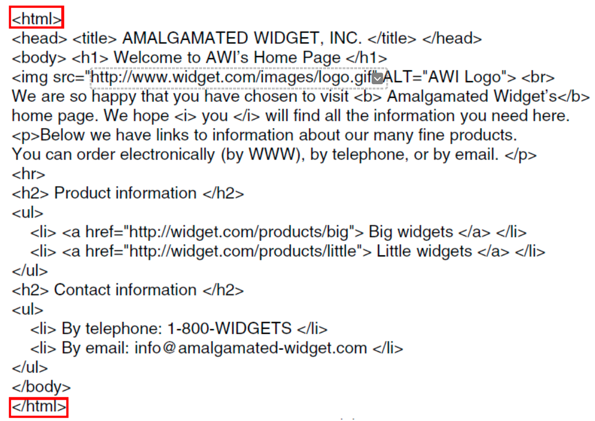


#### **HTML** —— Input and Forms

<u>HTML 1.0 基本上是单向的</u>，用户可以从信息提供者那里获取页面，但很难将信息反向发送回去。

为了实现双向交互，需要两个必要条件：

- 第一种要求是 HTTP 能够双向传输数据：**POST**
- 第二种要求是能够呈现收集和打包输入的用户界面元素：HTML 2.0 中包含了表单(**forms**)，并具备此功能。表单包含允许用户填写信息或做出选择的框(boxes)或按钮(buttons)，然后将œ信息发送回页面所有者。

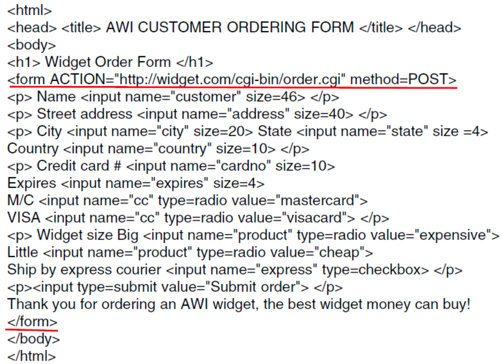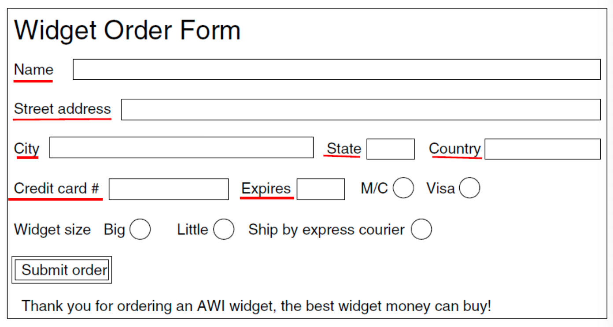


#### **HTML** —— CSS (Cascading Style Sheets)

CSS 定义了一种简单的语言，用于描述控制标记内容外观的规则。

样式表可以放在 HTML 文件中（例如，使用 `<style>` 标签），但更常见的做法是将其放在单独的文件中并引用。

### Dynamic Web Pages

动态网页由**程序执行生成**，内容随用户请求而变化。

- 常见的场景有：电子商务、图书馆目录、股票市场、收发电子邮件。


#### Server-Side Dynamic Web Page Generation

用于处理动态页面请求的多个 API(Application Programming Interface)

- GGI(Gommon Gateway Interface): 提供了一个接口，允许 Web 服务器与后端程序和脚本通信，这些程序和脚本可以接收输入（例如，来自表单的输入）并生成 HTML 页面作为响应。（常用Python, Ruby, Perl等）
- 服务器内嵌脚本(Embedded Scripts):将小型脚本嵌入到 HTML 页面中，并由服务器执行这些脚本以生成页面 (**PHP**, JSP)

#### Client-Side Dynamic Web Page Generation

PHP 和 CGI 都无法响应鼠标移动或直接与用户交互。为此，需要将脚本嵌入到 HTML 页面中，这些脚本在客户端机器而非服务器机器上执行。

- 从 HTML 4.0 开始，可以使用 **`<script>` 标签**来嵌入此类脚本。

最流行的客户端脚本语言是 **JavaScript**。其他还有VBScript, Applets。

#### AJAX (Asynchronous Javascript and XML)

AJAX 不是一种语言，而是一组协同工作的技术，旨在实现 Web 应用程序的以下功能：

- 使用 HTML 和 CSS 将信息呈现为页面。
- 使用 DOM(Document Object Mode)在用户浏览页面时更改页面内容。
- 使用 XML(eXtensible Makeup Language)使程序能够与服务器交换应用程序数据。
- 提供一种异步方式，使程序能够发送和接收 XML 数据。
- 使用 JavaScript 将所有这些功能整合在一起。

#### DOM (Document Object Model)

DOM 是 HTML 页面的表示形式，可供程序访问。这种表示形式以树状结构呈现，反映了 HTML 元素的结构。

- 根节点是一个 html 元素，代表整个 HTML 代码块。

DOM 模型的重要性在于，它为程序提供了一种直接的方式来修改页面的部分内容。无需重写整个页面，只需替换包含更改的节点即可。DOM 是一种强大的页面生成方法，能够实现页面的演进。

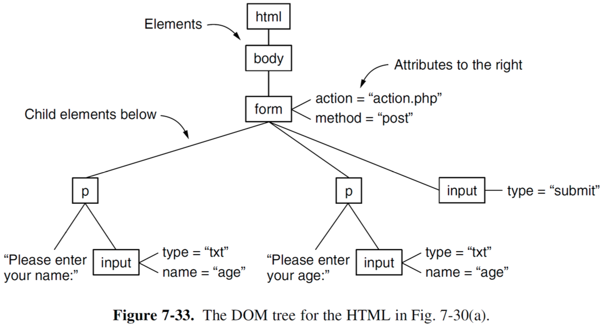

```html
<html>
  <body>
    <form action="action.php" method="post">
    <p>Please enter your name: <input type="txt" name="age"></p>
    <p>Please enter your age: <input type="txt" name="age"></p>
    <input type="submit">
    </form>
  </body>
</html>
```

#### Technologies to Generate Dynamic Web Pages

