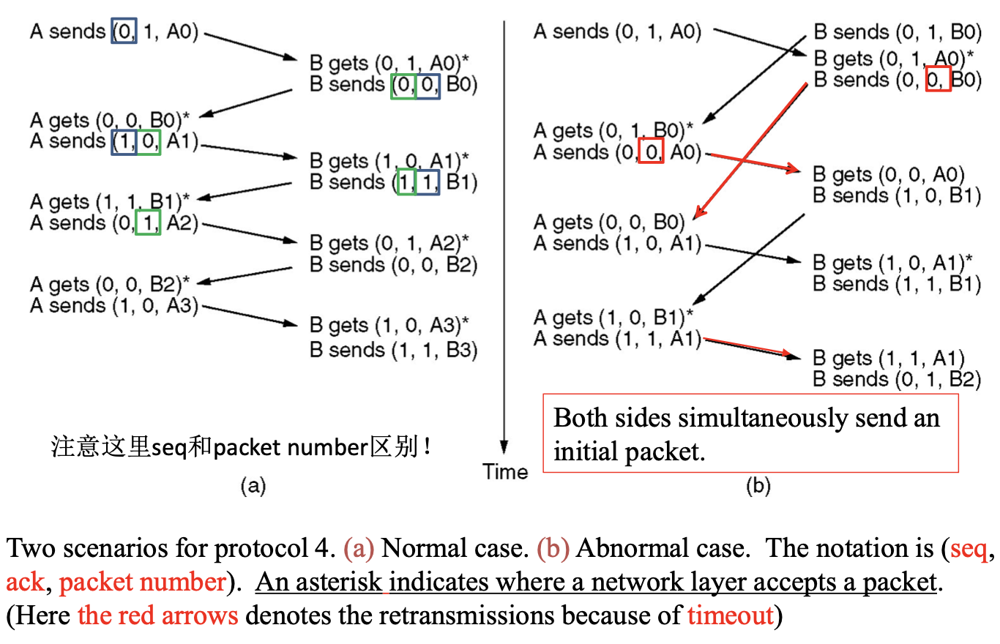
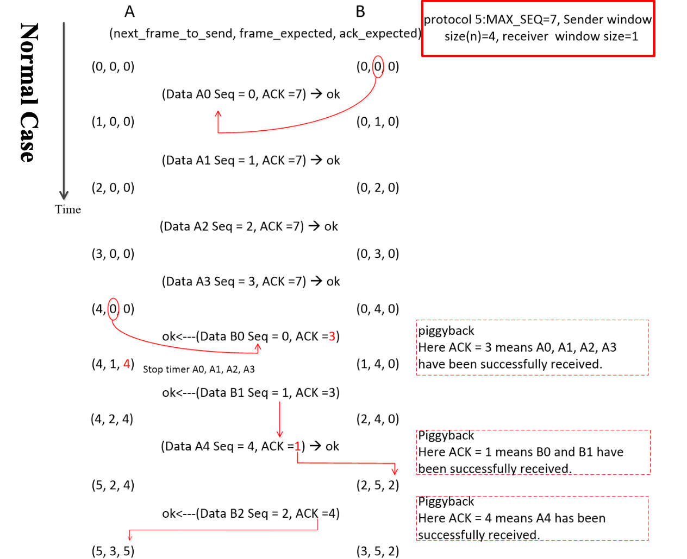
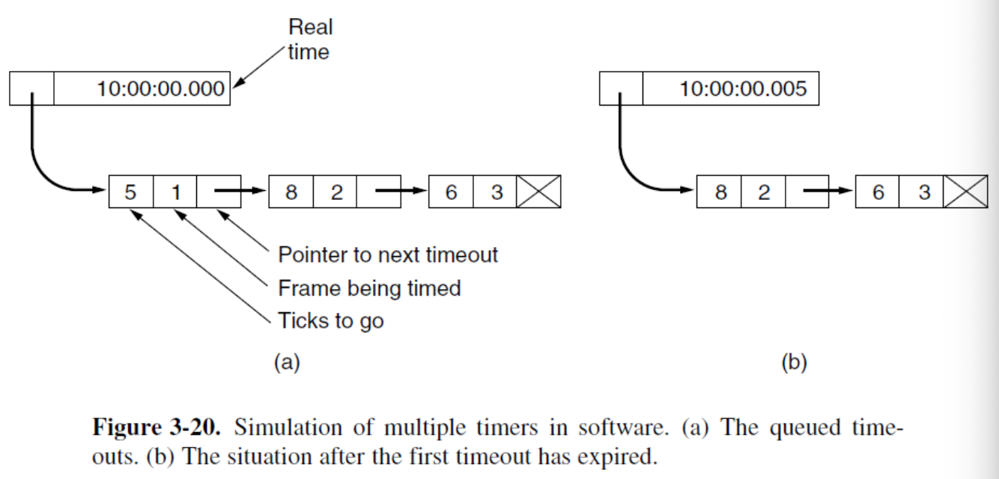
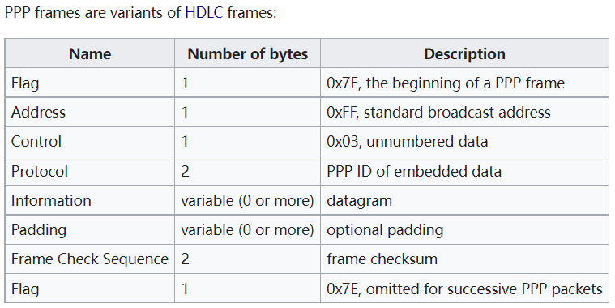
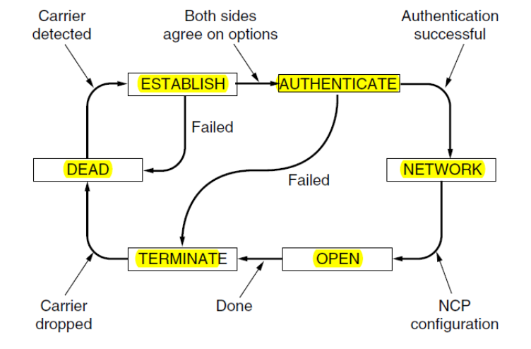
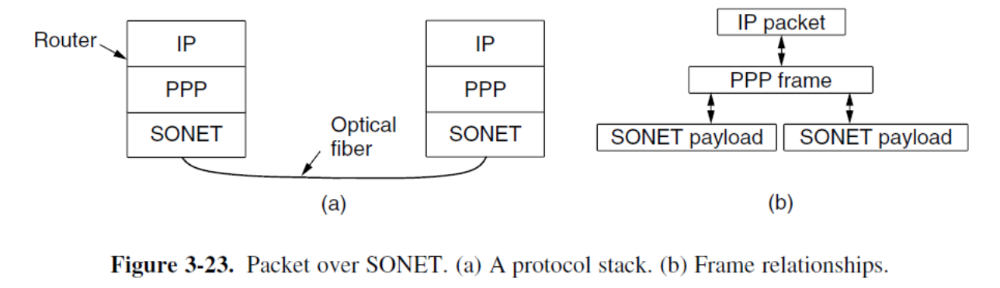

# Data Link Layer

## Overview

数据链路层借助物理层服务，通过communication channels发送和接收比特。

一般 communication channels 的特征:

- Errors
- Finite data rate
- Propagation delay

数据链路层的三个主要功能:

- **Framing**: 把比特流拆分成离散的frames

- **Error control**: 错误检测与修复，通过 acknowledgement, timer, sequence numbers等方式实现

- **Flow control**: 防止发送方的数据淹没接收方。

  **Feedback-based** flow control (the data link layer): 接收方给发送方许可

  **Rate-based flow** control (the transportation layer): 限制发送方的传输速率

### Position of the Data Link Layer

!!!Supplyment
	大部分数据链路层在硬件上实现，即 **netword interface card(NIC)**。还有一部分数据链路层中软件上实现，在用户的CPU上运行。

### Services of Data Link Layer

不同的协议有不同的服务

#### Unacknowledged connectionless service

无需确认直接把独立的帧发送到目的地。适用于出错率低、实时性强的应用。

Example: Ethernet

#### Acknowledged connectionless service

无需建立连接，但是每一帧的发送都需要单独确认。适用于可靠性差的通道。

Example: 802.11 WiFi

#### Acknowledged connection-oriented service

发送方和接收方在传输之前需要先建立连接，这种服务有三个阶段：

- 建立连接
- 传输数据帧
- 释放连接

适合长时间的、不可靠的连接。

Example: 卫星通道、长距离电话

## Framing

数据链路层接收来自网络层的数据包，并将它们封装成**帧(frames)**进行传输。

由于通道存在噪声，物理层传输时需要添加一些额外信息来降低出错率。在数据链路层常用的处理方法时把比特流拆分成离散的数据帧(frames)，计算一个简短的 **checksum**，到达目的地后进行重新计算，如果不同则说明传输过程出现了错误。

常见Frame格式: a header, a payload field, and a trailer

### Byte Count

使用header的一部分来确定frame里的字节数。

### Flag Byte with Byte Stuffing

在每一帧的开头和结尾都添加特殊的标识字节。通常开头和结尾使用相同的字节，称为 **flag byte**。如果出现了两个连续的flag bytes则说明是一个帧的结束和下一个帧的开始。

但是 flag bytes 可能会中数据中出现，这种情况会造成干扰。

- 解决方案：在数据中每个 flag bytes 出现的位置前面插入一个 **special escape byte(ESC)**

但是这样数据中如果出现ESC也会造成干扰。

- 解决方案：如果出现ESC则则ESC前面再加一个ESC。

Application Example: **PPP(Point-to-Point Protocol)**

### Flag Byte with Bit Stuffing

将 framing 在 bit 级别完成。

Example; **HDLC(High-Level Data Link Control)** 协议：

- 每个帧都以 01111110(0x7E) 开头或结束，即以此为 flag bytes
- 如果发送的数据中有5个连续的1，则自动中后面插入一个0。

优点：保证在最低的转换密度下维持物理层的同步。

Application Example: **USB(Universal Serial Bus)**

### Coding Violations

物理层编码通常会加入额外编码来帮助接收方，因此会存在一部分信号组合是不可能出现的，可以使用这部分信号来作为帧的开始或结束。

比如 **4B/5B** 中4位信号后被映射到5位信号，这样32中信号可能中有16种是没有被使用的。

对于 **Manchester encoding**： 可以使用未转换过的信号作为帧开头。

## Error Control

对于传输错误，网络工程师开发了两种最基本的处理策略：

- **Error-Correcting Codes**: 传输足够的额外信息让接收方能够对数据进行纠错。对于无线网络等不可靠通道，更适合传输足够信息来还原原数据。
- **Error-Detecting Codes**（Forward Error Correction, FEC): 传输的额外信息足够判断是否出现错误。对于可靠性高的通道，比如光纤，使用 error-detecting code 成本更低。

两种策略都需要传输额外的信息。并且由于传输的额外信息也可能会出错，两种策略都无法保证完全避免错误。

两种错误处理策略都不仅仅在数据链路层使用：

- Error-Correcting Codes 通常在物理层（特别是噪声大的通道）、以及更高层（特别是实时媒体或内容分发）使用
- Error-Detecting Codes 通常在链路层、网络层和传输层使用。

### Error-Correcting

> **Definition**
>
> **Block Code** 是一个由 $m$ 位数据和 $r$ 位额外位(或check bits)组成的帧。其中 $r$ 位的check bits是由 $m$ 位数据通过一个函数单独计算得到的。
>
> - 在 systematic code 中，信息明文传输。
> - 中 linear code 中，信息可能明文传输；也可能编码后传输。

#### Hamming Codes

> **Definition**
>
> **Hamming distance** 是两个 codewords 不同bit的数量。

- 如果需要可靠地**找到** $d$ 位错误，则任意两个码字之间距离至少为 $d+1$ （即 distance $d+1$ code）
- 如果需要可靠地**纠正** $d$ 位错误，则任意两个码字之间距离至少位 $2d+1$（即 distance $2d+1$ code）

对于**1位**错误考虑，码字由 $m$ 位数据位和 $r$ 位检查位，记 $n=m+r$。则对于 $2^m$ 个不同的合法码字，都有 $n$ 个非法码字与其距离为1，再加上合法码字自身，即每个合法码字需要 $n+1$ 个码字来确定：$(n+1)2^m\leq 2^n$，即
$$
m+r+1\leq2^r
$$
上式计算了给定 $m$ ，进行对 single errors 的纠错需要的最少检查位数量。

对于一个由 $k$ 位数据位和 $n-k$ 位检查位的码字，编码方式如下：

- 从最低有效位开始，检查位位于每一个2的幂次方位，即1、2、4、…

- 对所有值为1的位，取其位地址，依次进行XOR操作，得到对于的Hamming Code

  通过解码计算得到的 $n-k$ 位被称为 **syndrome word**，范围在 $0$ 到 $2^{(n-k)}-1$ 

 下面给出一个样例：

**编码**

- 如图所示8位数据位00111001
- 则Hamming Code 位 1010⊕1001⊕0111⊕0011=0111
- 传输的块位001101001111

**解码**

- Hamming Code 为 0111
- 则 Syndrome code 为
- **0111**⊕1010⊕1001⊕0111⊕0110⊕0011=0110（出错的位置）

- 如果syndrome code全为0，则说明没有出错。
- 如果只有1位被设为1，则说明出错位在检查位，不需要纠错。
- 否则syndrome code指向出错的位置，需要对这位数据进行取反。

#### Convolutional Code

卷积码不是block code，输入的位并不一定直接出现在码字中

对于一个 $(n,m,K)$ 卷积码：

- 一次输入 $m$ 位
- 对于每一个输入输出 $n$ 位
- $K$ = **constraint length**，需要考虑 $K$ 个输入，即输出与前面 $K-1$ 个输入有关
- 通常 $m$ 和 $n$ 都很小

以下为一个 $(3,1,3 )$ 卷积码的示例：

- 802.11中使用的 NASA binary convolutional code

### Error-Detecting

#### Parity

奇偶校验，通过添加1位奇偶校验位来进行错误检测。

- 奇校验：加上校验位后1的个数为奇数；偶校验：加上校验位后1的个数为偶数
- 可以用于检测 single-bit errors

优点：需要的校验位少，传输效率高

缺点：如果遇到较长一串 **burst error**，则成功检测错误的概率只有 0.5。对于 burst error，有以下的解决方案

- **Interleaving**

- **Two-dimensional parity**

#### Checksum

将数据累加得到 N 位的words，被广泛使用，如**TCP/IP/UDP**。相比于奇偶校验有更强的保护能力。

##### **16-bit Internet Checksum**

对数据根据16位拆分，然后进行反码(one's complement)加法。

发送：

1. 将数据拆分成16位
2. 将checksum设为0，进行累加
3. 如果有溢出位，则要加回前面16位（反码加法规则）
4. 最后结果取反得到最终值

接收：

1. 将数据拆分成16位
2. 对所有值累加，包括sum
3. 如果有溢出位，则要加回前面16位
4. 最后结果取反检查是否为0

Internet checksum 有效且简单，但是由于只是简单相加，在某些情况下保护能力较弱。

- 无法检测0数据的删除或添加
- 无法检测信息位的交换

#### Cyclic Redundancy Check (CRC)

发送：

- 对于 $m$ 位的块，生成一个 $(n-m)$ 位的 **frame check sequence(FCS)**。
- 最后生成的 $n$ 位的帧能够被预先确定的一个key(**predetermined bit pattern**)整除（最高位和最低位必须为1）

接收：

- 将得到的帧除以预先设定的key
- 如果没有余数，则认定为没出错

参数：

- $T$ ：n 位被传输的帧
- $D$ ：m 位数据块；即 $T$ 的前 m 位
- $F$ ：(n-m) 位的FCS；即 $T$ 的后 (n-m) 位
- $P$ ：预先决定的 **n-m+1** 位除数
- $Q$ ：除法的商
- $R$ ：除法的余数

!!!Note
	使用的是模2除法，即每次XOR操作。

## Elementary data link protocols

### A Utopian Simplex Protocol

1. 数据单向传输
2. 传输和接收的网络层都时刻就绪
3. 传输时间可以忽略
4. buffer空间无限
5. 数据链路层的传输通道永远不会被破坏或丢帧

### A Simplex Stop-and-Wait Protocol for an Error-Free Channel

这个协议用于防止发送方发送过快导致接收方来不及处理。一个常见的解决方案是接收方向发送方进行反馈(**feedback**)。

### A Simplex Stop-and-Wait Protocol for a Noisy Channel

一种解决方案是添加一个计时器。接收方只有在接收到正确的数据帧是才发送确认(ACK)，如果接收到被破坏的帧会直接无视掉。如果发送方在一定时间内没有接收到确认，则认定为超时，重新发送数据。

##### Timeout

需要保证接收方有足够的时间来处理，即考虑接收方处理数据的最坏情况以及确认帧传输的时间。

- 如果timeout时间太短，则会导致很多不必要的重传。
- 如果timeout时间太长，虽然连接是理想的，但是会导致传输效率降低。

##### Duplicate frames

考虑一种情况，接收方接收到了发送方的数据，但是发送的确认帧在传输过程中丢失或传输到的时候已经超过了timeout，那么发送方会重新发送数据，这样会造成数据帧的重复。

可以使用 **Sequence Number** 来解决这个问题。接收方可以根据序列号来确认数据是否重复。

在这个基本协议中，只需考虑前序数据帧是否到达，在最小情况下，只需要**1位**序列号就可以满足需求。

- 正常情况

- ACK丢失

- 传输错误或丢失（如果一直丢失，会一直重传）

- ACK到达超时

## Sliding Window Protocols

以下协议考虑双方互相的通信，而非单向通信。

> **Definiton**
>
> **Piggybacking(驮运)** 指在双向通信的过程中，将ack附加在即将发送的帧上一起发送，而非单独发送ack帧。

Sliding window bidirectional protocol(双向滑动窗口协议) 主要有以下三种，不同点为**效率、复杂度和buffer需求量**：

- A One-Bit Sliding Window Protocol (stop-and-wait)
- A Protocol Using Go Back N
- A Protocol Using Selective Repeat

### The Essence of All Sliding Window Protocols

发送方会根据允许发送的帧数维护一个序列号的集合，这些帧被放在 **sending window** 中直到确认接收方已经成功接收到数据。

如果 maximum window size 为 $n$，则发送方需要 $n$ 个buffers来存储这些帧。如果 sending window 已满，则数据链路层会停止接收网络层的需求直到有buffer空出来，这种行为被称为 **Flow Control** 。

类似的，接收方也会根据允许接收的帧数来维护一个 **receiving window**，落入这个窗口的帧会被放入接收方的buffer，否则会被丢弃。

!!!Note
	如果接收方的window size为1，则表示数据链路层只能顺序接收帧，否则允许乱序接收。
	
!!!Note
	接收方的window size和发送方的window size不一定相同。在有些协议中size是固定的，而在另一些协议中可能会动态调整。

### One-Bit Sliding Window Protocol

发送方和接收方的 window size **都为 1**。即发送方在接收到接收方的ack后才能继续发送下一个帧。

以下为一个sequence number为1位的示例：

- 缺点：在**传输时间长、高带宽、帧长度短**的情况下传输效率很低。

解决方案：在阻塞前允许至多 $w$ 个帧传输， $w$ 可以被设置为 $2BD+1$。（其中 $BD$ 为bandwidth-delay，即单向传输时间内可以传输的帧数量级，由于考虑来回传输要 $\times2$）

### Sliding Window Protocol Using Go Back N

- 发送方的 window size 为 $n$
- 接收方的 window size 为1

传输时有以下特点：

- 两个方向都对ACK使用 **piggybacking**：不单独发送ACK；如果接收到ack $n$，则 $n$ 之前的帧($n-1,n-2,…$)都自动确认。
- 通道有噪声
- 需要限制网络层的数据流

!!!Note
	需要满足 **the sender window <= MAX_SEQ**。
	假设MAX_SEQ=7, the sender window=8，此时如果连续发送8个数据帧0-7，则接收方返回的ack为7，即期望下次发送的seq_num为0，在这种情况下无法确定时8个数据帧都收到了还时全部丢失了。

由于有多个独立的帧需要传出，因此需要多个计时器来分别管理timeout，可以使用一个timeout队列来管理。

- 缺点：如果通道**出错率高**，则会导致大量包被重传。

### Sliding Window Protocol Using Selective Repeat

- 发送方的 window size 为 $n$
- 接收方的 window size 为 $n$

传输时有以下特点：

- 数据双向传播，ACK可以使用piggybacking也可以单独传输(需要ACK计时器)
- 通道有噪声
- 需要限制网络层的数据流
- 需要 **NACK** 包：接收方发现出错时发送

传输过程中，发送方的window size从0开始增长，直到一个设定的最大值。

接收方的window size 固定在预先设定的最大值，在这个固定的window中，为每个序列号都预留一个buffer。传输时检查到达帧都序列号是否满足要求，满足则接收。

!!!Note
	需要满足 **Maximum size <=  (1 + MAX_SEQ) / 2**。
	否则会出现序列号重叠，导致接收方无法确定是新帧还是重发的旧帧。

## Examples of data link protocols

### Point-to-Point Protocol(PPP)

PPP在数据链路层，是一种帧结构机制，能够在多种物理层上传输多种协议的数据包。

PPP具有以下3个主要特点：

- 帧封装与错误检测：PPP 提供了一种帧格式，用于标识数据的 **起始** 和 **结束**。
- 链路控制协议(LCP, Link Control Protocol)：管理 PPP 链路的状态，确认通信链路可靠。
- 网络控制协议(NCP,Network Control Protocol)：PPP设计了一种“通用框架”，每一种网络层协议，都配一个 **NCP** 。这些 NCP 都遵循 PPP 的统一格式（像插件一样），但具体字段和协商内容取决于对应的网络层协议。

#### PPP Frame Format

PPP帧以靠准**HDLC** flag byte，即 **0x7E(01111110)** 开头。如果遇到冲突，则使用ESC FLAG的方法，使用的ESC FLAG为 **0x7D**，然后对冲突字节进行 XOR 0x20 处理，这样可以保证数据中不出现 0x7E，可以直接扫描 0x7E 来确定帧。解码时只要去掉ESC FLAG然后对后面的字节进行 XOR 0x20 即可。

#### PPP Link Up & Down

- 链路初始状态为DEAD，表示物理层未建立连接。
- 当物理连接建立后，链路状态转为ESTABLISH。此时PPP对等体将交换一系列LCP数据包。
- 若LCP选项协商成功，链路状态将进入AUTHENTICATE。
- 若认证成功，则进入NETWORK状态，并发送一系列NCP数据包以配置网络层。由于每个NCP协议都针对特定网络层协议设计，因此难以对其进行概括性描述。
- 达到OPEN状态后即可进行数据传输。在此状态下，IP数据包将封装在PPP帧中通过SONET线路传输。
- 数据传输完成后，链路进入TERMINATE状态，当物理层连接断开时，将由此状态回退至DEAD状态。

**SONET** 和 **ADSL** 都是对PPP的不同应用。

### SONET 

SONET 是一种物理层协议，常用于广域光纤链路，是通信网络骨干（包括电话系统）的主要传输方式。它提供高速、同步、固定速率的光信号传输。

#### ADSL

**Asymmetric Digital Subscriber Loop**，基于OFDM调制。在ADSL物理层和PPP中间存在**AAL5**和**ATM**。

- AAL5 frame: 把上层变长数据封装成固定长度的 48 字节块，并提供长度和 CRC 检测。用于适配ATM信元。

- ATM(Asynchronous Transfer Mode): 链路层协议，异步传输，connected-oriented。有5个字节的header。

- AAL5+ATM：把上层协议切分成固定长度信元，通过虚电路转发。

  
