# Network Layer

## Overview of network layer

### Two Important Network LayerFunctions

网络层的主要任务是将数据包（packet）从发送主机传送到接收主机。

每个路由器都有一个转发表(**forwarding(internal, routing) table**)。转发表通过数据包头中的目标地址(**destination address**)或所属连接标识(**indication of connection**)进行索引。

#### Forwarding

路由器的主要功能。

- 转发(forwarding)指在**单台路由器**内部，将数据包从入站链路转移至出站链路。
- 转发是 **router-local操作**。

#### Routing

为每一个路由器建立转发表

- 路由涉及整个网络的路由器，它们通过路由协议(**routing protocols**)的集体交互确定数据包从源节点到目标节点传输的路径。路由算法决定了路由器转发表中插入的值。
- 路由是 **network-wide**过程。(可采用集中式/分布式)

### Network Layer Design Issues

包括为传输层提供的服务以及网络的内部设计。

- **Store-and-forward Packet Switching**: 数据包在路由器中存储，直至其完整到达且链路通过校验完成处理。随后它沿路径转发至下一台路由器，直至到达目标主机并完成交付。
  

### Services Provided to the Transport Layer

#### Design goals

- 服务应独立于路由技术
- 传输层应该与现有的路由器数量、类型、拓扑保持隔离
- 网络地址应该采用统一的编码方案

#### Connection-oriented & Connecitionless service

争议焦点：网络层应提供面向连接服务还是无连接服务。

- internet community: Connectionless service
- telephone company: Connection-oriented

#### Implementation of Connectionless Service

数据包被单独注入网络，并相互独立地进行路由。这些数据包(packet)通常被称为数据报(**datagram**)。

每个路由器都有一个**转发表**，每条表项由一对信息组成：目标地址及其对应的出站线路。

#### Implementation of Connection-Oriented Service

每个数据包都携带一个标识符，表明其所属的虚拟电路。

路由器A会为不同连接分配不同标识符，即使它们可能使用相同的虚拟电路——Lable Switching(**MPLS**, MultiProtocol LS)

### Virtual-Circuit vs. Datagram Networks

| Issue            | Datagram Networks                    | Virtual-circut Network                       |
| ---------------- | ------------------------------------ | -------------------------------------------- |
| 电路建立         | 不需要                               | 需要                                         |
| 寻址方式         | 每个数据包包含完整的源地址和目的地址 | 每个数据包包含短的虚电路号                   |
| 状态信息         | 路由器不维护连接状态信息             | 每个虚电路需要在路由器上占用连接表空间       |
| 路由方式         | 每个数据包独立路由                   | 虚电路建立时选择路由；所有数据包遵循同一路由 |
| 路由器故障的影响 | 无，除了故障期间丢失的数据包         | 所有经过故障路由器的虚电路都会终止           |
| 服务质量         | 困难                                 | 容易（如果能为每个虚电路预先分配足够资源）   |
| 拥塞控制         | 困难                                 | 容易（如果能为每个虚电路预先分配足够资源）   |

## Routing algorithms

在数据报中，最佳路由可能会在上一次使用而发生改变。而在虚电路中，只有在建立新虚电路时才对路由进行决策。

在设计中，理想的特性有：**correctness**, **simplicity**, **robustness**, **stability**, **fairness** and **efficiency**.

路由算法可以被分为全局路由(**Global routing**)算法和分布式(**decentralized**)算法：

- 全局路由算法利用完整的全局网络来计算源节点和目标节点之间的least-cost路径。(**LS**(Link-state) 算法，适合小规模网络)
- 分布式算法，通过迭代和分布式的方式计算least-cost路径。(**DV**(Distance-vector)算法，更适合大规模网络)

路由算法的第二种广泛分类方式是根据其静态或动态特性进行划分。

- **Static routing algorithms**(non-adaptive): e.g.人工手动编辑路由器的转发表
- **Dynamic routing algorithms**(adaptive):  能响应网络变化，但更易受路由环路和路径振荡等问题影响

### Static routing

**Example**

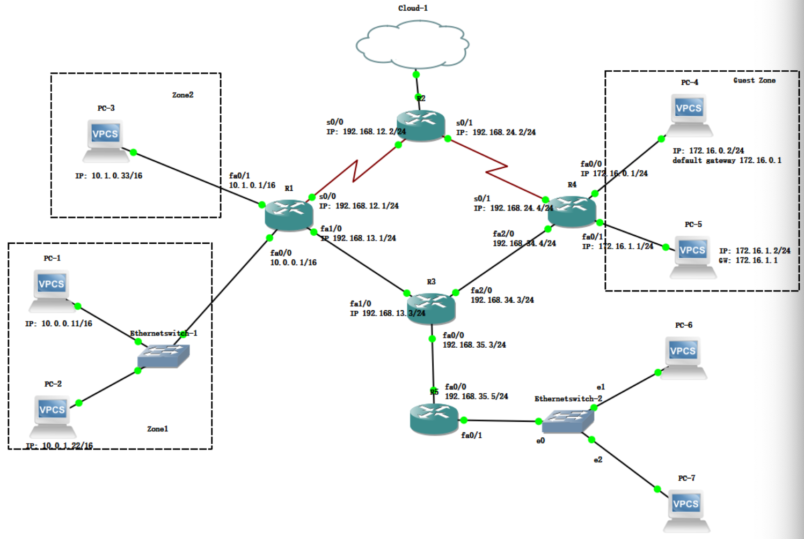

### The Link-State (LS) Routing Algorithm

在 LS 算法中，网络拓扑结构和所有链路成本是已知的，即作为链路状态算法的输入参数。在实际实现上，通过让每个节点向网络中所有其他节点广播(**broadcast**)链路状态数据包来完成，每个链路状态数据包包含其连接链路的标识和成本。

- 例如，Internet 的 **OSPF** 路由协议就是通过 LS 广播算法实现的。

需要保证<u>所有节点对网络的认知完全一致且完整</u>。每个节点运行链路状态算法后，计算出的最小成本路径集与其他节点完全相同。

- 比较有名的 LS 算法是 **Dijkstra's** 算法（计算一个节点到其他所有节点的least-cost路径）。

这里需要用到的算法为最短路算法，通常路径的cost可以用以下数据来衡量：

- 跳数 (number of hops)
- 延迟
- 距离
- 带宽
- 通信成本 (communication cost)
- 平均流量 (average traffic)

**最优性原则**：若路由器J位于路由器I到路由器K的最优路径上，则从J到K的最优路径也必经此路线。

#### Sink Tree

目的地的 **Sink Tree** 是所有通往该目的地的最短路径的并集。

例如对于下图，Sink Tree 为：

- A→B→C→E
- B→C→E
- C→E
- H→C→E
- D→E
- F→E
- G→F→E (G→B→C→E)

根据最优性原则，每个节点的转发表只要记录对于每一个目的地的下一跳就可以了。

#### Dijkstra Algorithm

用于求解单源最短路问题（所有边的权重必须为非负值），使用贪心算法。先把所有节点都标记为不确定tentative，其他节点的距离设为无穷大（源节点设为0）。

当不确定节点还存在时：

- 从未确定节点里找出一个距离最近的 `n`
- 对 `n` 的所有邻居节点 `v`：
  如果 `dist[n] + weight(n, v) < dist[v]`，
  就更新 `dist[v]`，表示找到了更短的路径。
- 把节点 `n` 标记为“已确定”，不再改变它的距离。

在 Dijkstra 算法中，每 $i$ 轮需要搜索 $n-i+1$ 个节点，即一共需要搜索 $(n+1)n/2$ 次。因此时间复杂度为 $O(n^2)$ 。

#### The Oscillation Problem with the LS Algorithm

当多个节点根据相同的网络状态独立计算最短路径，并根据结果改变其链路代b价或转发方向时，整个网络可能进入一个**反复改变、永不稳定的状态**，这就是振荡问题。

### The Distance Vector (DV) Routing Algorithm

DV算法具有以下三个特性： 

- **Distributed** : 每个节点从一个或多个直接邻居接收信息，执行计算后将结果分发回邻居节点。
- **Iterative** : 该过程持续进行直至邻居节点间不再交换信息，具有自终止特性。
- **Asynchronous** : 无需所有节点同步操作。

> #### **Bellman-Ford Equation**
> 
> 设 $d_x(y)$ 为从节点 $x$ 到节点 $y$ 的最小成本路径的成本。则最小成本由著名的> **Bellman-Ford**方程关联：
> 
> $$
> d_x(y)=\min\{c(x,v)+d_v(y)\}
> $$
> 
> 其中 $v$ 取自与 $x$ 相邻的所有节点。
> 
> **Example** 

算法的基本思想是每个节点 $x$ 都对于所有 $N$ 个节点初始化 $D_x(y)$ 值，即从自身到节点 $y$ 的最小成本路径的估计值。用 $\mathbf{D}_x(y)=[D_x(y): y\text{ in }N]$ 表示节点 $x$ 的成本估计向量（距离向量）。在 DV 算法中，每个节点 $x$ 都需要维护以下信息：

- 对于每一个邻居节点 $v$ ，维护 $x$ 到 $v$ 的直接距离 $c(x,v)$
- 维护成本估计向量，即 $\mathbf{D}_x(y)$
- 每一个邻居 $v$ 的成本估计向量 $\mathbf{D_v(y)}$

当 $x$ 接收了来自任意邻居节点 $v$ 的新的距离向量，则保存 $v$ 的向量，并对应地使用 Bellmen-Ford 公式来更新自己的距离向量。
$$
D_x(y)=\min\{c(x,v)+D_v(y)\}
$$
若节点 $x$ 的距离向量因本次更新发生变化，则节点 $x$ 将向所有邻居发送更新后的距离向量，邻居节点据此更新自身的距离向量。

只要所有节点持续以异步方式交换距离向量，每个成本估计值 $D_x(y)$ 都将收敛至 $d_x(y)$。

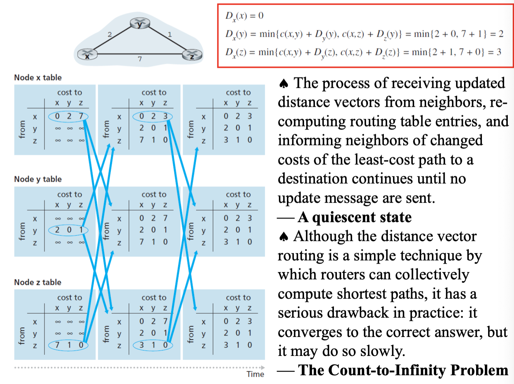

#### The Count-to-Infinity Problem

当节点 $x$ 告知节点 $y$ 存在某条路径时，节点 $y$ 无法判断自身是否位于该路径上。

在(b)的第二行中，B未收到来自A的任何消息，但C声称拥有通往A的路径，因此B到A的延迟变为3。此时B并不知晓C的路径恰恰经过自身节点。

### LS vs DV

#### Message Complexity

- **LS**: $n$ 个节点, $E$ 个连接，一共发送 $O(nE)$ 条消息
- **DV**: 只在邻居之间发送

#### Speed of Convergence

- **LS**: $O(n^2)$ 算法，需要 $O(nE)$ 条消息
- **DV**: 时间不确定，存在**Count-to-Infinity**问题

#### Robustness

（路由器故障时会发生什么）

- **LS**: 节点可能广播错误链路成本；每个节点都只计算自己的路由表（只影响自己，鲁棒性强）
- **DV**: 节点可能广播错误链路成本；节点路由表被其他节点使用；错误在网络中传播（鲁棒性弱，容易振荡）

### Hierarchical Routing

网络可能无法让每台路由器都存储所有其他路由器的条目。因此路由必须采用分层方式实现。使用分层路由时，路由器会被划分为若干区域(**rigions**)。

最常见的分层单位叫做 **Autonomous System(AS)**。每个路由器仅知道自身AS内数据包转发至目的地的完整细节，对其他AS的内部结构一无所知。

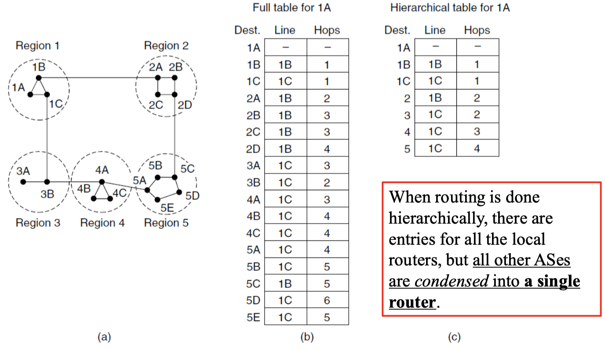

同一个AS内的路由器使用相同的路由协议，即**Intra-AS**路由协议。不同的AS中可以使用不同的Intra-AS路由协议。

直接与其他AS的路由器连接的被称为 **Gateway router**(网关路由器)，比图上图中的1B和1C。

根据Kamoun and Kleinrock (1979)的发现，在有 $N$ 个路由器的网络结构中，最优的网络层级数是 $\log N$。

### Broadcast Routing

在广播路由中，网络层提供将源节点发送的数据包传递至网络中所有其他节点的服务。

#### Uncontrolled flooding

发送节点向每个目的地发送独立的数据包副本，是实现广播通信最简单直接的方式之。

**优点**: 实现简单，不需要新的网络层路由协议

**缺点**: 效率低；源节点需要完整的目标列表；Broadcast storm。

#### Controlled flooding

**Sequence-number-controlled flooding**。

- 源节点将自身地址（或其他唯一标识符）及广播序列号放入广播数据包，随后将该数据包发送至所有邻居节点。
- 每个节点都维护着一份列表，记录其已接收、复制并转发的每个广播数据包的源地址和序列号。
- 当节点接收到广播数据包时，首先检查该数据包是否存在于列表中。若存在则丢弃；若不存在，则复制该数据包并转发至所有邻居节点。

**Reverse Path Forwarding(RPF)**

当广播数据包到达路由器时，路由器会检查该数据包是否通过通常用于向广播源发送数据包的链路抵达。若属实，则该广播数据包极有可能遵循了从路由器出发的最佳路径，因而被认为是首个抵达该路由器的副本。在此情况下，路由器会将其副本转发至除原始链路外的所有链路。但若广播数据包通过非首选链路抵达，则会被视为可能的重复数据包而丢弃。

**优点**: RPF仅需知道其单播最短路径上下一跳邻居节点。它仅利用该邻居的身份来决定是否泛洪接收到的广播数据包，无需记忆序列号。

#### Spanning Tree

生成树包含图中所有节点，且不包含环路。当源节点发送广播数据包时，会通过所有属于生成树的入链路发送该数据包。接收广播数据包的节点将转发该数据包至生成树中所有邻居节点。节点无需了解完整树结构，只需识别图中哪些邻居属于生成树邻居即可。

生成树方法的主要困难在于生成树的创建与维护。以下是基于中心的生成树构建方法：

- 首先定义一个中心节点(**rendezvous point/core**)
- 节点向中心节点单播发送**tree-join messages**。树接入消息通过单播路由向中心转发，直至抵达已属于生成树的节点或到达中心节点。树接入消息所经过的路径定义了节点到中心节点的路径。

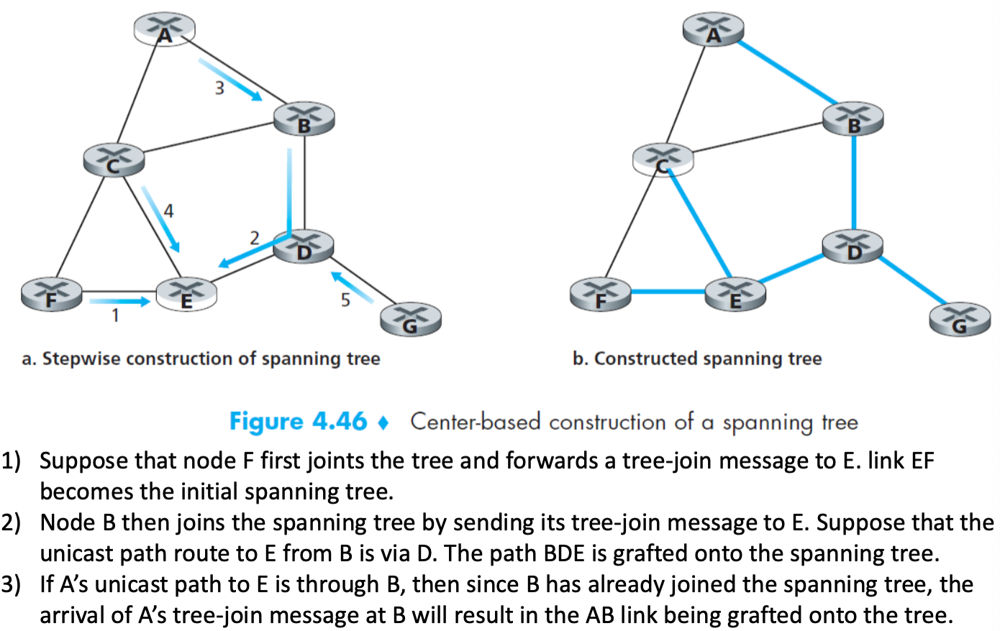

### Multicast Routing

向规模明确、数量庞大但相对于整个网络而言较小的群体发送消息。

在实际应用中，已采用两种方法来确定多播路由树(**multicast routing tree**)。

**Source-based tree**

为每个发送者（source）建一棵独立的多播树。

- 为多播组中的每个源构建专属的多播路由树。

- 使用反向路径转发(RPF)算法构建从源 $x$ 出发的多播数据报的转发树。

**Group-shared tree**

整个多播组（group）共用一棵树。

- 类似于生成树广播，组共享树的多播路由基于构建一个包含所有连接至多播组的边缘路由器的树。
- 所有沿路径传递JOIN消息的路由器将会将接收到的多播数据包转发给发起多播加入请求的边缘路由器（中心型树）。

#### Internet Multicast Routing

在 Internet 中，每个多播组(multicast group) 都用一个 **Class D IP 地址** 表示。

组的成员关系由 **IGMP(The Internet Group Management Protocol) 协议** 管理。

Internet 中网络层的多播由两个部分组成：IGMP 和 多播路由协议。

IGMP只有三种消息类型，每种消息都包含一个IP数据报，其中<u>IP protocol number为2</u>，三种消息分别为：

- **membership-query message**: 由路由器向所有主机广播，用于确定该接口上已加入的所有多播组成员。主机在首次加入多播组时，也可以主动生成成员查询消息，而无需等待路由器的查询。  
- **membership-report message**: 主机的响应。
- **leave-group message**: 可选的。当主机停止响应具有特定组地址的成员查询消息时，即表示其已不再属于该多播组。 

Distance-vector multicast routing protocol (**DVMRP**) 实现了基于源的树结构，采用反向路径转发和剪枝机制。

Protocol-Independent Multicast (**PIM**)路由协议明确区分两种多播分发场景：PIM 密集模式是一种洪泛和剪枝的反向路径转发技术，其工作原理类似于 DVMRP；PIM 稀疏模式利用会合点（rendezvous points）建立多播分发树结构。

### Anycast Routing

- Unicast —— 单一目的地
- Broadcast —— 到所有目标
- Multicast —— 到一组目标

**Anycast**一种网络寻址与路由技术，**多个服务器共享同一IP地址**，路由到**“最近”或最易达**的服务器，依据路由协议（如BGP）实现。  

- 因为这些服务器不在一个广播域内，所以不会引起IP地址冲突。
- 在仅仅配置相同IP外，还需要借助BGP协议进行地址宣告，通过BGP，各个站点向Internet宣告相同的AnyCast IP地址。

无需为任播设计新的路由方案，因为常规距离矢量和链路状态路由算法能够生成任播路由。例如，如果我们对组1的成员进行任播，他们都会被分配相同的地址“1”，而不是不同的地址。距离矢量路由将像往常一样传播路向信息，节点将选择到目的地“1”的最短路径。这将导致节点向最近的“1”实例发送数据。这一机制之所以有效，是因为路由协议未识别到存在多个“1”实例。

## The Network Layer in the Internet

Internet的网络层主要有3个组成部分：

- IP协议
- Internet控制协议（包括 ICMP, DHCP, ARP)
- Internet路由协议（包括 RIP, OSPF, BGP)

### IP Protocol

#### The IPv4 Datagram

IPv4报头有**20个字节的固定部分**和一个可变长度的可选部分。如下图所示，bits从左向头，从上向下传输。

**1. Version field(4bits)**

通过在每个数据报的起始位置加入版本信息，可以实现长时间跨度内的版本兼容与平滑过渡。

**2. IHL field(Header Length) (4 bits)**

以word为单位(4bytes)标记报头长度，4位的最大值位15，因此报头最长为60字节，即可选部分最长为40字节。
大多数IP报头都不包含可选部分，因此通常IP数据报的报头长度为20字节。

**3. The Different Service field(Type of Service) (8 bits)**

前6位用于标记数据报的服务类型，后2位用于指示明确的拥塞控制信号(**explicit congestion indications**)

- Real-time traffic(如IP电话应用) 或 non-real-time traffic(如FTP)

**4. The Total Length field (16bits)**

数据报的总长度（包括**报头和数据**）。
理论上的最大值是 65535 字节(最大payload=65535-20=65,515)，但是实际上数据报长度很少超过1500字节。

**5. The Identification field (16 bits), flags (DF, MF), and fragment offset (13 bits)**

这三个字段与所谓的IP分片机制(**IP fragmentation**)相关。<u>一个数据包中的所有切片都有相同的identification field</u>。后16位的作用如下：

- 未使用位 (1bit)
- DF (1bit): 不切片。若为1则不允许切片，通常用于探测网络的MTU(Max Transsion Unit)
- MF (1bit): 更多切片。若为1表示后面还有更多切片，**若为0则表示是最后一个切片**。
- The Fragment Offset (13 bits): 一个数据报最多有8192个切片。

**6. The TtL(Time to Live) field (8 bits)**

**每次数据包经过路由器处理时，该字段值减1**。当TtL值减至0时，数据报会被丢弃，并向源主机发送警告。

**7. The Protocol field (8 bits)**

协议字段指示应将数据包交付给哪个传输协议:

- 当值为**6**时，表明数据部分交由**TCP**协议处理。
- 当值为**17**时，表示数据交由**UDP**协议处理。

**协议编号**是连接网络层和传输层的纽带，而**端口号**则是连接传输层和应用层的媒介。

**8. The header checksum (16 bits)**

头部校验和通过将头部中的每两个字节视为一个数值，并使用**反码**运算对这些数值求和来计算。路由器为每个接收到的IP数据包计算头部校验和，若数据包头中的校验和与计算值不符，则检测出错误，通常会丢弃检测到错误的数据包。

<u>由于TTL字段及可能的选项字段在传输过程中可能会发生变化，因此每个路由器在转发时都必须重新计算并存储校验和。</u>

**9. The Source address and Destination address (each with 32 bit)**

**10. The Options field**

**11. Data (payload)**

!!!NOTE
	IPv4 要求主机必须能够接收至少 576 bytes 的 IP 数据报。

#### Packet Fragmentation

不同网络的最大有效载荷容量(payload):

- Ethernet: 1500 bytes
- 802.11: 2304 bytes(加密前帧体的最大size)
- IP: 65515 bytes

解决方案

1. 确保数据包在传输过程中不发生碎片化：计算路径最大传输单元（Path MTU）
2. 将数据包切割成多个切片(fragments)，作为独立的网络层数据包进行传输。切片重组方法有2种: Transparent fragmentation / Nontransparent fragmentation

**Transparent fragmentation**

分片和重组都由中间网络（路由器）完成。实现简单但是存在问题：

- 退出路由器必须能够识别全部碎片已接收完毕（例如采用计数字段或“数据包结束”标志位，如IP数据报中的“**MF**”位）
- 所有数据包必须通过同一路由器出口，以确保正确重组，路由器在此过程中受到限制。

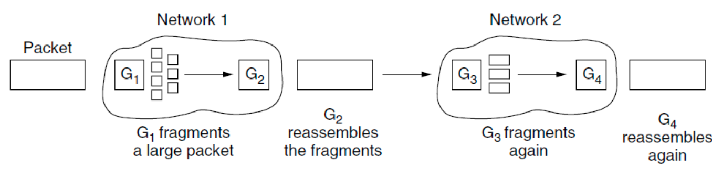

**Nontransparent fragmentation**

数据包一旦被分片，这些分片就独立传输，由目标主机在终点处重组。

非透明分段的主要优势在于降低路由器的处理负担

- IPv4协议即采用此方式。
- 完整的设计要求对分段进行编号，以确保能够准确还原原始数据流。

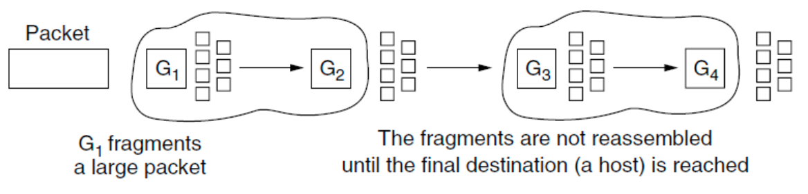

**Example**

4000字节的数据报在MTU位1500字节的网络上传输。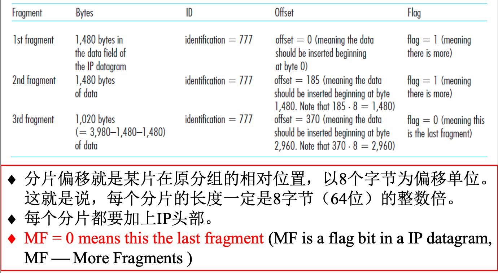

**Path MTU dicovery**

现代互联网中采用的技术。该技术的优势在于源终端能够实时获知MTU。若网络路由器或路径MTU发生变化，系统会生成新的报错包，源终端则会动态调整传输路径参数。
然而，其缺点在于在探测路径的过程中可能引入额外的初始化延迟(**added startup delays**)，可能需要多次往返时延以完成路径探测。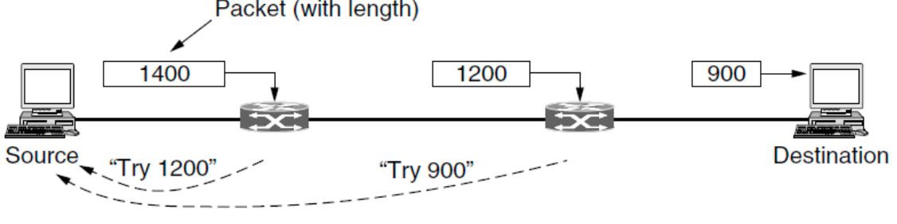

#### IPv4 Addressing

IPv4是32位地址空间。<u>IP地址实际上并不指向某一具体主机，而是指向网络接口(network interface)。</u>如果一台主机同时在两个网络上，则需要两个IP地址。

在实际使用中，大多数主机都在一个网络上工作，因此只需要1个IP地址。而路由器有多个接口，因此需要多个IP地址。

区别于以太网地址，IP地址采用层次结构设计。每个32位地址由顶部的可变长度网络部分(**network portion**)和底部的主机部分(**host portion**)组成。

IPv4地址采用点十进制表示法，如128.208.2.151。也可以使用十六进制表示: 80D00297。

**IP Prefix** 

用于表示**IP 地址块**，采用 IP address/length 的写法，其中 /N 被称为子网掩码(**subnet mask**)，如 /24 表示子网掩码位 255.255.255.0; 128.13.0.0/16 表示 128.13.0.0 到 128.13.255.255之间到IP地址。

Prefix的主要优势在于路由器可以仅根据IP地址的网络部分进行包转发，只要每个网络拥有唯一的地址块即可。

- 更具体的前缀具有更长的前缀长度，因此对应的IP地址范围更小。
- 相反，较不具体的前缀长度较短，覆盖的IP地址范围更大。

##### **Subnet**

按前缀进行路由需要网络中的所有主机共享相同的网络编号。随着网络规模扩大，此特性可能引发路由与管理上的难题。

解决方案是将地址块拆分为多个子网，用于内部通信，却对外表现为一个统一的网络，这一过程即子网划分（**subnetting**）。

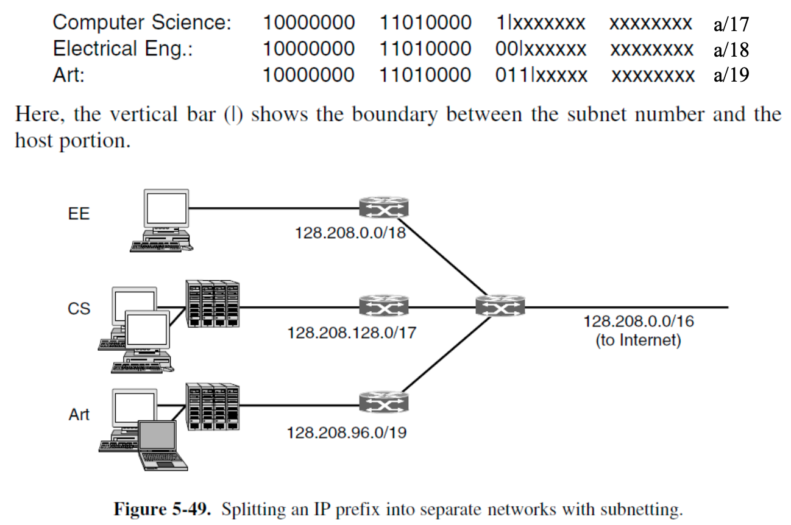

##### IP Address Classes - Historical

在采用Classless InterDomain Routing(CIDR)之前，IP地址的网络部分长度局限于8、16或24比特，这种寻址方案被称为**classful addressing**。

##### **CIDR (Classless InterDomain Routing)**

不再使用固定的类划分（Class A/B/C），而是允许 **IP 前缀长度可变**，根据实际需求灵活分配。

CIDR的实现需要两个关键的机制：

- **Subnetting**: 划分IP前缀 
- **Route aggregation**: 将多个较小的前缀合并为一个较大的前缀  

子网划分和路由聚合的设计过程统称为CIDR（Classless InterDomain Routing）

> **Longest Matching Prefix Rule**
>
> 当一个目标地址匹配多条路由时，选择匹配位数最多的那一条路由（即最具体的网络）。

!!!NOTE
	特殊IP地址有：0.0.0.0表示本网络；255.255.255.255表示当前子网的所有主机，常应用于局域网的广播通信；127.0.0.1表示本地地址。

!!!NOTE
	Internet数据包中不会出现的私有地址：

	10.0.0.0/8  10.0.0.0 - 10.255.255.255

	172.16.0.0/12 172.16.0.0 - 172.31.255.255

	192.168.0.0/16 192.168.0.0 -192.168.255.255

##### **NAT(Network Address Translation)**

为了解决IP地址资源有限的问题，主要采用两种解决方案：

- **DHCP(Dynamic Host Configuration Protocol)**: 采用动态IP分配机制，在计算机连接网络时动态分配IP地址，网络不再使用时回收该IP地址
- **NAT(Network Address Translation)**: 通过少量的外部IP地址，实现多个内部主机的通信

NAT转换表中不仅包含**端口号**，还包括表项中的**IP地址**。NAT路由器能够作为单一设备向外部网络表现，具有唯一的IP地址。

端口实质上是额外的16位地址，用于识别不同进程接收的入站数据包。0到1023端口专为知名服务保留，其中端口80为Web服务器所使用的默认端口。

NAT存在一些问题：

- <u>端口号应仅用于进程寻址</u>，而非主机寻址。
- 路由器应仅处理第3层（网络层）的数据包。
- NAT协议违反了所谓的端到端（end-to-end）原则，即主机之间应直接通信，不应有中间节点修改IP地址和端口号。
- NAT将互联网从一个无连接网络转变为一种特殊的面向连接的网络。如果NAT设备崩溃且丢失其映射表，所有连接将被中断。
- NAT违反了协议分层的基本原则：第k层不应对第k+1层在负载（payload）字段中存放的内容做任何假设。

##### **DHCP**

#### IPv6 Addressing

IPv6使用128位地址。IPv6 与 IPv4 不兼容，但与其他辅助互联网协议兼容，包括 TCP、UDP、ICMP、IGMP。

IPv6的主要特性有：

- IPv6 地址比 IPv4 地址更长。
- 简化后的报头仅包含 7 个字段（IPv4 为 13 个字段）。此更改使路由器能够更快地处理数据包，从而提高吞吐量并降低延迟。
- 更好地支持选项 → 加快数据包处理速度。
- 安全性。
- 服务质量 (QoS)。

##### **IPv6 Datagram Header**

**1. Version field (4 bits)**

IPv6 为 6，IPv4 为 4

**2. Difference Services field (8 bits)**

低 2 位用于指示显式拥塞情况。

**3. Flow Label field (20 bits)**

当出现带有非零**流标签**的数据包时，所有路由器都可以在内部表中查找该数据包，以确定它需要何种特殊处理。流标签是数据报网络的灵活性和虚拟电路网络的保障。

**4. Payload length field (16 bits)**

指示 40 字节头部之后有多少字节。

**5. Next Header field (8 bits)**

指示要将数据包传递给哪个传输协议处理程序（例如：TCP、UDP）。
此字段使用与 IPv4 头部中的协议字段相同的值。

**6. Hop Limit field (8 bits)**

与 IPv4 中的**TtL**字段相同。

**7. Source address and Destination address fields (each with 128 bits or 16 bytes)**

##### **IPv6 Address**

IPv6 地址由八组四位十六进制数字组成，组与组之间用冒号分隔。

- 如8000:0000:0000:0123:4567:89AB:CDEF

由于许多地址中包含大量0，因此允许通过以下三种来优化表示：

- 可以省略组前导0，因此 0123 可以写成123
- 可以用一对冒号替换一组或多组 16 位零。如8000::123:4567:89AB:CDER
- IPv4 地址可以写成一对冒号和一个旧的点分十进制数。

相比于IPv4，IPv6数据报去除了几个字段：

- 分片/重组：IPv6 不允许在中间路由器进行分片和重组；这些操作只能在源和目标端执行。分片和重组是一个耗时的操作；从路由器中移除此功能可以加快网络内的 IP 转发速度。如果路由器收到的 IPv6 数据报过大，无法通过出站链路转发，路由器会直接丢弃该数据报，并向发送方发送“数据包过大”的 ICMP 错误消息。
- 没有header checksum：因为互联网层的传输层（例如 TCP 和 UDP）和数据链路层（例如以太网）协议已经执行了校验和，所以网络层不再需要此功能。由于 IPv4 报头包含 TTL 字段，因此需要在每个路由器上重新计算 IPv4 报头校验和。如果没有校验和，处理 IP 数据包的速度会更快。
- 没有Options：移除可选字段后，IP 报头长度固定为 40 字节。

##### **IPv6 Extension Headers**

IPv6 引入了（可选）扩展头的概念。每个扩展头都是可选的，但如果存在多个扩展头，它们必须紧跟在固定头部之后，最好按照列出的顺序排列。

每个扩展头都编码为一个 (Type, Length, Value) 元组:

- **Type**是一个 1 字节的字段，用于指示该扩展头属于哪个选项。前 2 位告诉不知道如何处理该选项的路由器该怎么做。选项包括：跳过该选项，丢弃数据包；丢弃数据包并发送 ICMP 数据包；以及丢弃数据包但不为组播地址发送 ICMP 数据包。
- **Length**是一个 1 字节的字段，用于指示扩展头的值的长度（0 到 255 字节）。
- **Value**是所需的任何信息，最多 255 字节。

各拓展头通过Next Header字段串成一条链。

常见 IPv6 扩展头类型有：

- **The hop-by-hop header**: 用于存储路径上所有路由器必须检查的信息。
- **The destination options header**
- **The routing header**: 列出到达目标地址途中必须访问的一个或多个路由器。它与 IPv4 的loose source routing非常相似。
- **The fragmentation header**: 类似IPv4处理分片。但是在IPv6中，只有源主机可以对数据包进行分片。
- **The authentication header**: 提供一种机制，数据包的接收者可以通过该机制确认数据包的发送者。
- **The encrypted security payload**: 加密数据包的内容，以便只有预期的接收者才能读取。

##### **Transitioning from IPv4 to IPv6**

RFC 4213 描述了两种方法：

- **IPv6-capable nodes**: 一种双栈(**dual-stack**)方法，要求IPv6节点也具有完整的 IPv4 实现。IPv6 数据报中的一些 IPv6 特有字段将会丢失。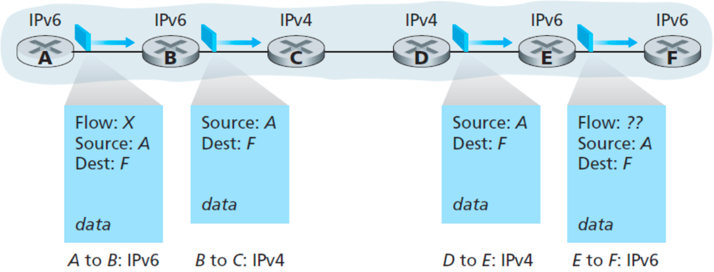
- **Tunneling**: 将整个 IPv6 数据报放入 IPv4 数据报的数据（payload）字段中。IPv4 网络只看到封装后的 IPv4 包，因此隧道内部的网络设备无法对隧道内的 IPv6 数据包进行处理或访问。（但 VPN 可以将这种限制转化为优势）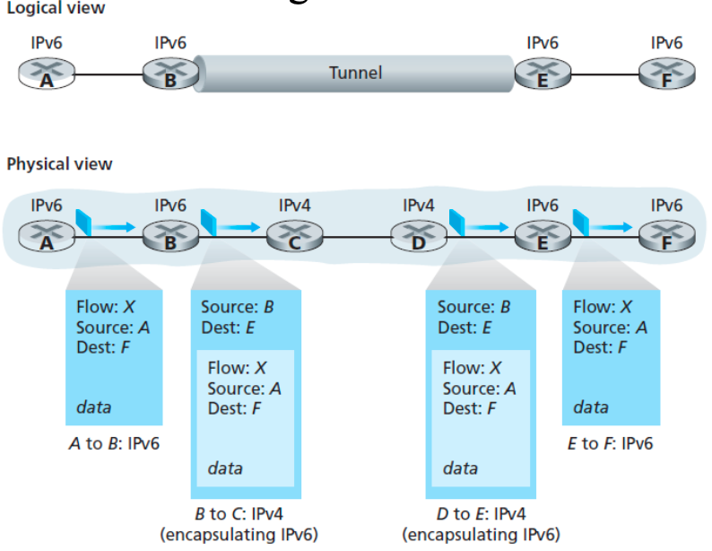

### Control Protocols

除了用于数据传输的 IP 协议之外，互联网还有几个用于网络层配套的控制协议:

- IPv4: ICMP, ARP, DHCP
- IPv6: ICMP, NDP(Neighbor Discovery Protocol), DHCP

#### ICMP(Internet Control Message Protocol)

ICMP 最典型的用途是**错误报告**。

ICMP 通常被认为是 IP 协议的一部分，但从架构上看，它位于 IP 协议之上，因为 <u>ICMP 消息包含在 IP 数据报中。</u>IP 数据报头的 **Protocol 字段值为 1** 表示这是一个 ICMP 数据报。ICMP 消息包含type字段和code字段，并包含 IP 数据报的头部和前 8 个字节。

##### **Use of ICMP**

**Ping**

通过发送**type 8 code 0**的ICMP消息实现的，目标主机收到消息后会返回一个**type 0 code 0**的ICMP消息回复。

**Tracert**

用于确定源主机和目标主机之间路由器的名称和地址，实现流程如下：

- 源主机上的 Tracert 程序向目标主机发送一系列普通的 IP 数据报，每个数据报都携带一个 UDP 段，其中**包含一个不常见的UDP 端口号**。第一个数据报的 TTL 为 1，第二个为 2，第三个为 3，依此类推。源主机还会为每个数据报启动计时器。
- 当第 n 个数据报到达第 n 个路由器时，第 n 个路由器发现该数据报的 TTL 已过期。根据 IP 协议规则，路由器丢弃该数据报，并向源发送 ICMP 警告消息(**type 11 code 0**)，<u>该警告消息包含路由器的名称及其 IP地址。</u>
- 当 ICMP 消息返回源端时，源端从计时器获取往返时间，并从 ICMP 消息中获取第 n 个路由器的名称和 IP 地址。
- 由于该数据报包含一个端口号不常见的 UDP 段，目标主机会向源端发送一个端口不可达的 ICMP 消息(**type 3 code 3**)。当源端收到此 ICMP 消息时，它知道无需发送额外的探测数据包。

!!!Note
	标准的 Tracert 程序实际上发送的是三组具有相同 TTL 值的数据包；因此，Tracert 输出对于每个 TTL 值都会提供三个结果。

#### ARP (The Address Resolution Protocol)

ARP 查询数据包的目的是查询子网上的所有其他节点，以确定与待解析的 IP 地址对应的 MAC 地址。

> **Example**
>
> 主机 1 上的用户如何向网络上的主机 2 上的用户发送数据包。
>
> 1. 查找主机 2 的 IP 地址，假设主机 1 知道主机 2 的名称。此查找由 DNS（第 7 章）执行。
> 2. 主机 1 在以太网上输出一个广播数据包，询问谁拥有 IP 地址 192.32.65.5。此时发送目标是一个**特殊的MAC地址: ff:ff:ff:ff:ff:ff(即所有主机)**
> 3. 只有主机 2 会响应其以太网地址 (E2)。这样，主机 1 就能获知 IP 地址 192.32.65.5 位于以太网地址 (E2) 上。
> 4. 主机 1 构建一个发往 E2 的以太网帧地址，将 IP 数据包（地址为 192.32.65.5）放入有效载荷字段，然后将其发送到以太网端口。
>
> 

##### Various Optimizations of ARP

**1. Cache**

一旦某台机器运行了 ARP 请求，它会将结果缓存起来，以便在需要时再次联系同一台机器。每个节点（主机和路由器）的内存中都有一个 **ARP 表**，其中包含 IP 地址到 MAC 地址的映射。ARP 表包含一个**生存时间 (TTL) 值**，该值指示每个映射何时从表中删除。

在许多情况下，主机 2 需要发送回复，这迫使它也运行 ARP 请求来确定发送方的以太网地址。可以通过让主机 1 将其 IP 地址到以太网地址的映射包含在 ARP 数据包中来避免这种 ARP 广播。当 ARP 广播到达主机 2 时，该映射对 (192.32.65.7, E1) 将被添加到主机 2 的 ARP cache中。实际上，以太网上的所有机器都可以将此映射添加到它们的 ARP 缓存中。

**2. The default gateway**

如图，假设主机 1 要向网络EE上的主机 4 (192.32.63.8) 发送数据包。主机 1 会发现目标 IP 地址不在 CS 网络上。它知道要将所有此类网络外流量发送到默认网关（路由器）。按照惯例，默认网关的地址是网络上**最低**的。发送的过程如下：

- Step1: 如果主机 1 不知道 IP 地址为 (192.32.65.1) 的默认网关（路由器）的 MAC 地址，它会通过发送 ARP 广播数据包来发现它，并找到 MAC 地址（以太网地址）为 E3。
- Step2: 主机 1 向默认网关发送一个帧（源地址 192.32.65.7，E1；目标地址 192.32.63.8，E3）。路由器收到该帧后，将其交给 IP 软件处理。路由器根据网络掩码得知该数据包应发送到 EE 网络，最终到达主机 4。
- Step3: 如果路由器不知道主机 4 的 MAC 地址，它将再次使用 ARP 协议（主机 4 的 MAC 地址为 E6）。
- Step4: 路由器发送一个帧（源地址 192.32.65.7，E4；目标地址 192.32.63.8，E6）。

**3. Proxy ARP**

主机 1 发送 ARP 后，由路由器代替主机 4 回应 ARP，即提供自己的 MAC 地址，让主机 1 以为主机 4 就在本地网络，从而实现跨网段通信。(<u>主机 4 不会直接回复 APR  请求，因为路由器不会转发以太网层的广播</u>)

##### ARP vs. DNS

- ARP 仅将同一子网上的节点的 IP 地址解析为 MAC 地址
- DNS 将互联网上任何位置的主机名解析为 IP 地址。

ARP 被视为一种跨越链路层和网络层的协议。

### Routing Protocols

本部分主要介绍当今Internet中使用的两种 intra-AS 路由协议(**RIP**, **OSPF**) 和一种 inter-AS 路由协议(**BGP**)。

#### Routing in the Internet

在实际的Internet中，如果将网络简单地视为一组互连的路由器，所有路由器都执行相同的路由算法(LS/DV)来计算整个网络中的路由路径会存在以下问题：

- **Scale**: LS 算法需要存储所有路由信息，并在所有路由器之间广播 LS 更新；而 DV 算法在大量路由器之间迭代，肯定无法收敛。
- **Administrative autonomy**: 组织应该能够按照自己的意愿运行和管理其网络，同时仍然能够将其网络连接到其他外部网络。

这些问题可以通过将路由器组织成自治系统(**Autonomous Systems, AS**)，即使用分层路由。

- 同一自治系统 (AS) 内的路由器都运行相同的路由算法（例如，LS 或 DV 算法），并且彼此之间共享信息。(Intra-autonomous system routing protocol)
- 为了将不同的 AS 连接起来，一个 AS 中的一个或多个路由器将承担额外的任务：负责将数据包转发到 AS 外部的目标地址。这些路由器被称为 **gateway routers**

Internet使用两级路由算法：

- 在每个网络内部，使用 intradomain/interior gateway protocol 进行路由(Distance vector routing, Link state routing)
- 在组成 internet 的各个网络之间，使用 interdomain/exterior gateway proticol 进行路由。

**不同网络可能使用不同的 intradoamin protocols，但是一定使用相同的 interdomain protocols**。在 Internet中，interdomain routing protocol 被称为 **BGP**(Border Gateway Protocol)。

在网络层，Internet 可以被视为相互连接的网络或 AS 的集合: 

- 没有固定的结构，但存在几个主要的骨干网。这些骨干网由高带宽线路和高速路由器构成。其中最大的骨干网被称为一级网络。

- 连接到骨干网的是互联网服务提供商 (**Internet Service Providers, ISP**)，它们为家庭和企业提供互联网接入；此外还有数据中心和托管机房，这些设施内装满了服务器；以及区域性（中级）网络。

- 连接到区域性网络的是更多的 ISP、许多大学和公司的局域网 (LAN) 以及其他边缘网络。

将整个互联网连接在一起的是网络层协议，即 IP（**Internet Protocol**）。

- 理论上，IP 数据包每个最大可达 64 KB，但实际上它们通常不超过 1500 字节（以便能够放入一个以太网帧中）。

> **Routers vs Switches(Bridges)**
>
> - 路由器会从帧中提取数据包，并根据数据包中的网络地址决定其发送目的地。
> - 交换机（或网桥）则会根据数据包的 MAC 地址传输整个帧。交换机无需了解用于交换数据包的网络层协议，而路由器则需要。
>
> 网桥主要用于在链路层连接相同类型的网络，而路由器则用于在网络层连接不同的网络。

#### RIP (Routing Information Protocol)

RIP是一种 DV 协议。

RIP使用跳数(**hop count**)来计算成本。最大的路径成本被限制在15，因此RIP只能用在小型的AS中。

在RIP中，路由使用 **RIP response message** 大约每30秒与邻居交换路由信息。

- 路由器或主机发送的响应消息包含自治系统内最多 15 个目标子网的列表，以及发送方到每个子网的距离。
- 回复的消息本称为 **RIP advertisement**

<u>RIP 是一种基于 **UDP** 的应用层协议。</u>路由器之间通过 UDP 协议，使用 **520** 端口相互发送 RIP 请求和响应消息。

**Example**

#### OSPF (Open Shortest Path First)

OSPF是一种网关内路由协议(**Interior Gateway Routing Protocol**)。

OSPF及其密切相关的IS-IS协议通常部署在上层ISP（互联网服务提供商）中，而RIP则部署在下层ISP和企业网络中。

OSPF本质上是一种链路状态协议(**link-state protocol**)，它利用链路状态信息的泛洪和Dijkstra最短路径算法。

- 使用OSPF时，路由器会构建整个自治系统的完整拓扑图。然后，路由器在本地运行Dijkstra最短路径算法，以确定到所有子网的最短路径树，并将自身作为根节点。
- 即使链路状态没有改变，OSPF也会定期（至少每30分钟一次）广播链路状态。
- OSPF通告包含在OSPF消息中，这些消息直接由 **IP** 传输，IP协议号为89。
- 如果找到多条长度相同的路径。在这种情况下，OSPF 会记住一组最短路径，并在数据包转发过程中将流量分配到这些路径上。(**ECMP**, Equal Cost MutiPath)

**OSPF Cost Table**

互联网中的许多自治系统 (AS) 本身规模庞大，为了在这种规模下运行，OSPF 允许将 AS 划分为编号区域(**numbered areas**)，其中一个区域是一个网络或一组连续的网络，即分层 OSPF 路由(**hierarchical OSPF routing**):

- 一个区域被认为是一个单独的网络
- 在区域外部，其目标地址可见，但其拓扑结构不可见。
- 完全位于区域内的路由器称为内部路由器。

每个 AS 都有一个**骨干区域(backbone area**)，被称为区域0(**area 0**)

- 这个区域里的路由器被称为**骨干路由器(backbone routers**)
- 所有区域都连接到骨干区域（可能通过隧道），因此可以通过骨干区域从 AS 中的任何区域访问 AS 中的任何其他区域。
- 与其他区域一样，骨干区域的拓扑结构在骨干区域外部不可见。

连接到两个或多个区域的每个路由器称为区域**边界路由器(area border router)**。它也必须是骨干区域的一部分。

- 区域边界路由器的职责是汇总一个区域内的目的地信息，并将此汇总信息注入到与其相连的其他区域中。
- 此汇总信息包含成本信息，但不包含区域内拓扑结构的全部细节。
- 如果一个区域外只有一个边界路由器，则甚至无需传递汇总信息。这种区域称为**末梢区域(stub area)**。

AS 边界路由器会将指向其他 AS 上外部目的地的路由注入到该区域内。然后，这些外部路由器会显示为可以通过 AS 边界路由器以一定成本到达的目的地。

一个区域内的每个路由器都拥有相同的链路状态数据库，并运行相同的最短路径算法。**区域边界路由器**需要其连接的所有区域的数据库，并且必须为每个区域**分别**运行最短路径算法。

对于位于不同区域的源和目标，跨区域路由必须从源到骨干网，穿过骨干网到达目标区域，然后再到达目标区域。

到外部目标的路由可能包含从 AS 边界路由器到外部路径的外部开销。

局域网 (LAN) 上的每个路由器都与其他所有路由器通信效率低下。为了避免这种情况，会选择一个路由器作为指定路由器(**designed router**)。它充当代表 LAN 的单一节点。同时，始终保持备用指定路由器(**backup designed router**)处于最新状态，以便在主指定路由器发生故障需要立即更换时，能够轻松完成切换。

**OSPF Messages**

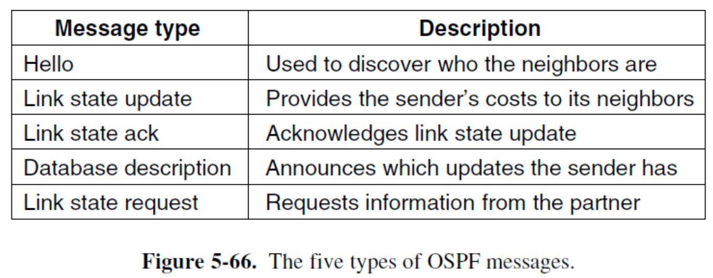

正常运行期间，每个路由器都会定期向其所有相邻路由器发送链路状态更新 (LINK STATE UPDATE) 消息。这些消息会收到确认，以确保其可靠性。每条消息都有一个序列号，因此路由器可以判断收到的链路状态更新消息(LINK STATE UPDAT)是比它当前收到的消息更旧还是更新。

#### BGP (Border Gateway Protocol)

BGP是网关外路由协议(Exterior Gateway Routing Protocol)，是当今Internet中使用的标准 **inter-AS** 路由协议。

<u>BGP是一种基于**策略(policies)**而非最小距离的**DV路由协议**。</u>连接通常通过IXP（Internet eXchange Points）的链路建立，许多ISP都通过链路连接到IXP，以便与其他ISP互联。

- 如果客户仅连接到一个ISP，则无需运行BGP，因为它是一个末端网络，仅通过一条链路连接到互联网的其他部分。
- 一些公司网络连接到多个ISP（**multihoming**）。在这种情况下，公司网络很可能运行域间路由协议（例如BGP），以告知其他AS哪些地址应该通过哪些ISP链路访问。

**BGP 在 AS 层选择要遵循的路径，而 OSPF 在每个 AS 层选择路径。**

在 BGP 中，路由器之间通过**端口 179 建立的半永久性(semipermanent) TCP 连接**交换路由信息。

- 每个自治系统 (AS) 内都存在一个 TCP 连接网。
- 在 BGP 中，目标地址不是主机，而是 CIDR 化的前缀(**CIDRized prefix)**，每个前缀代表一个子网或一组子网。

当位于任何自治系统 (AS) 中网关路由器接收到通过 eBGP 学习到的前缀时，网关路由器会使用其 iBGP 会话将这些前缀分发给 AS 中的其他路由器。当路由器（无论是否为网关）学习到新的前缀时，它会在其转发表中为该前缀创建一个条目。

在 BGP 中，自治系统由其全球唯一的自治系统编号 (**ASN**, autonomous system number)标识。(AS 编号与 IP 地址一样，由 ICANN 区域注册机构分配)

**在 BGP 术语中，前缀及其属性被称为路由。**因此，BGP 对等体之间会相互通告路由。

**BGP Route Advertising**

不同的参与方，例如互联网服务提供商 (ISP)，被称为自治系统 (AS)。自治系统的边界路由器会相互通告 BGP 路由。路由通告(Route Advertising)包含 **IP 前缀、AS 路径和下一跳**。

- 当路由器收到路由通告时，它会检查自身的 AS 号是否已在 AS 路径中。如果已存在，则检测到环路，该路由通告将被丢弃。
- 路由通告的传递方向与流量的传递方向相反。

**BGP Example**

AS2、AS3 和 AS4 都是 AS1 的客户，它们从 AS1 购买传输服务。

- 当源 A 向目标 C 发送数据时，数据包会先经过 AS2，再经过 AS1，最终到达 AS4。
- AS4 将 C 作为目标地址通告给其传输服务提供商 AS1，以便源地址可以通过 AS1 到达 C。之后，AS1 会将到达 C 的路由通告给包括 AS2 在内的其他客户，告知这些客户可以通过 AS1 向 C 发送流量。

AS2 从 AS1 购买传输服务 (TR)，从 AS3 购买对等服务 (PE)。对等连接并非传输服务。尽管 AS2 与 AS3 建立了对等连接，AS3 又与 AS4 建立了对等连接，但这并不意味着 AS2 是通过 AS3 与 AS4 建立对等连接的，即使存在物理路径。

即对等服务只能相互交换信息，不会帮忙转发第三方信息。

**BGP Policy**

该策略通过两种方式实施：

- ISP 的边界路由器仅向可以使用这些路径的其他方通告路径，过滤掉其他方无法使用的路径
- ISP 的边界路由器从所有已接收到的路径中选择最佳路径（非最短路径），如热点路由（提前退出）

## MPLS (Multiprotocol Label Switching)

MPLS与电路交换非常相似。

- 为了提高 IP 路由器的转发速度，采用了虚拟电路网络中的一个关键概念：固定长度标签(**a fixed-lengt label**)。
- 目标并非放弃基于目的地的 IP 数据报转发基础设施，转而采用基于固定长度标签和虚拟电路的基础设施，而是通过选择性地标记数据报来增强现有基础设施，并**允许路由器在可能的情况下基于固定长度标签（而非目的地 IP 地址）转发数据报。**

#### Where Does the Label Go

由于 IP 数据包并非为虚拟电路而设计，因此 IP 报头中没有用于存储虚拟电路编号的字段。需要在第 2 层（即 PPP 或以太网）报头和第 3 层（即 IP）报头之间添加一个新的 MPLS 报头。

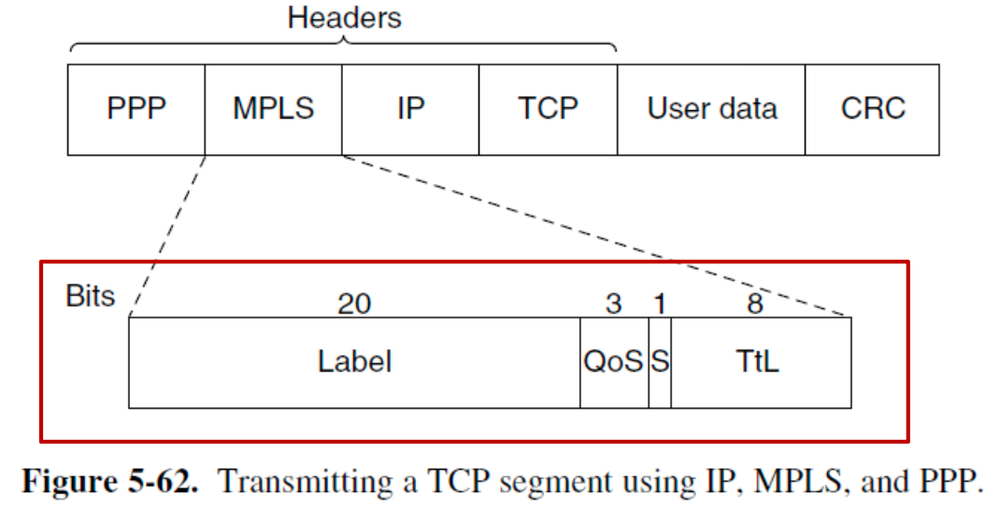

通用的 MPLS 报头长度为 4 字节，包含四个字段：

- The Label field
- The QoS field
- The S field (用于堆叠(stacking)多个标签)
- The TtL field (在每个路由器处递减，如果达到 0，则丢弃该数据包)

**MPLS 位于网络层协议和数据链路层协议之间。被称为2.5层协议**

- 它实际上并非三层协议，因为它依赖于 IP 或其他网络层地址来建立标签路径。
- 它实际上也并非二层协议，因为它转发数据包需要经过多个跃点，而不是单个链路。

当MPLS增强型数据包到达LSR（**Label Switched Router**）时，标签被用作索引，以确定要使用的出站线路以及要使用的新标签。

- 标签必须在每一跳处重新映射。（标签仅具有本地意义）
- 所有虚电路网络都使用标签交换。
- IP转发使用最长匹配前缀算法。相比之下，使用从数据包中提取的标签作为索引来交换转发信息，这种方法更简单、更快速。

#### When and How the Labels are Attached to Packets

当 IP 数据包到达 MPLS 网络边缘时，标签就会附加到数据包上。标签边缘路由器 (**LER**, Label Edge Router) 会检查目标 IP 地址和其他字段，以确定数据包应遵循的 MPLS 路径，并在数据包前端添加正确的标签。在 MPLS 网络内部，标签用于转发数据包。在 MPLS 网络的另一端，标签已完成其使命，将被移除，从而使 IP 数据包再次暴露出来，以便发送到下一个网络。

MPLS 可以通过在数据包前端添加多个标签来同时在多个层级上运行。

- 例如，假设有许多数据包已经带有不同的标签（因为希望在网络中的某些地方区别对待这些数据包），它们应该沿着一条共同的路径到达某个目的地。与其为每个不同的标签设置一条标签交换路径，我们可以设置一条单一的路径。当已标记的数据包到达这条路径的起点时，会在数据包前端添加另一个标签。(标签栈)
- MPLS报头中的S字段允许路由器在移除标签时知道是否还有剩余的标签。对于最底层的标签，S 位设置为 1；对于所有其他标签，S 位设置为 0。

#### How the Label Forwarding Tables are Set Up

MPLS 不需要用户参与建立连接阶段。转发信息由路由协议和连接建立协议的组合协议来建立。

路由器启动时，会检查哪些路由是其最终目的地（例如，哪些前缀属于其接口）。然后，它会为这些路由创建一个或多个 FEC（Forwarding Equivalent Class），为每个 FEC 分配一个标签，并将这些标签传递给其邻居。邻居们依次将这些标签添加到它们的转发表中，并向邻居发送新的标签，直到所有路由器都获取到该路径为止。

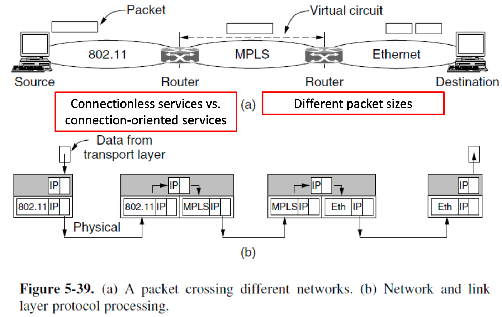

