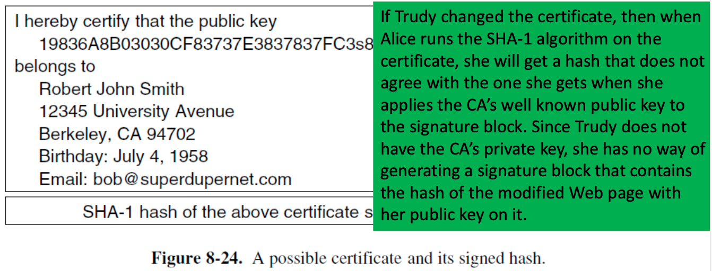
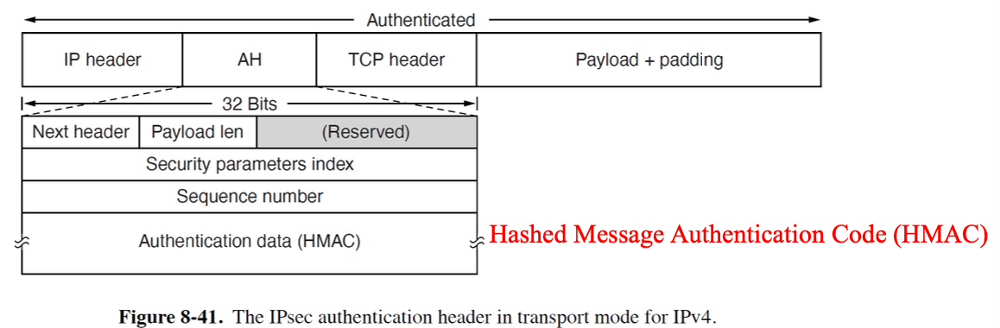
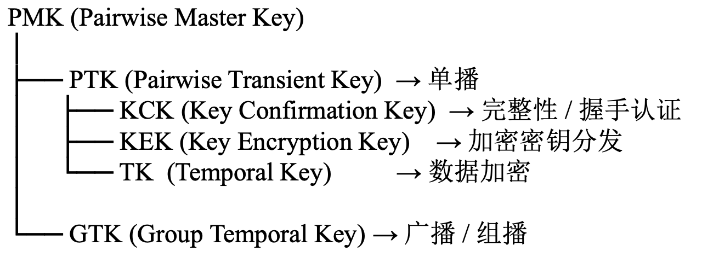
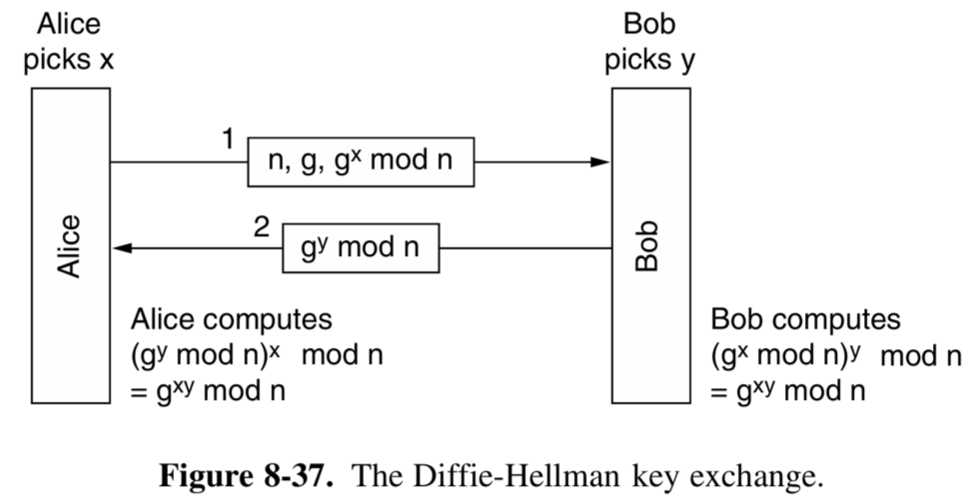
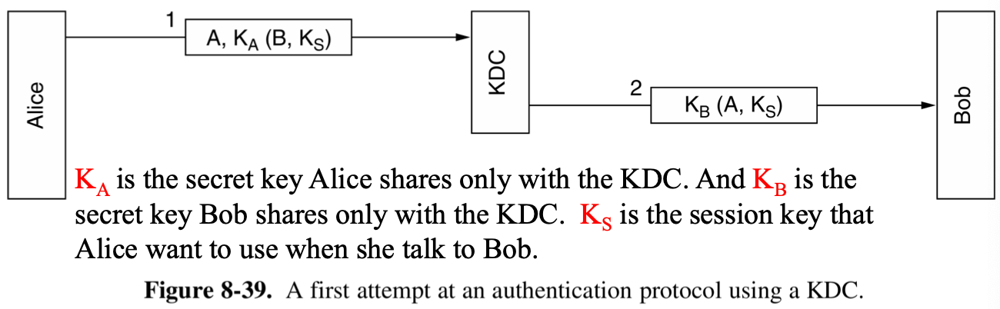

# Network Security

网络安全问题大致可以分为4个领域：

- Secrecy (机密性)
- Authentication (身份认证)
- Nonrepudiation (不可否认)
- Integrity control (完整性)

## Basic knowledge

### Cryptography

#### Kerckhoff’s Principle

**所有的算法(algorithms)都必需是公开的，只有密钥(keys)是保密的。**

密钥越长，密码分析者需要应对的工作量就越大。通过穷举搜索密钥空间破解系统的所需工作量与密钥长度呈指数关系。

加密方法可分为两类：**替换密码（substitution cipher）**和**换位密码（transposition cipher）。**

#### Substitute ciphers

在替换密码中，每个字母或字母组合都被替换为另一个字母或字母组合。

- **Caesar cipher**: 例如每个字母向后移动 k 个位置。
- 密码本

基本的攻击手段是利用<u>自然语言的统计特性</u>。

#### Transposition Ciphers

转位密码改变字母的顺序，但不进行伪装。


- 要破解置换密码，密码分析者首先必须意识到自己面对的是置换密码。(通过观察E、T、O、A、N、I等字母的出现频率，可轻松判断其是否符合明文的常规分布模式。)
- 接下来需推测列数（即密钥长度）。(多数情况下，可根据上下文推测可能的单词或短语。)
- 最后一步是排列列序。(当列数k较小时，可依次检验k(k − 1)组列对，观察其双字符组合频率是否符合英文明文特征。匹配度最佳的列对被视为正确位置，随后将剩余各列依次作为该列对的后续列进行试配。)

!!!Two Fundamental Cryptographic Principles
	(1) 所有加密消息必须包含一定冗余度。(2) 必须采取措施确保每条接收到的消息均可验证为最新消息。

### Symmetric-Key Algorithms

在对称密钥算法中，加密和解密使用相同的密钥。


- P-box: 打乱顺序。
- S-box: 非线性的查表替换。


#### DES (Data Encryption Standard)

- 明文以64位为单位分组加密，生成64位密文。
- 该算法采用56位密钥参数化，包含19个独立阶段。
- 第一阶段对64位明文进行密钥无关的置换操作。
- 最后阶段是该置换操作的精确逆运算。
- 倒数第二阶段将最左侧32位与最右侧32位互换。
- 其余16个阶段功能相同，但采用密钥的不同函数进行参数化。


该算法设计允许使用与加密相同的密钥进行解密，只需按相反顺序执行步骤。

对于iteration的每一步，左侧输出即右侧输入的副本，右侧输出为左侧输入与右侧输入及本阶段密钥 $K_i$ 的函数值进行按位异或运算的结果。这个转换函数包含以下4步：

- 根据固定的置换与复制规则，将32位 $R_{i-1}$ 展开构造出48位数 $E$。
- 对 $E$ 与 $K_i$ 进行异或运算。
- 将该输出划分为 8 个 6 位组，每组分别输入不同 S-box。每个 S-box 的 64 种可能输入均映射至 4 位输出。
- 这 8 × 4 位数据通过 P-box 处理。


DES的原始密钥是64位，包括8位的奇偶校验位。开始后先丢弃8个校验位，然后对剩下的56位进行重新排列。

每次迭代前，密钥被划分为两个 28 位单元。每个单元根据迭代次数进行 1 位或 2 位的左循环移位（每一轮的循环左移位数是固定表决定的，即左移位数与轮数有关）。对左移后的 56 位再进行一次置换选择，选出48位作为当前轮的密钥。

```
64 位主密钥
   ↓ 去掉校验位 + 置换（PC-1）
56 位
   ↓ 分成两半
C0(28) || D0(28)
   ↓ 每轮循环左移
Ci || Di
   ↓ 选择 + 置换（PC-2）
48 位轮密钥 Ki

```

#### Triple DES

- **whitening**: 一种增强DES的技术。在将明文块输入DES前，先与随机生成的64位密钥进行异或运算；随后在传输前，将生成的密文与第二个64位密钥进行异或运算。若接收方持有两个白化密钥，可通过逆向操作轻松解除。

**Triple DES**: EDE (Encrypt Decrypt Encrypt)，采用加密-解密-加密的三重处理方式，旨在与现有单密钥DES系统保持向后兼容性。


#### Rijndael

与DES类似，Rijndael采用置换与替换操作，并采用多轮处理。<u>有别于DES的是，所有操作均涉及完整字节，以实现硬件与软件的高效实现。</u>

#### Other Symmetric-Key Ciphers


### Public-Key Algorithms

加密密钥和解密密钥可以完全不同，即:

- $D(E(P))=P$
- 很难从 E(加密密钥) 中推导出 D(解密密钥)
- E 不能被选择明文攻击(plaintext attack)破解

公钥密码学要求每位用户拥有两把密钥：**公钥(public key)**供全世界用于加密发往该用户的密文，**私钥(private key)**则用于解密接收到的密文。

#### RSA

基于数论的基本规则实现：

- 选择两个大质数， $p$ 和 $q$ (通常是1024位)
- 计算 $n=p\times q$ 和 $z=(p-1)\times (q-1)$
- 选择一个与 $z$ 互质的数称为 $d$ 
- 找到 $e$ 使得满足 $e\times d=1\text{mod} z$
- 则 $(n,e)$ 为公钥， $(n,d)$ 为私钥


#### ECC (Elliptic Curve Cryptography)

基于椭圆曲线离散对数的数学难题，使用特定的曲线方程和基点生成公钥和私钥，子算法 ECDHE 用于秘钥交 换，ECDSA 用于数字签名。

比起 RSA，ECC 在安全强度和性能上都有明显的优势。160 位的 ECC 相当于 1024 位的 RSA，而 256 位的 ECC 则相当于 2048 位的 RSA。因为秘钥短，所以相应的计算量、消耗 内存和带宽也就少，加解密的性能就会好，对于现在移动互联网非常有吸引力。 

### Digital Signatures

数字签名使数字文件能够以无法伪造的方式签署，基本要求为：

- 接收方能够验证发件人声称的身份。
- 发件人日后不得否认消息内容。
- 接收方不可能自行伪造该消息。

#### Symmetric-Key Signatures

- 有一个**中心权威机构(central authority)**，如图中的Big brother
- A和B代表 Alice 和 Bob 的身份
- P 时发送的前面明文(plaintext)
- $R_A$ 是 Alice 选择的一个随机数， $t$ 是用于确保消息新鲜度的时间戳
- $K_A,K_B,K_{BB}$ 是Alice, Bob, BB 分别对应的密钥


这样的架构存在一个潜在问题：**Replay Attack** (回放攻击)

回放攻击是指攻击者截获一条“合法的通信消息”，不需要破解任何加密内容，而是把这条消息在之后再次发送（或延迟发送），从而欺骗接收方。

为最大限度规避此问题，系统全程采用时间戳机制。需检查所有近期消息，确认其中是否存在回放攻击。

#### Public-Key Signatures

使用对称密钥数字签名所有人都必须同意信任中心权威机构，而签名文档并不需要一个可信权威机构。

公钥加密与解密算法具备以下特性：除常规属性D(E(P)) = P外，还满足E(D(P)) = P。**RSA** 就拥有这个性质。原则上，任何公钥算法都可以用于数字签名。

**注意图中私钥和公钥的使用顺序。**


#### Message Digests

对于数字签名，**认证(authentication)**是必要的，而**保密(secrecy)**并非总是必要的。

以下认证方案基于**单向哈希函数**的原理，该<u>函数可处理任意长度的明文，并从中计算出固定长度的比特串</u>，不需要对整个消息进行加密。

使用的哈希函数被称为 **message digest(MD)**，主要有以下4个性质：

- **Efficiency**: 给定一个 $P$ ，很容易计算出 $MD(P)$
- **Confidential**: 给定 $MD(P)$ ，实际无法推导出 $P$
- **Uniqueness**: 给定一个 $P$ ，无法找到 $P'$ 使得 $MD(P)=MD(P')$ (哈希值长度至少应为128位，越长越好)
- **Trustworthiness**: 输入即使仅改变1位也会产生截然不同的输出。（哈希必须彻底畸变原始位序列）

从明文计算消息摘要的速度远快于使用公钥算法加密该明文，因此消息摘要可用于加速数字签名算法。

- Alice 首先计算其明文的消息摘要，随后对摘要进行签名，并将签名摘要与明文一并发送给 Bob。
- 若P中途被替换了，当Bob计算MD(P)时将发现异常。


消息摘要在对称密钥密码系统中也可以发挥作用，BB不再使用 $K_{BB}(A, t, P)$ 对P进行签名，而是通过将MD应用于P来计算消息摘要，从而得到MD(P)。


#### SHA-1 (Secure Hash Algorithm)

通过复杂的位操作，使每个输出位都受到每个输入位的影响。以512位元组为单位处理输入数据，生成160位元消息摘要。


#### SHA-2

已开发出新版SHA-1算法，可生成224、256、384和512位的哈希值。这些版本统称为SHA-2。

#### The Birthday Attack

生日攻击是指两个不同的明文，却具有相同的摘要值。

### Management of Public Keys

公钥需要一些机制来确保能够安全地交换：

- CA (Certification Authority)
- Standard X.509
- Public key infrastructure

#### CA (Certification Authority)

CA是认证公钥的机构，Certificate的核心功能是为主体（个人、公司等）建立公钥。



#### Public Key Infrastructures

**PKI(Public Key Infrastructure)** 包含多个组件，包括用户、CA机构、证书和目录。PKI的作用在于为这些组件构建架构体系，并为各类文档与协议制定标准规范。**层级式**CA体系是PKI中最简洁的实现形式。

顶级CA（根CA）为二级CA签发证书，我们称之为RA。当根CA授权新的RA时，它会生成一份X.509证书，声明已批准该RA，并在其中包含新RA的公钥，完成签名后交付给RA。同样地，当RA批准新的CA时，它会生成并签名一份证书，声明其批准行为并包含该CA的公钥。


- 默认所有用户都知晓根证书的公钥。
- 追溯至根证书的证书链称为**chain of trust**或**certification path**。
- 现代浏览器预装了超过100个根证书的公钥。
- 大多数浏览器允许用户检查根证书（通常以根证书签名的证书形式呈现），并可删除任何可疑证书。


## Applications

### Communication Security

#### IPsec (IP security)

完整的IPsec设计是一个支持多种服务(services)、算法(algorithms)和粒度(granularities)的框架。

- 多种服务：非所有用户都愿意为持续使用全部服务付费，因此服务采用套餐式灵活组合。核心服务包括保密性、数据完整性及防范回放攻击。所有服务均基于对称密钥加密技术，因高性能是关键需求。
- 多种算法：当前被认为安全的算法未来可能被破解。
- 多种粒度：可保护单个TCP连接，也可覆盖主机对间所有流量，或安全路由器对间所有流量等多种场景。

IPsec位于IP层（网络层），但是是connection oriented的。IPsec中的“连接”称为**SA(Security Association)**。

- SA是两个终端点之间的单工链接，并关联一个安全标识符。
- 若需双向安全通信，则需建立两个安全关联。
- 安全标识符承载于安全连接传输的数据包中，用于在安全数据包到达时查询密钥及其他相关信息。

IPsec主要包含两个部分：

- 第一部分描述了两种可添加至数据包的新头部，用于承载安全标识符、完整性控制数据及其他信息：**AH** (The IPsec Authentication Header 认证头)、**ESP** (Encapsulating Security Payload, 封装安全负荷)
- 另一部分 **ISAKMP (Internet Security Association and Key Management Protocol)** 负责密钥建立。ISAKMP 是一个框架，执行工作的主要协议是 **IKE** (**Internet Key** **Exchange**, 互联网密钥交换)

IPsec有两种工作模式：

- **Transport Mode**: IP头的协议字段被修改，以指示IPsec头紧随常规IP头（位于TCP头之前）。适用于同一网络内部。
- **Tunnel Mode**: 整个IP数据包（含头部）被封装到具有全新IP头的新数据包主体中。适用于跨网络传输。

##### **AH**

AH提供完整性检查和防回放安全性，但不提供保密性（即不加密数据）。

- 在IPv4中，它位于IP头（含所有选项）与TCP头之间。
- 在IPv6中，它只是另一个扩展头，按此方式处理。



1. **Next header**: <u>用于存储IP头中原来的协议号(TCP: 6, UDP: 17)，IP头中的协议号需要改为51来指示AH头。</u>
2. **Payload len**: AH 头的长度-2（以 32 位字为单位）
3. **Security parameters index:** 即连接标识符。由发送方插入以指向接收方数据库中的特定记录，该记录包含该连接使用的共享密钥及其他连接信息。
4. **Sequence number field**: 某一SA下的数据包编号。每个数据包（包括重传数据包）均获得唯一编号，该字段旨在检测重放攻击。序列号不可循环递增，若耗尽全部2³²个序列号，则必须建立新安全关联以继续通信。
5. **Authentication data**: 可变长度字段，包含有效负载的数字签名。由于数据包需极快处理，而所有已知公钥算法速度过慢，通常**不使用公钥加密**。由于IPsec基于**对称密钥加密**，且发送方与接收方在建立安全关联前协商共享密钥，故签名计算采用该共享密钥。AH仅处理完整性校验，不涉及数据加密。

##### **ESP**

同时适用于传输模式和隧道模式。ESP仅处理保密性。

ESP头部由两个32位字组成，即与AH中同样的**Security parameters index** 和 **Sequence number**字段。

将HMAC置于末尾在硬件实现中具有优势：HMAC可在数据位通过网络接口输出时实时计算并追加至末尾。


#### Firewalls

 防火墙充当数据**包过滤器**，但是打破了协议的标准分层结构：

- 防火墙虽然是**网络层设备**，却会窥探**传输层**和**应用层**来执行过滤。


防火墙通常依赖标准端口编号规则来判定数据包携带的流量类型。但是端口号不一定可靠：

- 某些点对点应用会动态选择端口以规避被轻易识别
- IPsec等加密方案可隐藏高层信息，使防火墙无法识别。

现代互联网通常通过以下方式进行流量分类：

- 五元组信息（IP地址、端口、协议）
- 连接状态跟踪
- 深度包检测（DPI）
- 行为与统计分析

但是仍然存在风险：

- **Dos(Denial of Service)**: 攻击者旨在瘫痪目标系统而非窃取数据。——DNS拒绝服务攻击
- **DDoS** (Distributed Denial of Service) 攻击

#### VPN (Virtual Private Networks)

VPN是在公共网络（即Internet）之上构建的覆盖网络，但具备私有网络的大部分特性。

- 为每个办公室配备防火墙，并在所有办公室之间通过互联网建立隧道。

系统启动时，每对防火墙需协商安全关联(SA)参数，包括服务类型、模式、算法及密钥。若采用IPsec隧道技术，可将任意两对办公室间的全部流量整合至单一认证加密SA中，从而实现完整性控制、保密性，甚至显著抵御流量分析。

<u>防火墙、VPN与隧道模式下带ESP的IPsec是天然组合，在实践中广泛应用。</u>

另一种方案是由ISP搭建VPN。


#### Wireless Security

802.11i修订版引入了名为**Wi-Fi Protected Access** (**WPA**)的新安全框架。WPA摒弃单一加密密钥模式，采用分层密钥结构：通过衍生多重密钥来保护单播与组播/广播流量，同时保障信息保密性与完整性。

初始认证阶段建立成对主密钥（PMK）后，WPA通过四次握手过程推导并安装所有会话密钥，同时确认双方均持有PMK。

- WPA的四次握手不是用来认证用户，而是用来证明双方已认证成功并安全地产生会话密钥。
- PMK是后续4次握手的根密钥。

在无线网络中，无线客户端作为请求方(supplicant)，接入点(AP)作为认证方(authenticator)。

##### **WPA的主要层级**



##### **Pair-wise Master Key (PMK)**

成对主密钥（PMK）位于密钥层次结构顶端，**用于单播流量及WPA四次握手**过程中的间接密钥生成。无线客户端和AP持有PMK，该密钥应贯穿整个会话周期，因此**必须严格保密**。

定义该密钥有两种方式：

- Pre-shared key：手动配置，用于WPA个人模式。
- AAA (Authentication, Authorization, and Accounting) Key：适用于多无线客户端的WPA企业模式。

##### **Pairwise Transient Key (PTK)**

PTK通过组合以下属性生成：

- PMK（成对主密钥）
- ANonceAP（AP，仅使用一次的随机数）
- SNonce（客户端）
- AP MAC地址
- 客户端MAC地址

这些属性被输入伪随机函数(PRF)；输出即为PTK（成对临时密钥）。

PTK用于保护两项内容：

- WPA四次握手过程
- 用户数据

PTK被分割为多个子密钥，TKIP与AES-CCMP分别采用不同子密钥进行加密。


### Authentication Protocols

身份验证是进程验证其通信伙伴身份的技术，确保对方确为预期对象而非冒名顶替者(imposter)。

- **Authentication** (验证) vs. **Authorization** (授权)

#### Authentication based on a shared secret key

假设双方已经有一个共享的密钥 $K_{AB}$。

一方向另一方发送一个随机数，另一方通过密钥对随机数进行转换然后发送结果。

- 这样的协议被称为 **Challenge-response** 协议
- 下图中协议分为5个消息


这个过程可以简化为3个消息，但是可能会遭到**reflection attack**（建立多个会话）。


中间两个灰色交换信息中：Trudy用第一个session中RB作为自己的随机数，然后Bob会用他与Alice共有的Secret Key: KAB来加密RB发给Trudy。然后message 5中Trudy就用KAB(RB)来回复Bob的message 2使Bob相信Trudy就是Alice。


协议设计的 4 条通用安全规则

- 不要让对方加密或哈希攻击者选择的值
- 请求和响应必须区分方向
- 认证双方的身份必须绑定到计算中
- 随机数不能被“原样反射”使用

违反其中任意一条，协议往往可以被攻破。

使用5条消息的验证在多会话下也会遭受攻击


**HMAC(Hashed Message Authentication Code)** 通过构建包含Alice的随机数、Bob的随机数、双方身份信息及共享密钥 $K_{AB}$ 的数据结构形成。该数据结构随后被哈希处理生成HMAC，例如使用SHA-1算法。

- 攻击者无法破坏此协议，因为无法强迫任一方对它指定的值进行加密或哈希处理


#### Establishing a Shared Key: the Diffie-Hellman Key Exchange

这个协议允许陌生人建立共享密钥。

The Diffie-Hellman Key exchange:

- 双方需事先约定两个大数 $n$ 和 $g$ ，其中 $n$ 为质数，$(n−1)/2$ 也为质数，且 $g$ 需满足特定条件。
- 一方(Alice)选择大数 $x$ 并保密。另一方(Bob)同样选择大数 $y$ 保密。
- Alice发起密钥交换协议，向鲍勃发送包含 $(n, g, g^x \text{ mod } n)$的消息。
- Bob回复时向Alice发送包含 $g^y \text{ mod } n$ 的消息。
- Alice将Bob发送的数值取$x$ 次幂并按模 $n$ 运算，得到 $(g^y \text{ mod } n)^x \text{ mod } n$ 。鲍勃执行类似运算得到 $(g^x \text{ mod } n)^y \text{ mod } n$ 。
- 根据模运算法则，两者计算结果均为 $g^{xy} \text{ mod } n$（即共享密钥）。



但是这个方式可能会遭受中间人攻击(**The man-in-the-middle attack**)


#### Authentication Using a Key Distribution Center

对于大多数用户而言，密钥管理将成为负担。一种方案是引入**KDC(Key Distribution Center)**。

- 每个用户仅与KDC共享单一密钥。
- 身份验证和会话密钥管理现通过KDC进行。
- 但是存在**回放攻击**的问题。



#### Solutions to the Replay Attack

- **Timestamp**: 存在网络中始终无法精准同步的问题。
- **Nonce**: 每一方都要记住所有历史 nonce，长期运行成本高。

##### **Needham-Schroeder Authentication Protocol**

一个多步challange-response协议。通过要求各方同时生成挑战并响应挑战，彻底消除任何形式的重放攻击可能性。

此协议存在微弱缺陷：若攻击者获取旧会话密钥明文，便可发起密钥污染攻击，使Bob误认其为Alice。


##### **Otway-Rees Protocol**

Alice首先生成随机数对：$R$ (作为共同标识)与 $R_A$ (用于向Bob发起挑战)。

Bob收到消息后，将从Alice消息的加密部分及其自身对应部分构建新消息。两部分均使用 $K_A$ 和 $K_B$ 加密，用于标识Alice和Bob，包含共同标识符及挑战信息。

KDC验证两部分中的 $R$ 是否一致，若确认无误，则认定Bob的请求消息有效。随后KDC生成会话密钥并进行双重加密：一次发送给Alice，一次发送给Bob。每条消息均包含接收方的随机数，以此证明消息由KDC而非攻击者生成。

此时Alice和Bob均可使用该会话密钥开始通信


### Email Security

安全电子邮件系统PGP (Pretty Good Privacy)

- 是一款完整的电子邮件安全套件，提供隐私保护、身份验证、数字签名及压缩功能，且操作简便。
- 采用名为**IDEA** (International Data Encryption Algorithm) 的分组密码进行数据加密，使用128位密钥。
- 密钥管理采用**RSA**算法，数据完整性验证使用MD5算法。
- 其运作原理类似预处理器：接收明文作为输入，生成Base64编码的签名密文作为输出，该输出可直接通过电子邮件发送。


### Web Security (https)

#### DNSSEC (DNS security)

**DNS Spoofing —— man-in-the-middle attack**


**DNSSEC**基于公钥加密技术，每个DNS区域都拥有公钥/私钥对。DNS服务器发送的所有信息均使用源区域的私钥进行签名，以便接收方验证其真实性。

DNSSEC提供三项基础服务：

- 数据来源验证
- 公钥分发
- 交易与请求认证

在具体实现上DNS记录按名称、类和类型归类为RRSets (Resource Record Sets)

- 每个RRSets均经加密哈希处理（如采用SHA-1算法）
- 哈希值由区域私钥签名（如采用RSA算法）
- 向客户端传输的单位为签名后的RRSets

DNS 查询的安全与隐私增强机制：

- **EDNS0 CS (Extended DNS Client Subnet** or **EDNS Client Subnet** option): 客户端的本地递归解析器将 stub 解析器的IP地址子网传递给权威域名服务器。这样可以让权威服务器返回地理位置更近的服务器地址。
- **0x20 Encoding**: 本地递归服务器会对每个QNAME进行大小写转换。

在执行系列迭代查询时，递归DNS解析器可能向返回响应的权威域名服务器序列发送完整QNAME，存在隐私风险。

- **QNAME minimization**是一种**隐私保护**机制，递归解析器在迭代解析过程中仅向每个上游DNS服务器发送QNAME的最小必要部分，而非完整的FQDN（Full Qualified Domain Name）。

DNS除了把域名解析成 IP 地址，还有另外一个应用，即通过DNS查询在DNSBL (DNS-based blacklist) 中检索域名。（该列表通常用于追踪与垃圾广告和恶意软件相关的IP地址）

由于DNS 缓存投毒、分布式拒绝服务攻击（DDoS），DNS运输协议日益转向TCP：

- DNS-over-TLS (**DoT**) 和 DNS-over-HTTPS (**DoH**)

> **Oblivious DNS** 毫无知觉的DNS
>
> 

##### **TLS**

TLS 不是应用层，也不是传输层，而是一个“介于两者之间的安全层”。

- HTTPs --- HTTP over TLS over TCP
- SMTPs --- SMTP over TLS
- IMAPs --- IMAP over TLS
- FTPs --- FTP over TLS


