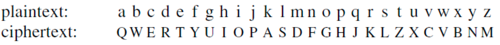
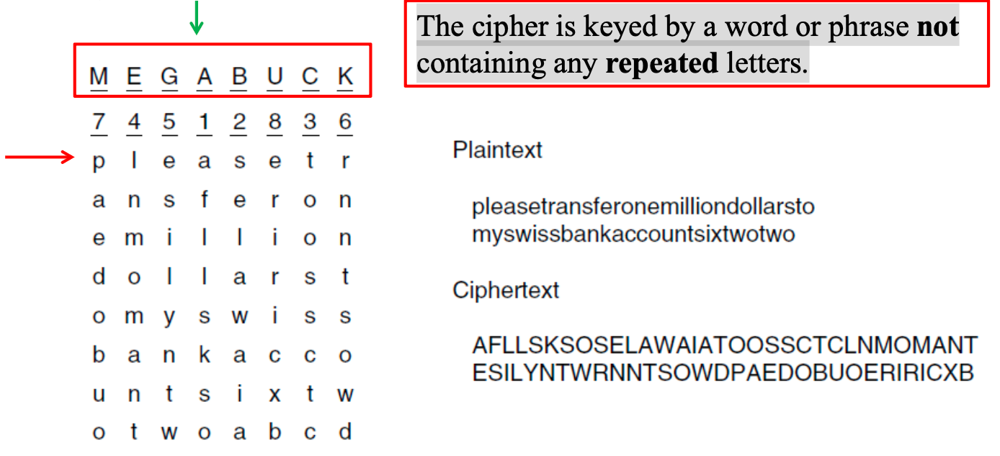
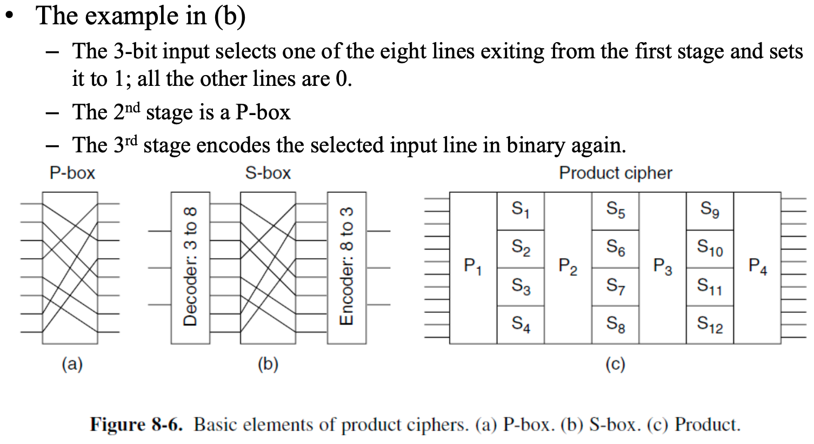
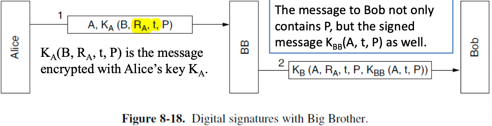
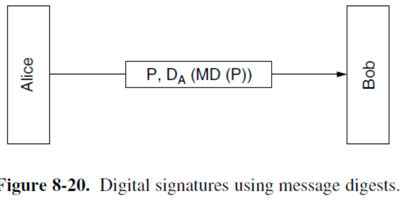

# Network Security

网络安全问题大致可以分为4个领域：

- Secrecy (机密性)
- Authentication (身份认证)
- Nonrepudiation (不可否认)
- Integrity control (完整性)

## Basic knowledge

### Cryptography

#### Kerckhoff’s Principle

**所有的算法(algorithms)都必需是公开的，只有密钥(keys)是保密的。**

密钥越长，密码分析者需要应对的工作量就越大。通过穷举搜索密钥空间破解系统的所需工作量与密钥长度呈指数关系。

加密方法可分为两类：**替换密码（substitution cipher）**和**换位密码（transposition cipher）。**

#### Substitute ciphers

在替换密码中，每个字母或字母组合都被替换为另一个字母或字母组合。

- **Caesar cipher**: 例如每个字母向后移动 k 个位置。
- 密码本

基本的攻击手段是利用<u>自然语言的统计特性</u>。

#### Transposition Ciphers

转位密码改变字母的顺序，但不进行伪装。



- 要破解置换密码，密码分析者首先必须意识到自己面对的是置换密码。(通过观察E、T、O、A、N、I等字母的出现频率，可轻松判断其是否符合明文的常规分布模式。)
- 接下来需推测列数（即密钥长度）。(多数情况下，可根据上下文推测可能的单词或短语。)
- 最后一步是排列列序。(当列数k较小时，可依次检验k(k − 1)组列对，观察其双字符组合频率是否符合英文明文特征。匹配度最佳的列对被视为正确位置，随后将剩余各列依次作为该列对的后续列进行试配。)

!!!Two Fundamental Cryptographic Principles
	(1) 所有加密消息必须包含一定冗余度。(2) 必须采取措施确保每条接收到的消息均可验证为最新消息。

### Symmetric-Key Algorithms

在对称密钥算法中，加密和解密使用相同的密钥。


- P-box: 打乱顺序。
- S-box: 非线性的查表替换。



#### DES (Data Encryption Standard)

- 明文以64位为单位分组加密，生成64位密文。
- 该算法采用56位密钥参数化，包含19个独立阶段。
- 第一阶段对64位明文进行密钥无关的置换操作。
- 最后阶段是该置换操作的精确逆运算。
- 倒数第二阶段将最左侧32位与最右侧32位互换。
- 其余16个阶段功能相同，但采用密钥的不同函数进行参数化。


该算法设计允许使用与加密相同的密钥进行解密，只需按相反顺序执行步骤。

对于iteration的每一步，左侧输出即右侧输入的副本，右侧输出为左侧输入与右侧输入及本阶段密钥 $K_i$ 的函数值进行按位异或运算的结果。这个转换函数包含以下4步：

- 根据固定的置换与复制规则，将32位 $R_{i-1}$ 展开构造出48位数 $E$。
- 对 $E$ 与 $K_i$ 进行异或运算。
- 将该输出划分为 8 个 6 位组，每组分别输入不同 S-box。每个 S-box 的 64 种可能输入均映射至 4 位输出。
- 这 8 × 4 位数据通过 P-box 处理。


DES的原始密钥是64位，包括8位的奇偶校验位。开始后先丢弃8个校验位，然后对剩下的56位进行重新排列。

每次迭代前，密钥被划分为两个 28 位单元。每个单元根据迭代次数进行 1 位或 2 位的左循环移位（每一轮的循环左移位数是固定表决定的，即左移位数与轮数有关）。对左移后的 56 位再进行一次置换选择，选出48位作为当前轮的密钥。

```
64 位主密钥
   ↓ 去掉校验位 + 置换（PC-1）
56 位
   ↓ 分成两半
C0(28) || D0(28)
   ↓ 每轮循环左移
Ci || Di
   ↓ 选择 + 置换（PC-2）
48 位轮密钥 Ki

```

#### Triple DES

- **whitening**: 一种增强DES的技术。在将明文块输入DES前，先与随机生成的64位密钥进行异或运算；随后在传输前，将生成的密文与第二个64位密钥进行异或运算。若接收方持有两个白化密钥，可通过逆向操作轻松解除。

**Triple DES**: EDE (Encrypt Decrypt Encrypt)，采用加密-解密-加密的三重处理方式，旨在与现有单密钥DES系统保持向后兼容性。


#### Rijndael

与DES类似，Rijndael采用置换与替换操作，并采用多轮处理。<u>有别于DES的是，所有操作均涉及完整字节，以实现硬件与软件的高效实现。</u>

#### Other Symmetric-Key Ciphers


### Public-Key Algorithms

加密密钥和解密密钥可以完全不同，即:

- $D(E(P))=P$
- 很难从 E(加密密钥) 中推导出 D(解密密钥)
- E 不能被选择明文攻击(plaintext attack)破解

公钥密码学要求每位用户拥有两把密钥：**公钥(public key)**供全世界用于加密发往该用户的密文，**私钥(private key)**则用于解密接收到的密文。

#### RSA

基于数论的基本规则实现：

- 选择两个大质数， $p$ 和 $q$ (通常是1024位)
- 计算 $n=p\times q$ 和 $z=(p-1)\times (q-1)$
- 选择一个与 $z$ 互质的数称为 $d$ 
- 找到 $e$ 使得满足 $e\times d=1\text{mod} z$
- 则 $(n,e)$ 为公钥， $(n,d)$ 为私钥


#### ECC (Elliptic Curve Cryptography)

基于椭圆曲线离散对数的数学难题，使用特定的曲线方程和基点生成公钥和私钥，子算法 ECDHE 用于秘钥交 换，ECDSA 用于数字签名。

比起 RSA，ECC 在安全强度和性能上都有明显的优势。160 位的 ECC 相当于 1024 位的 RSA，而 256 位的 ECC 则相当于 2048 位的 RSA。因为秘钥短，所以相应的计算量、消耗 内存和带宽也就少，加解密的性能就会好，对于现在移动互联网非常有吸引力。 

### Digital Signatures

数字签名使数字文件能够以无法伪造的方式签署，基本要求为：

- 接收方能够验证发件人声称的身份。
- 发件人日后不得否认消息内容。
- 接收方不可能自行伪造该消息。

#### Symmetric-Key Signatures

- 有一个**中心权威机构(central authority)**，如图中的Big brother
- A和B代表 Alice 和 Bob 的身份
- P 时发送的前面明文(plaintext)
- $R_A$ 是 Alice 选择的一个随机数， $t$ 是用于确保消息新鲜度的时间戳
- $K_A,K_B,K_{BB}$ 是Alice, Bob, BB 分别对应的密钥



这样的架构存在一个潜在问题：**Replay Attack** (回放攻击)

回放攻击是指攻击者截获一条“合法的通信消息”，不需要破解任何加密内容，而是把这条消息在之后再次发送（或延迟发送），从而欺骗接收方。

为最大限度规避此问题，系统全程采用时间戳机制。需检查所有近期消息，确认其中是否存在回放攻击。

#### Public-Key Signatures

使用对称密钥数字签名所有人都必须同意信任中心权威机构，而签名文档并不需要一个可信权威机构。

公钥加密与解密算法具备以下特性：除常规属性D(E(P)) = P外，还满足E(D(P)) = P。**RSA** 就拥有这个性质。原则上，任何公钥算法都可以用于数字签名。

**注意图中私钥和公钥的使用顺序。**


#### Message Digests

对于数字签名，**认证(authentication)**是必要的，而**保密(secrecy)**并非总是必要的。

以下认证方案基于**单向哈希函数**的原理，该<u>函数可处理任意长度的明文，并从中计算出固定长度的比特串</u>，不需要对整个消息进行加密。

使用的哈希函数被称为 **message digest(MD)**，主要有以下4个性质：

- **Efficiency**: 给定一个 $P$ ，很容易计算出 $MD(P)$
- **Confidential**: 给定 $MD(P)$ ，实际无法推导出 $P$
- **Uniqueness**: 给定一个 $P$ ，无法找到 $P'$ 使得 $MD(P)=MD(P')$ (哈希值长度至少应为128位，越长越好)
- **Trustworthiness**: 输入即使仅改变1位也会产生截然不同的输出。（哈希必须彻底畸变原始位序列）

从明文计算消息摘要的速度远快于使用公钥算法加密该明文，因此消息摘要可用于加速数字签名算法。

- Alice 首先计算其明文的消息摘要，随后对摘要进行签名，并将签名摘要与明文一并发送给 Bob。
- 若P中途被替换了，当Bob计算MD(P)时将发现异常。



消息摘要在对称密钥密码系统中也可以发挥作用，BB不再使用 $K_{BB}(A, t, P)$ 对P进行签名，而是通过将MD应用于P来计算消息摘要，从而得到MD(P)。


#### SHA-1 (Secure Hash Algorithm)

通过复杂的位操作，使每个输出位都受到每个输入位的影响。以512位元组为单位处理输入数据，生成160位元消息摘要。


#### SHA-2

已开发出新版SHA-1算法，可生成224、256、384和512位的哈希值。这些版本统称为SHA-2。

#### The Birthday Attack

生日攻击是指两个不同的明文，却具有相同的摘要值。


