# The Medium Access Control Sublayer

## Key Issue

!!!Note
	MAC子层是数据链路层的一部分

网络连接可以被分为两类：

- Point-to-Point connections
- Broadcasting channels: Multi-access channels / random access channels

在任何广播网络中，关键问题在于如何在频道存在竞争时确定谁能使用该频道。

- 用于确定Multi-access channel中下一个发送者的协议属于数据链路层下的一个子层，即 **MAC(Medium Access Control)** sublayer
- MAC子层在**局域网(LANs)**中尤为重要，尤其是无线局域网，因为无线信道本质上是广播信道。

## The Channel Allocation Problem

### Static Channel Allocation

- **FDMA**: 如果有 $N$ 个用户，则带宽被分成 $N$ 个等大的部分，每个用户拥有一部分带宽。这种方式简单高效但是当发送方规模大并且变化大时会出现问题，并且会因为突发性而导致阻塞。

对于静态通道分配的performance，可以使用简单的队列理论来分析。

#### Preliminary Queueing Theory

对于一个系统，记

- $C$ : 系统可以正常工作的最大传输速率(capacity)

- $S$ : 系统工作时需要的平均速率

则当 $R<C$ 时系统可以满足需求，否则系统的容量不足。但是在实际情况下 $R<C$ 时也会由于需求的不规律性而导致系统无法满足需求。

队列理论主要基于两个**不可预测**的变量:

- **the arrival times**: 用户到达系统的时间（不规律）
- **the service times**: 需求不同导致的系统需要处理的时间不同

到达时间和服务时间的特征化及其对排队现象影响的评估构成的队列理论的核心。

接下来用 $C_n$ 表示第 $n$ 个用户, $\tau_n$ 表示用户到达的时间，$x_n$ 表示用户需要的服务时间，则用户到达的间隔时间 $t_n=\tau_n-\tau_{n-1}$，由此可以定义两个随机变量：

- $\tilde{t}$ ：间隔时间
- $\tilde{x}$：服务时间

根据这两个随机变量可以构造对应的分布函数(probability distribution function, **PDF**)

- $A(t)=P[\tilde{t}\leq t]$
- $B(x)=P[\tilde{x}\leq x]$

对应的可以得到密度函数(probability density function, **pdf**)

- $a(t)=\frac{dA(t)}{dt}$
- $b(x)=\frac{B(x)}{dx}$

根据这些函数，可以定义两个新的变量：

- 平均到达率：$\frac1\lambda=E[\tilde{~t~}]$
- 平均服务率：$\frac1\mu=E[\tilde{~x~}]$

!!!Supplyment
	根据 $a(t)$ 和 $b(x)$ 的设定，可以把队列分成三种

	- elementary queueing theory：初级队列理论
	- intermediate queueing theory：中级队列理论
	- advanced queueing theory：高级队列理论

>  为了更简单地描述不同的系统，可以用一个三元表达式来表达 **A/B/m** ：A表示到达时间的分布；B表示服务时间的分布；m表示队列系统有m个服务器。

A和B主要指下面几种分布：

- **M**: exponential
- **Er**: r-stage Erlangian
- **Hr**: r-stage Hyperexponential
- **D**: Deterministic
- **G**: General

对于一个普遍的系统 G/G/1，定义**利用率(utilization factor)** $\rho=\lambda\tilde{x}$ 。在多服务系统 G/G/m 中，对应的利用率为 $\rho=\frac{\lambda\tilde{x}}{m}$。利用率表示了系统被使用的比例：

- 一个**稳定(stable)**的系统在任何情况下都可以满足 $0\leq \rho <1$
- $\rho$ 越接近1，则说明系统的队列越大，等待时间越长。

在一个系统中，平均时间简单来说是由服务时间和等待时间构成的，记等待时间为 $W$，则有
$$
T=\tilde{x}+W
$$

> **Little's Result**
>
> 是一种联系系统中用户数与到达率和平均延迟的方法，定义在系统中的平均用户数为 $\overline{N}=\lambda T$ ，则平均队列大小 $\overline{N_q}=\lambda W$。
>
> - 对于 G/G/m，$\overline{N_q}=\overline{N}-m\rho$（可以理解为系统中平均的客户数减去正在被服务的客户数）

另一种联系方法是通过系统的输入和输出率函数的累加来表示。

- $E_k$ 表示系统中有 $k$ 个用户的状态
- $P_k(t)=P[N(t)=k]$ 表示中时间 $t$ 时系统中 $E_k$ 状态的概率

则 $\frac{dP_k(t)}{dt}$ 表示 $t$ 时间用户的流动率（流入率-流出率）

对于 M/M/1 队列，系统的输入是一个 Poisson input，则 $P_k(t)=\frac{(\lambda t)^k}{k!}e^{-\lambda t}$，于是有

$$
\overline{N(t)}=\sum^{+\infty}_{k=0}kP_k(t)=\lambda t
$$

接下来考虑稳态的情况，系统中有 $k$ 个用户的概率 $p_k=(1-\rho)\rho^k$，则系统中的评价用户数：

$$
\overline{N}=\sum^{+\infty}_{k=0}kp_k=\frac{\rho}{1-\rho}
$$

根据 **Little's Result**，以及 $\rho=\lambda\tilde{x}=\lambda/\mu$，可以得到

$$
T=\overline{N}/\lambda=\frac{\frac{\rho}{1-\rho}}{\lambda}=\frac{1/\mu}{1-\rho}
$$

根据流动函数也同样可以得出 $W=\overline{N_q}/\lambda=(\overline{N}-m\rho)/\lambda=\frac{\rho/\mu}{1-\rho}$，

$$
T=\tilde{x}+W=\frac{1}{\mu}+\frac{\rho/\mu}{1-\rho}=\frac{1/\mu}{1-\rho}
$$

#### Performance of Static FDM

对于一个capacity为 $C$ bps的通道，假设平均到达率为 $\lambda$ frames/sec，帧的平均长度为 $1/\mu$ bits，则平均服务时间 $\tilde{x}=\frac{1/\mu}{C}=\frac{1}{\mu C}$

根据队列理论中 M/M/1 队列的结论以及 $\rho=\lambda\tilde{x}$ ，平均延迟为

$$
T=\frac{\tilde{x}}{1-\rho}=\frac{1}{\mu C-\lambda}
$$

接下来把单通道分别分配到 $N$ 个通道，即每个通道的capacity为 $C/N$ bps，则平均输入率变为 $\lambda/N$ ，根据 M/M/m 队列，平均延迟为

$$
T_N=\frac{1}{(\mu C/N)-(\lambda/N)}= \frac{N}{\mu C -\lambda}=NT
$$

从中可以看出FDMA的平均延迟比所有帧有序排列在中央队列中要差N倍。

### Dynamic Channel Allocation

- **Statistical Multiplexing**

所有动态信道分配方法均基于以下五个关键假设：

- **独立流量(Independent Traffic)**：模型由N个独立站点（如计算机、电话）组成，每个站点均配备生成传输帧的程序或用户。帧生成后，该站点将被阻塞直至帧成功传输。帧生成具有不可预测性，但保持恒定速率。
- **单一信道(Single Chnnel)**：仅存在一条可用信道。所有终端均可在此信道上传输数据并接收数据。假设各终端能力均等。
- **可观测碰撞(Observable Collisions)**：若两个数据帧同时传输，将发生时间重叠导致碰撞。所有终端均能实时检测碰撞事件。发生碰撞的数据帧必须稍后重新传输。（有线信道与无线信道的区别）
- **Continuous or Slotted Time**：帧传输可在任意时刻开始，或必须在slot开始时启动。一个slot可能包含0、1个或多个帧，分别对应空闲时隙、成功传输或碰撞。
- **Carrier Sense or No Carrier Sense**：采用载波侦听机制时，节点可在尝试使用信道前判断信道状态。当侦测到信道繁忙时（有线信道），任何节点均不会尝试占用该信道。若无载波侦听机制，节点在尝试使用信道前无法感知信道状态，仅能直接发送数据，事后才能判断传输是否成功（无线信道）。

## Multiple Access Protocols

### ALOHA

**ALOHA** 是一种**随机接入协议（Random Access Protocol）**，具有以下特点：

- **随机发送**：终端有数据就发送，而不需要等待特定时间或轮到自己。
- **冲突检测与重发**：如果两个或多个终端同时发送导致数据碰撞（collision），发送端会等待一个**随机时间**后重发数据。
- **中央广播/反馈机制**（原始 ALOHA）：中央计算机接收数据后，会将数据广播给所有终端(**Rebrocast**)，发送端通过接收广播判断发送是否成功。

#### Pure ALOHA

完全随时发送，无时隙限制。

假设平均每个帧时间内期望产生的帧数量为 $G$，实际产生的帧数量为 $k$

根据泊松分布， $P(k)=\frac{G^ke^{-G}}{k!}$ ( $G\sim\lambda t$ )

对于纯 ALOHA，帧发送成功的条件是前后两个帧时间内都没有帧发送，而两个帧时间对应的平均期望帧数应为 $2G$ ，概率分布为 $P(k)=\frac{(2G)^ke^{-2G}}{k!}$，则 $P_0=e^{-2G}$

定义通道吞吐量，即单位时间成功传输的帧数： $S=G P_0=Ge^{-2G}$

求导求可得 $G=0.5$ 时取到最大值 $S=0.5e^{-1}=0.1839$

**即最好情况下，Pure ALOHA的信道利用率约为 18.39%**

#### Slotted ALOHA

帧发送被限制到时隙，只能在时隙开始时发送。

对应的通道吞吐量为 $S=Ge^{-G}$，在 $G=1$ 时取到最大值 $S=e^{-1}=0.368$

**即最好情况下，Slotted ALOHA的信道利用率约为 36.8%**

接下来考虑**通道负载**，假设一次传输需要 $k$ 次尝试，则 $P_k=e^{-G}(1-e^{-G})^{k-1}$

传输次数的期望为 $E=\sum^{+\infty}_{k=1}kP_k=e^G$

即重传次数与 $G$ 是指数关系，那么 $G$ 一个很小的增加都会给通道带来巨大的负载。

### Carrier Sense Multiple Access Protocols

- **Carrier Sense Protocols**: 终端会监听 carrier 并据此采取行动的协议

#### 1-persistent CSMA

- 当一个终端需要传输数据时，先监听通道内有无其他终端正在传输

- 如果通道空闲，则传输；否则持续监听直到通道空闲，然后传输

- 如果发生collision，则终端等待一个随机时间然后重新开始

由于通道空闲时通道的传输率为1，这个协议被称为**1-persistent CSMA**

#### Nonpersistent CSMA

- 当一个终端需要传输数据时，先监听通道内有无其他终端正在传输
- 如果通道空闲，则传输；否则，终端不会持续监听，而是**在一个随机时间后重新执行算法**

该算法相比于1-persistent CSMA有更高的通道利用率但是也会导致更大的传输延迟。

#### p-persistent CSMA

- 该协议用于**时隙通道(slotted channels)**
- 如果通道空闲，则以 $p$ 的概率发送，以 $q=1-q$ 的概率推迟到下一个slot
- 如果通道被占用，则等到下一个slot再执行算法
- 重复执行直到成功发送

#### CSMA with Collision Detection(CSMA/CD)

发送端在发送的同时持续监听返回的信号，如果不一致 ，则说明发生了collision，立即终止传输。

CSMA/CD模型的传输过程可以分成三个时期：竞争期(contention period)、传输期(transmission period)、空闲期(idle period)。竞争期多个终端同时访问通道，最后某个终端成功占用通道，进入传输期，传输结束后进入空闲期。

在最坏情况下，假设两个最远的终端之间的传输时间为 $\tau$ 

- 在 $t_0$ 时间时，第一个终端发送信息
- 取一个很小的 $\epsilon$ ，第二个终端在 $t_0+\tau-\epsilon$ 时还没有检测到碰撞，发送信息。
- 第二个终端刚发出时就收到了第一个终端的信息，检测到碰撞，立即停止
- 但是第一个终端需要等到 $t_0+2\tau-\epsilon$ 才能接收到碰撞信息。

于是可以把 CSMA/CD 的竞争看成一个时隙长度为 $2\tau$ 的 slotted ALOHA 系统。

### Collision Free Protocols

#### A Bit-Map Protocol —— Reservation Protocol

- 每个竞争期包含恰好N个时隙。
- 节点 $j$ 可通过在第 $j$ 时隙插入1位来宣告其有帧要发送。当所有N个时隙经过后（即竞争期结束），每个节点便完全知晓哪些节点希望传输。
- 此时，进入传输期，它们开始按数字顺序传输帧。
- 由于所有节点都知晓下一个发送者，因此永远不会发生冲突。
- 当最后一个准备就绪的节点完成帧传输后，将启动另一个N时隙竞争期

#### Token Passing

- 将名为令牌(token)的小型消息按预定义顺序从一个站传递至下一个站。
- 终端接收令牌时已有待传输帧，可在传递令牌前发送该帧。
- 问题：帧也会沿令牌传递方向传输。如此它们将在环形网络中循环，最终抵达目标站。然而为防止帧像令牌般无限循环，需由特定节点将其移出环路。该节点可能是：帧完成完整环路后返回的原始发送节点，或帧的实际目标接收节点。
- 令牌传递机制无需物理环形网络，只需设定一个逻辑环路即可。

#### Binary Countdown

Bit-Map Protocol 和 Token Passing 在网络终端过多时都效果都不理想。Binary Countdown可以解决这个问题。

- 每个终端都有一个地址，在传输消息前先在通道里广播从高位到低位自己的地址。
- 使用逻辑 **OR 运算** 来比较发送的比特。（通道优先接收1）
- 发送0的终端接收到1时自动放弃传输。
- 地址大的终端的优先级高于地址地的终端。

### Limited-Contention Protocols

!!!Note
	两个衡量通道表现的参数是：1. 低负载时的延迟 2. 高负载时的效率

融合竞争协议与无碰撞协议的优势特性。

在现有的竞争协议下，每个终端都以 $p$ 的概率竞争通道。假设有 $k$ 个终端参与竞争，则有终端竞争成功并发送消息的概率为 $kp(1-p)^{k-1}$（1个终端成功，k-1个终端失败）

根据这个式子，可以得到概率值最大时应该取 $p=\frac{1}{k}$

从图中可以看出终端数大于5之后成功率快速降低逼近 1/e。因此只有减少竞争数量才能提高成功通信的概率。于是

- 把站点划分成多个组
- 仅允许组内的成员去竞争对应的时隙。如果出现时隙空闲或发生冲突，则让把时隙给下一组竞争。
- 通过合理分组可降低各时隙的竞争强度，使每个时隙运行状态接近图中左端区域。
- 低负载时每个时隙分配多个站点，高负载时则分配少量站点

#### The Adaptive Tree Walk Protocol

把每个终端看出二叉树里的叶子节点

- 负载越重，搜索就应从树的更深层开始。

### Wireless LAN Protocols

CSMA/CD无法在802.11无线网络中使用。无线网络存在以下几个问题：

- **Different Coverage Areas**: 无线网络的传输只有附近的站点可以接收到，不能使用carrier sense
  

- **The Hidden Terminal Problem**: 节点A和节点C在向节点B发送消息时属于隐藏终端，节点A与节点C无法相互通信以协调行动。因此，若两者同时向节点B发送消息，则消息将在节点B处发生冲突。
  

- **The Exposed Terminal Problem**: 节点B和节点C在分别向节点A和节点D发送消息时处于暴露终端状态，由于节点B和节点C处于彼此的无线电覆盖范围内，因此它们能够互相接收信号，产生不必要的冲突。
  

- **Nodes Cannot Hear while Sending**: 在无线系统中，某一站点的接收信号可能极其微弱，其强度或许仅为传输信号的百万分之一。无线局域网节点在发送消息时几乎无法接收任何信号，无法实时检监测冲突。

#### MACA(Multiple Access with Collision Avoidance)

使用一个简单的握手，协议规则：

- 发送节点发送RTS（请求发送，附带帧长度）
- 接收节点回复CTS（允许发送，附带帧长度）
- 发送节点传输帧，同时听到CTS的节点保持静默

在RTS/CTS仍然可能会发生冲突，但是冲突发生率大大减小。

A范围内任何监听到RTS的站点必须保持一段时间静默来确保CTS的传输。B范围内任何监听到CTS的站点必须保持一段时间静默来确保数据的传输。

## Ethernet(IEEE 802.3)

主要分为两种:

- **Classical Ethernet**(3 - 10 Mbps)
- **Switched Ethernet**: 使用交换机连接不同终端，传输速率在100(fast Ethernet), 1000(gigabit Ethernet), 10000(10 gigabit Ethernet) Mbps

在cable中，信息通过 **Manchester encoding** 来传输

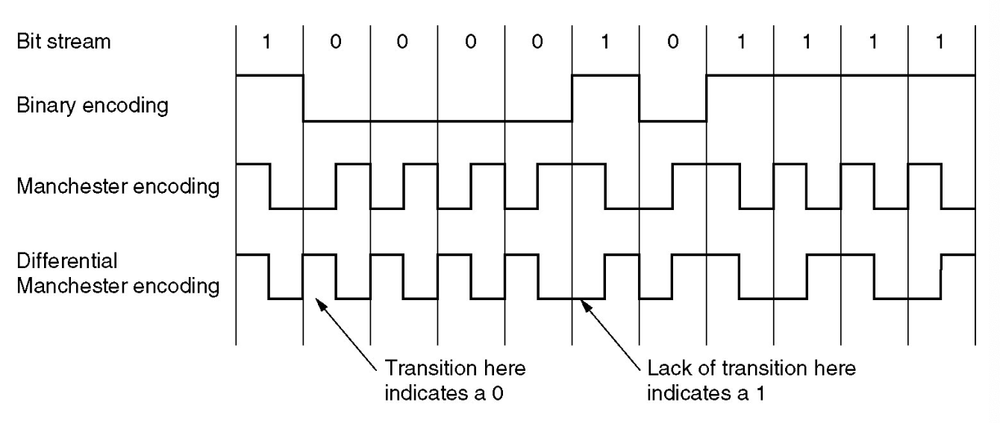

!!!Note
	交换机是链路层的设别。在 switch-base Ethernet LAN 中不存在冲突，因此不需要MAC协议。

!!!Note
	所有以太网技术给网络层提供的都是 **connectionless service**。（更简单、成本更低）

### Ethernet Frame Structure

#### Preamble(先导码 8 bytes)

8个字节，每个字节都是10101010的形式（除了最后一个字节的最后两位为11）。最后一个字节被称为 **the Start of Frame delimiter(SFD)** 。先导码在Manchester编码中提供了6.4µs的10-MHz方波来用于接收方与发送方的时钟同步。

#### MAC Addresses (12 bytes)

分为Destination address 和 Source address，每个都是6字节。

#### Type/Length (2bytes)

- **Type**: 指定帧传输方式(0x0800表示数据包含 IPv4 包、0x0806表示包含 ARP 消息、0x86DD 表示包含 IPv6 包)
- 所有不大于0x600(1536)的数字被理解为 **Length**，大于0x600的被理解为 **Type** 。

#### Data (46-1500 bytes)

这部分携带 **IP datagram**，最大传输单元(maximum transmission unit, MTU)为1500字节。

!!!Note
	以太网的有效帧大小为64-1518字节（Destination address 到 Checksum部分）。其中最小帧要求为64字节是为了区分有效帧和垃圾帧。

#### Check-sum

是32位CRC。

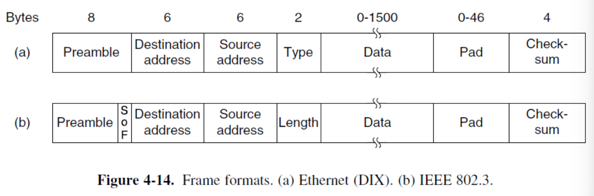

### CSMA/CD with Binary Exponential Backoff

Classic Ethernet 使用1-persistent CSMA/CD 算法。

#### Binary Exponetial backoff

一种生成碰撞后等待时间的算法。在以太网中，时隙被设定为512 bit times(51.2 µs)，每次发生碰撞后，需要等待一个随机时间，随机间隔产生方式如下：

- 在 $i$ 次碰撞后($i\leq 10$)，取 $0\sim2^i-1$ 个之间的一个随机值 $k$ ，等待时间为 $k$ 个时隙
- 在碰撞次数超过 **10** 次之后，随机间隔最大值被固定在 **1023** 个时隙
- 碰撞次数超过 **16** 次之后，控制器放弃传输(throw in the towel)并报错。

### Ethernet Performance

假设有 $k$ 个站在传输数据，在竞争期的每个时隙中每个站都有 $p$ 的概率竞争成功。

则记每个站竞争成功的概率 $A=kp(1-p)^{k-1}$ ($p=1/k$ 时取到最大值)

在 $j$ 个时隙内有帧竞争成功并开始传输的概率为 $A(1-A)^{j-1}$，则竞争期的平均时隙数为

$$
\sum^{+\infty}_{j=0}jA(1-A)^{j-1}=\frac{1}{A}
$$

每个时隙的时间为 $2\tau$ ，因此平均竞争时间 $w=2\tau/A$

假设帧的平均传输时间为 $P$，则

$$
\text{Channel efficiency}=\frac{P}{P+2\tau/A}
$$

!!!Note
	电缆越长，竞争间隔越长。

记帧长度为 $F$ ，网络带宽为 $B$ ，电缆长度为 $L$ ，信号传输速度为 $c$ ，最优平均竞时隙数为 $e$

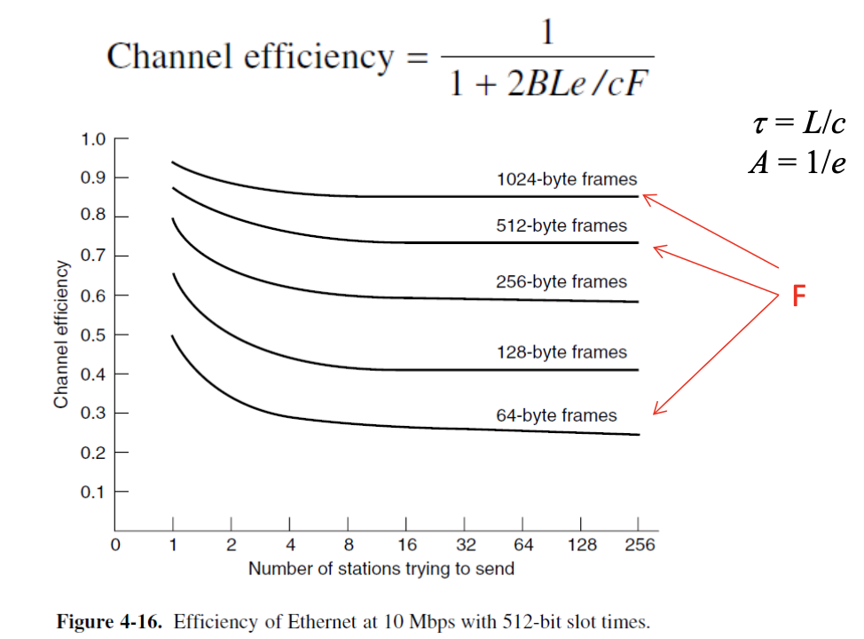

### Switched Ethernet

- **Hub(集线器)**: 把几根电缆连接到一起，不会增加容量，它们在逻辑上等同于经典以太网中单根长电缆。
- **Switch(交换机)**: 包含一个高速背板(backplane)，将所有端口连接在一起。

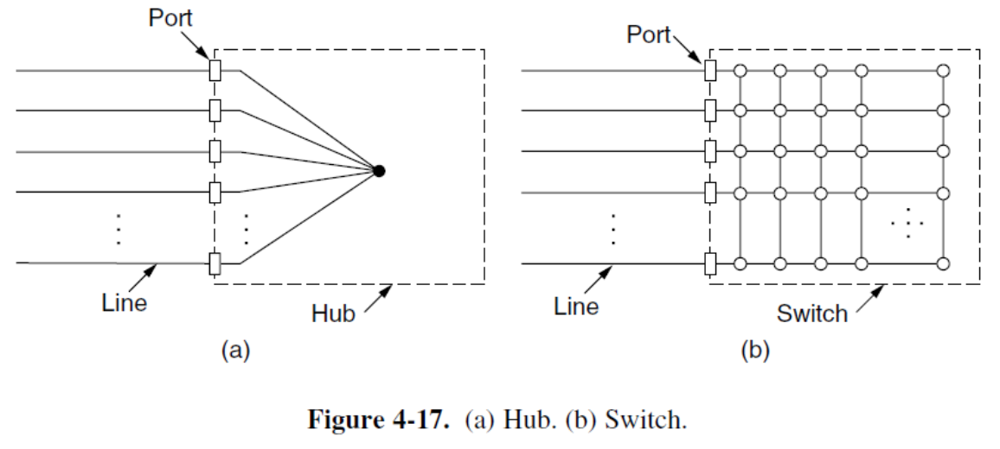

交换机只把帧传输到指定的目标，而集线器后把帧传输到所有端口。

!!!Note
	在集线器中，所有端口都处于同一个冲突域。但在交换机中，每个端口都是独立的冲突域。

### Ethernet Technologies

“BASE”指基带以太网，即物理介质仅承载以太网流量；几乎所有802.3标准均适用于基带以太网。缩写末尾字母代表物理介质类型。通常“T”表示双绞线铜缆。

- Example: 10BASE-T, 10BASE-2, 100BASE-T, 1000BASE-LX and 10GBASE-T

!!!Note
	以太网同时涵盖链路层与物理层规范。

#### Fast Ethernet

快速以太网允许通过集线器或交换机进行互连。

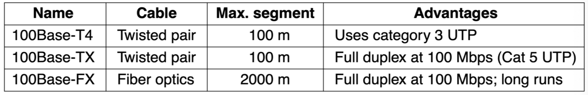

#### Gigabit Ethernet

所有千兆以太网配置均采用点对点链路。与快速以太网类似，支持两种不同模式的操作：

- **Full-duplex** mode: 外围存在一个中心交换机来连接终端（或其他交换机），不存在竞争，不需要CSMA/CD协议
- **Half-duplex** mode: 使用集线器连接，双向不能同时传输，存在竞争和碰撞。由于传输时间大幅缩短，为保证 CSMA/CD 能检测到碰撞，**最大电缆长度必须缩短**，或者通过 **Carrier Extension**(增大帧长度)或 **Frame bursting**(将多个帧合到一起) 延长最小帧传输时间。

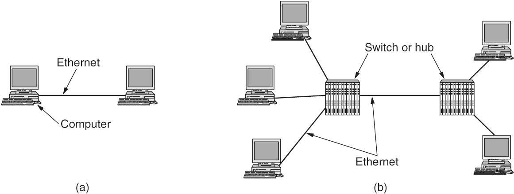

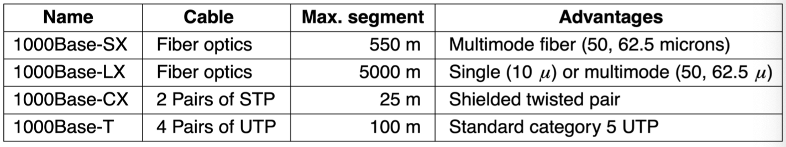

#### 10-Gigabit Ethernet

只支持 **full-duplex** 操作。

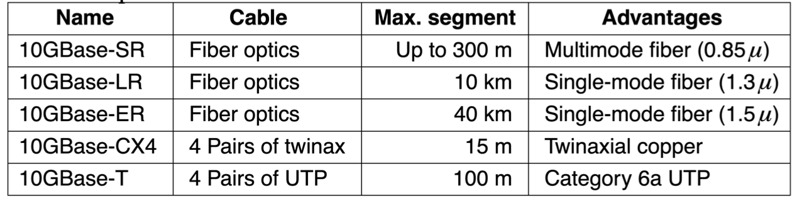

## Wireless LANS (802.11 WiFi)

802.11网络有两种使用模式：

- **Infrastructure Mode**: 每个客户端(client)都和一个**AP(Access Point)**连接，APs可能通过有线网络连接。
- **Ad-hoc Mode**: 没有AP，每个终端可以直接向户发送帧。

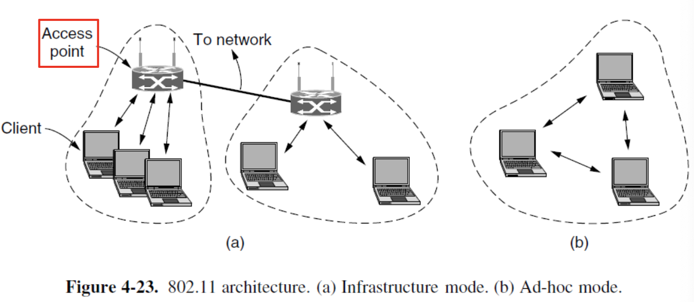

### 802.11 Protocol Stack

所有802.11协议中的数据链路层均划分为两个或更多子层：

- **MAC**（介质访问控制）子层决定信道分配机制，即确定下一个传输主体。
- **LLC**（逻辑链路层）旨在隐藏不同802变体间的差异，使其在网络层视角下不可区分。

### 802.11 Physical Layer

所有802.11技术均采用短距离无线电在2.4 GHz或5 GHz **ISM**（Industrial, Scientific and Medical）频段传输信号。 

- **802.11b**：支持1、2、5.5、11Mbps的传输速率，采用**Barker Sequence**进行扩频。
- **802.11a**：在5 GHz ISM的频段上支持6-54 Mbps的传输速率。使用OFDM调制
- **802.11g**：同a使用OFDM调制，将 802.11a 的高速传输能力与更常用的 2.4 GHz 频段结合起来。
- **802.11n**：MIMO(Multiple Input Mutiple Output) 技术

### 802.11 MAC Sublayer Protocol

存在的问题：

- **Half duplex**: 无法在单一频率上同时发送数据和监听。
- **Limited Range**: 存在 hidden station 和 exposed station 问题。

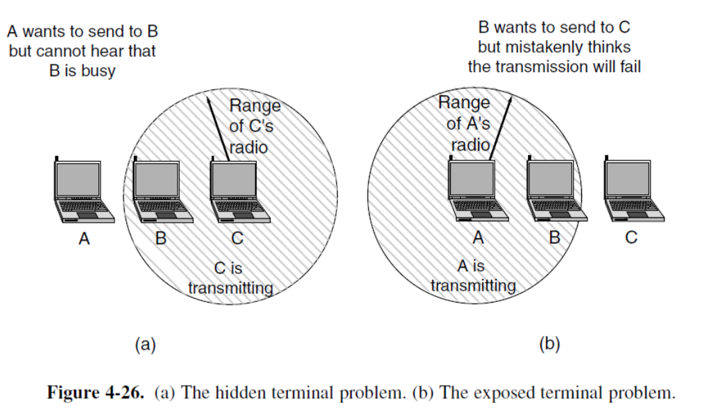

解决冲突的方案：**CSMA/CA** (CSMA with Collision Avoidance)

- **信道监听（Channel sensing before sending）**
- **指数退避（Exponential backoff after collision）**

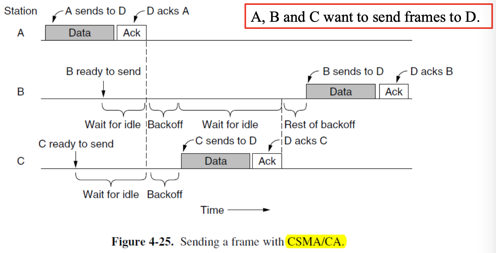

相比于以太网，主要有两点不同：

- 提前开始backoff来避免碰撞
- 使用acknowledgements(ack)来判断是否碰撞

802.11的工作模式有两种：

- **DCF**(Distributed Coordination Function)：每个终端独立决定什么时候发送数据
- **PCF**(Point Coordinate Function)：有AP来统一协调网络中的终端（由于很难仿制附近网络的干扰，PCF在实际中很少使用）

为了减少多个设备同时发送数据时产生的混乱，802.11定义了两种通道侦测方式：

- **Physical sensing**: 如果空闲就开始传输，传输过程中不侦测。如果发生碰撞就等待随机时间(Ethernet binary exponential backoff算法)。被用于传输 RTS 帧。

- **Virtual sensing**: 通过 RTS/CTS 帧 和 NAV(Network Allocation Vector) 计时机制，让所有在范围内的设备都知道信道被占用多久，从而避免隐藏节点引发的碰撞。图中C接收到RTS之后，设置内部的NAV进行计时，保持一段时间沉默，D同理。**NAV不被传输。**

  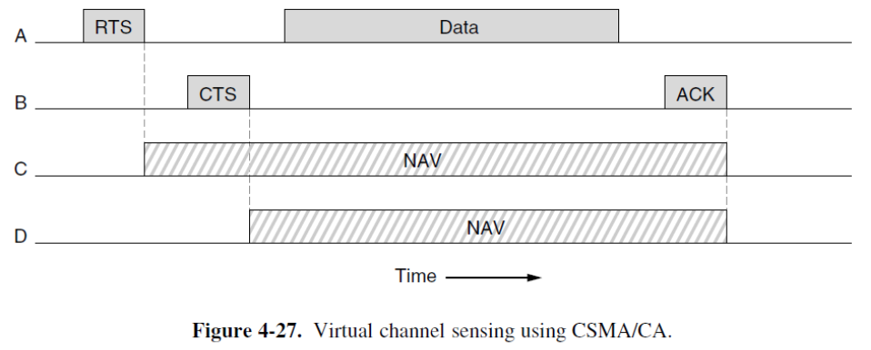

802.11协议的核心是 **CSMA/CA + Physical&Virtual Sensing**。除此之外，还有一些其他技术可以提升表现：

- **Reliability**: 降低传输速率以提高传输成功率；缩短帧长度来提高帧完整传输的概率。
- **Power**: 定期传输 **Beacon** 帧来减少能耗。(Beacon由 AP 周期性广播，传输网络中的各种参数，可以控制设备休眠或唤醒)
- **Quality of Services**: 帧发送后，需等待特定空闲时间才能再次发送帧，以确保信道未被占用。通过给不同帧设定不同的等待时间来控制帧的优先级。
  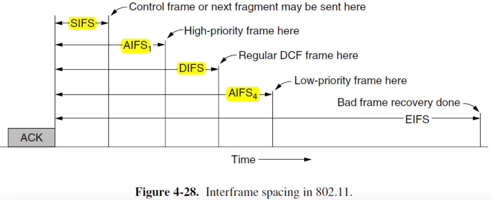

### The 802.11 Frame Structure

#### Data Frame

- **Address field**: 数据帧传入或传出 AP，但是AP可能是一个中转点，需要Address 3来提供远端目标。
- *Protocol Version*: 设置为00
- *Type*: 同时用于数据帧、控制帧或管理帧；*Subtype*：控制帧的RTS、CTS或ACK；
  对于常规数据帧（无服务质量），其二进制值设为10和0000。
- **To DS** 和 **From DS**: 指示帧是否发往或来自接入点连接的网络。
- *More Fragments*: 后续还有更多分片
- *Retry*: 重传
- *Pwr*: 休眠状态;
- *More data*: 发送方还有额外帧;
- *The Protected Frame bit*: 使用WEP加密;
- *The Order bit*: 要求严格按顺序处理;
- *Duration*: 及其应答所需时间；控制帧中也存在该字段。
- *Sequence*: 16位，其中12位用于完整帧，4位用于分片。

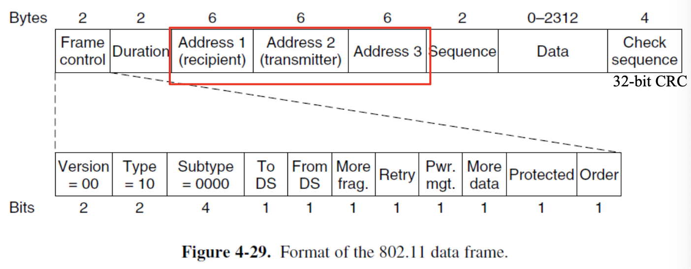

#### Management Frame

类似数据帧，缺少一个base station address，因为管理帧严格限制在一个分布系统内。

#### Control Frame

- 只有两个地址
- 没有 Data 和 Sequence 字段
- **Subtype**: RTS, CTS, ACK

## Data Link Layer Switching

### Bridge

所有连接在同一个网桥端口上的设备，属于同一个冲突域；而连接在网桥不同端口上的设备，属于不同的冲突域。

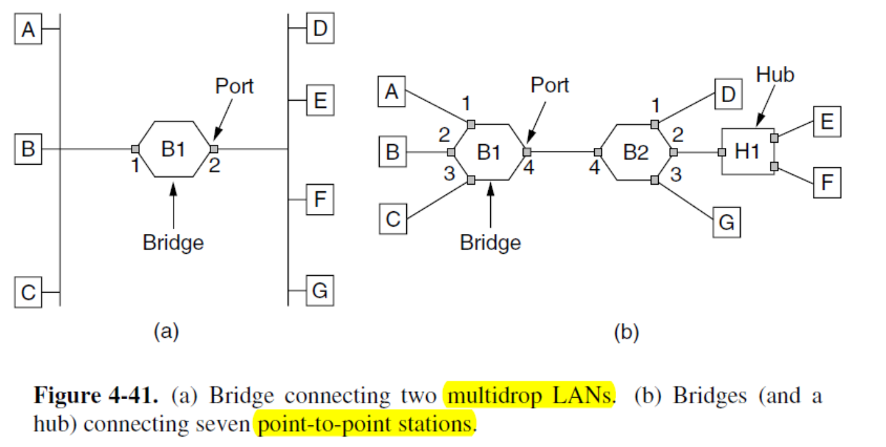

网桥必须决定是否转发或丢弃帧，以及转发到哪一个端口。

一个简单的实现方式就是存储一个巨大的**哈希表**来列举所有可能的目的地及其所属的输出端口。在网桥首次使用时，所有哈希表都是空的，需要先使用 **flood** 算法，即所有未知目的地的帧，都转发到网桥的所有端口（除了发送的端口）；已知目的地的直接转发到对应端口即可。

网桥工作在**混杂模式(promiscuous mode)**，可以看到任何端口上的任何帧。通过观察源地址，网桥可以知道机器位于哪个端口。

网络拓扑结构是动态的，因为某些机器和网桥会频繁开关机并移动位置。为处理动态拓扑，每次哈希表条目创建时，都会记录帧的到达时间。当源地址已在表中存在的帧到达时，其条目会更新为当前时间。网桥会定时扫描哈希表中的所有条目，删除所有超过一定时间未发送的条目。（如果一个设备在几分钟内保持沉默，那么所有发送给它的信息都会被泛洪转发，直到它自己发送帧）

路由转发的过程取决于源端口与目的端口：

- 如果源端口和目的端口是同一个，则丢弃。
- 如果源端口和目的端口不同，则转发到目的端口。
- 如果目的端口未知，则进行泛洪发送。

#### Protocol Processing at a Bridge

在一般情况下，特定层的转发器可以重写该层的报头。

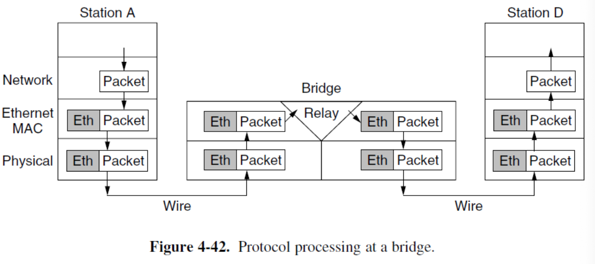

#### Bridges from 802.x to 802.y

连接 k 个不同局域网的网桥将包含 k 个不同的 MAC 子层和 k 个不同的物理层，每种类型各对应一层。

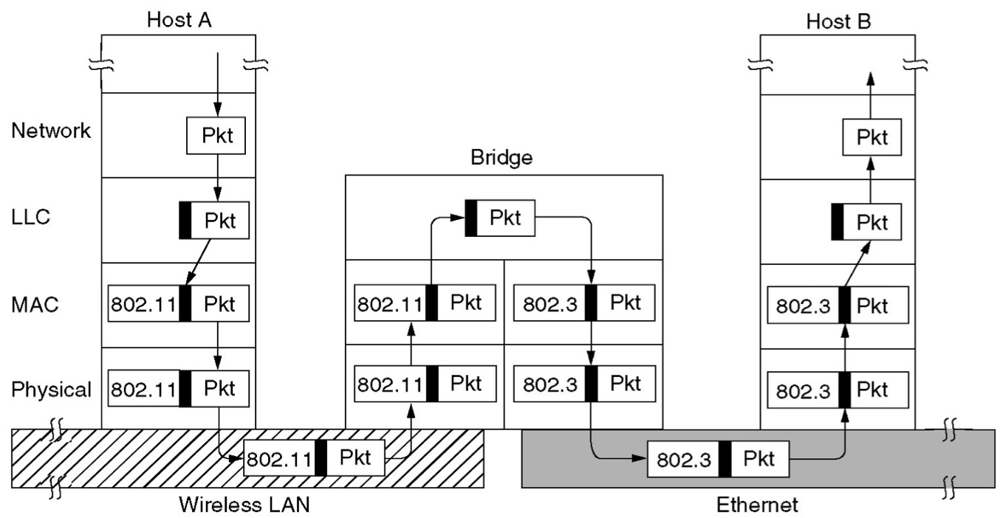

### Spanning Tree Bridges

网络拓扑中可能存在环路（用于提高可靠性或人为错误导致），但是环路会造成问题。比如在进行泛洪发送时帧可能在网络中循环。

解决方案是给拓扑结构找到一个 **spanning tree** ，使得所有交换机可以互相连接且**每两个终端之间只有一条道路可以通信**。

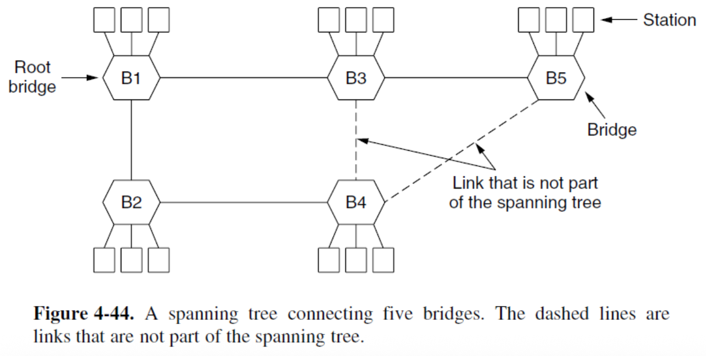

#### Spanning Tree Algorithm

交换机使用分布式算法来构建spanning tree。每台交换机定期向所有端口的邻居广播配置消息，并处理从其他网桥接收的消息。这些消息不会被转发，因为其目的是构建生成树，该树随后可用于转发。

- 选定根节点（MAC地址最低的交换机）
- 基于根节点最短距离扩展树形结构（采用最低地址打破距离平局）
- 若端口不在生成树中，则关闭其转发功能

实现细节：

- 每个交换机初始时都认为自己是树的根节点。
- 每个交换机定期向邻居发送更新，包含：自身地址、根节点地址以及到根节点的距离（跳数）。
- 交换机优先选择到最低根节点距离较短的端口。当距离相同时，采用最低地址进行决胜。

> 不同的设备位于网络的不同层级。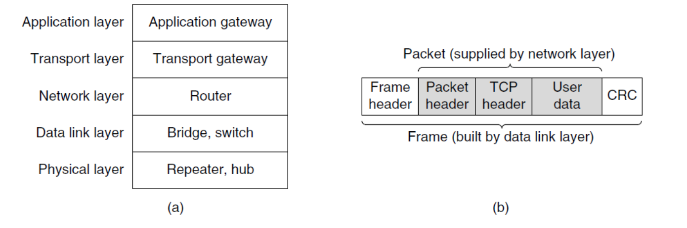
>
> **物理层**
>
> - **Repeater**(中继器): 用于净化和放大输入信号，不理解帧、数据包、报头。
> - **Hub**: 连接多条线路，通常不放大信号。所有接入集线器的设备必须以相同速率运行。不检查链路层的地址，也不使用。
>
> **数据链路层**
>
> - **Bridge**: 每个端口被隔离为独立的冲突域，线路可以运行于不同速率。仅在所需端口输出帧。
> - **Switch**：相当于以太网中的网桥。
>
> **网络层**
>
> - **Router**: 根据数据包头选择输出线路；无法看到帧地址，也无法判断数据包是从局域网还是点对点线路传入的；连接不同类型的局域网。
>
> **传输层和更高层**
>
> - **Gateways**(网关): 网关可在传输层为应用层提供服务(e.g. reformatting)。

### Virtual LANs

VLAN可以实现逻辑拓扑与物理拓扑的解耦——通过软件完全重构建筑布线。

- 基于 VLAN-aware switches
- 常采用颜色命名法，便于打印网络拓扑图时区分

要使VLAN正常工作，必须在网桥中自动设置配置表。帧不允许转发至具有不同VLAN ID的端口。单个端口可标记多个VLAN颜色。

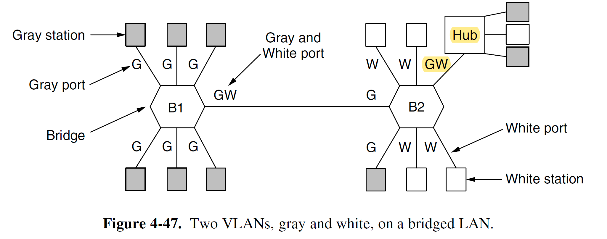

#### Interconnecting VLAN Switches

 每个VLAN中的端口构成一个广播域。

- **VLAN trunking**: 在每台交换机上配置专用端口作为干线端口，用于连接两台VLAN交换机。

干线端口同时属于所有VLAN，发往任意VLAN的帧都会通过干线链路转发至其他交换机。

通过扩展以太网帧格式802.1Q，交换机可以识别干线链路接收帧所属的VLAN。

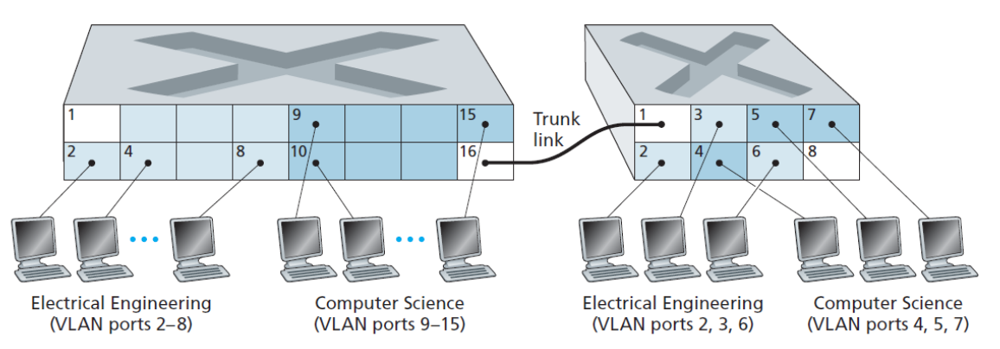

#### The 802.1Q Frame Format

唯一的区别就是增加了一对2字节字段。

- **VLAN protocol ID**:  0X8100，由于该数值大于1500，所有以太网卡均将其解释为类型而非长度。
- **TCI**: 包含3位 **priority**；1位 **CFI**(Canonical format indicator)最初用于标识MAC地址的位序——小端序或大端序；12位 **VLAN identifier**，作为查找表索引（即VLAN编号），用于确定发送端口。

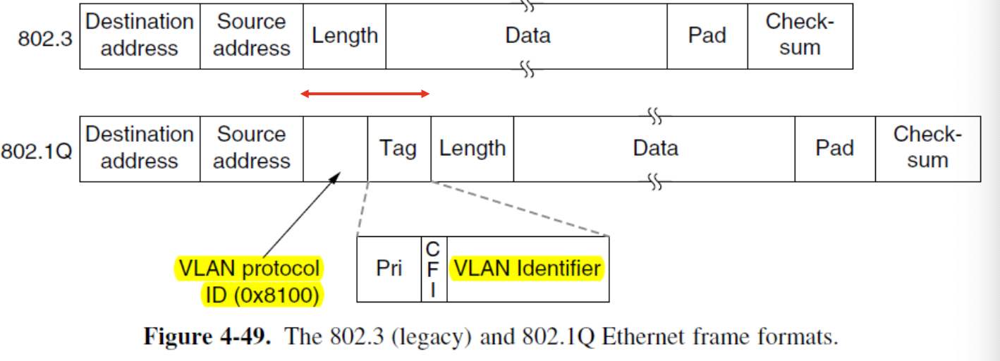

!!!Note
	在802.1Q下，最大帧大小增加到 **1522** 字节，最小帧大小仍为 **64** 字节。网桥在传输过程中可能把最小帧大小从64字节扩大到68字节。
