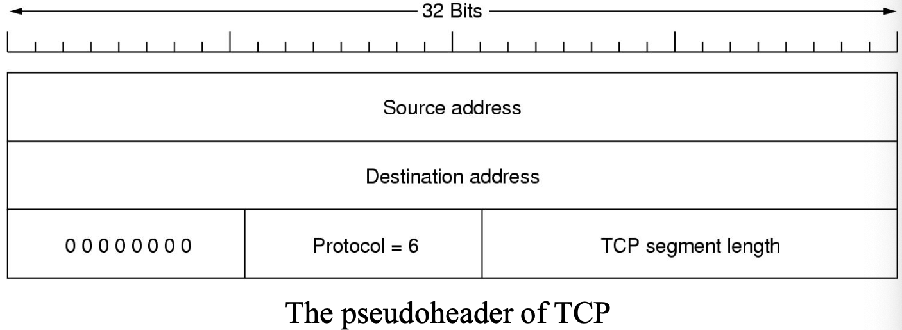
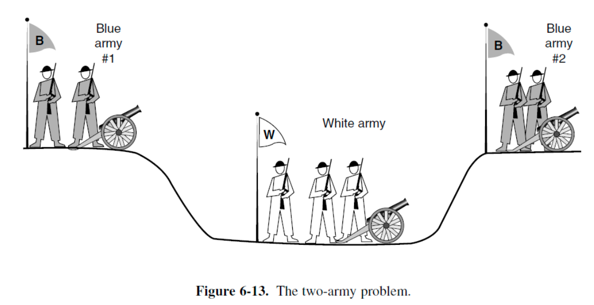
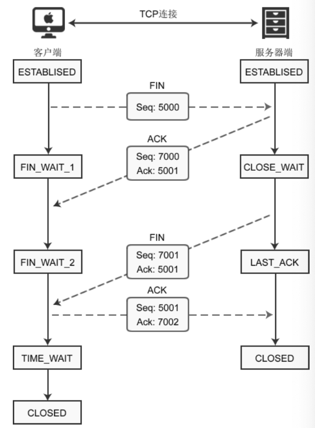

# Transport Layer

## Overview

传输层与网络层共同构成协议体系的核心。

- 传输层为源机器至目标机器的数据传输提供高效、可靠且经济高效的服务。
- 传输层在整个网络中提供**end-to-end**连接。

#### The Relationship of the Network, Transport, and Application Layers

#### Transport Service

传输服务有两种：

- Connection-oriented transport servieces: 建立、传输、释放
- Connectionless transport service

与网络层服务相比：

- <u>传输层代码完全在用户机器上运行，而网络层主要在路由器上运行</u>。用户无法真正意义上控制网络层。
- 网络服务通常不可靠(**unreliable**)。唯一解决方案是在网络层之上增设一层以提升服务质量。

#### Transit Units of Different Layers

- 传输层: **segment** or TPDU (Transport Protocol Data Unit)
- 网络层: **packet**
- 数据链路层: **frame**
- 物理层: **bit**

#### The internet transport protocols

Internet中的传输层主要有两个协议：

- **UDP(User Datagram Protocol)**: connectionless. 仅负责在应用程序间传输数据包，通常在操作系统中运行。
- **TCP(Transmission Control Protocol)**: connection-oriented. 承担几乎所有功能，包括建立连接、通过重传机制增强可靠性，以及实现流量控制和拥塞控制。

## 

## UDP

一种无连接传输协议。UDP header长度为8字节。

- **Source/Destination port field**: 这两个端口用于在源机器和目标机器中识别端点。通过这两个端口，它将嵌入的分段传递到正确的应用程序。当必须将回复发送回源时，源端口是主要需要的。通过将传入分段的源端口字段复制到传出分段的目标端口字段来实现。
- **UDP length field** (包括头): 最小8字节；最大65515字节(低于16位可容纳的最大数值，这是由于IP数据包的大小限制所致)
- **UDP checksum field**(optional): 用于提供额外的可靠性。对报头、数据以及概念性的IP伪报头进行校验和计算。

**The IPv4 pseudoheader**

在计算 UDP checksum 时，会临时加入一个 IPv4 pseudoheader。 pseudoheader 不实际随 UDP 报文发送，仅用于校验和计算，以增强错误检测能力。

- source/destintaion address
- UDP protocol number **17**
- UDP segment 字节数

- UDP **not do**: 流量控制、拥塞控制，或在收到损坏数据段时重传。
- UDP **do**: 为IP协议提供接口，并通过端口实现多进程解复用功能；可选的端到端错误检测（类似校验和）

!!!Note
	DNS(Domain Name System), SSDP(Simple Service Discovery Protocol) 不使用UDP协议。

### RTP (Real-time Transport Protocol)

一种恰巧在应用层实现的传输协议。用于媒体视频在数据报中的传输。

 RTP的基本功能是<u>将多个实时数据流**复用(muliplex)**到单个UDP数据包流中</u>。该UDP流可发送至单一目的地（单播）或多个目的地（组播）。

由于无法保证传输可靠性，数据包可能丢失、延迟或损坏，RTP流中每个发送的数据包编号均比前一个高一位。

- 此编号机制使接收方能检测数据包缺失情况。若发现缺失数据包，可选择跳过（视频帧）或进行插值处理（音频数据）
- RTP不支持acknowledgement

每个RTP有效负载可包含多个采样点，且可采用应用程序指定的任意编码方式（通过头部字段指定编码方案）。 

RTP为每个数据包的首个采样关联一个time-stamping。此机制使接收端可进行少量缓冲，并在流开始后精确播放每个采样。（降低网络延迟波动的影响、实现多流同步）

#### The RTP Header

- Version field: 2
- P bit: 表示数据包已补足至4字节的倍数。最后一个填充字节指示追加的字节数
- X bit: 标记存在扩展头
- CC field: 表示贡献源数量，范围为0至15
- M bit: 应用程序专属标记位
- Payload type field: 标识所用编码算法
- Sequence number field: 随每个发送的RTP数据包递增的计数器，用于检测丢失数据包。
- Timestamp field: 由流源生成，记录数据包中首个采样点的时间
- Synchronization source identifier field: 标识符表明数据包所属的流
- Contributing source identifier field: 若存在贡献源则使用该字段，如演播室混音设备

#### RTCP (Real-time Transport Control Protocol)

是RTP的附属协议。用于处理反馈、同步及用户界面，不传输任何媒体样本。

#### Playout with Buffering & Jitter Control

流畅播放的关键考量在于播放点，即接收端在开始播放媒体内容前需要等待多长时间。等待时长的决定取决于抖动程度。为选择合适的播放点，应用程序可通过测量RTP时间戳与实际到达时间的差异来评估抖动，并根据延迟随时间的变化动态调整播放点。

## TCP

TCP(Transportation Control Protocol) 旨在通过不可靠的互联网络提供可靠的end-to-end字节流传输。

互联网络的不同部分可能存在截然不同的拓扑结构、带宽、延迟、数据包大小及其他参数。TCP的设计能够动态适应互联网络的特性，并在面对多种故障时保持健壮性。

### TCP Service Model

TCP 服务通过双方创建端点(**socket**)来获得。每个端点都有一个**socket number (address)**，由**主机的IP地址**和该主机本地16位编号(**port**)组成。连接通过两端的端点标识符(socket1, socket2)进行识别。

**所有TCP连接均为全双工点对点(dupelx and point-to-point)连接。**TCP不支持多播和广播。

TCP连接是**字节流(byte stream)**，而不是消息流，在端到端的过程中消息的边界不会被保留。例如发送方对TCP流执行四次512字节写入时，接收方可能收到四块512字节数据、两块1024字节数据或一块2048字节数据。

应用传输数据给TCP时，TCP可能会直接发送(使用**PUSH**标志)，也有可能先放入缓存(buffer)。

当应用程序存在需立即处理的高优先级数据时，发送方可在数据流中添加控制信息，并通过**URGENT**标志传递给TCP。当紧急数据到达目的地时，接收应用程序会被中断，从而停止当前操作并读取数据流以定位紧急数据。紧急数据的结束位置会被标记，以便应用程序知晓数据结束点。紧急数据的起始位置不作标记，需由应用程序自行定位。

>  **Some Assigned Ports for Well-known Applications**
>
> 

### TCP Segment Header

<u>TCP 连接中的每个字节都拥有独立的 32 位序列号</u>，序列号空间基于字节而非分段。

**每个分段均以固定格式的 20 字节头部开头，**固定头部之后可跟随头部可选项。若存在可选项，其后最多可跟随 65535 − 20（IP头部）− 20（TCP头部）= 65495 个数据字节。

- 无数据的分段是合法的，通常用于确认和控制消息。

**1. Source port** (16 bits) / **Destination port** (16bits) field

用于标识连接的本地端点。TCP端点使用IP地址和16位端口号唯一标识。连接标识符为五元组，因其包含五项信息：协议（TCP）、源IP、源端口、目标IP及目标端口。

**2. The Sequence number** (32 bits) and **Acknowledgement number** (32 bits) field

- 序列号标识 TCP 段中第一个数据字节(不包括头)在整个字节流中的位置。

- 确认号指明预期接收的下一个按序字节，而非最后正确接收的字节。该确认号具有**累积性**，通过单一数字汇总已接收数据。

**3. TCP header length** （4bits)

指示TCP头部包含多少个32位words。由于可选项字段长度可变，因此头部长度也随之变化，该字段必须存在， 从技术角度而言，该字段实际标示分段内数据的起始位置，以32位字为单位进行测量。

**4. not used field** (4bits)

**5. CWR/ECE** (each 1bit)

当使用**ECN**(Explicit Congestion Notification)时，**CWR**和**ECE**用于指示拥塞。

- 当TCP接收方从网络收到拥塞指示时，ECE被设置为向TCP发送方发送<u>ECN-Echo</u>，告知其减缓发送速率。
- 当TCP发送方向接收方发送拥塞窗口缩减信号时，CWR被设置为1，告知接收方发送方已减缓传输速率，可停止发送ECN-Echo。

**6. URG** (1bit)

若紧急指针启用，则URG设为1。紧急指针用于标识紧急数据在当前序列号中的字节偏移位置。（注：紧急指针指向字节流的序列号空间，而非报文数据的偏移位置。例如，当前序列号为1000时，若紧急指针=10，则该字节流中紧急数据的终点为1000 + 10 = 1010。）

**7. ACK** (1bit)

ACK设为1表示确认号有效。若ACK为0，则该分段不包含确认信息，故确认号字段被忽略。

**8. PSH** (1bit)

PSH位指示已推送的数据。接收方收到该数据后应立即传递给应用程序，而非缓冲至缓冲区满时才传输。

**9. RST** (1bit)

RST位用于突然重置因主机崩溃或其他原因导致混乱的连接。它也用于拒绝无效分段或拒绝建立连接的尝试。

**10. SYN** (1bit)

SYN位用于建立连接。

- SYN=1且ACK=0：连接请求。
- SYN=1且ACK=1：连接应答包含确认信息。

实质上，SYN位同时表示“连接请求”与“连接接受”，通过ACK位区分这两种状态。

**11. FIN** (1bit)

FIN位用于释放连接，表明发送方无更多数据可传输。但关闭连接后，关闭进程仍可能无限期接收数据。SYN和FIN段均带有序列号，因此可确保按正确顺序处理。

**12. Window size field** (16 bits)

指示从已确认字节起可发送的字节数。窗口大小字段取值为0是合法的，表示接收方已收到至 Acknowledgement number-1（含）的所有字节，但尚未处理完这些数据，当前暂不接收新数据。在TCP中，数据确认与发送许可完全解耦(decoupled)。

**13. Checksum** (16 bits) 

提供额外的可靠性。它以与UDP完全相同的方式对报头、数据和概念上的伪报头进行校验和计算，区别在于伪报头包含TCP协议号(**6**)，且校验和是强制要求的。

**14. Options** field

可选字段长度可变，需用零填充至32位整数倍，并<u>可扩展至40字节以容纳可指定的最长TCP头</u>。因此 TCP 最大头部长度 = **20 + 40 = 60 bytes**

- **MSS(Maximum Segment Size)**是一个广泛使用的可选字段，允许主机指定其可接受最大分段大小。若主机未使用此选项，默认分段大小为536字节。所有互联网主机必须接受536+20=556字节的TCP分段。
- **window scale option**允许发送方和接收方在连接初始阶段协商窗口缩放因子。此选项对高带宽、高延迟或兼具两者的线路尤为有用。较大的窗口尺寸可使发送方持续输出数据。
- **timestamp option**携带发送方发送、接收方回显的时间戳。用于计算往返时间样本，据此推测数据包丢失时机。同时作为32位序列号的逻辑扩展。
- **SACK(Selective ACKnowlegement** option作为确认号的补充机制，在数据包丢失后后续（或重复）数据到达时启用。

### TCP Connection Establish

TCP的连接建立使用三次握手(**Three Way Handshake**)

**Step1: SYN for establishing a connection**

客户端向服务器发送请求段(request segment)，请求段仅包含TCP头部，有效负载为空。随后等待服务器的应答段(reply segment)。

**Request Sement** 的TCP头中包含以下信息：

- 初始序列号（由客户端随机选择）
- **SYN位标记设为1**（告知服务器该分段包含客户端使用的初始序列号）
- 最大段大小（客户端可发送至服务器及接收自服务器的最大数据块，存储于option field）
- 接收窗口大小（<u>可发送至客户端的未确认数据上限，存储于window size field</u>）

**Step 2: SYN + ACK After receiving the request segment**

服务器通过发送应答段(relpy segment)回应客户端， 向客户端告知服务器端的参数设置。

**Reply Sement** 的TCP头中包含以下信息：

- 初始序列号（由服务器随机生成）
- **SYN位置为1**（告知客户端该分段包含服务器使用的初始序列号）
- 最大段大小（服务器与客户端间可传输的最大数据块，存储于option field）
- 接收窗口大小（可发送至服务器的未确认数据上限，存储于window size field）
- **Acknowledgement number**（<u>客户端发送请求分段中的初始序列号加1作为确认号，或指示服务器预期从客户端接收的下一个数据字节序列号</u>）
- **ACK位设为1**（向客户端表明当前段中的确认号字段有效）

**Step 3: ACK After receiving the reply segment**

客户端确认服务器的响应，通过发送纯确认来确认服务器（也可以携带数据）。

#### Important Points

连接建立阶段消耗双方各1个序列号：

- request segment 消耗请求方1个序列号
- reply segment 消耗响应方1个序列号。
- 纯确认不消耗任何序列号。

Response无需为纯确认段：

- 若客户端立即发送数据包，则该数据包将被视为确认，即仅在前两个步骤中建立全双工连接

除requset segment外，所有段的ACK位始终设为1：

- requset segment的确认号字段始终无效。
- 其他段的确认号字段始终有效。

连接建立期间需协商特定参数，协商内容包括：

- Window Size
- Maximum segment size
- Timer values

在一个正常的TCP段中：

- 如果 SYN=1, ACK=0：一定是request segment
- 如果 SYN=1, ACK=1：一定是reply segment
- 如果 SYN=0, ACK=1：可能是纯ACK或数据传输(data transfer)段
- SYN=0, ACK=0：不可能出现

#### “SYN Flood” Attack

三次握手协议的实现存在一个漏洞：监听进程在响应自身SYN分段时，必须立即记住其序列号。

基于时钟的ISN(初始序列号)被证明存在重大缺陷：**SYN flood**——恶意发送者可通过持续发送SYN分段却不完成连接，占用主机资源。

防御此类攻击的方法之一是采用SYN Cookie机制：主机不再记忆序列号，而是选择一个通过密码学生成的序列号，将其写入发送段后立即清除。若三向握手完成，该序列号(+1)将被返回至主机。此时主机可通过运行相同加密函数再生正确序列号，前提是已知函数输入参数（如对方IP地址、端口及本地密钥）。

- ISN = C(t) + hash(local_addr, local_port, remote_addr, remote_port, key) 

### TCP Connection Release

#### The Two-army Problem

对称释放将连接视为两个独立的单向连接，需要分别释放每个连接。在不可靠的通讯信道中，双方无法通过有限次消息交换来保证达成一致。

在TCP连接释放时，每个单工连接独立释放。通常需要**四个TCP段**来释放连接：每个方向各一个FIN和ACK。

为避免双军问题，采用定时器机制：若FIN包在**两个最大数据包生存周期**内未获响应，FIN发送方将释放连接。此时接收方最终会察觉无人响应，同样进入超时状态。

Step 1: For terminating the connection

- 客户端向服务器发送 FIN 段，其中 **FIN 位设置为 1**。
- 客户端进入 **FIN_WAIT_1** 状态。
- 客户端等待服务器的确认。

Step 2: after receiving the FIN segment

- 服务器释放其缓冲区（receving buffer）
- 服务器向客户端发送确认。
- 服务器进入 **CLOSE_WAIT** 状态。

Step 3: After receiving the acknowledgement, client enters the **FIN_WAIT_2** state

此时：

- 客户端到服务器的连接终止，即单向连接关闭。
- 由于服务器已释放缓冲区，客户端无法向服务器发送任何数据。
- 客户端仍可向服务器发送纯确认（不含数据）。
- 服务器到客户端的连接保持开放，即单向连接仍存续。

Step 4: Now suppose server wants to close the connection with the client.

- 服务器向客户端发送<u>FIN段</u>，其中**FIN位置为1**。
- 服务器等待客户端的确认。

Step 5: After receiving the FIN segment

- 客户端释放其缓冲区（接收缓冲区）。
- 客户端向服务器发送确认（非强制要求）。
- 客户端进入TIME_WAIT状态。

TIME_WAIT状态

- TIME_WAIT状态允许客户端在最终确认丢失时重发。
- 等待结束后，连接正式关闭。

### TCP Sliding Window

TCP采用滑动窗口机制以提升吞吐量。

窗口大小以字节为单位而非数据包计，当窗口为0时，发送方通常不得发送段，但存在两种例外情况：

- 可发送紧急数据，例如允许用户终止远程机器上运行的进程
- 发送方可发送1字节段，迫使接收方重新声明预期接收的下一个字节及窗口大小。此数据包称为窗口探测(**window probe**)。TCP标准明确提供此选项，以防窗口更新丢失时发生死锁。
