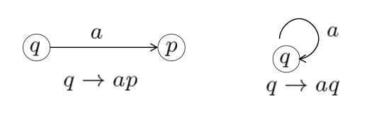
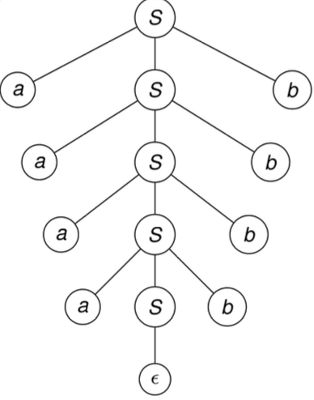
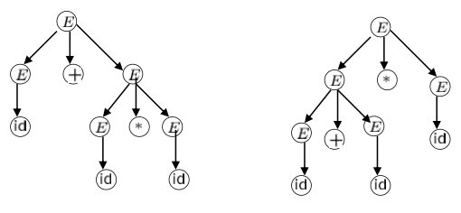
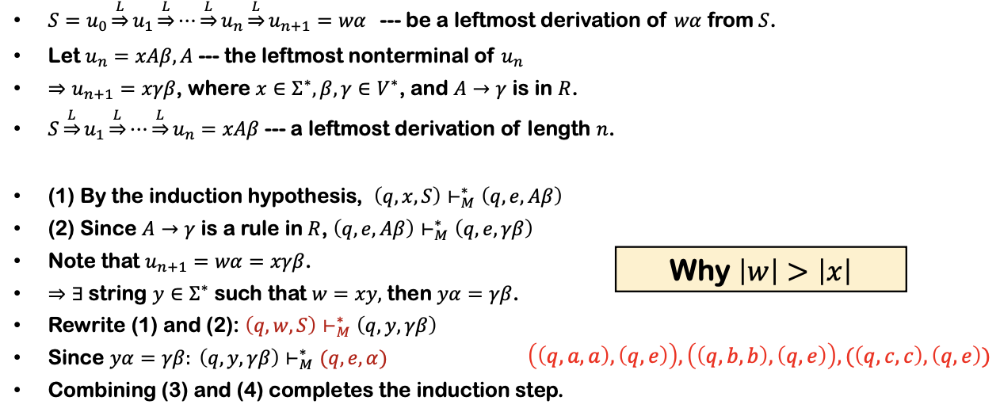

# Context-Free Language and Pushdown Automata

**Introduction**

对于 $L=\{a^nb^n|n\geq 0\}$，可以通过一下方式生成：

- **Basis**: $e\in L$
- **Recursion**: 如果 $w\in L$ ，则 $awb\in L$

## 3.1 Context-Free Grammars

> **Definiton**
>
>  **Context-Free Grammar(CFG)** 是一个四元组 $G=(V,\Sigma,R,S)$，满足：
>
> - $V$是一个字母表
> - $\Sigma\subseteq V$ 是终止符号的集合（终止符号是出现在最终结果中的符号，即不包括 $S$ 等过程符号）
> - $S\in V-\Sigma$ 是开始符号
> - $R$ 是生成规则的集合，是 $(V-\Sigma)\times V^*$ 的一个**有限**子集

!!!Note
	**Regular Expression and CFG**

	- 两者都是 **generation** devices
	- $L$ 是一个正则语言当且仅当存在正则表达式 $\alpha$, $L=L(\alpha)$
	- $L$ 是一个上下文无关语言(**CFL**)当且仅当存在 CFG $G$, $L=L(G)$

> **Theorem**
>
> 所有正则语言都是上下文无关语言(CFL)

#### **Proof**

对于一个正则语言对应的DFA $M=(K,\Sigma,\delta,s,F)$

构造一个CFG $G=(V,\Sigma,R,S)$ ，满足：

- $V=K\cup\Sigma$
- $\Sigma = \Sigma$
- $S=s$
- $R=\{q\rightarrow ap:\delta(q,a)=p\}\cup\{q\rightarrow e:q\in F\}$

#### **Regular Expression VS CFG** 

|                                       | Regular Expression（正则表达式）               | Context-Free Grammar（上下文无关文法）      |
| ------------------------------------- | ---------------------------------------------- | ------------------------------------------- |
| **生成工具 (Generation Device)**      | Regular Expression                             | Context-Free Grammar                        |
| **识别工具 (Recognition Device)**     | Finite Automata (有限自动机, FA)               | Pushdown Automata (下推自动机, PDA)         |
| **生成语言类型 (Generated Language)** | Regular Language (正则语言)                    | Context-Free Language (CFL, 上下文无关语言) |
| **等价关系 (Equivalence)**            | FA ↔ Regular Expression                        | PDA ↔ CFG                                   |
| **非所属语言 (Not in this Class)**    | Not Regular Language                           | Not Context-Free Language                   |
| **判定方法 (Non-Membership Test)**    | Pumping Lemma for Regular Languages (抽引引理) | Pumping Lemma for CFLs (CFL 抽引引理)       |

#### **Remark**

- 在 $V-\Sigma$ 中的符号被称为非终止符(nonterminals)，对于所有 $A\in V-\Sigma$ 和 $u\in V^*$，满足 $A\rightarrow _Gu\Leftrightarrow (A,u)\in R$
- $u\Rightarrow _Gv\Leftrightarrow\exists x,y\in V^*,A\in V-\Sigma$，满足 $u=xAy,v=xv'y,A\rightarrow _Gv'$  
- $\Rightarrow^*_G$ 是 $\Rightarrow_G$ 的自反、传递闭包
- 关于 $G$ 的**Derivation**: $w_0\Rightarrow_G w_1\Rightarrow_G … \Rightarrow_G w_n$，$n$是derivation的长度
- 由 $G$ 产生的语言: $L(G)=\{w\in\Sigma^*:S\Rightarrow^*_G w\}$

!!!Note
	证明CFG $G$ 和 语言 $L$ 等价(e.g. $L$ 是 context-free):  $w\in L\Leftrightarrow w\in L(G)$ 。	
	可使用归纳法。

## 3.2 Parse Tree

CFG $G=(S,V,\Sigma,R)$ 的一个 derivation 可以用**语法树(parse tree)**来表示:

- 叶节点：终止符
- 根节点：开始符
- 节点：$V$ 中的元素

其中：

- 叶节点构成输出
- 终止符只出现在叶节点
- 过程变量只能出现在中间节点
- 最终的字符串由终止符从左到右组合生成

> **Definition**
>
> 定义 derivations 的相似性，假设：
>
> - CFG $G=(V,\Sigma,R,S)$
> - $D=x_1\Rightarrow x_2\Rightarrow x_3\Rightarrow…\Rightarrow x_n,~~~x_i\in V^*,x_1\in V-\Sigma, x_n\in \Sigma^*$
> - $D'=x_1'\Rightarrow x_2'\Rightarrow x_3'\Rightarrow…\Rightarrow x_n',~~~x_i'\in V^*,x_1'\in V-\Sigma, x_n'\in \Sigma^*$
>
> 则 $D \text{ precedes } D' (D\prec D') \Leftrightarrow \exist 1\leq k\leq n$ ，满足
>
> - 对于所有 $i\neq k$ ，$x_i=x_i'$
> - $x_{k-1}=x’_{k-1}=uAvBw$ 其中 $u,v,w\in V^*，A,B\in V-\Sigma$
> - $x_k=uyvBw$ 其中 $A\rightarrow y\in R$
> - $x_k'=uAvzw$ 其中 $B\rightarrow z\in R$
> - $x_{k+1}=x'_{k+1}=uyvzw$
>
>  $D$ 和 $D'$ **相似(similar)** $\Leftrightarrow$ $(D,D')$ 属于 $\prec$ 的reflexive, symmetric, transitive闭包。 

- 相似性是一种**等价关系**。
- 在相似性下属于同一等价类的推导具有**相同的语法树**。
- 每个语法树包含一个在 $\prec$ 关系下**最左推导(Leftmost derivation)**或最右推导。最左推导是指始终将生成规则应用于最左符号的推导。

> **Theorem**
>
> 对于一个 CFG $G=(V,\Sigma,R,S)$，令 $A\in V-\Sigma,w\in\Sigma ^*$，则以下语句等价：
>
> - $A\Rightarrow^*w$
> - 存在一个语法树根节点未 $A$ ，field 为 $w$
> - 存在一个最左推导 $ A\overset{L^*}\Rightarrow w$
> - 存在一个最右推导 $ A\overset{R^*}\Rightarrow w$

!!!Note
	一个字符串可以有多个最左或最右推导。(歧义语法)

> **Definition**
>
> 一种语法中，当某些单词具有两个语法树时，称该语法存在歧义(**ambiguous**)。

- Example
  

## 3.3 Pushdown Automata

对于有限状态机，可以理解为由以下部分组成：

- 输入序列
- 有限的状态控制
- 操作：Read: 检查输入，移动到序列的下一个；Think: 改变状态

相对的，Pushdown Automata 多了一个栈，即增加存储功能：

- 输入序列
- 有限的状态控制
- **一个栈**
- 操作：Read: 检查输入，移动到序列的下一个；Think: 改变状态，**读写栈**

> **Definition**
>
> 一个 **PDA**(pushdown automata) 是一个六元组 $M=(K,\Sigma,\Gamma,\Delta,s,F)$
>
> - $K$ 是一个有限的状态集合
> - $\Sigma$ 是一个字母表（输入符）
> - $\Gamma$ 是一个字母表（输出符）
> - $s\in K$ 是初始状态
> - $F\subseteq$ 是终止状态集合
> - $\Delta$ 是转移关系，是 $(K\times(\Sigma \cup \{e\})\times \Gamma^*)\times(K\times \Gamma^*)$ 的子集

**Example**

对于 $L=\{wcw^R|w\in\{a,b\}^*\}$，有PDA $M$

!!!Note
	FA可以被认为是永远不会操作栈的PDA

同样，PDA中也可以存在空转移(**e-transition**)，比如 $((p,e,\beta),(q,\gamma))$ 。对于存在空转移的PDA，由于空转移可以发生在任何时候，这类机器被认为是 **nondeterministic**。

- Example: $L(M)=\{ww^R|\{a,b\}^*\}$

> **Definition**
>
> 定义 PDA 的 configuration: $K\times\Sigma^*\times\Gamma^*$ 的一个成员 $(p,x,\alpha)\vdash_M(q,y,\zeta)$ 当且仅当存在某个转移关系 $((p,\alpha,\beta),(q,\gamma))$ 满足：
>
> - $x=ay,a\in\Sigma\cup \{e\}$
> - $\alpha=\beta\eta$
> - $\zeta=\gamma\eta \text{ for some } \eta\in\Gamma^*$
>
>  

$\vdash^*_M$ 是 $\vdash_M$ 在 reflexive 和 transitive 上的闭包。

一个PDA $M$ 可以接收一个字符串 $w\in \Sigma^*$ 当且仅当（以下描述等价）：

- 对于某个$p\in F,(s,w,e)\vdash_M^*(p,e,e)$
- 存在一个configuration的序列 $C_0,…,C_n(n>0)$ , 对于某个$p\in F$,  $(s,w,e)\vdash_M C_1\vdash_M…\vdash_M C_n=(p,e,e)$ 
- $L(M)=\{w|(s,w,e)\vdash_M^* (p,e,e)\text{ for some state } p\in F\}$

## 3.4 PDA and CFL

> **Theroem**
>
> PDA接受的语言类就是CFL的语言类。

- **Lemma 1**: 每个 context-free 语言都可以被某个 PDA 接受

**Proof**

对于一个 CFG $G=(V,\Sigma,R,S)$, 对应构造一个 PDA $M=(K,\Sigma,\Gamma,\Delta,s,F)$ 

- $M$ 仅有两个状态：开始状态 $p$ ，结束状态 $q$
- 栈字母表 $\Gamma=V$
- $\Delta$ 包含以下转移关系：
  $((p,e,e),(q,S))$
  $((q,e,A),(q,x))$ 对于所有 $A\rightarrow x\in R$
  $((q,a,a),(q,e))$ 对于所有 $A\in \Sigma$

这样构造出的 $M$ 可以模拟输入字符串的**最左推导**。

Claim: 令 $w\in \Sigma^*$ 和 $\alpha\in(V-\Sigma)V^*\cup\{e\}$，则 $S\overset{L^*}\Rightarrow w\alpha \Leftrightarrow (q,w,S)\vdash^*_M (q,e,\alpha)$

接下来先证明 Claim 的 $\Rightarrow$

- Basic step: 推导长度为0，即 $w=e,\alpha=S$，则$(q,e,S)\vdash^*_M(q,e,S)$ 显然成立
- Induction hypothesis: 假设 $S\overset{L^*}\Rightarrow w\alpha \Rightarrow (q,w,S)\vdash^*_M (q,e,\alpha)$ 对于 $\leq n$ 步的推导成立。
- induction step:

- **Lemma 2**: 如果一个语言可以被 PDA 接受，那么这个语言是 context-free语言。

**Proof**

先定义简单 PDA：如果一个转移关系 $((q,\alpha,\beta),(p,\gamma))$ 属于PDA，则 $q$ 不是开始状态且 $\beta\in \Gamma,|\gamma|\leq 2$。也就是所，简单PDA会一直消耗栈顶的符号，把它换成 $e$、单栈符号或双栈符号。

接下来把PDA转化成简单PDA：

记PDA $M=(K,\Sigma,\Gamma,\Delta,s,F)$ ，则对应构造一个简单PDA $M'=(K',\Sigma,\Gamma\cup\{Z\},\Delta',s',\{f'\})$ 使得 $L(M)=L(M')$ 。其中 $s',f'\notin K$ 是两个新的状态， $Z\notin \Gamma$ 是栈底符号。

对于转移关系 $\Delta'$：

- 开始转移: $((s',e,e),(s,Z))$
- 结束转移: $((f,e,Z),f',e)$
- 其他转移都对应替换成满足条件的转移

最后从简单PDA中构建出对应的CFG，即构造CFG $G=(V,\Sigma,R,S)$ 满足 $L(G)=L(M')$ 。

定义 nonterminals $<q,A,p>$ : 当 $M$ 处于状态 $q$ 且栈顶元素为 $A$ 时，$M$ 从栈中移除 $A$ 可以进入状态 $p$。 

x取 $V=\{S\}\cup\Sigma\cup\{<q,A,p>|\forall q,p\in K,A\in\Gamma\cup\{e,Z\}\}$

根据以下四条规则取 $R$ :

- 对于原来PDA的开始状态 $s$ 和新的结束状态 $f'$ :   有 $S\rightarrow <s,Z,f'>$
- 对于每一个转移 $((q,a,B),(r,C))$ , 其中 $q,r\in K',a\in\Sigma\cup\{e\},B,C\in\Gamma\cup\{e\}$ , 对于每一个状态 $p\in K'$ , 对应添加规则 $<q,B,p> \rightarrow a<r,C,p>$
- 对于每一个转移 $((q,a,B),(r,C_1C_2))$ , 其中 $q,r\in K',a\in\Sigma\cup\{e\},B\in\Gamma\cup\{e\},C_1,C_2\in\Gamma$ , 对于每一对状态 $p,p'\in K'$ , 对应添加规则 $<q,B,p> \rightarrow a<r,C_1,p'><p',C_2,p>$
-  对于每一个 $q\in K$ , 添加规则 $<q,e,q>\rightarrow e$

> **Claim**
>
> 对于任何 $q,p\in K, A\in \Gamma \cup \{e\}$ , 以及 $x\in\Sigma^*$,满足
> $$
> <q,A,p>\Rightarrow^*_G x\Leftrightarrow (q,x,A)\vdash^*_M (p,e,e)
> $$

根据Claim可以证明Lemma2。

## 3.5 Languages that are and are not CF

> **Theorem**
>
> CFL 在 **union, concatenation, Kleene star** 操作上是封闭的。

**Proof**

- 构造 $G_1=(V_1,\Sigma_1,R_1,S_1),G_2=(V_2,\Sigma_2,R_2,S_2)$
- 假设两者的非终止符不同，即 $V_1-\Sigma_1$ 和 $V_2-\Sigma_2$ 

> **Theorem**
>
> CFL 在 **intersection, complementation** 操作下**不封闭**。

**Example**

- $L_1=\{a^nb^nc^m:m,n\geq 0\}=\{a^nb^n:n\geq 0\}\circ c^*$
- $L_2=\{a^mb^nc^n:m,n\geq 0\}=a^*\circ\{b^nc^n:n\geq 0\}$
- 则 $L_1\cap L_2=\{a^nb^nc^n:n\geq 0\}$ 不是 CFL

> **Theorem**
>
> CFL 和一个正则语言的 intersection 是 CFL。

**Proof**

对两个语言都分别构造PDA和FA，其中正则语言对应的FA不会操作栈。

记 $M_1=(K_1,\Sigma,\Gamma_1,\Delta_1,s_1,F_1)$, $M_2=(K_2,\Sigma,\delta,s_2,F_2)$ 。

然后构造一个 PDA $M = (K,\Sigma,\Gamma,\Delta_1,s_1,F_1)$ ，其中：

- $K=K_1\times K_2$
- $\Gamma = \Gamma_1$
- $s=(s_1,s_2)$
- $F=F_1\times F_2$
- $\Delta$ : 对于每一个 $((q_1,a,\beta),(p_1,\gamma))\in\Delta_1,q_2\in K$ ，都有 $(((q_1,q_2),a,\beta),((p_1,\delta(q_2,a)),\gamma))\in\Delta$ 

###  Pumping Theorem

假设一个 CFG $G=(V,\Sigma,R,S)$ ，其中 $\Sigma = \{a,b,c\},V=\{S,a,b,c\}$ , $R$ 包括以下规则 $S\rightarrow aAa, C\rightarrow S, A\rightarrow bBb,B\rightarrow cCc$

则对于一个字符串比如 $abcabccbacba$ :

- 如果字符串足够长，语法树将非常庞大，因此至少会包含一条极长的路径。
- 该路径中某些非终结符会出现两次，正如本例中 $𝐵$ （及其他非终结符）的重复出现。
- 利用路径上 $𝐵$ 的两次出现，我们可以将字符串按如下方式分割为子串 $𝑢、𝑣、𝑥、𝑦、𝑧$：

> **Lemma**
>
> 高度为 $ℎ$ 的 $𝐺$ 的任何语法树的生成树长度至多为 $𝜙(𝐺)^ℎ$ 。

> **Pumping Theorem**
>
> 记 CFG $G=(V,\Sigma,R,S)$ , 则任何长度大于 $\phi(G)^{|V-\Sigma|}$ 的字符串 $w\in L(G)$ ，都可以被写成 $w=uvxyz$ ，其中：
>
> - $|vy|\geq 1$
> - $uv^nxy^nz\in L(G)$ 对于任何 $n\geq 0$ 成立

**Proof**

记一个字符串为 $w$ , 满足 $|w|>\phi(G)^{|V-\Sigma|}$。取一个根节点为 $S$ ，能够生成 $w$ 的具有最小叶节点数的语法树，记 $T$ 为语法树的高度。

则根据 **Lemma** 有 $T>|V-\Sigma|$ ，因此存在一条长度至少为 $|V-\Sigma|+1$ , 节点数至少为 $|V-\Sigma|+2$ 的路径。

根据鸽笼原理，路径上至少有两个节点的符号是相同的。 此时如果 $vy=e$ , 则一定存在一个语法树有更少的叶节点，但是已经假设这是叶节点最小的语法树，矛盾，证明完毕。

!!!Note
	Pumping Theorem 用于证明一个语言不是 CF。

> 任何字母表只有单个字符的CFL都是正则语言。

