# Regular Language and Automata

## 2.1 Deterministic Finite Automata

> **Difinition**
>
> **deterministic finite automata(DFA)** 是一个五元组 $(K,\Sigma,\delta,s,F)$，满足：
>
> - $K$ 是一个状态的有限集合
> - $\Sigma$ 是一个字母表
> - $s\in K$ 是最初状态
> - $F\subseteq K$ 是集合的最终状态
> - $\delta$: 转移函数 $K\times \Sigma\rightarrow K$

- **Graphical Representation**

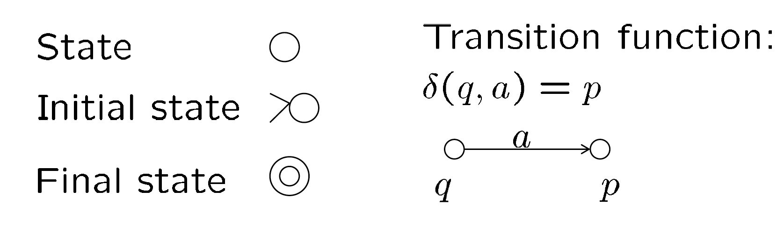

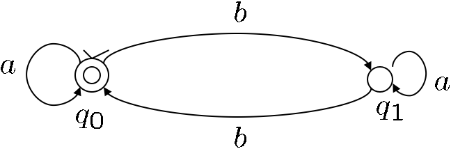

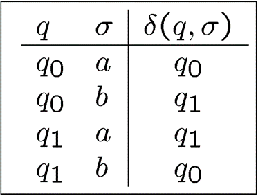

> **Definition**
>
> DFA $（K,\Sigma,\delta,s,F)$ 的一个 **configuration** 有 $K\times \Sigma^*$ 的形式，表示从当前状态 $K$ 开始经过 $\Sigma^*$ 所表示的多个操作。

两个configuration之间的二元关系 $\vdash_M$ 满足：

- $(q,w)\vdash_M(q',w') \Leftrightarrow \exists a\in\Sigma,w=aw',\text{and }\delta(q,a)=q'$

Example: $(n,WSSW)\vdash_M(i,SSW)\vdash_M(n,SW)\vdash_M(u,W)\vdash_M(n,\epsilon)$

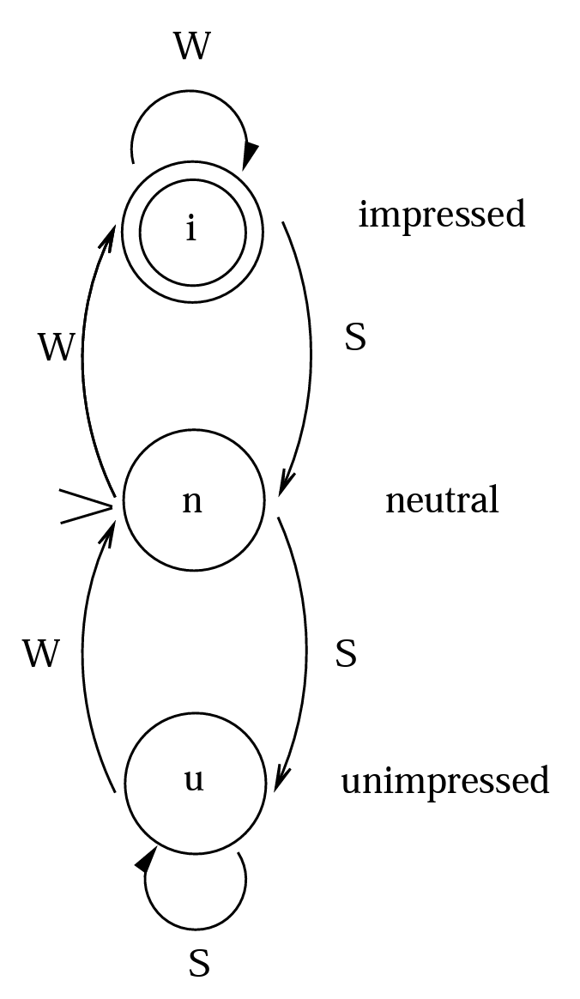

!!!Note
	$\vdash_M^*$ 是 $\vdash_M$ 关于 reflexive, transitive 的 closure。
	- $(q,w)\vdash_M^*(q',w')$ 表示 $(q,w)$ 经过若干步之后会到达 $(q',w')$

## 2.2 Nondeterministic Finite Automata

> **Difinition**
>
> **Nondeterministic finite automata(NFA)** 是一个五元组 $(K,\Sigma,\delta,s,F)$，满足：
>
> - $K$ 是一个状态的有限集合
> - $\Sigma$ 是一个字母表
> - $s\in K$ 是最初状态
> - $F\subseteq K$ 是集合的最终状态
> - $\Delta$: 转移关系，是 $K\times (\Sigma\cup\{e\})\times K$ 的子集

!!!Supplyment
	NDF和DFA的主要区别为：1. DFA的转移关系必须是一个函数: $K\times\Sigma\rightarrow K$ ，NFA的转移关系可以不是函数: $K\times(\Sigma\cup\{e\})\times K$ 。2.  DFA转移关系的domain为 $K\times\Sigma$，而NFA的是 $K\times(\Sigma\cup\{e\})$ ，即允许空字符 $e$ 。

$\vdash_M^*$ 是 $\vdash_M$ 关于 reflexive, transitive 的 closure，仍满足。

一个字符串 $w\in\Sigma^*$ 被 $M$ **accept** 当且仅当存在一个状态 $q\in F$ 满足 $(s,w)\vdash_M^*(q,\epsilon)$

- $L(M)$ 是所有被 $M$ 接受的字符串构成的集合。

> **Theorem**
>
> 对于一个NFA $M$的语言 $L=L(M)$，存在一个DFA $M'$ 满足 $L=L(M')$

### Proof

对于一个给定的 NFA: $M=\{K,\Sigma,\Delta,s,F\}$，构造一个 DFA: $M'=\{K',\Sigma,\delta,s',F,\}$，其中

- $K'=2^K$
- $s'=E(s)$
- $F'=\{Q|Q\subseteq K,Q\cap F\neq \phi\}$
- 对于每一个 $Q\subseteq K$ ，以及 $a\in \Sigma$，取 $\delta(Q,a)=\cup\{E(p)|p\in K \text{ and }(q,a,p)\in \Delta \text{ for some } q\in Q\}$

> **Claim**
>
> 对于任意字符串 $w\in \Sigma^*$ 和任意状态 $p,q\in K$ ，存在一个包含 $p$ 的集合 $P$，使得 $(q,w)\vdash^*_M(p,e)\Leftrightarrow (E(q),w)\vdash^*_{M'}(P,e)$ 

定义 $E(q)$ 为状态 $q$ 可以在没有任何输入的情况下可以到达的所有状态的集合，即

$$
E(q)=\{p\in K:(q,e)\vdash^*_M(p,e)\}
$$

则对于所有字符串 $w\in\Sigma^*$

$$
\begin{aligned}
w\in L(M) &\Leftrightarrow (s,w)\vdash^*_M(f,e) \text{ for some }f\in F \text{ (Definition)}\\\\
&\Leftrightarrow (E(s),w) \vdash^*_{M'}(Q,e)\text{ for some } f\in Q\text{ (Claim)}\\\\
&\Leftrightarrow (s',w)\vdash^*_{M'}(Q,e) \text{ with } Q\in F'\\\\
&\Leftrightarrow w\in L(M')
\end{aligned}
$$

即只需证明 *Claim* 正确，即可证明 *Theorem* 正确。

接下来使用归纳法来证明 *Claim*：

- **Basic Step**

当 $|w|=0$ 即 $w=e$ 时，只需证存在 $P$ 满足 $(q,e)\vdash^*_M(p,e)\Leftrightarrow (E(q),e)\vdash^*_{M'}(P,e)$ 

此时显然满足 $p\in E(q)$ ，则只需取 $P=E(q)$ 即可达成。

- **Induction Hypothesis**

假设对于所有满足 $|w|\leq k$ 的字符串，*Claim* 都成立。

- **Induction Step**

取 $|w|=k+1,w=va$，满足 $a\in \Sigma,v\in \Sigma^*$

先证 $\Rightarrow$ ，即存在 $P$ 满足 $(q,va)\vdash^*_M(p,e)\Rightarrow (E(q),va)\vdash^*_{M'}(P,e)$ 

$$
(q,w)\vdash^*_M(q,e)\Leftrightarrow \exists ~r_1,r_2,(q,va)\vdash^*_M(r_1,a)\vdash^*_M(r_2,e)\vdash^*_M(p,e)
$$

根据 Induction Hypotheses, (其中 $r_1\in R_1$ )

$$
(q,va)\vdash^*_M(r_1,a)\Leftrightarrow(q,v)\vdash^*_M(r_1,e)\Leftrightarrow(E(q),v)\vdash^*_{M'} (R_1,e)
$$

根据构造的 $\delta$ 的定义，有

$$
(r_1,a,r_2)\in \Delta \Rightarrow E(r_2)\subseteq \delta(R_1,a)=P
$$

由 $(r_2,e)\vdash_{M'}^* (p,e)$ 易知 $p\in E(r_2) \Rightarrow p\in P$，则

$$
E(q,va)\vdash^*_{M'}(R_1,a)\vdash^*_{M'}(P,e)
$$

$\Rightarrow$ 证明完毕，接下来证明 $\Leftarrow$ ，即 $(q,va)\vdash^*_M(p,e)\Leftarrow (E(q),va)\vdash^*_{M'}(P,e)$ 

$$
(E(q),va)\vdash^*_{M'}(R_1,a)\vdash^*_{M'}(P,e) \text{ for some }p\in P
$$

则根据 $M'$ 的定义，$(R_1,a)\vdash^*_{M'}(P,e)\Rightarrow P=\delta(R_1,a)$，又有

$$
\delta(R_1,a)=\cup\{E(r_2):\exists r_2\in K \text{ and } (r_1,a,r_2)\in\Delta \text{ for some }r_1\in R_1\}
$$

则 $p\in P\Rightarrow \exists r_2$ 满足 $p\in E(r_2)$ 且$\exists r_1\in R_1, (r_1,a,r_2)\in \Delta$ 

根据 $E(r_2)$ 的定义可得 $(r_2,e)\vdash^*_M (p,e)$

又根据 Inductino Hypotheses，$(q,va)\vdash^*_M(r_1,a)$，则

$$
(q,va)\vdash^*_M(r_1,a)\vdash^*_M(r_2,e)\vdash^*_M (p,e)
$$

证明完毕。

### Example

!!!Remark
	以上证明提供了从NFA构造DFA的实际算法。构造出的信DFA在规模上是NFA的指数级。

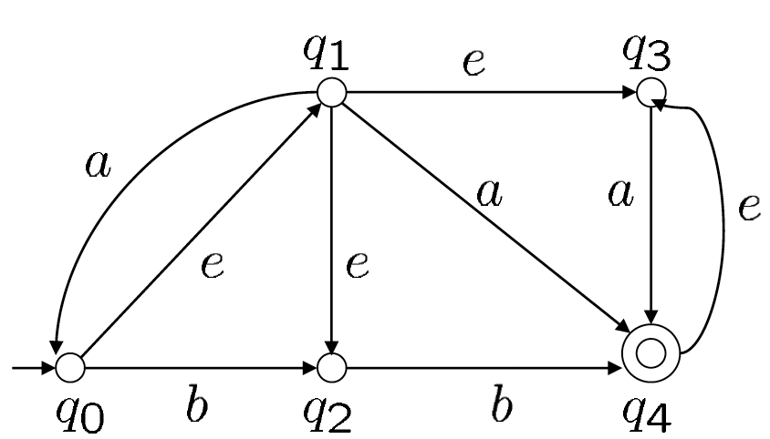

根据上图的的NFA，首先可以得到 $s'=E(q_0)=\{q_0,q_1,q_2,q_3\}$，然后得出转移关系：

$$
\begin{aligned}
&\delta(s',a)=E(q_0)\cup E(q_4)=\{q_0,q_1,q_2,q_3,q_4\}\\
&\delta(s',b)=E(q_2)\cup E(q_4)=\{q_2,q_3,q_4\}\\\\

&\delta(\{q_0,q_1,q_2,q_3,q_4\},a)=\{q_0,q_1,q_2,q_3,q_4\}\\
&\delta(\{q_0,q_1,q_2,q_3,q_4\},b)=\{q_2,q_3,q_4\}\\
&\delta(\{q_2,q_3,q_4\},a)=\{q_3,q_4\}\\
&\delta(\{q_2,q_3,q_4\},b)=\{q_3,q_4\}\\\\

&\delta(\{q_3,q_4\},a)=\{q_3,q_4\}\\\\
&\delta(\{q_3,q_4\},b)=\phi\\\\

&\delta(\phi,a)=\delta(\phi,b)=\phi
\end{aligned}
$$

于是可以得出等价的DFA为

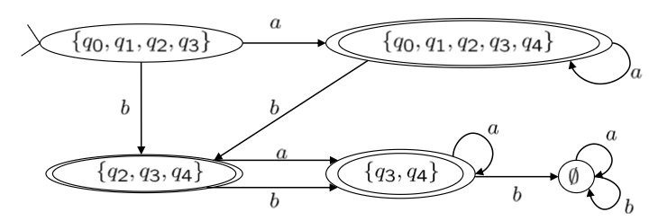

## 2.3 FA & Regular Expression

> **Theorem**
>
> 一个语言 $L$ 是正则的当且仅当它可以被一个有限状态机 $M$ 接受。

### Regular Expression -> FA

对于单个字符的正则表达式，一定可以被 FA 接受。

#### Union

如果两个正则表达式分别可以被两个NFA $M_i=（K_i,\Sigma,\Delta_i,s_i,F_i)(i=1,2)$ 接受，则可以对于构造一个NFA $M=(K,\Sigma,\Delta, s,F)$ ：$L(M)=L(M_1)\cup L(M_2)$ ，满足：

- $K=K_1\cup K_2 \cup {s}$
- $F=F_1\cup F_2$
- $\Delta=\Delta_1\cup\Delta_2\cup\{(s,e,s_1),(s,e,s_2)\}$

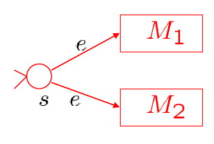

#### Concatenation

构造 $L(M)=L(M_1)\circ L(M_2)$，满足：

- $K=K_1\cup K_2 $
- $F=F_2$
- $\Delta=\Delta_1\cup\Delta_2\cup\{(q_i,e,s_2):q_i\in F_1\}$

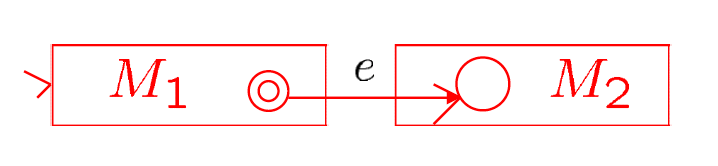

#### Kleene Star

构造 $L(M)=L(M_1)*$，满足

- $K=K_1\cup\{s_1'\}$
- $F=F_1\cup\{s_1'\}$
- $\Delta=\Delta_1\cup\{(s_1',e,s_1)\}\cup\{(q,e,s_1):q\in F_1\}$

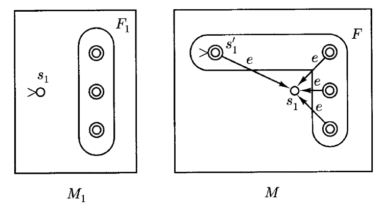

!!!Note
	引入新状态 $s_1'$ 来处理 Kleene Star 满足空字符的情况。

根据以上三种方式可以说明根据正则表达式可以构造出对应的NFA。下面介绍另外两种在 **DFA** 下的操作的对应转换。

#### Complementation

!!!Note
	这里的 $M_1$ 是 DFA，下同。

构造 $L(M)=\overline{L(M_1)}=\Sigma^*-L(M_1)$，满足：

- $K=K_1$
- $s=s_1$
- $F=K-F_1$
- $\delta=\delta_1$

#### Intersection

构造 $L(M)=L(M_1)\cap L(M_2)=\Sigma^*-(\Sigma^*-L(M_1))\cup(\Sigma^*-L(M_2))$，满足：

- $K=K_1\times K_2$
- $s=(s_1,s_2)$
- $F=F_1\times F_2$
- $\delta=K\times\Sigma\rightarrow K,\delta((q_1,q_2),a)=(\delta_1(q_1,a),\delta_2(q_2,a))$

### FA -> Regular Expression 

定义**广义状态机(genetalized finite automaton)**: $M_G=(K_G,\Sigma_G,\Delta_G,s_G,F_G)$ 由一个NFA: $M=(K,\Sigma,\Delta, s,F)$ 生成，满足：

- $M_G$ 有唯一的最终状态。
- $\Sigma_G=\Sigma\cup R_0$ ，其中 $R_0$ 是 $\Sigma$ 上的正则表达式构成的集合 $R$ 的子集。
- 转移关系：$\Delta_G\subseteq K\times(\Sigma\cup\{e\}\cup R)\times K$
- 没有状态可以进入初始状态或离开最终状态

可以通过给一个DFA或NFA增加一个初始状态和一个最终状态，并使用 $e$ 指向和指出原来的初始状态和最终状态来实现转换。

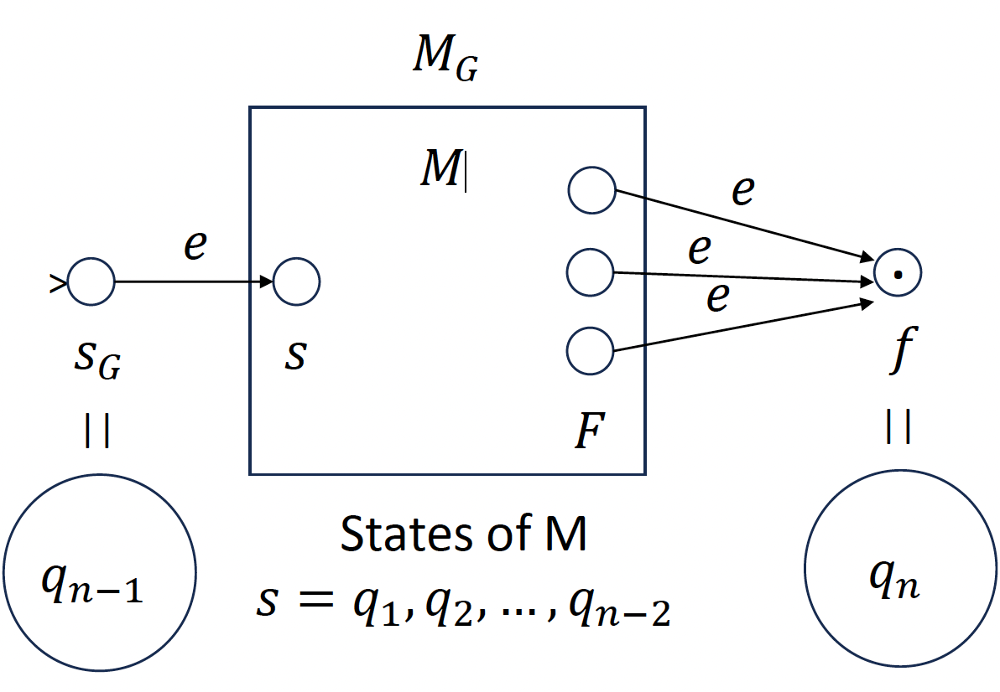

通过依次消除中间状态最终可以得到一个正则表达式。

#### Example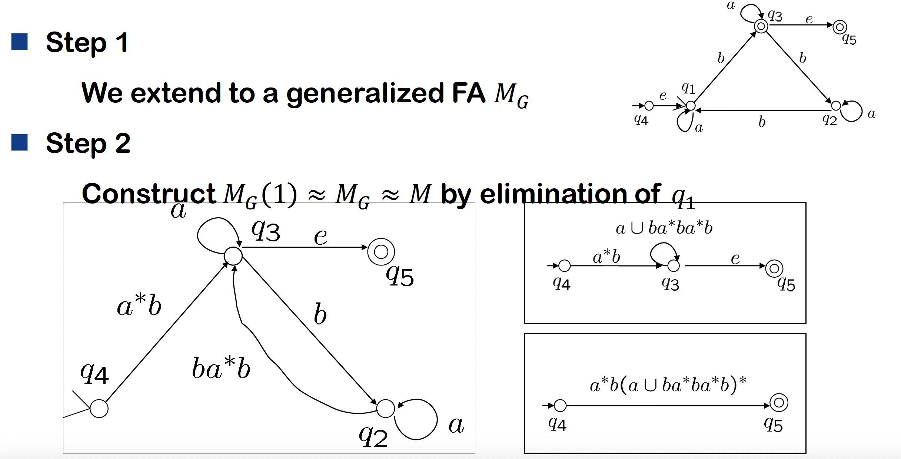

> **Definition**
>
> $R(i,j,k)=\{w\in\Sigma^*;(q_i,w)\vdash^*_{M,k}*(q_j,e)\},i,j=1,2,3,…,n,k=0,1,2,…,n$ 表示所有 $q_i$ 不经过下标大于 $k$ 的状态可以到达 $q_j$ 的路径。

根据这个定义可以得到 $L(M)=\cup\{R(1,j,n):q_j\in F,q_1=s\}$

要证明 $L(M)$ 是正则的，只需证所有 $R(i,j,k)$ 是正则的。

- **Base case**: $k=0$，则 $R(i,j,0)\left\{\begin{array}{ll} \{a|\delta(q_i,a)=q_j\} &i\neq j\\ \{a|\delta(q_i,a)=q_j\}\cup\{e\} &i= j \end{array}\right.$ 

- **Induction step**: $R(i,j,k)=R(i,j,k-1)\cup R(i,k,k-1)\cup R(k,k,k-1)^*\cup  R(k,j,k-1)$

## 2.4 Languages that are and are not regular

!!!Note
	正则表达式关于Union, intersection, complementation, concatenation, Kleene star操作封闭。
	

**直观理解**：FA只有有限个状态，并对这些状态进行重复。即满足FA必须要使状态可以在有限大的内存里保存下来。

> **Pumping Theorem**
>
> 如果 $L$ 是一个正则语言，则存在一个整数 $n\geq 1$ 使得对于所有满足 $|w|\geq n$ 的 $w\in L$，都可以被写成 $w=xyz$ 满足：
>
> - $y\neq e$
> - $|xy|\leq n$
> - 对于所有 $i\geq 0$ 满足 $xy^iz\in L$

#### Proof

如果 $L$ 是一个被 DFA $M$ 接受的正则语言，$M$ 有 $n$ 个状态，则对于 $|w|\geq n$，考虑前 $n$ 步，即
$$
(q_0,a_1\cdot\cdot\cdot a_n)\vdash_M(q_1,a_2\cdot\cdot\cdot a_n)\vdash_M\cdot\cdot\cdot\vdash_M(q_n,e)
$$
根据鸽笼原理，其中必然存在 $0\leq i< j\leq n$，使得 $q_i=q_j$

则区 $y=a_i\cdot\cdot\cdot a_j,x=a_1\cdot\cdot\cdot a_{i-1},z=a_{j+1}\cdot\cdot\cdot a_n$

#### Usage

通常使用反证法，先假定 $L$ 是正则的，存在一个 $n$。

然后找出一个 $w$ 满足 $|w|>n$，使得无论如何拆分成 $w=xyz$ 都会存在 $xy^iz\notin L$ 。

则可以说明 $L$ 不是正则的。

