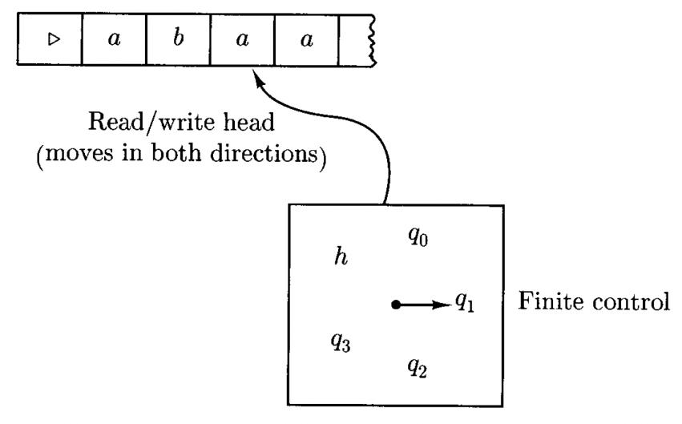
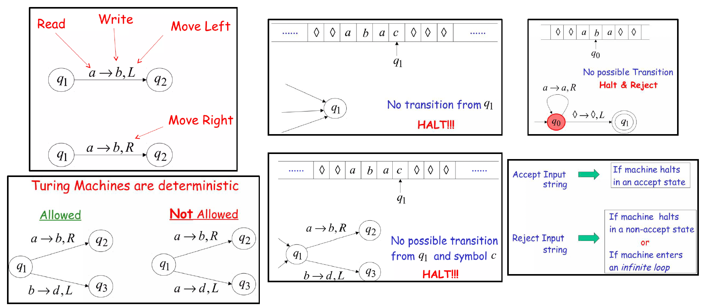
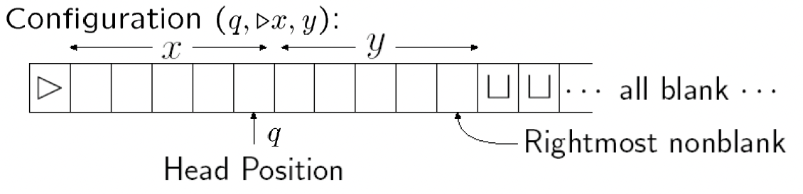
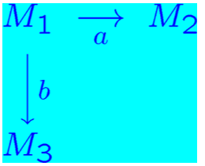
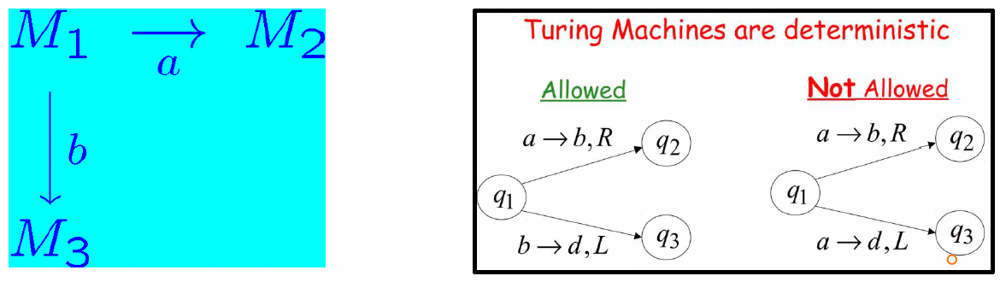
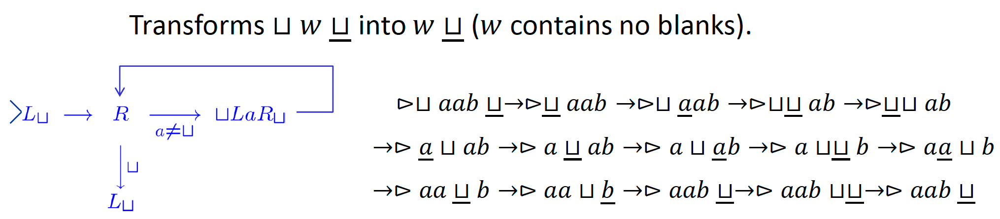
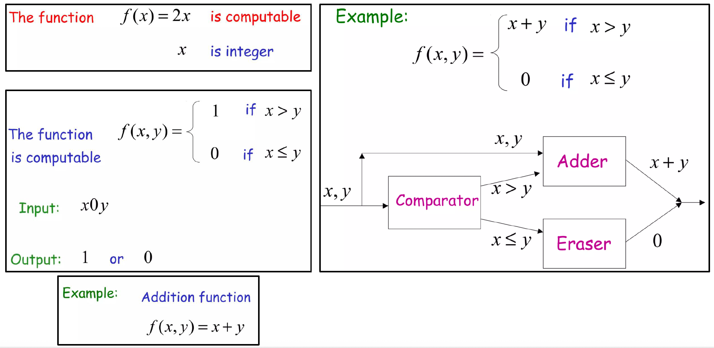
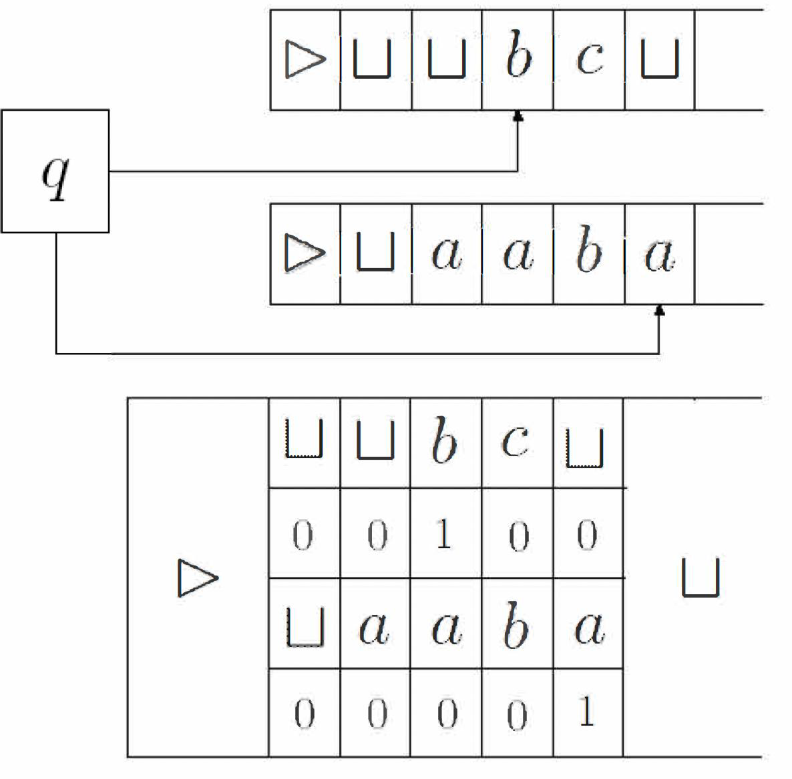
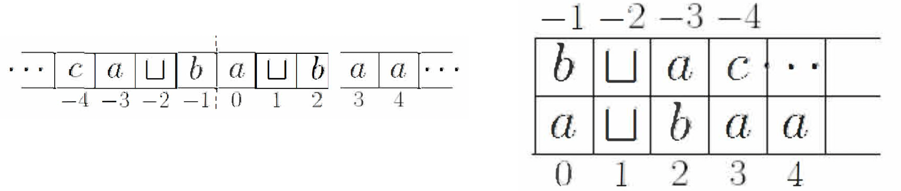
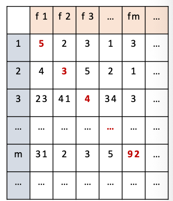

# Turing Machine

PDA仍存在只能在栈顶操作字符的缺陷，而图灵机的基本思想就是把磁带和栈结合在一起，即使用一个可写的磁带。

## 4.1 The Definition of Turing Machine

图灵机可以定义为一个五元组 $(K,\Sigma,\delta,s,H)$ , 其中：

- $K$ 是一个状态的有限集合
- $\Sigma$ 是一个字母表，**包括** $\sqcup$ (blank symblo) 和 $\rhd$ (left end) ，但**不包含** $\rightarrow$ 和 $\leftarrow$ 符号
- $s\in K$ 是最初状态
- $H\subseteq H$ 是停止状态(**halting states**)的集合
- 转移函数 $\delta:(K-H)\times\Sigma\rightarrow K\times (\Sigma\cup\{\leftarrow,\rightarrow\})$ 满足
  $\forall q\in K-H \text{ if } \delta(q,\rhd)=(p,b)\text{, then } b=\rightarrow$
  $\forall q\in K-H \text{ and } a\in\Sigma\text{, if } \delta(q,a)=(p,b) \text{, then }b\neq \rhd$

!!!Note
	$\delta(q,a)=(p,b)$ 表示在状态 $q$ 时如果在磁带上读到 $a$ ，则转移到 $p$ 状态，并进行 $b$ 操作: $b$ 为字符，则不移动磁带头，并写入字符 $b$ ; $b$ 位 $\{\rightarrow,\leftarrow\}$  则向对应方向移动磁带头。

如果机器没有转移函数可以操作，则停止(**halt**)在一个状态。

**Graph Presentation**

**Example**

### Configuration

> **Definition**
>
> TM $M=(K,\Sigma,\delta,s,H)$ 的 **configuration** 定义为 $K\times \rhd\Sigma^*\times (\Sigma^*(\Sigma-\{\sqcup\})\cup\{e\})$
>
> 
>
> 若一个configuration的状态(图中 $q$ )属于集合 $H$，则称该配置为**halted configuration**。

一个configuration $(q,wa,u)$ 可以简单表示为 $(q,w\underline{a}u)$

### Computation

> **Defintion**
>
> 对于TM $M=(L,\Sigma,\delta,s,H)$ ，考虑以下两个configurations: $(q_1,w_1\underline {a_1}u_1)$ 和 $(q_2,w_2\underline{a_2}u_2)$ 其中$a_1,a_2\in\Sigma$，则定义图灵机的计算为
> $$
> (q_1,w_1\underline {a_1}u_1)\vdash_M(q_2,w_2\underline {a_2}u_2)
> $$
> 当且仅当存在一个 $b\in\Sigma\cup\{\rightarrow,\leftarrow\},\delta(q_1,a_1)=(q_2,b)$,满足一下之一
>
> 1. $b\in \Sigma,w_1=w_2,u_1=u_2,a_2=b$
> 2. $b=\leftarrow,w_1=w_2a_2$ , 且满足以下之一:
>    如果 $a_1\neq\sqcup$ 或 $u_1\neq e$ , 则需满足 $u_2=a_1u_1$
>    如果 $a_1=\sqcup$ 且 $u_1=e$ , 则需满足 $u_2=e$
> 3. $b=\rightarrow,w_2=w_1a_1$ , 且满足以下之一:
>    如果 $a_2\neq \sqcup$ 或 $u_2\neq e$ 则需满足 $u_1=a_2u_2$
>    如果 $a_2=\sqcup$ 且 $u_2=e$ 则需满足 $u_1=e$
>
> 

对于任何一个图灵机 $M$ , $\vdash^*_M$ 是 $\vdash_M$ 在 reflexive, transitive 上的闭包。

图灵机 $M$ 的计算是一个configuration序列 $C_0,C_1,…,C_n$ 满足
$$
C_0\vdash_M C_1\vdash_M…\vdash_M C_n
$$
用 $C_0\vdash^n_M C_n$ 来表示一个长度为 $n$ (即需要 $n$ 步)的图灵机计算。

### Basic Machine

> **Defintion**
>
> 定义两种基本图灵机: **Symbol-writing** 和 **Hand-moving** 机器:
>
> $\Sigma$ 是一个给定的字母表, $a\in \Sigma\cup\{\leftarrow,\rightarrow\}-\{\rhd\}$ , 于是可以定义图灵机 
> 
> $$
> M_a=(\{s,h\},\Sigma,\delta,s,h)
> $$
> 
> 满足对于每一个 $b\in\Sigma-\{\rhd\},\delta(s,b)=(h,a)$ , 对于 $\rhd,\delta(s,\rhd)=(s,\rightarrow)$ 

简单来说，就是一个固定状态转移的图灵机，上述定义中 $a$ 为其他字符是被称为 symbol-writing 机器($M_a$)， $a\in\{\leftarrow,\rightarrow\}$ 时被称为 hand-moving 机器($M_{\leftarrow},M_\rightarrow$)。

### Combining

对于以上的图灵机组合，定义 $M_i=(K_1,\Sigma_i,\delta_i,s_i,H_i),(i=1,2,3)$ ,他们的组合 $M=(K,\Sigma,\delta,s,H)$ 满足:

- $K=K_1\cup K_2\cup K_3$
- $s=s_1$
- $H=H_2\cup H_3$
- 对于每一个 $\sigma\in \Sigma,q\in K-H$ , $\delta(q,\sigma)$ 的定义如下:
  如果 $q\in K_1-H_1$ 则 $\delta(q,\sigma)=\delta_1(q,\sigma)$
  如果 $q\in K_2-H_2$ 则 $\delta(q,\sigma)=\delta_2(q,\sigma)$
  如果 $q\in K_3-H_3$ 则 $\delta(q,\sigma)=\delta_3(q,\sigma)$
  如果 $q\in H_1$ 则若 $\sigma=a$ , $\delta(q,\sigma)=s_2$ ; 若 $\sigma=b$ , $\delta(q,\sigma)=s_3$ ; 否则 $\delta(q,\sigma)\in H$ 

## 4.2 Computing with Turing Machine

> **Definition**
>
> 首先定义两个不同的停止状态 $\{y,n\}$ , 任何halting configuration的停止状态为 $y$ 的被称为 accepting configuration; 停止状态为 $n$ 的被称为 rejecting configuration。
>
> 对于一个字符串 $w\in(\Sigma-\{\sqcup,\rhd\})*$ , 如果 $(s,\rhd\underline{\sqcup}w)$ 构成(yields) 一个accepting configuration，则称图灵机 $M$ **接收(accept)** $w$ , 如果构成一个rejecting configuration 则称 $M$ **拒绝(reject)** $w$ 。

> **Definition**
>
> 对于 $L\subseteq \Sigma^*$ , 如果满足以下条件，则称 $M$ **决定(decides)** $L$ :
>
> - $w\in L\text{ iff } M \text{ accepts }w$
> - $w\notin L\text{ iff } M \text{ rejects }w$
>
> 如果存在一个 $TM$ 可以决定 $L$ , 则称 $L$ 是 **recursive** 的。
>
> 

> **Definition**
>
> 对于TM $M=(K,\Sigma,\delta,s,H)$ , 字母表 $\Sigma_0\subseteq\Sigma-\{\rhd,\sqcup\}$ 以及 $L\in\Sigma^*_0$ , 如果对于任何 $w\in \Sigma^*$ 满足以下条件:
> $$
> w\in L\Leftrightarrow M \text{ halts on input } w
> $$
> 则称 $M$ **semidecides** $L$ 。
>
> 当且仅当存在一个 TM 可以 semidecides $L$ 时，称语言 $L$ 是 **Recursively Enumerable Languages(R.E.)** 。

!!!Supplyment
	对于一个图灵机，可以通过一直延伸空格或一直循环的方式来达到**无法停止**。对于 $w$ 在 $M$ 上无法停止可以用 $M(w)=\uparrow$ 来表示，即 $M(w)=\uparrow\Leftrightarrow w\notin L$ 。

> **Theorem**
>
> 如果 $L$ 是 recursive language，则它是一个 R.E.。
>
> 

> **Theorem**
>
> 一个 recursive language 的 **complement** 也是 recursive 的。
>
> 

> **Theorem**
>
> 两个 recursive language 的 **union / intersection** 也是 recursive 的。
>
> 

!!!Note
	R.E.对于 intersection不封闭。

图灵机用于计算函数：

> **Definition**
>
> 记TM $M=(K,\Sigma,\delta,s,H)$ , 字母表 $\Sigma_0\subseteq \Sigma-\{\rhd,\sqcup\}$ , 字符串 $w\in \Sigma_0^*$ 。
>
> 假设 $M$ 在输入 $w$ 后停止了，且 $(s,\rhd\underline{\sqcup} w)\vdash_M^*(h,\underline{\sqcup}y)$ , 其中 $y\in\Sigma_0^*$ , 则称 $y$ 为 $M$ 在 $w$ 输入下的输出，记作 $M(w)$ 。  
>
> 对于一个函数 $f:\Sigma_0^*\rightarrow \Sigma^*_0$ , 如果满足以下条件:
> 
> $$
> \forall w\in\Sigma^*_0,M(w)=f(w)
> $$
> 
>  则称 $M$ 计算(**computes**) $f$ 。如果存在一个图灵机 $M$ 可以计算函数 $f$ , 则函数 $f$ 是 **recursive** 的。
>
> 

**Example**

- **The Copy Machine** $C$ 
- **The left-shifting Machine** $S_\leftarrow$ 

对于任意自然数，都可以用二进制表示，即可以用一个字符串 $w=0\cup 1(0\cup 1)^*$ 来表示。用 $num(w)$ 表示二进制字符串所对应的数字。则对于一个数字到数字的函数，如果其用二进制表示的字符串函数是 recursive 的，这个函数就是 recursive 的。

对于一个由多个数字计算得到结果的函数，可以有以下定义：

> **Definition**
>
> 记TM $M=(K,\Sigma,\delta,s,\{h\})$ , 其中 $0,1,;\in\Sigma$ , 函数 $f:N^k\rightarrow N(k\geq 1)$ , 如果对于任何 $w_1,…,w_k\in0\cup1(0\cup1)^*$ 满足：
> $$
> num(M(w_1;…;w_k))=f(num(w_1),…,num(w_k))
> $$
> 则称 $M$ 计算 $f$ 。如果存在一个图灵机 $M$ 可以计算函数 $f:N^k\rightarrow N$ , 则函数 $f$ 是 **recursive** 的。

**Example**

-  
-  

## 4.3 Extension of Turing Machine

图灵机的拓展主要有以下几种：

- **Multiple tapes**
- Two-way infinite tape
- Multiple heads
- Multi-dimensional tape
- Non-determinism

这些拓展并不能提升图灵机的能力，但是可以方便图灵机的设计。

### Multiple tapes

> **Definition**
>
> 对于一个整数 $k\geq 1$ , 一个 **k-tape TM** 是一个五元组 $(K,\Sigma,\delta,s,H)$ 其中 $K,\Sigma,s,H$ 的定义与普通 TM 相同，转移函数 $\delta$ 为：
> 
> $$
> \delta:(K-H)\times\Sigma^k\rightarrow K\times(\Sigma\cup\{\leftarrow,\rightarrow\})^k
> $$

> **Defition**
>
> $M=(K,\Sigma,\delta,s,H)$ 是一个 k-tape TM，则 $M$ 的 **configuration** 满足：
> 
> $$
> K\times(\rhd\Sigma^*\times(\Sigma^*(\Sigma-\sqcup))\cup\{e\})^k
> $$

对于 mutiple tapes , 作出以下约定：

- 输入字符串放置在第一条磁带上
- 其他磁带初始为空白，磁头位于每条磁带最左侧的空白方格内；
- 计算结束后，输出位于第一条磁带上；其他磁带将被忽略。

**Example**

- **The Copying Machine**
  
- **Add arbitrary any binary numbers**
  

> **Theorem**
>
> 设 $𝑀=(𝐾,\Sigma,\delta,𝑠,𝐻)$ 为一个 k-tape TM $(k\geq1)$。则存在一个标准图灵机 $𝑀'=(𝐾',\Sigma',\delta',𝑠',𝐻)$，其中 $\Sigma\subseteq\Sigma'$，使得以下条件成立：
>
> - 对于任意输入字符串 $𝑥\in\Sigma^*$，$M$ 在输入 $x$ 时停止，并在第一个磁带上输出 $y$ 当且仅当 $M'$ 在输入 $x$ 时也停止，且停止状态相同，并在其磁带上输出 $y$
> - 如果 $M$ 在输入 $x$ 上经过 $t$ 步后停止，则 $M'$ 在输入 $x$ 上经过步数为 $O(t(|x|+t))$ 后停止。

**Proof**

用一个单磁带图灵机模拟一个 k-tape 图灵机该单磁带图灵机的磁带被分割成 2k 个磁道：

- k 个磁道用于存储磁带符号
- k 个磁道用于存储磁头位置（每个磁道一个）

从给定的 k-tape 图灵机 $M=(K,\Sigma,\delta,s,H)$ 构造一个标准图灵机 $M'=(K',\Sigma',\delta',s',H')$ :

- $\Sigma'=\Sigma\cup\{0,1\}$
- $M'$ 的字母表由 $M$ 的字母表和 2k-tuples $(𝑎_1,𝑏_1,…,𝑎_𝑛,𝑏_𝑛)$ 组成$𝑎_1,…,𝑎_𝑛\inΣ,𝑏_1,…,𝑏_𝑛\in\{0,1\}$。即 $M'$ 的多磁带部分都单元格内字符是 2k-tuple。

**Phase1: Representation of the initial configuration of 𝑀**

假定 $M'$ 的磁带上最初是一个输入字符串 $q$ 

- 首先把所有字符都右移一个位置，然后在腾出来的那个空位写上 $(\sqcup,1,…,\sqcup,1)$ ，用于表示 k 个磁带的开始。
- 然后从这个位置开始继续向右读取，如果遇到有效字符 $a$ ，则写入 $(a,0,\sqcup,0…,\sqcup,0)$ ，知道读取到 $\sqcup$ 表示字符串结束。
- Time Complexity: $O(|w|)$

 **Phase 2: Simulate the computation of 𝑀**

- 从磁头扫描磁带上尚未细分为磁道的第一个位置开始模拟每一步操作。
- 沿磁带向左向下扫描，收集 $M$ 的 k 个磁头扫描过的符号信息。识别所有扫描过的符号后，返回到最左侧的空白处，然后改变有限控制器的状态，以反映标记磁头位置上 $\Sigma$ 的 $k$ 个磁道中的 $k$ 个符号元组。
- 沿磁带再向右向下扫描，以更新磁道，使其与 $M$ 的移动保持一致。
- Time Complexity: $O(|w|+2+t)$

!!!Corollary
	任何由 k-tape 图灵机计算的函数或由 k-tape 图灵机 decided 或 semidecided 的语言，也可以分别由标准图灵机计算, decided 或 semidecided 。

### Two-way infinite tape

- 磁带向左和向右均**无边界**。
- 输入/输出采用相同约定。

具有双向无限磁带的图灵机不比标准图灵机更强大。双向无限磁带可由双磁带机器轻松模拟。

### Multiple Heads

一条磁带配有多个磁头。在单一步骤中，所有磁头同时读取扫描符号，并独立移动或写入。多头磁带机可通过k-tape机器轻松模拟。

### Two Dimensional Tape

允许其磁带为无限二维网格。解决诸如“拼图”等问题时，比标准TM实用得多。

> **Theorem**
>
> 任何由多带、多头、双向无限带或多维带的TM所决定或半决定的语言，以及任何由此类TM计算的功能，均可分别由标准TM进行决定、半决定或计算。

## 4.4 Nondeterministic Turing Machines

> **Definition** 
>
> 一个**nondeterministic Turing Machine(NTM)** 是一个五元组 $(K,\Sigma,\Delta,s,H)$ ，其中 $K,\Sigma,H$ 和标准TM相同，$\Delta$ 为
> $$
> ((K-H)\times\Sigma)\times(K\times(\Sigma\cup\{\leftarrow,\rightarrow \}))
> $$
> 相比于TM，这里的转移关系是 **relation** 而不是 function。
>
> Configurations $\vdash_M$ 和 $\vdash^*_M$ 的定义与标准 TM 类似。
>
> - $\vdash_M$ 可以不是单值的：一个configuration可以在一步中yield几个结果。

>  **Definition**
>
> 一个NTM $M=(K,\Sigma,\Delta,s,H)$ ，如果 $(s,\rhd\underline{\sqcup}w)\vdash^*_M (h,u\underline{a}v)$ ，则称 $M$ 接受(**accepts**) 输入 $w\in(\Sigma-\{\rhd,\sqcup\})^*$。（只要存在一个路径可以停止即可）
>
> 对于一个语言 $L\subseteq(\Sigma,\{\rhd,\sqcup\})^*$，对于所有 $w\in(\Sigma-\{\rhd,\sqcup\})^*:w\in L$ ，都满足 $M$ 接受 $s$ $\Leftrightarrow$ $M$ **semidicides** $L$。

> **Definition**
>
> 一个NTM $M=(K,\Sigma,\Delta,s,\{y,n\})$ ，如果对于任何 $w\in(\Sigma-\{\rhd,\sqcup\})^*$ 都满足以下两个条件，则称 $M$ 决定(**decides**) 一个语言 $L\subseteq(\Sigma-\{\rhd,\sqcup\})^*$ :
>
> - 存在一个自然数 $N$ ，使得不存在 configuration $C$ 满足 $(s,\rhd\underline{\sqcup}w)\vdash^N_M C$ 。（即最多经过 $N$ 步，所有分支都停下来）
> - $w\in L$ 当且仅当存在 $u,v\in\Sigma^*,a\in\Sigma,$ $(s,\rhd\underline{\sqcup}w)\vdash^*_M(y,u\underline{a}v)$
>
> 如果对于任何 $w\in(\Sigma-\{\rhd,\sqcup\})^*$ 都满足以下两个条件，则称 $M$ 计算(**computes**) 一个函数 $f:(\Sigma-\{\rhd,\sqcup\})^*\rightarrow (\Sigma-\{\rhd,\sqcup\})^*$ :
>
> - 存在一个自然数 $N$ ，使得不存在 configuration $C$ 满足 $(s,\rhd\underline{\sqcup}w)\vdash^N_M C$ 。（即最多经过 $N$ 步，所有分支都停下来）
> - $(s,\rhd\underline{\sqcup}w)\vdash^*_M(h,u\underline{a}v)$ 当且仅当 $ua=\rhd\sqcup$ 且 $v=f(w)$

!!!Remark
	如果NTM决定一个语言且计算一个函数，则所有计算都需要停止在(condition(a))。
	
	如果NTM决定一个语言，则只需要至少一个可能的计算可以结束且接受输入。
	
	如果NTM计算一个函数，则需要所有可能的计算都到达同一个结果。

> **Theorem**
>
> 如果一个 NTM $M$ semidecides/decides一个语言或计算一个函数，则存在一个标准 TM $M'$ semidecides/decides这个语言或计算这个函数。

**Proof**

对于一个 NTM $M$ ，都可以构造一个 $M'$ 。由于 $M$ 每一步可以到达的状态都是有限的，则假设对于所有 $(q,a)$ ，最大的可以转移到的状态数为 $r$ ，然后把这些转移标为 $1,2,…,r$ (或更少)。对于任何在 $k$ 步内结束的计算，都可以由一个长度为 $k$ 的数字序列来表示路径，其中的每个数字都小于 $r$ 。

构造一个 $M'$ 在3个磁带上工作：

- tape1: 始终保持原始输入
- tape2/tape3: 用于模拟对于一个给定数字序列 $d$ 的NTM计算 $M_d$ 。其中tape2用于存储  计算结果，每次都要从tape1复制内容重新计算；tape3用于计算 $\{1,…,r\}^*$ 的字典序(**lexicographically**)的下一个值，初始为 $e$

- $C^{1\rightarrow2}$ : 擦除第二个磁带并从第一个磁带拷贝数据到第二个磁带
- $B^3$ : 生成字典序的下一个字符串的机器
- $M^{2,3}_d$ : $M$ 的决定型版本，在磁带2和3上操作

接下来只需说明 $M'$ halt on input $w$ **iff** (some computation of) $M$ halts: 

假设 $M'$ 在输入 $w$ 后停止

- $\Rightarrow$ $M_d$ 停止且第三个磁带上扫到的不是空白
- $\Rightarrow$ 对于一个字符串 $i_1,i_2,…,i_n$ , $M_d$ 在第二个磁带上从 $w$ 开始，在第三个磁带上从 $i_1,i_2,…,i_n$ 开始，最后可以停止。
- $\Rightarrow$ 存在一个计算可以让 $M$ 在 $w$ 上停止

假设 $M$ 在输入 $w$ 后在运行 $n$ 步后停止

- $\Rightarrow$ $M'$ 在至多 $r+r^2+r^3+…+r^n$ 次失败后，$B^3$ 可以找到一个字符串满足 $\{1,…,r\}^*$ 根据对应的选择使 $M'$ 可以停止，而 $M_d$ 将在扫描该字符串的最后一个符号时停机

!!!Remark
	用确定性模型模拟非确定性模型**并非逐步模拟**。它需要**指数级数量**的步骤来模拟n步的非确定性模型，而本章描述的所有其他模拟都是**多项式级别**的。

## 4.5 Grammars

> **Definition**
>
> 一个 **grammer**(or **unrestricted grammer**) 是一个四元组 $G=(V,\Sigma,R,S)$ ，其中
>
> - $V$ 是一个字母表
> - $\Sigma\subseteq V$ 是终止符(**terminal symbols**)的集合, $V-\Sigma$ 是非终止符(**nonterminal symbols**) 的集合
> - $S\in V-\Sigma$ 是开始符号(**start symbol**)
> - $R$ 是规则(**rules**)集合 ，是 $(V^*(V-\Sigma)V^*)\times V^*$ 的有限子集

- $u\rightarrow_G v\Leftrightarrow (u,v)\in R$
- $u\Rightarrow_G v\Leftrightarrow \exists w_1,w_2\in V^*,\text{ and some rule } u'\rightarrow_Gv'\text{ such that } u=w_1u'w_2,v=w_1v'w_2$
- $\Rightarrow^*_G$ 是 $\Rightarrow_G$ 对于 reflexive, transitive 的闭包。
- 由 $G$ 产生的语言表示为 $L(G)=\{w\in\Sigma^*:S\Rightarrow^*_Gw\}$

!!!Remark
	任何 Context-free gammar 都是 grammar。

**Example**

生成语言 $\{a^nb^nc^n:n\geq 1\}$ 的grammar $G$ :

> **Theorem**
>
> 一个语言可以由一个 grammar 生成当且仅当这个语言可以是 R.E. 

**Proof**

- 先证 $\Rightarrow$ ，即假设 $L=L(G)$

此时需要构建一个NTM $M$ 满足 $L(M)=L(G)$ 

取一个双磁带 $M$ ，第一个磁带始终保持输入 $w$ ，第二个磁带 $M$ 试图在语法 $𝐺$ 中重建从 $𝑆$ 推导出 $𝑤$ 的过程，因此 $M$ 从在第二个磁带上写入 $S$ 开始。

每一步由 $|R|+1$ 中可能状态：前 $|R|$ 中状态各自对应一条转换序列的起始点，该序列将对应规则应用于第二磁带的当前内容。第 $|R|+1$ 个选择：检查当前字符串是否等于 $𝑤$ ，如果等于，则 $M$ 停止并接受，否则 $M$ 陷入无限循环。

 $𝑀$ 以非确定性方式执行推导 $𝑆=𝑤_0\Rightarrow_𝐺𝑤_1\Rightarrow_𝐺…\Rightarrow_𝐺𝑤_𝑛$ , 每一步都检查 $w_i=w$

- 再证 $\Leftarrow$ ，即假设 $L$ 是一个 R.E.

设 $M$ 为一台图灵机，构造grammar $G$ 使得 $G$ 生成由 $M$ semidecide的语言。

先约定以下规则：

- 如果 $M$ 启动，则开始configuration $(s,\rhd\underline{\sqcup}w)$
- $K$ 和 $\Sigma$ 不相交，并且都不包含新的结尾符号 $\lhd$
- 如果 $M$ 停止，则停止configuration $(h,\rhd\underline\sqcup)$

Main Idea: $𝐺$ 将模拟由 $𝑀$ 执行的逆向计算。中间字符串将作为配置的编码形式呈现。

> **Definiton**
>
> 若存在图灵机 $𝑀$ ，对于任意输入 $𝑥$ ，机器在有限步数内**停止**并输出 $𝑓(𝑥)$，则函数 $𝑓$ 为**recursive(or computable)**函数。

> **Definition**
>
> 若存在图灵机 $𝑀$ ，对于任意输入字符串 $𝑤$ ，机器都能停止并正确判定 $𝑤$ 是否属于语言 $𝐿$ ，则称语言 $𝐿$ 是 **recursive(or decidable)**的。
>
> - 如果 $w\in L$ , $M$ 接受 $w$
> - 如果 $w\notin L$ , $M$ 拒绝 $w$

## 4.7 Numerical Functions

> **Definiton**
>
> 定义**基本函数(basic funtions)**为以下三个：
>
> - **零函数(Zero Functions**, $Z$ **)**: $Z()=0$
> - **后继函数(Successor Function,** $S$ **)**: $S(n)=n+1$
> - **投影函数(Projection Functions,** $P_i^k$ **)**: $P_i^k(x_1,x_2,…,x_k)=x_i$

> **Definition**
>
> 定义两种将函数组合成更复杂函数的方式：
>
> - **Composition**: 对于 $k,l\geq 0$ ，令 $N_k\rightarrow N$ 是一个k元函数， $h_1,…,h_k$ 是l元函数，则 $g$ 对 $h_1,…,h_k$ 的**composition**为 
>
> $$
> f(n_1,…,n_l)=g(h_1(n_1,…,n_l),…,h_k(n_1,…,n_l))
> $$
>
> - **Recursive**: 对于 $k\geq0$ ，令 $g$ 是一个k元函数， $h$ 是一个 (k+2)元函数，则由 $g$ 和 $h$ 定义的 (k+1)元递归函数为
>
> $$
> f(n_1,…,n_k,0)=g(n_1,…,n_k)
> $$
>
> $$
> f(n_1,…,n_k,m+1)=h(n_1,…,n_k,m,f(n_1,…,n_k,m))
> $$
>
> 于是可以定义**原始递归函数(primitive recursive functions)** 为所有基本函数以及可以由基本函数在若干次组合和递归之后生成的函数。

#### Example

$plus(m, n) = m + n:$

- plus(m, 0) = m
- plus(m,n+1) = succ(plus(m, n))

$mult(m, n) = m · n:$

- mult(m, 0) = 0
- mult(m, n+1) = plus(m, mult(m, n))

$exp(m,n)=m^n:$

- exp(m, 0) = 1
- exp(m, n+1) = mult(m, exp(m, n))

所有常函数:

- $f(n_1,…,n_k)=succ(…succ(zero(n_1,…,n_k)))$
- sgn(0) = 0, sgn(n+1) = 1

$m\sim n=\max\{m-n,0\}:$

- 先定义pred函数: $pred(0)=0,pred(n+1)=n$ 为原始递归
- $m\sim 0 =m$
- $m\sim(n+1)=pred(m\sim n)$

> **Definition**
>
> 一个**primitive recursive predicate**是一个值只能取0或1的原始递归函数。

#### Example

- $iszero(n):iszero(0)=1, iszero(m+1)=0$
- $positive(n)=sgn(n)$
- $greater-than-or-equal(m,n)=iszero(n\sim m)$
- $less-than(m,n)=1\sim greater-than-or-equal(m,n)$

任何primitive recursive predicate的 **negation** 也是primitive recursive predicate:
$$
\neg p(m)=1\sim p(m)
$$
任何两个primitive recursive predicate 的 **disjuntion**和**conjuntion**也是primitive recursive predicate

$$
p(m,n)\vee q(m,n)=1\sim iszero(p(m,n)+q(m,n))
$$

$$
p(m,n)\wedge q(m,n)=1\sim iszero(p(m,n)\cdot q(m,n))
$$

如果 $f$ 和 $g$ 是原始递归函数， $p$ 是一个primitive recursive predicate，则根据以下规则定义的函数也是原始递归的

$$
f(n_1,…,n_k)=\left \{ \begin{array}{lr} 
	g(n_1,…,n_k) & \text{if }p(n_1,…n_k) \\
  h(n_1,…,n_k) & \text{otherwise}
\end{array}\right.
$$

以上定义规则等价于
$$
f(n_1,…,n_k)=p(n_1,…,n_k)\cdot g(n_1,…,n_k)+(1\sim p(n_1,…,n_k))\cdot h(n_1,…,n_k)
$$

#### Example

余数函数 $rem$

- $rem(0,n)=0$

$$
rem(m+1,n)=\left\{\begin{array}{lr}
0, & if~equal(rem(m,n),pred(n)) \\
rem(m+1,n) & otherwise
\end{array}\right.
$$

除法函数 $div$

- $div(0,n)=0$

$$
div(m+1,n)=\left\{\begin{array}{lr}
div(m,n)+1, & if~equal(rem(m,n),pred(n)) \\
div(m,n) & otherwise
\end{array}\right.
$$

$𝑑𝑖𝑔𝑖𝑡(𝑚, 𝑛, 𝑝)$ 取base-p表示数n的第m位数字:

$$
digit(m,n,p)=div(rem(n,p^m),p^{m\sim 1})
$$

求和函数 $sum_f(n,m)=\Sigma^m_{k=0}f(n,k)$

- $sum(n,0)=0$
- $sum(n,m+1)=sum(n,m)+f(n,m+1)$

求积函数 $mult_f(n,m)=\Pi^m_{k=0}f(n,k)$ 同理

$\exists 𝑡_{(\leq 𝑚)} 𝑝(𝑛_1, … , 𝑛_𝑘, 𝑡)$
$$
\exists 𝑡_{(\leq 𝑚)} 𝑝(𝑛_1, … , 𝑛_𝑘, 𝑡)\Leftrightarrow \Sigma^m_{t=0}p(n_1,…,n_k,t)\neq 0
$$
$\forall 𝑡_{(\leq 𝑚)} 𝑝(𝑛_1, … , 𝑛_𝑘, 𝑡)$
$$
\forall 𝑡_{(\leq 𝑚)} 𝑝(𝑛_1, … , 𝑛_𝑘, 𝑡)\Leftrightarrow \Pi^m_{t=0}p(n_1,…,n_k,t)\neq 0
$$
整除判定函数 $y|x$
$$
y|x \Leftrightarrow\exists 𝑡_{(\leq x)} (y\cdot t=x)
$$
判断质数函数 $prime(x)$
$$
prime(x)\Leftrightarrow(x>1)\wedge \forall t_{(<x)}[t=1\vee \neg(t|x)]
$$

#### Enumerable

原始递归函数集合是 **可数的(enumerable)** 的：

- 每个原始递归函数原则上都可以用**基本函数**来定义，因此可以表示为**有限字母表**中的字符串；该字母表应包含恒等函数、后继函数和零函数的符号，用于表示原始递归和复合运算，此外还需包含括号以及用于在二进制基本函数中索引的符号0和1。
- 我们可枚举字母表中所有字符串，并保留其中作为原始递归函数合法定义的字符串。

> **Remark**
>
> 原始递归函数集合是递归函数集合的**真子集(proper subset)**。

根据原始递归函数可数的性质，可以列举出一元原始递归函数 $f_1,f_2,f_3,…$，定义一个函数 $g(n)=f_n(n)+1$ 。假设 $g$ 是原始递归函数，则必然存在一个 $m$ 使得 $g=f_m$ 但是此时须满足 $g(m)=f_m(m)=f_m(m)+1$ ，矛盾，则 $g$ 不是一个原始递归函数。

#### Minimalization

> **Definition**
>
> 令 $g$ 是一个 (k+1)元函数，他和 $g$ 的**最小化(minimalization)** k元函数为
> 
> $$
> f(n_1,…,n_k)=\left\{\begin{array}{l}
> \text{the last }m \text{ such that } g(n_1,…,n_k)=1 \text{ if such } m \text{ exists}\\
> 0 \text{ otherwise}
> \end{array}\right.
> $$
> 
> $g$ 的最小化用以下式子表示
> $$
> \mu m[g(n-1,…,n_k,m)=1]
> $$
> 一个(k+1)元函数是**可最小化的(minimalizable)**如果满足：
> $$
> \forall n_1,…,n_k\in N,\exists m\in N \text{ such that }g(n_1,…,n_k,m)=1
> $$

!!!Supplyment
	the TM of recursive function always halt. (**False**)
	

	the TM of primitive recursive function always halt (**True**)

使用最小化操作可以定义 **logarithm function**

> **Definition**
>
> 若函数可通过复合运算、递归定义及可最小化函数的最小化操作从基本函数推导得出，则称其为$\mu$-递归函数($\mu$**-recursive function**)。

**Example**
$$
\log(m,n)=\lceil \log_{m+2}(n+1)\rceil=\mu p[greater-than-or-equal((m+2)^p,n+1)]
$$

> **Theroem**
>
> 一个函数 $f:N^k\rightarrow N$ 是$\mu$-递归函数当且仅当这函数是递归函数（即可以用TM计算）

**Proof**

1. $\Rightarrow$ : 如果 $f:N^k\rightarrow N$ 是$\mu$-递归函数

则这个函数是由基本函数经过**组合、递归和最小化**操作得到的，这些操作都可以由图灵机实现，则这个函数可以用图灵机计算。

2. $\Leftarrow$ : 假设存在一个TM $M=(K,\Sigma,\delta,s,\{h\})$ 计算函数 $f:N\rightarrow N$  

首先约定以下规则：

- $K\cup\Sigma =\phi$ ，取 $b=|\Sigma|+|K|$ ，建立映射 $\mathbb{E}:\Sigma\cup K\rightarrow \{0,1,…,b-1\}$ ，其中 $\mathbb{E}(0)=0,\mathbb{E}(1)=1$
- configuration $(q,a_1a_2…\underline{a_k}…a_n)$ 使用 b-base的方法表示成一个整数$a_1a_2…a_kq…a_n$，即$\mathbb{E}(a_1)b^n+…+\mathbb{E}(a_k)b^{n-k+1}+\mathbb{E}(q)b^{m-k}+\mathbb{E}(a_{k+1})b^{n-k-1}+…+E(a_n)$

接下来定义 $f(n)=num(output(last(comp(n))))$

- $halted(n) = 𝑒𝑞𝑢𝑎𝑙(𝑑𝑖𝑔𝑖𝑡(\log(𝑏 \sim 2, 𝑛 \sim 1)\sim 2,𝑛,𝑏) ,\mathbb{E}(h))$
- $𝑖𝑠𝑐𝑜𝑚𝑝(𝑚, 𝑛) $是一个predicate，表示 $𝑚$ 是某次计算中的配置序列，该计算未必已终止，用于保证序列合法。
- $comp(n)=\mu m[iscomp(m,n) \text{ and } halted(last(m))]$ : 生成从初始配置到最终停止配置的所有配置序列编码
- $lastpos(n)=\mu m[equal(digit(m,n,b),E(\rhd))\text{ or } equal(m,n)]$
- $last(n)=rem(n,b^{lastpos(n)})$
- $ouptut(n)=rem(n,b^{\log(b\sim 2,n\sim1)}\sim2)$
- $num(n)=digit(1,n,b)\cdot2+digit(2,n,b)\cdot2^2+…+digit(\log(b\sim2,n\sim1)\sim2)\cdot2^{\log(b\sim2,n\sim1)}$

comp函数将图灵机计算过程中的每一步的b-base数字都罗列出来，然后last取最后一步的结果即输出，然后通过num和output把结果输出出来。

这些函数的复合过程满足$\mu$-递归的定义，证明完毕。
