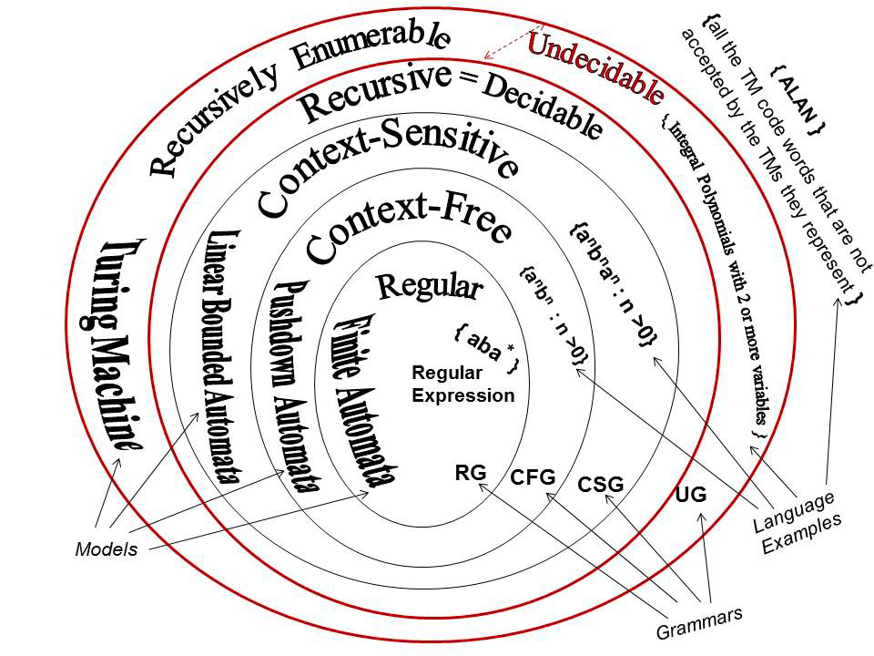
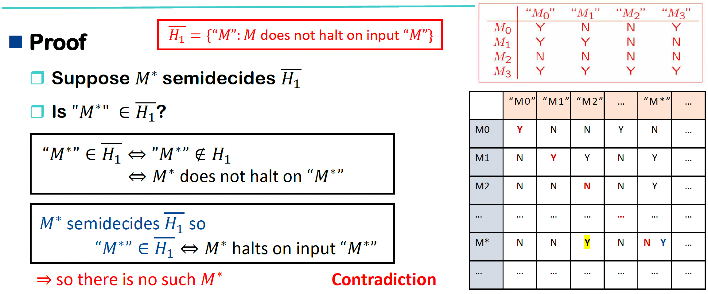
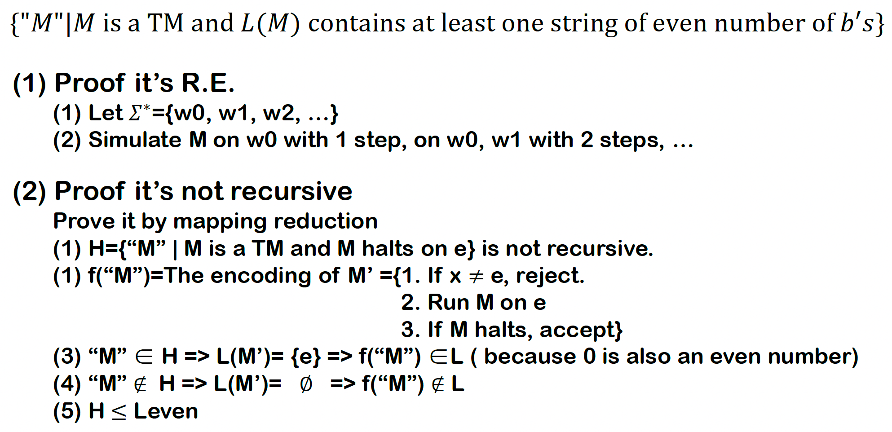

# Undecidability

## 5.1 Church-Turing Thesis

> **Church-Turing Thesis**
>
> 任何可以被图灵机表示并对所有输入停机的过程都可以被称为算法。
>
> （目前还没被证明，也没有找到反例）

图灵机的数量是可数的，而所有自然问题/语言($\Sigma^*$的子集)是不可数，因此存在大量问题是不可计算的，比如停机问题(halting probelm)。



## 5.2 Universal Turing Machines

### Representation of Turing Machines

对于 $\Sigma\cup \{\leftarrow,\rightarrow\}$ ，用二进制编码表示，记需要 $j$ 位二进制编码，其中 $\sqcup,\rhd,\leftarrow,\rightarrow$ 用固定的4个最小编码表示


对于状态，用 $i$ 位二进制编码表示，其中 $q0^i$ 表示开始状态。

对于图灵机 $M$ 自身：

- 每一步转移关系都是一个四元组 $(q,a,p,b)$ : 当前状态q，当前符号a，转移到状态p，写入符号b
- 把所有4元组都编码成字符串，按照字典序排序，排序后的列表要以 $\delta(a,\sqcup)$ 开头
- 如果图灵机的 $H=\{y,n\}$ ，则约定 $y$ 的字典序是最小的。


### Universal Turing Machine

**通用图灵机(Universal Turing Machine)**能够模拟所有图灵机，对于一个通用图灵机 $U$ ，在输入 $M$ 和 $w$ 时，应该与 $M$ 输入 $w$ 的输出相同，也需要满足相同的停机条件。

$$
U(^"M^",^"w^")=^"M(w)^"
$$

#### Design of U

构造一个3-tape图灵机 $U'$ ， $U$ 是可以模拟 $U'$ 的标准图灵机。

- 对于输入 $M,w$ ，把 $M$ 放到第二个磁带， $w$ 放到第一个磁带的左端， 输出结果写在第三个磁带。
- $M$ 的一步计算的模拟过程为在第二个磁带中找到对应的四元组，根据四元组的指令更改第一个和第三个磁带。
- 重复上一步骤，知道第三个磁带中出现 $h$

## 5.3 The Halting Problem

假设有一个程序：`halt(P,X)`

- 如果程序 `P` 可以在输入 `X` 时停止，则返回 yes
- 如果程序 `P` 在输入 `X` 上一直运行，则返回 no

此时定义一个函数 

```
diagnoal(X):
a:	if halt(X,X) then goto a else halt
```

则`diagnoal(diagnoal)` 当且仅当 `halt(diagonal,diagoal)=no` 时停止，这是矛盾的。

不存在任何程序、任何算法可以**正确判断任意程序是否停机**。

记 $H$ 是停机问题的格式化版本，则 $H$ 是一个递归可枚举语言，因为通用图灵机可以 semidicides $H(L(U)=H)$

> **Theorem**
>
> 记 $H=\{^"M ^",^"w^":\text{TM } M\text{ halts on input string }w\}$ ，则语言 $H$ 不是递归的，因此递归语言集合是递归可枚举语言的真子集。

**Proof**

构造 $H_1=\{^"M ^":\text{TM } M\text{ halts on input string "M"}\}$ ，则如果存在TM $M_0$ 可以决定 $H$ ，就必然可以构造一个 TM $M_1$ 来决定 $H_1$ : 

- 把输入磁带从 $\rhd\sqcup\text{"M"}\underline{\sqcup}$  转换成 $\rhd\sqcup\text{"M""M"}\underline{\sqcup}$ 
- 然后用 $M_0$ 去模拟这个输入

因此如果 $H$ 是递归的，那么 $H_1$ 也是递归的。

又由于递归语言在补操作上是封闭的，可以得到 $\overline{H_1}$ 也是递归的。

而 $\overline{H_1}=\{\text{"M"}:M\text{ does not halt on input "M"}\}$ 不是一个RE，则必然不是一个递归语言，与假设矛盾，因此 $H$ 不是递归语言。



> **Theorem**
>
> R.E.语言在补运算下不封闭。

> **Theorem**
>
> 任何R.E.语言是递归的当且仅当 $H$ 是递归的。

假设一个 TM $M_0$ 可以决定 $H$ ，则对于任何 TM $M$ 半决定一个语言 $L(M)$ ，都可以按照一下步骤设计一个 TM $M'$ 来决定 $L(M)$ ：

- 把输入磁带从 $\rhd\sqcup w\underline{\sqcup}$ 转换成 $\rhd\sqcup \text{"M""w"}\underline{\sqcup}$
- 然后用 $M_0$ 来模拟这个输入

**Remark**

- 所有 R.E. 语言都可以归约到 $H$
- $H$ 是 RE-complete，即 $H$ 是 R.E. 语言中最难的语言之一


## 5.4 Undecidable Problems about TM

- 任何算法都可以转化为对所有输入都会停机的图灵机。
- 不存在算法的问题称为不可判定(**undecidable**)问题或不可解(unsolvable)问题。
- $H$ 不是递归的，最著名的不可判定问题被称为图灵机的停机问题。

> **Definition**
>
> 记 $L_1,L_2\subseteq \Sigma^*$ 是两个语言。从 $L_1$ 到 $L_2$ 的**规约(reduction)** 是一个递归函数 $\tau:\Sigma^*\rightarrow \Sigma^*$ 满足 $x\in L_1 \text{ iff } \tau(x)\in L_2$ 。


> **Theorem**
>
> 如果 $L_1$ 不是递归的，且存在一个 $L_1$ 到 $L_2$ 的规约，那么 $L_2$ 也不是递归的。

**Proof**

假设 $L_2$ 是递归的，可以被 TM $M_2$ 计算，那么记 $T$ 是计算递归函数 $\tau$ 的TM，那么 $TM_2$ 可以决定 $L_1$ ，但是 $L_1$ 不是递归的，矛盾。

**Remark**

如果存在 $L_1$ 到 $L_2$ 的规约，则：

- 如果 $L_2$ 是可判定的，那么 $L_1$ 也是可判定的
- 如果 $L_1$ 是不可判定的，那么 $L_2$ 也是不可判定的

> **Theorem**
>
> 如果存在一个 $L_1$ 到 $L_2$ 的规约：
>
> - $L_2$ 是递归的 $\rightarrow$ $L_1$ 是递归的。
> - $L_1$ 不是递归的 $\rightarrow$ $L_2$ 不是递归的。
>
> 
>
> - $L_2$ 是 R.E. $\rightarrow$ $L_1$ 是 R.E.
> - $L_1$ 不是 R.E. $\rightarrow$ $L_2$ 不是 R.E.
>
> 

**规约证明的关键元素：**

- 清晰声明归约的“源”语言和“目标”语言，以及试图通过归约证明的内容。
- 描述如何基于假定的“目标”语言的机器和一个递归函数 $\tau$ 来构建“源”语言的机器。
- 描述 $\tau$ 函数的输入和输出。如果 𝜏 函数执行任何非平凡操作，最好论证它是递归的。
- 在这些证明中，机器图并非必要或充分条件。仅在需要时将其用作思维工具。
- 推演一遍逻辑，展示归约是如何判定“源”语言的。必须同时考虑接受和拒绝两种情况。

> **Theorem**
>
> 以下关于 TM 的问题是不可判定的：
>
> a) 给定一个 TM $M$ 和一个输入 $w$ ，$M$ 是否在 $w$ 上停止？
> b) 给定一个 TM $M$ ，$M$ 是否在空磁带上停止？
> c) 给定一个 TM $M$ ，是否存在任何字符串使得 $M$ 停止？
> d) 给定一个 TM $M$ ，$M$ 是否在所有输入字符串都停止?
> e) 给定两个 TM $M_1,M_2$ ，它们是否在相同的输入字符串停止？
> f ) 给定一个 TM $M$ ， $M$ 半判定的语言正则吗？上下文无关吗？递归吗？
> g) 存在一个特定的机器 $M$ ，使得以下问题不可判定：给定 $w$ ， $M$ 在 $w$ 上停止吗？

#### a) 给定一个 TM $M$ 和一个输入 $w$ ，$M$ 是否在 $w$ 上停止？

就是停机问题本身，不可判定。

#### b) 给定一个 TM $M$ ，$M$ 是否在空磁带上停止？

可以记为语言 $L=\{\text{"M"}:M\text{ halts on }e\}$ ，则只需说明 $H$ 可以规约到 $L$ 。

构造一个 TM $M_w$ ， $M_w$ 把 $w$ 写在空磁带上然后运行 $M$ 。

构造递归函数 $\tau:\text{"M""w"}\rightarrow M_w$

则 $H$ 可以规约到 $L$

#### c) 给定一个 TM $M$ ，是否存在任何字符串使得 $M$ 停止？

目标：证明 $L=\{\text{"M"}:M\text{ halts on }e\}$ 可以规约到  $L'=\{\text{"M"}:M\text{ halts on some input}\}$

给定 "$M$" ，构造 "$M'$": 擦除所有输入然后在 $e$ 上模拟 $M$
$$
\begin{aligned}
M' \text{ halt on some strings} &\Leftrightarrow M'\text{ halts on all strings}\\
&\Leftrightarrow M \text{ halts on empty string}
\end{aligned}
$$

#### d) 给定一个 TM $M$ ，$M$ 是否在所有输入字符串都停止?

证明同 c)

#### e) 给定两个 TM $M_1,M_2$ ，它们是否在相同的输入字符串停止？

- $H=\{\text{"M"}|M \text{ halts on every input}\}$
- $L=\{^"M_1M_2^"|M_1\text{ and } M_2\text{ halt on the same input}\}$
- $f(^"M^")=$ the encoding of $M'y$ and = {1. "$y$" is the the description of the machine that immediately accepts any input; 2. run $M$ on $x$ ; 3. if $M$ halts, accept }
- $^"M^" \in H\Rightarrow L(M'y)=\Sigma^*\Rightarrow f(^"M^") \in L$  
- $^"M^" \notin H\Rightarrow L(M'y)=\phi\Rightarrow f(^"M^") \notin L$
- $H\leq L$  





## 5.5 Properties of Re. Languages

> **Theorem**
>
> $L$ 是递归的当且仅当 $L$ 和 $\overline{L}$ 都是 R.E.。

**Proof**

如果 $L$ 是递归的：

-  $L$ 是 R.E.
-  $\overline{L}$ 也是递归的因此 $\overline{L}$ 是 R.E.

如果 $L$ 和 $\overline{L}$ 都是 R.E.：

- 对于一个输入字符串 $w$ ，同时运行 $L$ 和 $\overline{L}$ 的判定机器。
- 由于 $w\in L$ 或 $w\in \overline{L}$ ，则必然有一个可以停下来。

> **Definition**
>
> 定义图灵机 $M$ **enumerates** 语言 $L$ 当且仅当存在 $M$ 的某些固定状态 $q$ :
> $$
> L=\{w:(s,\rhd\underline{\sqcup})\vdash_M(q,\rhd\underline{\sqcup}w)\}
> $$
> 一个语言是 **Turing-enumerable** 当且仅当存在一个图灵机可以enumerable 这个语言。

> **Theorem**
>
> 一个语言是**递归可枚举**的当且仅当这个语言是 **Turing-enumerable** 的。

**Proof**

$\Rightarrow$ 如果语言是递归可枚举的，则存在一个TM $M$ 可以半决定 $L$ ，此时需要构建一个TM $M'$ enumerates $L$ 。

首先枚举所有 $L$ 的字母表可以生成的字符串，然后用 $M'$ 使用dovetail（交错枚举）对所有字符串在 $M$ 上模拟：

- $w_0$ 执行一步
- $w_0, w_1$ 各执行一步
- $w_0, w_1, w_2$ 各执行一步
- ……


这样 $M'$ 就可以枚举出 $L$ 。

$\Leftarrow$ 如果 $M$ enumerates $L$ ，需要说明 $L$ 是 R.E.

构造一个 $M'$ ，输入$w$ 时，在空磁带上模拟 $M$ ，每次枚举到一个停止的字符串，就和 $w$ 进行对比，如果相等则停止，否则继续。


那么被 $M'$ 可以半决定 $L$ 。

> **Definition**
>
> $M$ 时一个可以枚举语言 $L$ 的图灵机。如果满足以下条件，则称 $M$ **字典序枚举(lexicographically enumerates)** $L$ :
>
> - 每当 $(q,\rhd \underline{\sqcup}w)\vdash^+_M(q,\rhd \underline{\sqcup}w')$ 时，需满足 $w'$ 的字典序在 $w$ 后面。
>
> 一个语言是**字典序图灵可枚举的(lexicographically Turing enumerable)** 当且仅当存在一个图灵机可以字典序枚举这个语言。

> **Theorem**
>
> 一个语言是**递归的**当且仅当这个语言是**字典序图灵可枚举的**。
