# Chapter4 The Processor

## **Computer Organization**

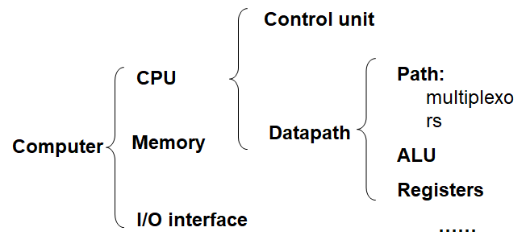 

## **Datapath**

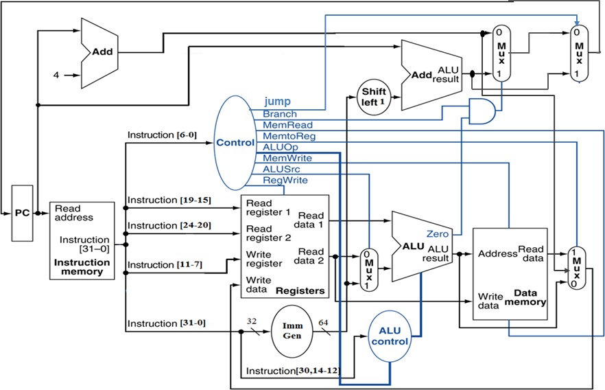

### **R指令通路**

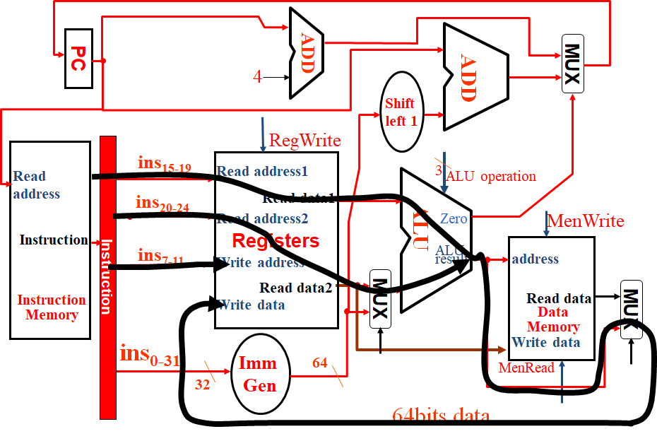 

​	其他指令同理。

## **Pipeline | 流水线**

### **Five stages, one step per stage**

$\bullet$ IF: Instruction fetch from memory（读取指令）

$\bullet$ ID: Instruction decode & register read（指令解码，寄存器读取）

$\bullet$ EX: Execute operation or calculate address（计算）

$\bullet$ MEM: Access data memory operand（内存读写）

$\bullet$ WB: Write result back to register（写）

### **Single-Cycle Pipeline Diagram | 单周期流水线**

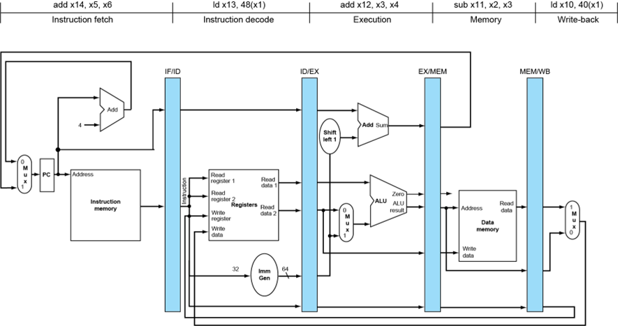

### **Pipelined Control | 流水线控制器**

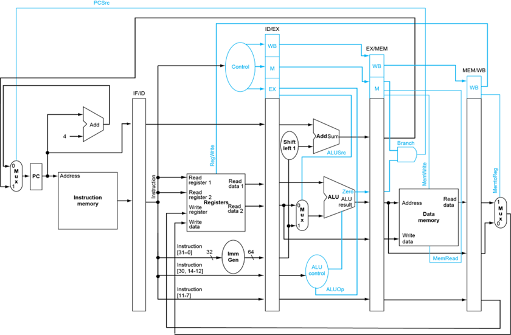

### **Structure Hazards | 结构冲突**

**（1）Multi access to a Single Memory**

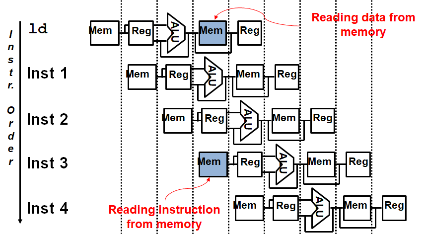

解决方案：将Memory分成Instruction Memory和Data Memory两部分，分别处理读和写。

**（2）Multi access to the register file**

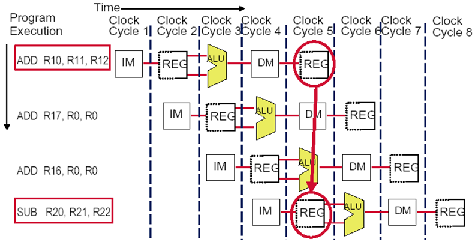

解决方案：
double bump(双重触发) ：将Register的读写操作分离，即上半个周期写，下半个周期读。

**（3）Not fully pipelined function unit** 

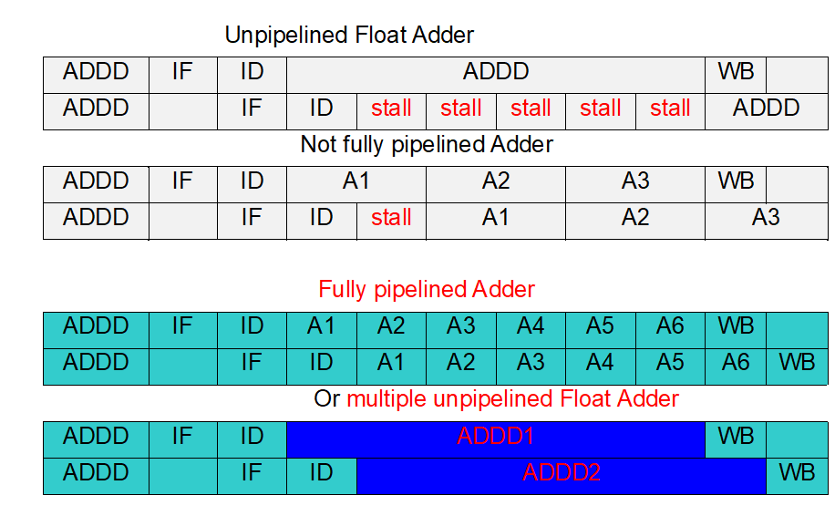

解决方案：使功能单元完全流水化

### **Data Hazards | 数据冲突**

数据还没完成写操作就要进行下一次读取。

#### **Forwarding(or Bypassing) | 旁路**

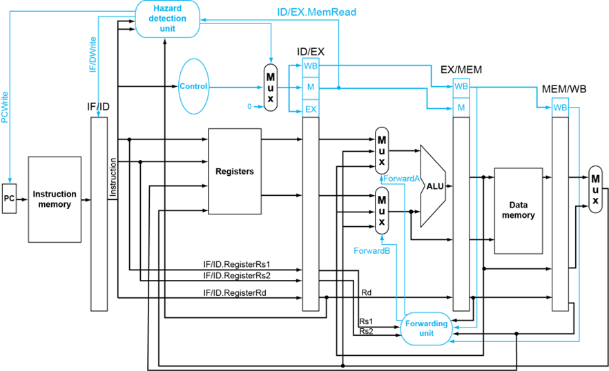

##### **Case1**

add-sub

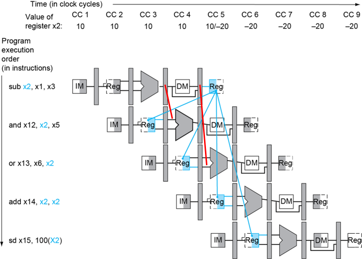 

##### **Case2**

ld-sub

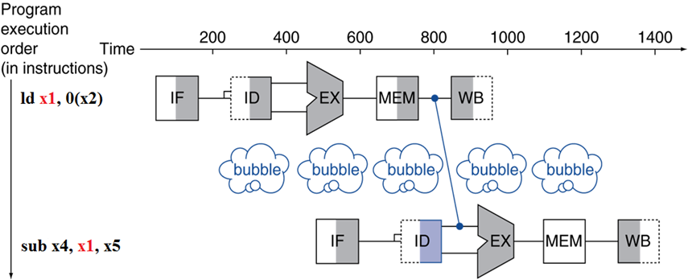 

可以在编译过程中调整语序来减少stall的引入。

##### **Case3**

ld-sw

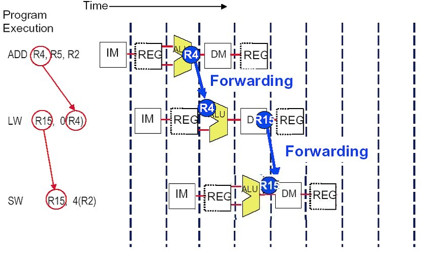 

##### **Case4**

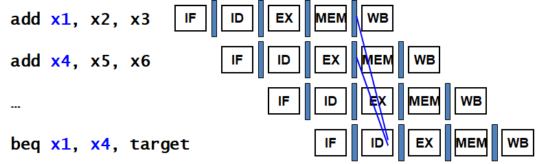 

##### **Case5**

需要一个stall

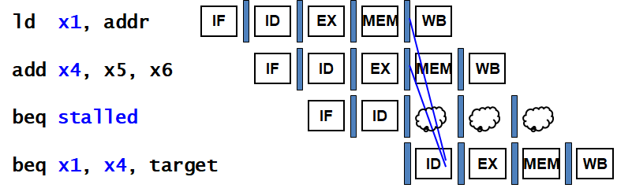 

##### **Case6**

需要两个stall

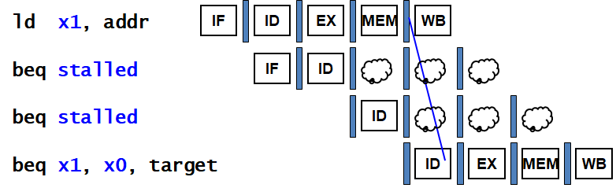 

#### **Summary**

$\bullet$ **发生原因**：指令需要的数据还没被计算或存储

$\bullet$ **Solutions**:
  
  1. Double bump

​	2. Forwarding

​	3. Compiler scheduling

​	4. Stall

### **Control Hazards | 控制冲突**

跳转指令可能会导致还在 Pipeline 的指令失效

#### **Stall**

在执行跳转指令时直接插入Stall，直到指令运行结束。

#### **Prediction**

预测跳转结果，先提前执行预测到的位置的指令。

##### **(1)Predict-untaken**

对于branch指令，每次都预测跳转不被执行，直接提前顺序执行后续执行。

taken时会造成3次指令浪费：

$\Rightarrow Pref=1+br\%\times taken\% \times 3$

##### **(2)Predict-taken**

对于branch指令，每次都预测跳转被执行，等待ALU计算出跳转位置后提前执行跳转位置的指令。

在实现中可以在ID中添加一个ALU用于计算branch的跳转地址，再通过forwarding进行传输。这样在taken时仅需插入一个Stall即可，在untaken时仍会造成3次指令浪费。

$\Rightarrow Pref=1+br\%\times taken\%+br\% \times untaken\% \times 3$ 

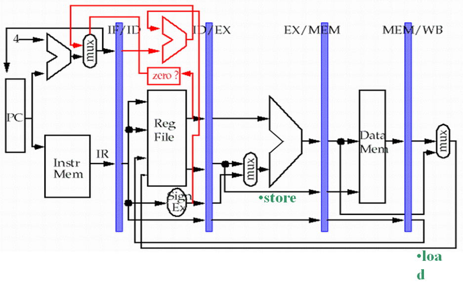

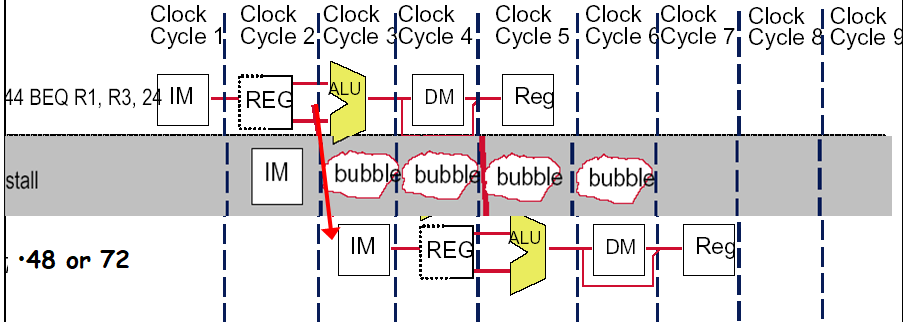

##### **More-Realistic Branch Prediction**

###### **(1) Static branch prediction**

根据设定的规则进行推测

###### **(2) Dynamic branch prediction**

$\bullet$ Branch prediction buffer (aka branch history table)
  记录前几次是否命中

$\bullet$ Indexed by recent branch instruction addresses

$\bullet$ Stores outcome (taken/not taken)

$\bullet$ To execute a branch

  1. Check table, expect the same outcome
  
  2. Start fetching from fall-through or target
  
  3. If wrong, flush pipeline and flip prediction

 $\bullet$ **1-bit predictor**

使用一位进行预测，根据上一次预测的结果对下一次进行预测。

 **Shortcomings: 对于内嵌循环会连续错误两次**

  1. Mispredict as taken on last iteration of inner loop
  2. Then mispredict as not taken on first iteration of inner loop next time around

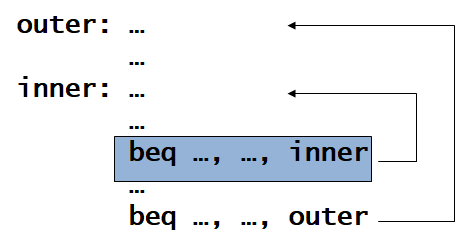 

**2-Bit Predictor**

连续预测错两次才修改预测结果

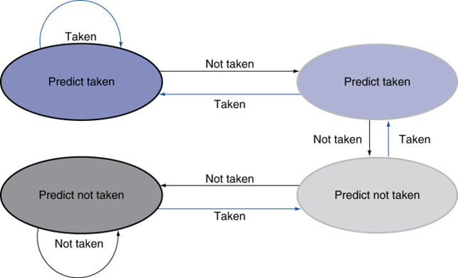 

#### **Calculating the Branch Target**

即使 branch 命中了，我们也有一个时钟的 bubble 来计算地址。
但 branch 要跳转的地址其实是可以存下来的。

Branch target buffer

- Cache of target addresses
- Indexed by PC when instruction fetched
  If hit and instruction is branch predicted taken, can fetch target immediatel

### **Exceptions**

- **Exception | 异常**: e.g., undefined opcode, overflow, syscall, …
- **Interrupt | 中断**: From an external I/O controller
