# **Chapter5 Large and Fast: Exploiting Memory Hierarchy**

## **Memory Technologies**

### **SRAM**

**Cache**

- 速度快，但占空间大

### **DRAM**

**Memory**

- 占空间小，但速度慢

- 需要刷新

### **Flash Storage**

Nonvolatile semiconductor storage

- 比disk快100-1000倍
- 更小，更省电
- 但是价格更贵

### **Disk**

Nonvolatile, rotating magnetic storage

- 保存时间更长
- 更容易修复

| **Memory technology** | **Typical access time**    | **Cost per** **GByte** **(2012)**  ($) |
| --------------------- | -------------------------- | -------------------------------------- |
| **SRAM**              | **0.5-2.5ns**              | 2000-5,000*                            |
| **DRAM**              | **50-70ns**                | 20-75                                  |
| **Magnetic disk**     | **5,000,000-20,000,000ns** | 0.2-2                                  |

## **The basics of Cache**

### Hit | Miss

#### Read hits

找到需要读取的数据

#### Read miss

- 指令cache miss
- 数据cache miss

#### Write hits

- **write-back**: Cause Inconsistent 
  - 数据只写在cache里
  - Strategy---在发生冲突时再把数据写回memory(**更快**)
- **write-through**: Ensuring Consistent
  - 每次都把数据同时写在cache和memory
  - strategy---同时更新cache和memory
  - 更慢---write buffer

#### Write miss

- **Write allocate**:
  - 发生write miss时，先把block读取到cache里再进行后续操作
- **Write around** 
  - 发生write miss时，直接在内存里进行写，不需把block读入cache

通常情况下，有一下策略搭配

- **write-back --- write allocate**
- **write-through --- write around**

### **Block Placement**

#### **Direct Mapped Cache**

block只能放在指定的位置

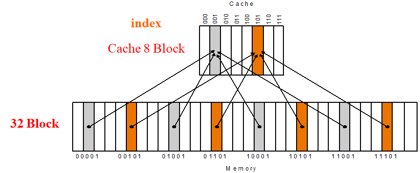 

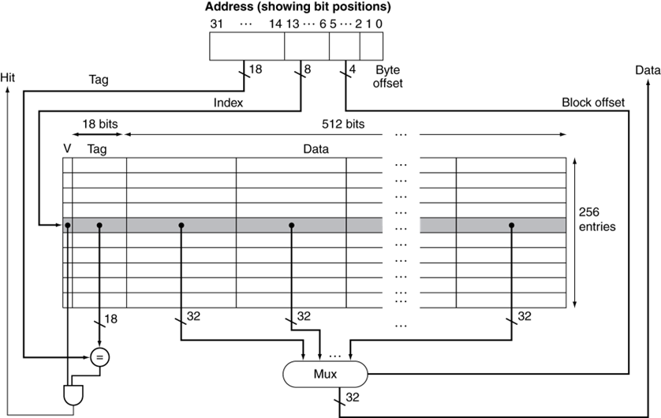 

#### **Fully associative** 

block可以放在任意位置

#### **Set associative** 

把block地址分成几个sets，block只能放到相应的set里面

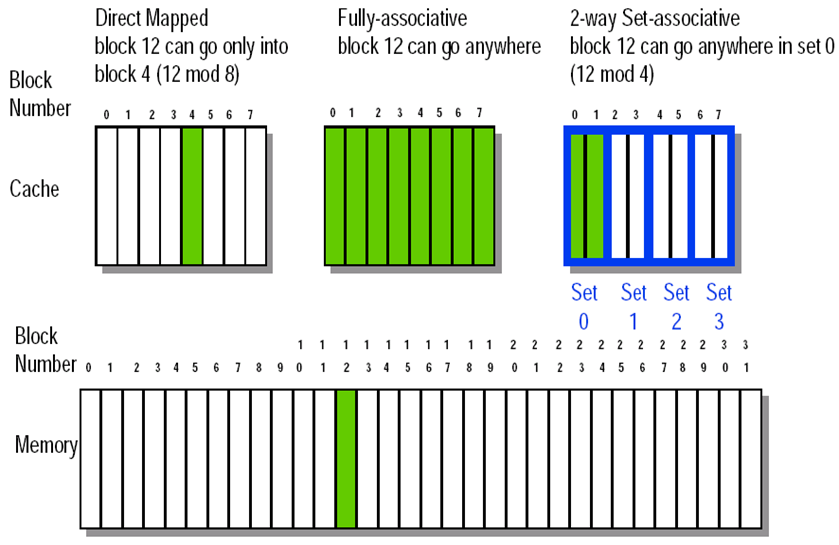 

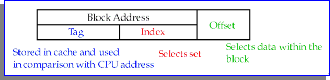 

### **Strategy of block Replacement**

#### **Random replacement**

随机挑选其中一个block

-  在硬件中更容易实现
- 在cache里分布均匀
- 但是有可能会替换掉马上要被使用的block

#### **Least-recently used (LRU)** 

每次都替换掉最近最少用的一个block

实现：对每个block进行计数，每隔一段时间+1，当block被访问时清零。每次都替换计数最大的block。

- 建立在最近使用的block更有可能被访问的假设下
- 但是需要额外的bits来进行计数

#### **First in,first out(FIFO)**

每次都替换掉最早读取进来的一个block

## **Virtual  Memory**

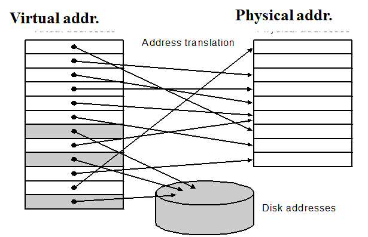  

### Page Table | 页表

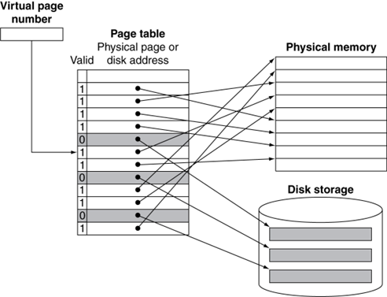 

!!!Note
	页表存储在Memory里

### 地址翻译（虚拟地址 $\rightarrow$ 物理地址）

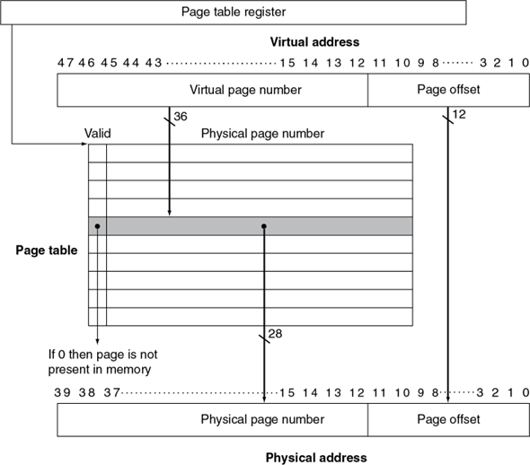 

### Page Fault

虚拟地址对应的页在内存中不存在，需要从外存读入数据。

- Takes millions of clock cycles
- Handled by OS code

可以通过以下方法减小page fault rate:

- Fully associative placement
- Smart replacement algorithms

### Page Table大小计算

例：

**Assume:** 

- Virtual address is **32 bits**
- page size is **4KB**
- Entry size is **4 Bytes**

$Number~of~page~table~entries=\frac{2^{32}}{2^{12}}=2^{20}$

$Size~of~pag~table=2^{20}entries\times 4Bytes/entry=4MB$ 

!!!Note
	Entry的数量等于index的数量。例如对于2-set-associative，entries的数量为页表列数/2。
	
!!!Note
	页表中每行的数据按字对齐，即对齐到4Bytes。注意包括valid bit和dirty bit。(dirty bit用于表示该数据是否已写回外存，在write-back策略中使用)

### TLB

可以理解为用于页表的cache。

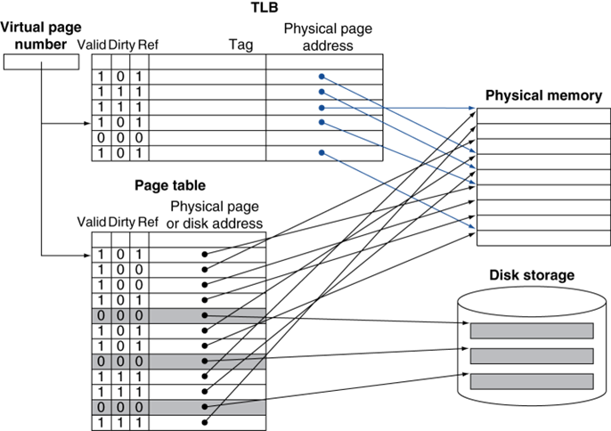 

当 TLB miss 的时候，处理器去 page table 查找对应的项；如果发现对应项是 valid 的，那么就把他拿到 TLB 里（此时被替换掉的 TLB entry 的 dirty bit 如果是 1，也要写回 page table）；否则就会触发一个 page fault。

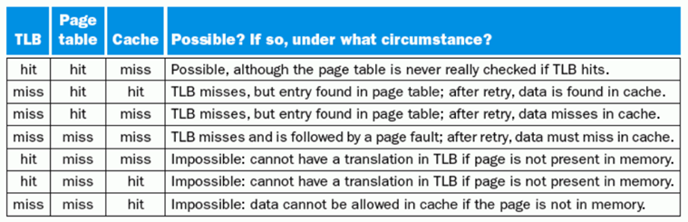 

## Using FSM to Control a simple Cache 

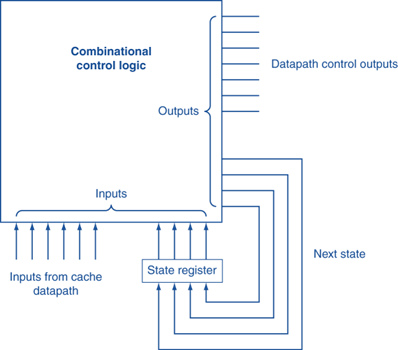 

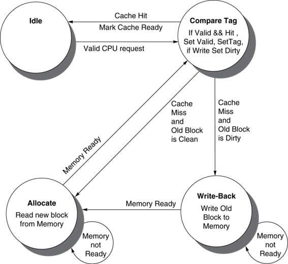 

