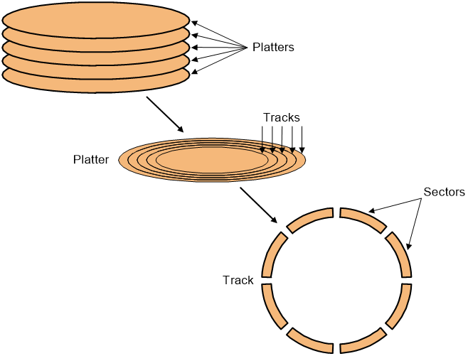
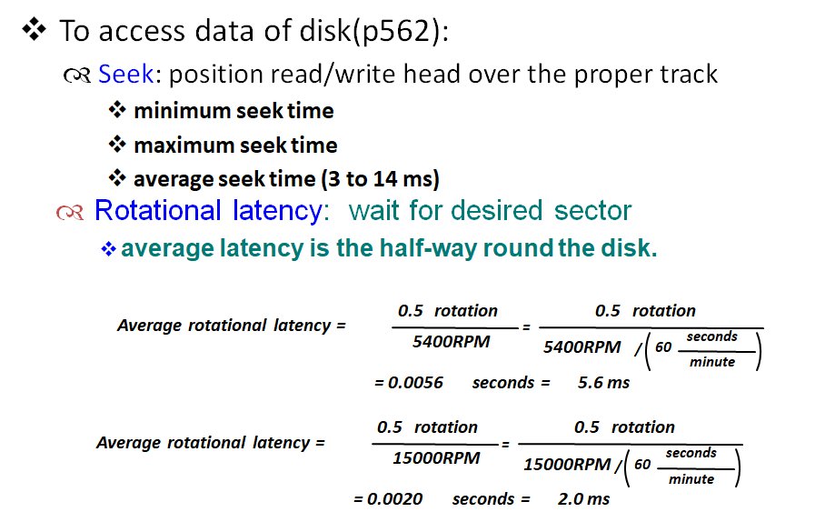
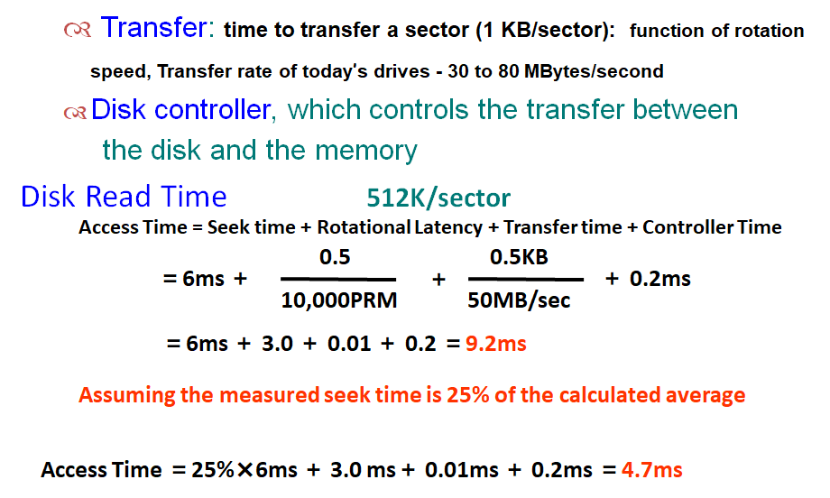
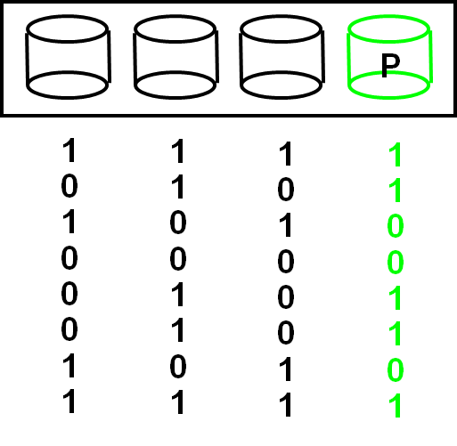
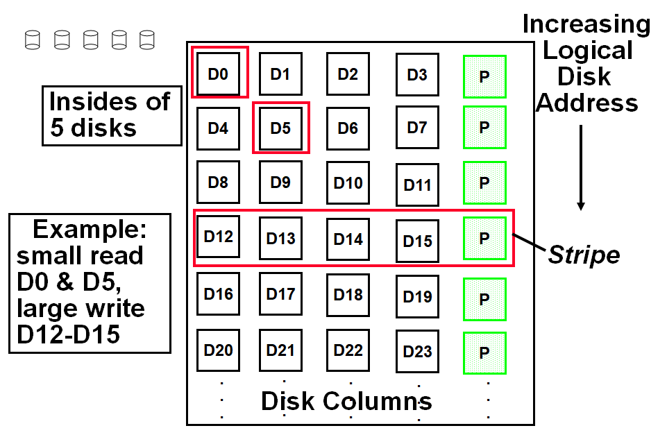
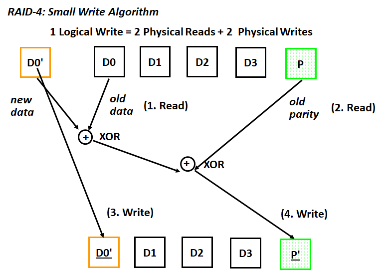
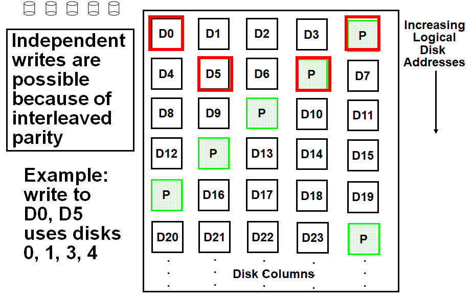
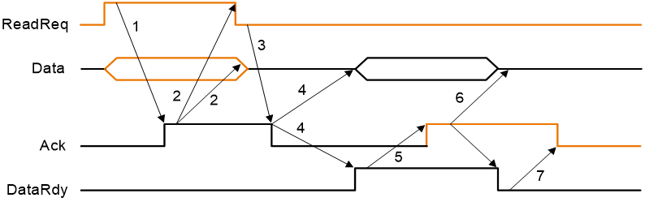
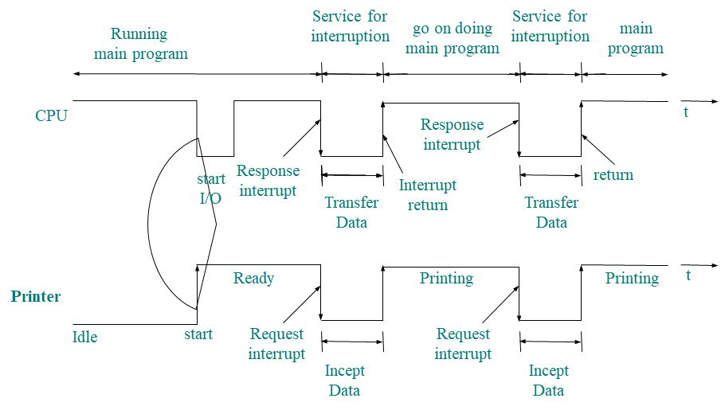
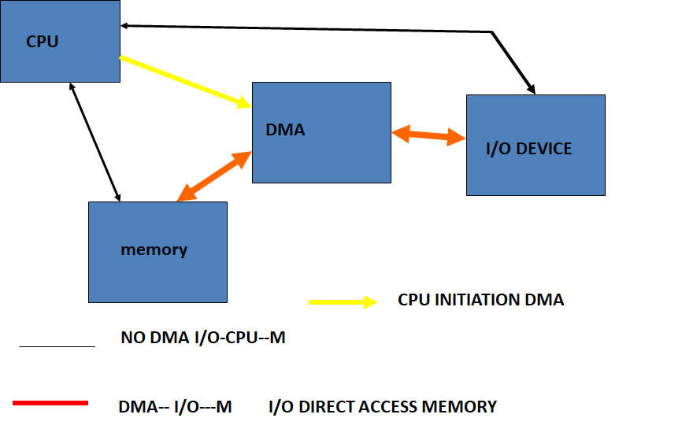

# Chapter6 Storage and other I/O Topics

## Disk Storage and Dependability

 

### Access Time

 

 

### Dependability, Reliability, Availability

  *Computer system dependability is the quality of delivered service such that reliance can justifiably be placed on this service. The service delivered by a system is its observed actual behavior as perceived by other system (s) interacting with this system’s users. Each module also has an ideal specified behavior, where a service specification is an agreed description of the expected behavior. A system failure occurs when the actual behavior deviates from the specified behavior.* 

#### Measure

- *MTTF  mean time to failure*

- *MTTR  mean time to repair*

- *MTBF (*Mean Time Between Failures)= *MTTF+ MTTR*

- *Availability* =$\frac{MTTF}{MTTF+MTTR}$

#### Three way to improve MTTF

- **Fault avoidance:** 在设计时避免错误发生
- **Fault tolerance:** 允许服务在发生故障时仍符合服务规范，主要适用于硬件故障
- **Fault forecasting:** 预测故障的存在和产生，适用于硬件和软件故障

#### Array Reliability

Reliability of N disks = Reliability of 1 Disk ÷ N

### RAID | 磁盘阵列

#### RAID 0

没有冗余来容忍磁盘故障，把连续的数据分散到多个磁盘上存取。

提高性能，没有保护功能、

#### RAID 1 | 镜像磁盘

在成对的独立磁盘上产生互为备份的数据。

成本最高，安全性高

#### RAID 3 | 交错校验

校验位P为前三位的和mod2。

 

#### RAID 4 | High I/O Rate Parity

 

 

#### RAID 5 | High I/O Rate Interleaved Parity

相比RAID 4，将校验盘分散到不同列，有效防止了磁盘过载。（由于每次写时校验盘都需要写）	

 

#### RAID 6 | P+Q Redundancy

当单次故障纠正不够时，奇偶校验可以推广为对数据进行第二次计算和另一个信息校验磁盘。

## Bus | 总线

### 总线包含两种线

- **Control lines**：用于传输控制信号
- **Data lines**：用于传输数据

### 总线类型

- **processor-memory** (short high speed, custom design)
- **backplane** (high speed, often standardized, e.g., PCI)
- **I/O** (lengthy, different devices, standardized, e.g., SCSI)

### 同步/异步

#### Synchronous | 同步

使用时钟和同步协议

- 速度快，占空间小
- 需要保证所有设备都在同一个速率下运行

#### Asynchronous | 异步

不使用时钟，使用握手协议（**handshaking**）

 

1. 当内存看到ReadReq线时，它从数据总线读取地址，开始内存读取操作，然后引发Ack来告诉设备ReadReq信号已经被看到。

2. I/O设备看到Ack线为高电平，释放ReadReq数据线。
3. 内存看到ReadReq为低电平的，释放Ack线。
4. 当内存准备好数据时，它将数据放在数据线上并触发DataRdy。
5.  I/O设备看到DataRdy为高电平时，从总线读取数据，并通过触发Ack。
6. 内存看到Ack信号，释放DataRdy，并释放数据线。
7. 最后，I/O设备看到DataRdy变低电平，释放Ack线，这表明传输已经完成。

### Bus Standards | 总线标准

- **SCSI** (small computer system interface)
- **PCI** (peripheral component interconnect)
- **IPI** (intelligent peripheral interface)
- **IBMPC-AT  IBMPC-XT**
- **ISA EISA**

### Communication with the Processor

#### **Polling**：处理器定期检查状态位，看是否到了下一个I/O操作的时间。

缺点：浪费处理器时钟

#### **Interrupt**: 当一个I/O设备想要通知处理器它已经完成了某些操作或需要操作时，中断处理器来处理I/O。

操作系统可以在处理I/O时进行其他操作	

 

#### **DMA** *(direct memory access)*: 设备控制器直接将数据传输到存储器或从存储器传输数据，而不涉及处理器。
不过多消耗处理器时钟

 
