# 计算机组成

## **Chapter1  Computer Abstractions and Technology**

### **CPU Time**

Cycle Per Instruction **(CPI)**：执行一条指令所需的周期数（平均时可为小数）  
CPU Clock Cycles：时钟周期数  
Clock Cycle Time：每个时钟的时间  
Clock Rate：时钟速率  
Instruction Count **(IC)**：指令数

$$
\begin{align*}
CPU~Time&=CPU~Clock~Cycles\times Clock~Cycle~Time\\\\
&=\frac{CPU~Clock~Cycles}{Clock~Rate}\\\\
&=Instruction~Count\times CPI \times Clock~Cycle~Time\\\\
&=\frac{Instruction~Count\times CPI}{Clock Rate}&&&&&
\end{align*}
$$

$$
\begin{align*}
Average~CPI&=\frac{Clock~Cycles}{Instruction~Count}\\\\
&=\frac{\sum^n_{i=1}(CPI_i\times Instruction~Count_i)}{Instruction~Count}&&&&&&&&&
\end{align*}
$$

### **MIPS: Millions of Instructions Per Second**

$$
\begin{align*}
MIPS&=\frac{Instruction~Count}{Execution~Time\times 10^6}\\\\
&=\frac{Instruction~Count}{\frac{instruction~Count\times CPI}{Clock~Rate}\times 10^6}\\\\
&=\frac{Clock~Rate}{CPI\times 10^6}&&&&&&&&&&&&&&&
\end{align*}
$$

## **Chapter2  Instructions: Language of the Computer**

### **RISC-V assembly language** 

#### **Arithmetic**

<table style="table-layout: fixed; width: 100%;">
  <thead>
    <tr>
      <th style="width: 20%;"><strong>Instruction</strong></th>
      <th style="width: 20%;"><strong>Example</strong></th>
      <th style="width: 25%;"><strong>Meaning</strong></th>
      <th style="width: 35%;"><strong>Comments</strong></th>
    </tr>
  </thead>
  <tbody>
    <tr>
      <td>add</td>
      <td>add x5,x6,x7</td>
      <td>x5 = x6 + x7</td>
      <td>Add two source register operands</td>
    </tr>
    <tr>
      <td>subtract</td>
      <td>sub x5,x6,x7</td>
      <td>x5 = x6 - x7</td>
      <td>First source register subtracts second one</td>
    </tr>
    <tr>
      <td>add immediate</td>
      <td>addi x5,x6,20</td>
      <td>x5 = x6 + 20</td>
      <td>Used to add constants</td>
    </tr>
  </tbody>
</table>

#### **Data transfer**
<table style="table-layout: fixed; width: 100%;">
  <thead>
    <tr>
      <th style="width: 20%;"><strong>Instruction</strong></th>
      <th style="width: 20%;"><strong>Example</strong></th>
      <th style="width: 25%;"><strong>Meaning</strong></th>
      <th style="width: 35%;"><strong>Comments</strong></th>
    </tr>
  </thead>
  <tbody>
    <tr>
      <td>load doubleword</td>
      <td>ld x5, 40(x6)</td>
      <td>x5 = Memory[x6 + 40]</td>
      <td>doubleword from memory to register</td>
    </tr>
    <tr>
      <td>store doubleword</td>
      <td>sd x5, 40(x6)</td>
      <td>Memory[x6 + 40] = x5</td>
      <td>doubleword from register to memory</td>
    </tr>
    <tr>
      <td>load word</td>
      <td>lw x5, 40(x6)</td>
      <td>x5 = Memory[x6 + 40]</td>
      <td>word from memory to register</td>
    </tr>
    <tr>
      <td>load word, unsigned</td>
      <td>lwu x5, 40(x6)</td>
      <td>x5 = Memory[x6 + 40]</td>
      <td>Unsigned word from memory to register</td>
    </tr>
    <tr>
      <td>store word</td>
      <td>sw x5, 40(x6)</td>
      <td>Memory[x6 + 40] = x5</td>
      <td>word from register to memory</td>
    </tr>
    <tr>
      <td>load halfword</td>
      <td>lh x5, 40(x6)</td>
      <td>x5 = Memory[x6 + 40]</td>
      <td>Halfword from memory to register</td>
    </tr>
    <tr>
      <td>load halfword, unsigned</td>
      <td>lhu x5, 40(x6)</td>
      <td>x5 = Memory[x6 + 40]</td>
      <td>Unsigned halfword from memory to register</td>
    </tr>
    <tr>
      <td>store halfword</td>
      <td>sh x5, 40(x6)</td>
      <td>Memory[x6 + 40] = x5</td>
      <td>halfword from register to memory</td>
    </tr>
    <tr>
      <td>load byte</td>
      <td>lb x5, 40(x6)</td>
      <td>x5 = Memory[x6 + 40]</td>
      <td>byte from memory to register</td>
    </tr>
    <tr>
      <td>load byte, unsigned</td>
      <td>lbu x5, 40(x6)</td>
      <td>x5 = Memory[x6 + 40]</td>
      <td>Unsigned byte from memory to register</td>
    </tr>
    <tr>
      <td>store byte</td>
      <td>sb x5, 40(x6)</td>
      <td>Memory[x6 + 40] = x5</td>
      <td>byte from register to memory</td>
    </tr>
    <tr>
      <td>load reserved</td>
      <td>lr.d x5, (x6)</td>
      <td>x5 = Memory[x6]</td>
      <td>Load; 1st half of atomic swap</td>
    </tr>
    <tr>
      <td>store conditional</td>
      <td>sc.d x7, x5, (x6)</td>
      <td>Memory[x6] = x5; x7 = 0/1</td>
      <td>Store; 2nd half of atomic swap</td>
    </tr>
    <tr>
      <td>Load upper immediate</td>
      <td>lui x5, 0x12345</td>
      <td>x5 = 0x12345000</td>
      <td>Loads 20-bits constant shifted left 12 bits</td>
    </tr>
  </tbody>
</table>

#### **Logical**
<table style="table-layout: fixed; width: 100%;">
  <thead>
    <tr>
      <th style="width: 20%;"><strong>Instruction</strong></th>
      <th style="width: 20%;"><strong>Example</strong></th>
      <th style="width: 25%;"><strong>Meaning</strong></th>
      <th style="width: 35%;"><strong>Comments</strong></th>
    </tr>
  </thead>
  <tbody>
    <tr>
      <td>and</td>
      <td>and x5, x6, 3</td>
      <td>x5 = x6 & 3</td>
      <td>Arithmetic shift right by register</td>
    </tr>
    <tr>
      <td>inclusive or</td>
      <td>or x5, x6, x7</td>
      <td>x5 = x6 | x7</td>
      <td>Bit-by-bit OR</td>
    </tr>
    <tr>
      <td>exclusive or</td>
      <td>xor x5, x6, x7</td>
      <td>x5 = x6 ^ x7</td>
      <td>Bit-by-bit XOR</td>
    </tr>
    <tr>
      <td>and immediate</td>
      <td>andi x5, x6, 20</td>
      <td>x5 = x6 & 20</td>
      <td>Bit-by-bit AND reg. with constant</td>
    </tr>
    <tr>
      <td>inclusive or immediate</td>
      <td>ori x5, x6, 20</td>
      <td>x5 = x6 | 20</td>
      <td>Bit-by-bit OR reg. with constant</td>
    </tr>
    <tr>
      <td>exclusive or immediate</td>
      <td>xori x5, x6, 20</td>
      <td>x5 = x6 ^ 20</td>
      <td>Bit-by-bit XOR reg. with constant</td>
    </tr>
  </tbody>
</table>

#### Shift

<table style="table-layout: fixed; width: 100%;">
  <thead>
    <tr>
      <th style="width: 20%;"><strong>Instruction</strong></th>
      <th style="width: 20%;"><strong>Example</strong></th>
      <th style="width: 25%;"><strong>Meaning</strong></th>
      <th style="width: 35%;"><strong>Comments</strong></th>
    </tr>
  </thead>
  <tbody>
    <tr>
      <td>shift left logical</td>
      <td>sll x5, x6, x7</td>
      <td>x5 = x6 &lt;&lt; x7</td>
      <td>Shift left by register</td>
    </tr>
    <tr>
      <td>shift right logical</td>
      <td>srl x5, x6, x7</td>
      <td>x5 = x6 &gt;&gt; x7</td>
      <td>Shift right by register</td>
    </tr>
    <tr>
      <td>shift right arithmetic</td>
      <td>sra x5, x6, x7</td>
      <td>x5 = x6 &gt;&gt; x7</td>
      <td>Arithmetic shift right by register</td>
    </tr>
    <tr>
      <td>shift left logical immediate</td>
      <td>slli x5, x6, 3</td>
      <td>x5 = x6 &lt;&lt; 3</td>
      <td>Shift left by immediate</td>
    </tr>
    <tr>
      <td>shift right logical immediate</td>
      <td>srli x5, x6, 3</td>
      <td>x5 = x6 &gt;&gt; 3</td>
      <td>Shift right by immediate</td>
    </tr>
    <tr>
      <td>shift right arithmetic immediate</td>
      <td>srai x5, x6, 3</td>
      <td>x5 = x6 &gt;&gt; 3</td>
      <td>Arithmetic shift right by immediate</td>
    </tr>
  </tbody>
</table>

!!!NOTE
    **sra（算数右移）：**右移，最高位补符号位
    
    **srl（逻辑右移）：**右移，最高位补0

#### **Conditional branch**

<table style="table-layout: fixed; width: 100%;">
  <thead>
    <tr>
      <th style="width: 20%;"><strong>Instruction</strong></th>
      <th style="width: 20%;"><strong>Example</strong></th>
      <th style="width: 25%;"><strong>Meaning</strong></th>
      <th style="width: 35%;"><strong>Comments</strong></th>
    </tr>
  </thead>
  <tbody>
    <tr>
      <td>branch if equal</td>
      <td>beq x5, x6, 100</td>
      <td>if(x5 == x6) go to PC+100</td>
      <td>PC-relative branch if registers equal</td>
    </tr>
    <tr>
      <td>branch if not equal</td>
      <td>bne x5, x6, 100</td>
      <td>if(x5 != x6) go to PC+100</td>
      <td>PC-relative branch if registers not equal</td>
    </tr>
    <tr>
      <td>branch if less than</td>
      <td>blt x5, x6, 100</td>
      <td>if(x5 &lt; x6) go to PC+100</td>
      <td>PC-relative branch if registers less</td>
    </tr>
    <tr>
      <td>branch if greater or equal</td>
      <td>bge x5, x6, 100</td>
      <td>if(x5 &gt;= x6) go to PC+100</td>
      <td>PC-relative branch if registers greater or equal</td>
    </tr>
    <tr>
      <td>branch if less, unsigned</td>
      <td>bltu x5, x6, 100</td>
      <td>if(x5 &lt; x6) go to PC+100</td>
      <td>PC-relative branch if registers less, unsigned</td>
    </tr>
    <tr>
      <td>branch if greater or equal, unsigned</td>
      <td>bgeu x5, x6, 100</td>
      <td>if(x5 &gt;= x6) go to PC+100</td>
      <td>PC-relative branch if registers greater or equal, unsigned</td>
    </tr>
  </tbody>
</table>

#### **Unconditional branch**
<table style="table-layout: fixed; width: 100%;">
  <thead>
    <tr>
      <th style="width: 20%;"><strong>Instruction</strong></th>
      <th style="width: 20%;"><strong>Example</strong></th>
      <th style="width: 25%;"><strong>Meaning</strong></th>
      <th style="width: 35%;"><strong>Comments</strong></th>
    </tr>
  </thead>
  <tbody>
    <tr>
      <td>jump and link</td>
      <td>jal x1, 100</td>
      <td>x1=PC+4 ; go to PC + 100</td>
      <td>PC-relative procedure call</td>
    </tr>
    <tr>
      <td>jump and link register</td>
      <td>jalr x1, 100(x5)</td>
      <td>x1=PC+4 ; go to x5 + 100</td>
      <td>procedure return; indirect call</td>
    </tr>
  </tbody>
</table>

### **$\blacktriangledown$  Register Operands**

**32 registers in RISC-V**（越少越快，寄存器个数一般不超过32个）

**64 bits (doubleword) for each register in RISC-V**

### **$\blacktriangledown$ RISC-V register conventions（约定）**

| Name    | Register  name | Usage                          | Preserved  On  call? |
| ------- | -------------- | ------------------------------ | -------------------- |
| x0      | 0              | The  constant value 0          | n.a.                 |
| x1(ra)  | 1              | Return  address(link register) | yes                  |
| x2(sp)  | 2              | Stack  pointer                 | yes                  |
| x3(gp)  | 3              | Global  pointer                | yes                  |
| x4(tp)  | 4              | Thread  pointer                | yes                  |
| x5-x7   | 5-7            | Temporaries                    | no                   |
| x8-x9   | 8-9            | Saved                          | yes                  |
| x10-x17 | 10-17          | Arguments/results              | no                   |
| x18-x27 | 18-27          | Saved                          | yes                  |
| x28-x31 | 28-31          | Temporaries                    | no                   |

### **$\blacktriangledown$ RISC-V 指令格式**

#### **R-format**

| **Instruction** | **Opcode** | **Funct3** | **Funct6/7** |
| --------------- | ---------- | ---------- | ------------ |
| add             | 0110011    | 000        | 0000000      |
| sub             | 0110011    | 000        | 0100000      |
| sll             | 0110011    | 001        | 0000000      |
| xor             | 0110011    | 100        | 0000000      |
| srl             | 0110011    | 101        | 0000000      |
| sra             | 0110011    | 101        | 0000000      |
| or              | 0110011    | 110        | 0000000      |
| and             | 0110011    | 111        | 0000000      |
| lr.d            | 0110011    | 011        | 0001000      |
| sc.d            | 0110011    | 011        | 0001100      |

#### **I-format**

| **Instruction** | **Opcode** | **Funct3** | **Funct6/7** |
| --------------- | ---------- | ---------- | ------------ |
| lb              | 0000011    | 000        | n.a.         |
| lh              | 0000011    | 001        | n.a.         |
| lw              | 0000011    | 010        | n.a.         |
| ld              | 0000011    | 011        | n.a.         |
| lbu             | 0000011    | 100        | n.a.         |
| lhu             | 0000011    | 101        | n.a.         |
| lwu             | 0000011    | 110        | n.a.         |
| addi            | 0010011    | 000        | n.a.         |
| slli            | 0010011    | 001        | 000000       |
| xori            | 0010011    | 100        | n.a.         |
| srli            | 0010011    | 101        | 000000       |
| srai            | 0010011    | 101        | 010000       |
| ori             | 0010011    | 110        | n.a.         |
| andi            | 0010011    | 111        | n.a.         |
| jalr            | 1100111    | 000        | n.a.         |

#### **S-format**

| **Instruction** | **Opcode** | **Funct3** | **Funct6/7** |
| --------------- | ---------- | ---------- | ------------ |
| sb              | 0100011    | 000        | n.a.         |
| sh              | 0100011    | 001        | n.a.         |
| sw              | 0100011    | 010        | n.a.         |
| sd              | 0100011    | 111        | n.a.         |

#### **U-format**

 

| **Format** | **Instruction** | **Opcode** | **Funct3** | **Funct6/7** |
| ---------- | --------------- | ---------- | ---------- | ------------ |
| U-type     | lui             | 0110111    | n.a.       | n.a.         |

#### **SB-format**

例：bne x10, x11, 2000

 

| **Instruction** | **Opcode** | **Funct3** | **Funct6/7** |
| --------------- | ---------- | ---------- | ------------ |
| beq             | 1100011    | 000        | n.a.         |
| bne             | 1100011    | 001        | n.a.         |
| blt             | 1100011    | 100        | n.a.         |
| bge             | 1100011    | 101        | n.a.         |
| bltu            | 1100011    | 110        | n.a.         |
| bgeu            | 1100011    | 111        | n.a.         |

!!!NOTE
	immediate为13位（imm[0]=0）
	

	跳转范围$-2^{12}~\sim~2^{12}$

#### **UJ-format**

例：jal x0, 2000 

| **Instruction** | **Opcode** | **Funct3** | **Funct6/7** |
| --------------- | ---------- | ---------- | ------------ |
| jal             | 1101111    | n.a.       | n.a.         |

!!!NOTE
	immediate为21位（imm[0]=0）
	

	跳转范围$-2^{20}~\sim~2^{20}$

### **汇编程序书写**

#### **Six steps**

1. Place Parameters in a place where the procedure can access them

2. Transfer control to the procedure

3. Acquire the storage resources needed for the procedure

4. Perform the desired task

5. Place the result value in a place where the calling program can access it 

6. Return control to the point of origin 

#### **寄存器使用**

• **Preserved**  $\Rightarrow$  子函数保护

• **Not Preserved**  $\Rightarrow$  主函数(caller)保护，子函数(callee)不需保护

| **Preserved**                        | **Not preserved**                        |
| :----------------------------------- | :--------------------------------------- |
| Saved registers:  **x8–x9, x18–x27** | Temporary registers:  **x5–x7, x28–x31** |
| Stack pointer register:  **x2 (sp)** | Argument/result registers:  **x10–x17**  |
| Frame pointer:  **x8 (fp)**          |                                          |
| Return address:  **x1 (ra)**         |                                          |
| Stack above the stack pointer        | Stack below the stack pointer            |

### **Addition**

#### 寻址方式

$\bullet$  **Register addressing:**                     add x5,x6,x7

$\bullet$  **Base addressing:**                            ld x5,100(x6)

$\bullet$  **Immediate addressing:**                addi x5,x6,4

$\bullet$  **PC-relative addressing:**                beq x5,x6,L1

#### **Two principles of stored-program computers**
$\bullet$  Use instructions as numbers

$\bullet$  Use alterable memory for programs

#### **Four design principles**
$\bullet$  Simplicity favors regularity

$\bullet$  Smaller is faster

$\bullet$  Good design demands good compromises

$\bullet$  Make the common case fast

## Chapter3  Arithmetic for Computer 

### **数字格式**

| Sign Magnitude | One's Complement（反码） | Two's Complement（补码） |
| :------------: | :----------------------: | :----------------------: |
|    000 = +0    |         000 = +0         |         000 = +0         |
|    001 = +1    |         001 = +1         |         001 = +1         |
|    010 = +2    |         010 = +2         |         010 = +2         |
|    011 = +3    |         011 = +3         |         011 = +3         |
|    100 = -0    |         100 = -3         |         100 = -4         |
|    101 = -1    |         101 = -2         |         101 = -3         |
|    110 = -2    |         110 = -1         |         110 = -2         |
|    111 = -3    |         111 = -0         |         111 = -1         |

**Two's Biased notation（偏码）:**

$$
\begin{align*}
&通常：[X]_b＝~2^n~＋~Ｘ\\
\\
&IEEE~754: [X]_b＝~2^n-1~＋~Ｘ&&&&&&&&&&&&&&&&&&&&&&&&&\\
\end{align*}
$$

### **Integer**

#### **Adder**

#### **Carry Lookahead Adder (CLA)**

$$
\begin{align*}
C_1&=G_0+P_0C_0\\\\
C_2&=G_1+P_1C_1=G_1+P_1(G_0+P_0C_0)\\\\
&=G_1+P_1G_0+P_1P_0C_0\\\\
C_3&=G_2+P_2C_2=G_2+P_2(G_1+P_1G_0+P_1P_0C_0)\\\\
&=G_2+P_2G_1+P_2P_1G_0+P_2P_1P_0C_0\\\\
G_4&=G_3+P_3G_3=G_3+P_3(P_2G_1+P_2P_1G_0+P_2P_1P_0C_0)\\\\
&=G_3+P_3P_2G_1+P_3P_2P_1G_0+P_3P_2P_1P_0C_0&&&&&&&&&&&\\\\
\end{align*}
$$

 

#### **Multiplier**

**• Booth's Algorithm**

 **操作:最后一位补0**

$$
\begin{align*}
1~0:~&左半部分减乘数，右移结果\\
1~1:~&右移结果\\
0~1:~&左半部分加乘数，右移结果\\
0~0:~&右移结果&&&&&&&&&&&&&&&&&&&&&&&&\\
\end{align*}
$$

**Example**

$2\times (-3)=-6$

$0010\times 1101=1111~1010$

 

#### **Division** 

**Example: 7 / 2**

 

符号数相除：转出同符号相除，最后添加符号

除以0：overflow

### **Floating Point**

#### **IEEE标准**

 

$X=(-1)^S+(1+Fraction)\times2^{(Exponent-Bias)}~~~~~~~~~~$

S：符号位（0正1负）

Exponent:指数部分

• single:8bits        Bias=127

• double:11bits       Bias=1023

Fraction: 小数部分

• single: 23 bits

• double: 52 bits

#### **范围**

$$
\begin{align*}
Sing&le:\\
&Samlles:\pm1.0\times2^{-126}\approx\pm1.2\times10^{-38}\\
&Largest:\pm2.0\times2^{+127}\approx\pm3.4\times10^{38}\\
Doub&le:\\
&Samlles:\pm1.0\times2^{-1022}\approx\pm2.2\times10^{-308}\\
&Largest:\pm2.0\times2^{+1023}\approx\pm1.8\times10^{308}&&&&&&&&&&&&&&&&&\\
\end{align*}
$$

#### **Denormal Numbers**

$$
\begin{align*}
&Exponent=000……0\\\\
\Rightarrow&X=(-1)^S+(0+Fraction)\times2^{(Exponent-Bias)}&&&&&&&&&&&&&&&\\
\end{align*}
$$

#### **Infinity**

$$
Exponent = 111...1,~~~Fraction = 000...0~~~~~~~~~~~~~~~~~~~~~~~~~~~~~~~~~~~~~~~~~~~~~~~~~~~~~~~~~~~~~~~~~~~~~~~
$$

#### **NANs**

$$
Exponent = 111...1,~~Fraction ≠ 000...0~~~~~~~~~~~~~~~~~~~~~~~~~~~~~~~~~~~~~~~~~~~~~~~~~~~~~~~~~~~~~~~~~~~~~~~~~
$$

#### **Addition**

**Example:   $9.999\times10^1 + 1.610 \times 10^{-1}$**
 

!!!NOTE
    **大数吃小数**
$$
	\begin{aligned}
    &计算\frac{1}{1}+\frac{1}{2}+\frac{1}{3}+……+\frac{1}{n},\\\\
    &for(i=n;i>=1;i--)~~精度大于			~~for(i=1;i<=n;i++)&&&&&&&&&&&&&&&&
    \end{aligned}
$$

#### **Multiplication**

$$
(s_1 \times 2^{e_1}) \times (s_2 \times 2^{e_2})  = (s_1 \times s_2) \times 2^{e_1+ e_2}~~~~~~~~~~~~~~~~~~~~~~~~~~~~~~~~~~~~~~~~~~~~~~~~~~~~~~~~
$$

**Example:   $0.5_{ten}\times-0.4375_{ten}~\Rightarrow~1.000_{two}\times2^{-1}\times-1.110_{two}\times2^{-2}$**

 

#### **sticky bit**

## Chapter4 The Processor

### **Computer Organization**

 

### **Datapath**

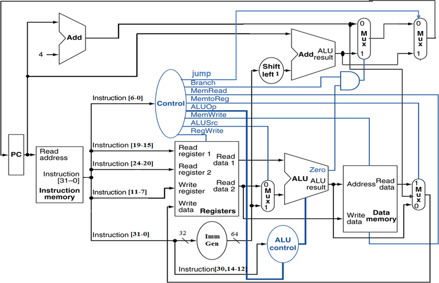

#### **R指令通路**

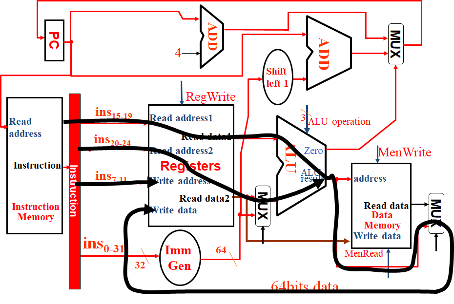 

​	其他指令同理。

### **Pipeline | 流水线**

#### **Five stages, one step per stage**

$\bullet$ IF: Instruction fetch from memory（读取指令）

$\bullet$ ID: Instruction decode & register read（指令解码，寄存器读取）

$\bullet$ EX: Execute operation or calculate address（计算）

$\bullet$ MEM: Access data memory operand（内存读写）

$\bullet$ WB: Write result back to register（写）

#### **Single-Cycle Pipeline Diagram | 单周期流水线**

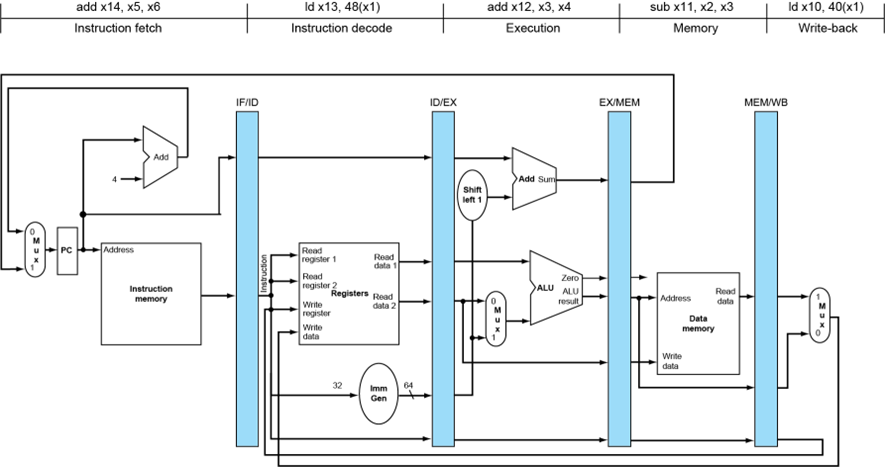

#### **Pipelined Control | 流水线控制器**

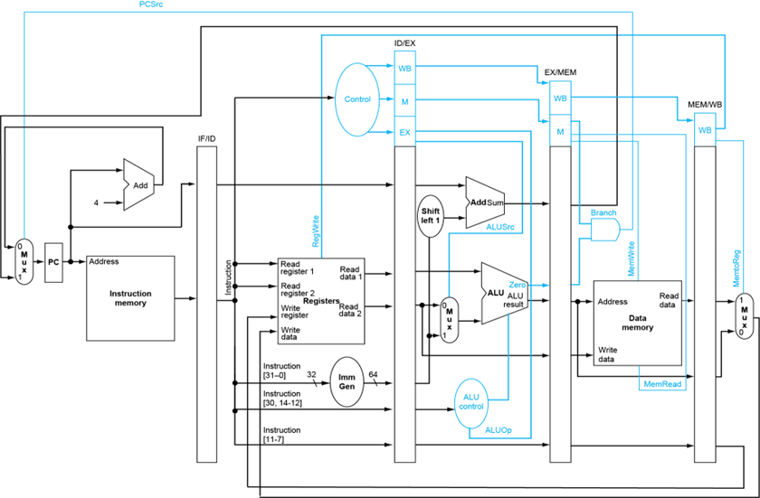

#### **Structure Hazards | 结构冲突**

**（1）Multi access to a Single Memory**

解决方案：将Memory分成Instruction Memory和Data Memory两部分，分别处理读和写。

**（2）Multi access to the register file**

解决方案：
double bump(双重触发) ：将Register的读写操作分离，即上半个周期写，下半个周期读。

**（3）Not fully pipelined function unit** 

解决方案：使功能单元完全流水化

#### **Data Hazards | 数据冲突**

数据还没完成写操作就要进行下一次读取。

##### **Forwarding(or Bypassing) | 旁路**

###### Case1:

add-sub

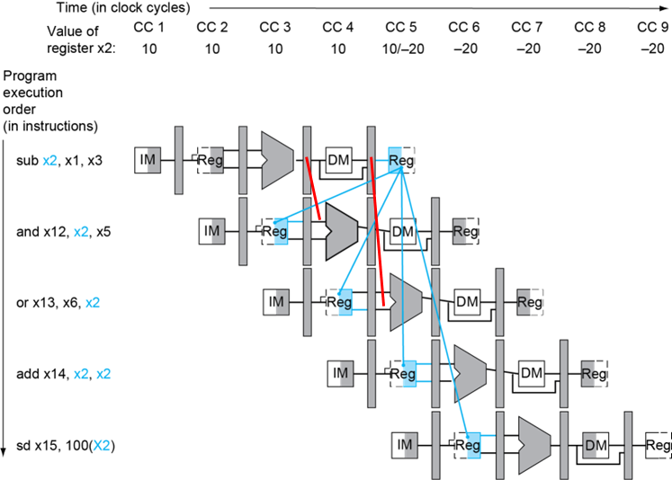 

###### Case2

ld-sub

 

可以在编译过程中调整语序来减少stall的引入。

###### Case3

ld-sw

 

**Case4**

 

**Case5**

需要一个stall

 

**Case6**

需要两个stall

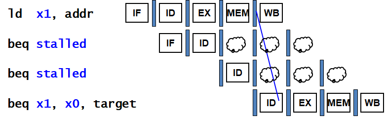 

##### **Summary**

$\bullet$ **发生原因**：指令需要的数据还没被计算或存储

$\bullet$ **Solutions**:

​	1. Double bump

​	2. Forwarding

​	3. Compiler scheduling

​	4. Stall

#### **Control Hazards | 控制冲突**

跳转指令可能会导致还在 Pipeline 的指令失效

##### **Stall**

在执行跳转指令时直接插入Stall，直到指令运行结束。

##### **Prediction**

预测跳转结果，先提前执行预测到的位置的指令。

**(1)Predict-untaken**

对于branch指令，每次都预测跳转不被执行，直接提前顺序执行后续执行。

taken时会造成3次指令浪费：

$\Rightarrow Pref=1+br\%\times taken\% \times 3$

**(2)Predict-taken**

对于branch指令，每次都预测跳转被执行，等待ALU计算出跳转位置后提前执行跳转位置的指令。

在实现中可以在ID中添加一个ALU用于计算branch的跳转地址，再通过forwarding进行传输。这样在taken时仅需插入一个Stall即可，在untaken时仍会造成3次指令浪费。

$\Rightarrow Pref=1+br\%\times taken\%+br\% \times untaken\% \times 3$ 

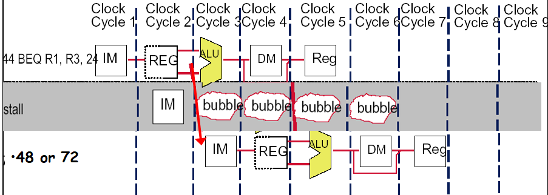

**More-Realistic Branch Prediction**

**(1) Static branch prediction**

根据设定的规则进行推测

**(2) Dynamic branch prediction**

- Branch prediction buffer (aka branch history table)
  记录前几次是否命中
- Indexed by recent branch instruction addresses
- Stores outcome (taken/not taken)
- To execute a branch
  - Check table, expect the same outcome
  - Start fetching from fall-through or target
  - If wrong, flush pipeline and flip prediction

 **1-bit predictor**

使用一位进行预测，根据上一次预测的结果对下一次进行预测。

- **Shortcomings: 对于内嵌循环会连续错误两次**
  - Mispredict as taken on last iteration of inner loop
  - Then mispredict as not taken on first iteration of inner loop next time around

 

**2-Bit Predictor**

连续预测错两次才修改预测结果

 

##### **Calculating the Branch Target**

即使 branch 命中了，我们也有一个时钟的 bubble 来计算地址。
但 branch 要跳转的地址其实是可以存下来的。

Branch target buffer

- Cache of target addresses
- Indexed by PC when instruction fetched
  If hit and instruction is branch predicted taken, can fetch target immediatel

#### **Exceptions**

- **Exception | 异常**: e.g., undefined opcode, overflow, syscall, …
- **Interrupt | 中断**: From an external I/O controller

## **Chapter5 Large and Fast: Exploiting Memory Hierarchy**

### **Memory Technologies**

#### **SRAM**

**Cache**

- 速度快，但占空间大

#### **DRAM**

**Memory**

- 占空间小，但速度慢

- 需要刷新

#### **Flash Storage**

Nonvolatile semiconductor storage

- 比disk快100-1000倍
- 更小，更省电
- 但是价格更贵

#### **Disk**

Nonvolatile, rotating magnetic storage

- 保存时间更长
- 更容易修复

| **Memory technology** | **Typical access time**    | **Cost per** **GByte** **(2012)**  ($) |
| --------------------- | -------------------------- | -------------------------------------- |
| **SRAM**              | **0.5-2.5ns**              | 2000-5,000*                            |
| **DRAM**              | **50-70ns**                | 20-75                                  |
| **Magnetic disk**     | **5,000,000-20,000,000ns** | 0.2-2                                  |

### **The basics of Cache**

#### Hit | Miss

##### Read hits

找到需要读取的数据

##### Read miss

- 指令cache miss
- 数据cache miss

##### **Write hits**

- **write-back**: Cause Inconsistent 
  - 数据只写在cache里
  - Strategy---在发生冲突时再把数据写回memory(**更快**)
- **write-through**: Ensuring Consistent
  - 每次都把数据同时写在cache和memory
  - strategy---同时更新cache和memory
  - 更慢---write buffer

##### Write miss

- **Write allocate**:
  - 发生write miss时，先把block读取到cache里再进行后续操作
- **Write around** 
  - 发生write miss时，直接在内存里进行写，不需把block读入cache

通常情况下，有一下策略搭配

- **write-back --- write allocate**
- **write-through --- write around**

#### **Block Placement**

##### **Direct Mapped Cache**

block只能放在指定的位置

 

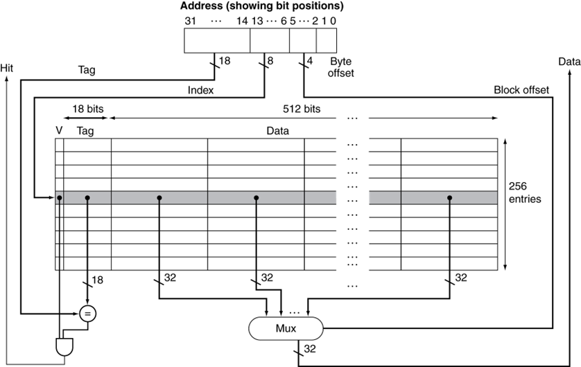 

##### **Fully associative** 

block可以放在任意位置

##### **Set associative** 

把block地址分成几个sets，block只能放到相应的set里面

 

 

#### **Strategy of block Replacement**

##### **Random replacement**

随机挑选其中一个block

-  在硬件中更容易实现
- 在cache里分布均匀
- 但是有可能会替换掉马上要被使用的block

##### **Least-recently used (LRU)** 

每次都替换掉最近最少用的一个block

实现：对每个block进行计数，每隔一段时间+1，当block被访问时清零。每次都替换计数最大的block。

- 建立在最近使用的block更有可能被访问的假设下
- 但是需要额外的bits来进行计数

##### **First in,first out(FIFO)**

每次都替换掉最早读取进来的一个block

### **Virtual  Memory**

  

#### Page Table | 页表

 

!!!Note
	页表存储在Memory里

#### 地址翻译（虚拟地址 $\rightarrow$ 物理地址）

 

#### Page Fault

虚拟地址对应的页在内存中不存在，需要从外存读入数据。

- Takes millions of clock cycles
- Handled by OS code

可以通过以下方法减小page fault rate:

- Fully associative placement
- Smart replacement algorithms

#### Page Table大小计算

例：

**Assume:** 

- Virtual address is **32 bits**
- page size is **4KB**
- Entry size is **4 Bytes**

$Number~of~page~table~entries=\frac{2^{32}}{2^{12}}=2^{20}$

$Size~of~pag~table=2^{20}entries\times 4Bytes/entry=4MB$ 

!!!Note
	Entry的数量等于index的数量。例如对于2-set-associative，entries的数量为页表列数/2。
	
!!!Note
	页表中每行的数据按字对齐，即对齐到4Bytes。注意包括valid bit和dirty bit。(dirty bit用于表示该数据是否已写回外存，在write-back策略中使用)

#### TLB

可以理解为用于页表的cache。

 

当 TLB miss 的时候，处理器去 page table 查找对应的项；如果发现对应项是 valid 的，那么就把他拿到 TLB 里（此时被替换掉的 TLB entry 的 dirty bit 如果是 1，也要写回 page table）；否则就会触发一个 page fault。

 

### Using FSM to Control a simple Cache 

 

 

## Chapter6 Storage and other I/O Topics

### Disk Storage and Dependability

 

#### Access Time

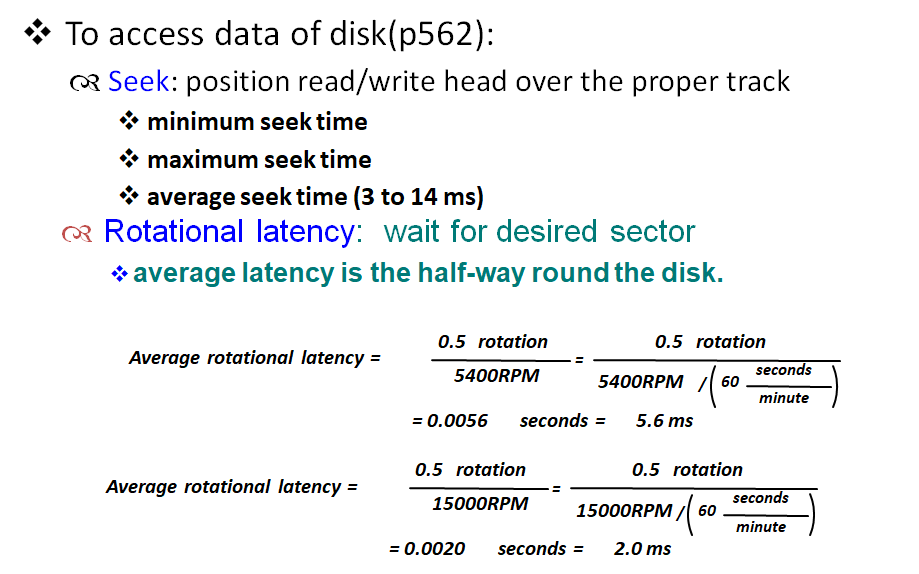 

 

#### Dependability, Reliability, Availability

  *Computer system dependability is the quality of delivered service such that reliance can justifiably be placed on this service. The service delivered by a system is its observed actual behavior as perceived by other system (s) interacting with this system’s users. Each module also has an ideal specified behavior, where a service specification is an agreed description of the expected behavior. A system failure occurs when the actual behavior deviates from the specified behavior.* 

##### Measure

- *MTTF  mean time to failure*

- *MTTR  mean time to repair*

- *MTBF (*Mean Time Between Failures)= *MTTF+ MTTR*

- *Availability* =$\frac{MTTF}{MTTF+MTBF}$

##### Three way to improve MTTF

- **Fault avoidance:** 在设计时避免错误发生
- **Fault tolerance:** 允许服务在发生故障时仍符合服务规范，主要适用于硬件故障
- **Fault forecasting:** 预测故障的存在和产生，适用于硬件和软件故障

##### Array Reliability

Reliability of N disks = Reliability of 1 Disk ÷ N

#### RAID | 磁盘阵列

##### RAID 0

没有冗余来容忍磁盘故障，把连续的数据分散到多个磁盘上存取。

提高性能，没有保护功能、

##### RAID 1 | 镜像磁盘

在成对的独立磁盘上产生互为备份的数据。

成本最高，安全性高

##### RAID 3 | 交错校验

校验位P为前三位的和mod2。

 

##### RAID 4 | High I/O Rate Parity

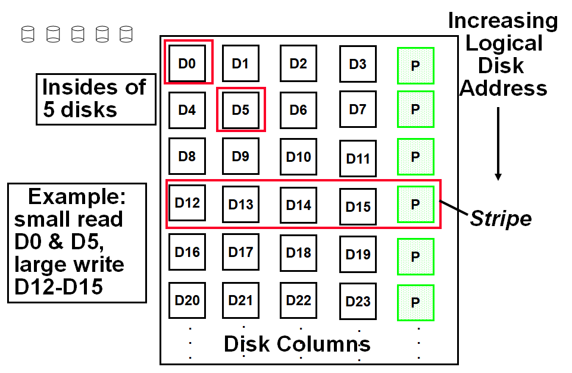 

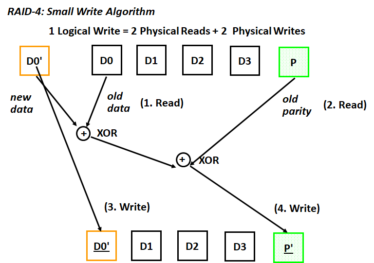 

##### RAID 5 | High I/O Rate Interleaved Parity

相比RAID 4，将校验盘分散到不同列，有效防止了磁盘过载。（由于每次写时校验盘都需要写）	

 

##### RAID 6 | P+Q Redundancy

当单次故障纠正不够时，奇偶校验可以推广为对数据进行第二次计算和另一个信息校验磁盘。

### Bus | 总线

#### 总线包含两种线

- **Control lines**：用于传输控制信号
- **Data lines**：用于传输数据

#### 总线类型

- **processor-memory** (short high speed, custom design)
- **backplane** (high speed, often standardized, e.g., PCI)
- **I/O** (lengthy, different devices, standardized, e.g., SCSI)

#### 同步/异步

##### Synchronous | 同步

使用时钟和同步协议

- 速度快，占空间小
- 需要保证所有设备都在同一个速率下运行

##### Asynchronous | 异步

不使用时钟，使用握手协议（**handshaking**）

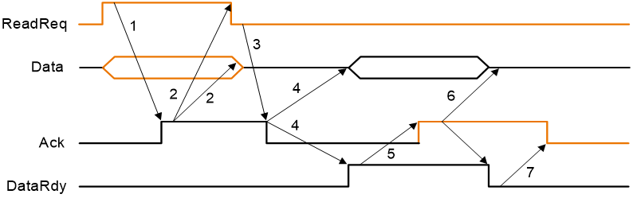 

1. 当内存看到ReadReq线时，它从数据总线读取地址，开始内存读取操作，然后引发Ack来告诉设备ReadReq信号已经被看到。

2. I/O设备看到Ack线为高电平，释放ReadReq数据线。
3. 内存看到ReadReq为低电平的，释放Ack线。
4. 当内存准备好数据时，它将数据放在数据线上并触发DataRdy。
5.  I/O设备看到DataRdy为高电平时，从总线读取数据，并通过触发Ack。
6. 内存看到Ack信号，释放DataRdy，并释放数据线。
7. 最后，I/O设备看到DataRdy变低电平，释放Ack线，这表明传输已经完成。

#### Bus Standards | 总线标准

- **SCSI** (small computer system interface)
- **PCI** (peripheral component interconnect)
- **IPI** (intelligent peripheral interface)
- **IBMPC-AT  IBMPC-XT**
- **ISA EISA**

#### Communication with the Processor

- **Polling**：处理器定期检查状态位，看是否到了下一个I/O操作的时间。
  - 缺点：浪费处理器时钟

- **Interrupt**: 当一个I/O设备想要通知处理器它已经完成了某些操作或需要操作时，中断处理器来处理I/O。
  - 操作系统可以在处理I/O时进行其他操作	

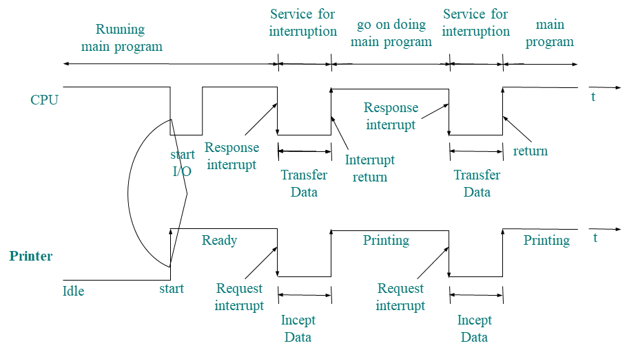 

- **DMA** *(direct memory access)*: 设备控制器直接将数据传输到存储器或从存储器传输数据，而不涉及处理器。
  - 不过多消耗处理器时钟

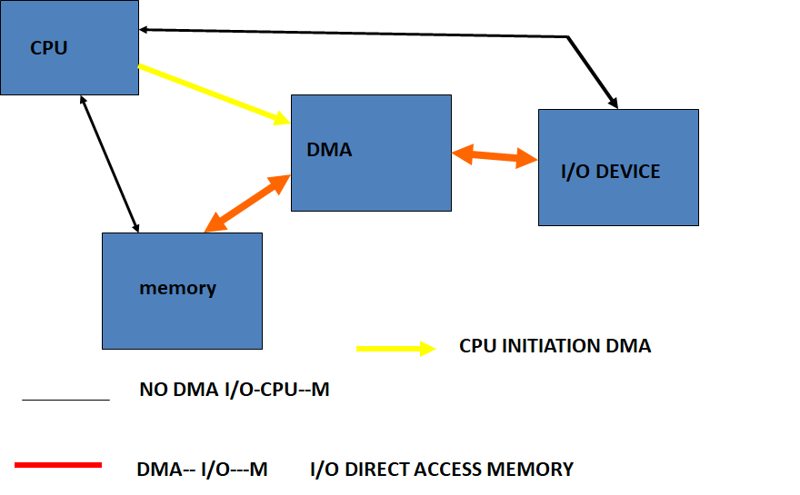 
