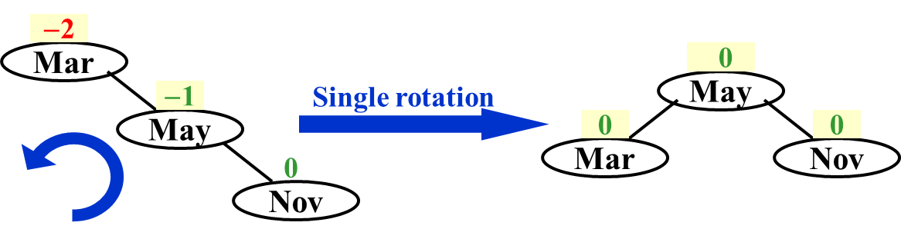
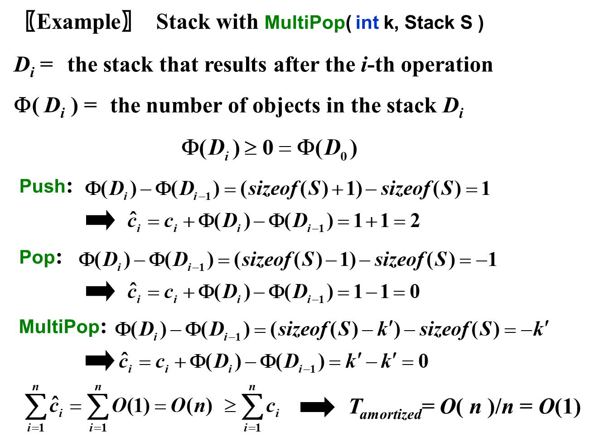

# **Chapter 1 ---AVL Trees, Splay Trees, and Amortized Analysis**

• height:  该节点向下的最长路径长度

• depth:  根节点到该节点的距离

• balance factor:  左右子树高度差

## **AVL Tree**

### **Definition**

1. 左右子树高度差不超过1

2. 所有子树都是AVL Tree

### **The Minimum number of nodes**

$$
\begin{align*}
n_h为&height为h的AVL~Tree的最小节点个数\\\\
&n_h=n_{h-1}+n_{h-2}+1\\\\
&n_{-1}=0,~n_0=1\\\\
Fibo&nacii~numbers:\\\\
&F_i=F_{i-1}+F_{i-2}\\\\
&F_0=0,~F_1=1\\\\
\Rightarrow&n_h=F_{h+3}-1,~for~h\geq0\\\\
\Rightarrow&n_h\approx\frac{1}{\sqrt5}(\frac{1+\sqrt5}{2})^{h+2}-1~~\\\\
\Rightarrow&h=O(ln(n))\\\\
&&&&&&&&&&&&&&&&&&&&
\end{align*}
$$

### **Single Rotation**

 

 

### **Double Rotation**

 

 

### **Time Complexity**

$$
\begin{aligned}
&Search&&O(logN)&&\\
\\
&Insertion&&O(logN)&&\\
\\
&Deletion&&O(logN)&&&&&&&&&&&&&&&&&&&&&&&&&\\
\end{aligned}
$$

## **Splay Tree  |  伸展树**

### **Definition**

从空树开始连续M次操作时间不会超过O(M log N)

**核心思想：一个节点被访问后，通过一系列rotation操作将这个节点转移至根节点**

### **Operation**

   

### **Deletion**

 

## **Amortized Analysis  |  摊还分析**

求数据结构的一个操作序列中执行的所有操作的平均时间，来评价操作的代价。

### **Aggregate analysis | 聚合分析**

证明对所有n个操作，一个包含n个操作的序列总共花费最坏情况时间$T(n)$。在最坏的情况下，每次操作的平均成本或平摊成本因此是$\frac{T(n)}{n}$。

### **Accounting method | 核算法**

对于每一种操作，赋予一个**摊还代价(amortized cost)**。赋予某些操作的摊还代价可能多于或少于其实际代价。当一个操作的摊还代价超出其实际的代价的时候，我们将差额存入数据结构的特定对象中，存入的差额称为**信用（Credit)**。对于后续操作中小于其实际代价的时候，预存的信用可以用来支付差额。

$$
\begin{align*}
如果&用c_{i}表示第i个操作的真实代价，用\hat{c_i}代表第i个操作的摊还代价，需满足：&&&&&&\\\\
&\sum_{i=1}^n\hat{c_i}\geqslant\sum_{i=1}^nc_i\\\\
&T_{amortized}=\frac{\sum_{i=1}^n\hat{c_i}}{n} =O(?)\\\\
那么&可知,摊还成本为O(?)
\end{align*}
$$

     

### **Potential method | 势能法**

使用**势函数$\Phi$**来表示credit。

$$
\begin{align*}
\hat{c_i}-c_i&=Credit_i=\Phi(D_i)-\Phi(D_{i-1}) ~~\Leftarrow~~Potential~Funciton\\\\
\sum_{i=1}^n\hat{c_i}&=\sum_{i=1}^n(c_i+\Phi(D_i)-\Phi(D_{i-1}))&&&&&&&&&\\\\
&=(\sum_{i=1}^nc_i)+\Phi(D_n)-\Phi(D_0)\\\\
为满足&Accounting~method的条件，只需满足\Phi(D_n)-\Phi(D_0)\geqslant0\\\\
\end{align*}
$$

!!!NOTE
    $$
    假设需证明\sum_{i=1}^nc_i=O(n),~则当满足\Phi(D_n)-\Phi(D_0)=-n时也可也可满足，无须大于0~~~~~~~~~~~~~~~~~~~~~~~\\
    $$

    