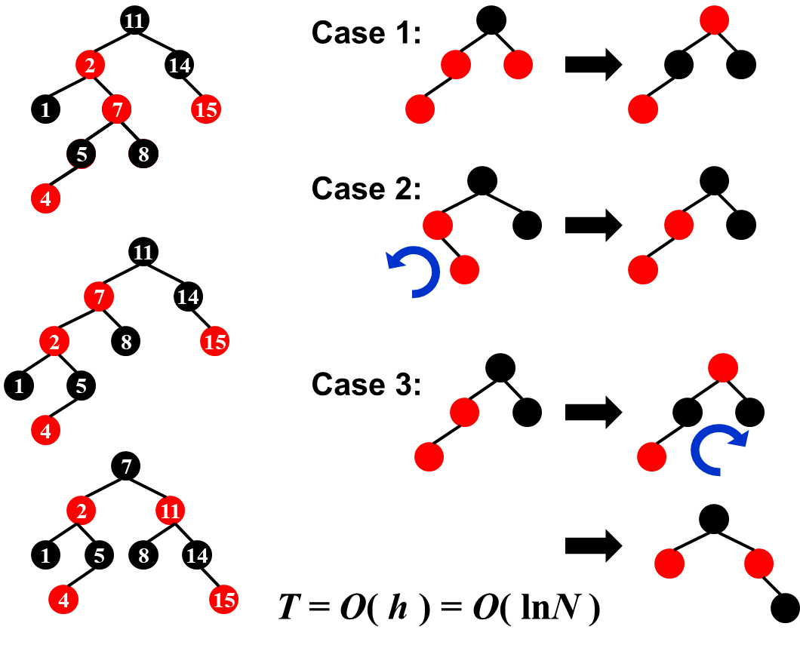

# **Chapter 2 ---Red-Black Trees and B+ Trees**

## **Red-Black Trees**

### **Definition**

1.红黑树是一个二叉排序树

2.每个节点都是红色或者黑色

3.根节点为黑色

4.叶子节点（外部节点、NULL节点、失败的节点）都为黑色

5.红色节点的父节点和孩子节点都为黑色

6.对于每个节点，从该节点到任一叶子节点的路径上的黑色节点数量相同

### **black-height**

用 $bh(x)$ 表示，指从任意 $x$ 开始的任意简单路径上的黑色节点数量（不包括 $x$)

$bh(NULL)=0$

### **Insert**

每次插入都插入红色节点，对称同理

 

### **Delete**

**Case 1 ：$x_0$的兄弟节点$w$为红色。**

• 交换父节点和兄弟节点的颜色。($w$变为黑色)

• 对删除的节点的方向进行一次rotation。

• 前往Cases 2.1 / 3 / 4。

**Case 2.1 $x_0$的兄弟节点$w$为黑色, 并且$w$的子节点为黑色。 同时, $x$的父节点为红色。**

• 交换$x_0$父节点和兄弟节点的颜色，完成删除。

 

**Case 2.2 $x_0$的兄弟节点$w$为黑色，并且$w$的子节点都为黑色。并且$x_0$的父节点为黑色。**

• 把$x_0$的兄弟节点设为红色

• $x_0$的父节点变为新的删除节点$z$，递归至根节点。

**Case 3 $x_0$的兄弟节点$w$为黑色，$w$有一个红色的子节点，并且"outer nephew"为黑色。**

• 交换$w$和"inner nephew"的颜色。

• 对$x_0$的兄弟节点$w$向"outer nephew"的方向进行一次rotation。

• 前往case 4。

**Case 4 $x_0$的兄弟节点$w$为黑色，$w$至少有一个红色的子节点，并且 "outer nephew"为红色。**

• 将兄弟节点$w$设为父节点的颜色；将父节点和"outer nephew"的颜色设为黑色.

• 将父节点向被删除节点的方向进行一次rotation。

!!!NOTE
    最多的rotation次数：Case 1  $\rightarrow$  Case 3  $\rightarrow$  Case 4   (3次)

### **Numbers of Rotations**

$$
\begin{aligned}
&&~~~~~~~~&AVL&~~~~~~~~Red-&Black~Trees&&&&&&&&&&&\\
\\
&Insertion&&\leqslant2&&\leqslant2&\\
\\
&Deletion&&O(logN)&&\leqslant3
\end{aligned}
$$

### **Time Complexity**

$$
\begin{aligned}
&Search&&O(logN)&&\\
\\
&Insertion&&O(logN)&&\\
\\
&Deletion&&O(logN)&&&&&&&&&&&&&&&&&&&&&&&&&\\
\end{aligned}
$$

## **B+ Trees**

### **Definition**

**M阶B+树 (B+ Trees of order M)**  具有以下性质：

1.根节点是一个叶节点或者有 $2-M$ 个子节点。

2.所有非叶节点（除了根节点）都有 $\lceil M/2\rceil-M$ 个子节点。

3.所有叶节点都在同一层，假设每个非根叶也有 $\lceil M/2\rceil-M$个键。
