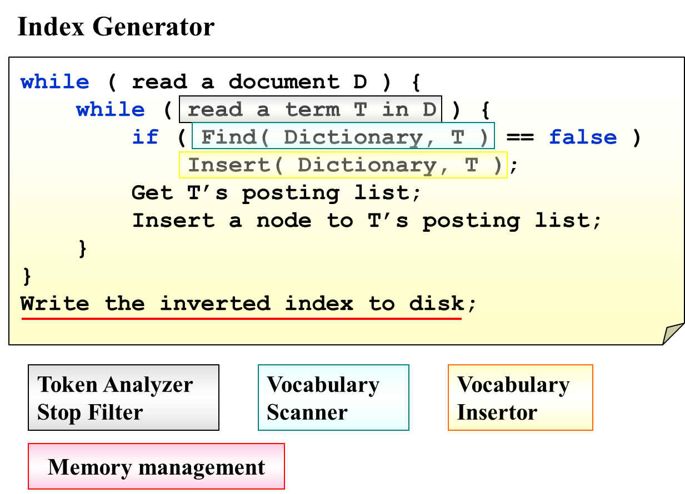

# **Chapter 3 ---Inverted File Index | 倒排文件索引**

在建立索引时就确定字符串在哪里出现过。即在查找时用关键词为索引查找文档。

 

### **生成算法**

 

### **处理方法**

 

### **Precision | Recall**

**Precison：查询到的文件中相关的比例**

**Recall：有关的文件中被查询到的比例**

 

 

!!!NOTE
     