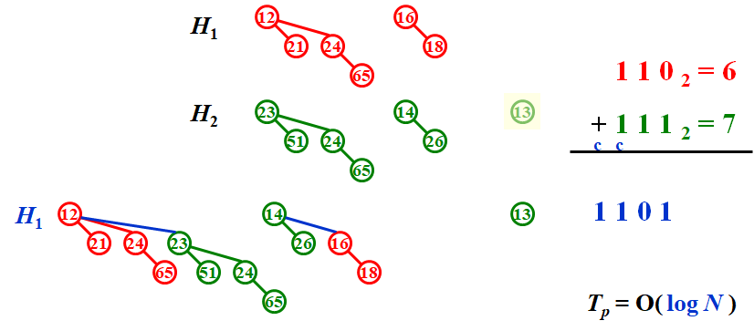

# **Chapter 5 ---Binomial Queue | 二项堆** 

### **Definition**

二项堆是堆的集合，每个堆都是**二项树(binomial tree)**。

### **Binomial Tree | 二项树**

$•~height~为~0~的二项树为一个节点$

$•~高度为~k~的二项树~B_k~,由~B_{k-1}~连接到~B_{k-1}~的根节点构成$

 

!!!NOTE
    $•~B_k~有~k~个节点，分别为~B_0,B_1,……,B_{k-1}$

​    $•~B_k~有2^k个节点$

​    $•~深度为d的节点数为\left( \begin{array}{c}k \\ d \end{array} \right)$


### **Merge**

 


### **Insert**

特殊的Merge

• 如果最小的空二项树为 $B_i$ ，则 $T_p=Const\times(i+1)$。

• 对一个空二项堆，N次Inseet操作的worst case为 $O(N)$ 。因此平均时间复杂度为常数。


### **FindMin**

最小值一定是其中一颗二项树的根节点。由于至多存在 $\lceil logN \rceil$ 个根节点，$T_p=O(logN)$。

!!!Note
    可以通过记忆并实时更新最小值所在位置，使时间复杂度到达$O(1)$。


### **DeleteMin**

​    

### **Proof**

$$
\begin{align*}
记~&C_i::=第~i~次操作的代价\\\\
&\Phi_i::=在第~i~次操作后二项树的数量(\Phi_0=0)\\\\
假&设第~i~次操作前第一个空二项树为B_d，则：\\\\
&C_i=d+1\\\\
&\Phi_i-\Phi_{i-1}=1-d\\\\
\Rightarrow&C_i+(\Phi_i-\Phi_{i-1})=2，i=1,2,…,N\\\\
\Rightarrow&\sum^N_{i=1}C_i=2N-\Phi_N\leqslant2N=O(N)\\\\
\Rightarrow &T_{Worst}=O(logN)~,~T_{Amortized}=2&&&&&&&&&&&&&&&&&&\\
\end{align*}
$$


#### **Time Complexity**

$$
\begin{aligned}
&Merge&&O(logN)&&\\
\\
&Insertion&&O(logN)(从零开始插入平均O(1))&&\\
\\
&Delete~Min&&O(logN)&&\\
\\
&Decrease~Key&&O(logN)&&\\
\\
&Find~Min&&O(logN)(可以通过标记变为O(1))&&\\
\\
&Deletion&&O(logN)&&&&&&&&&&&&&&&&\\
\end{aligned}
$$


#### **Code**

```C
typedef struct BinNode *Position;
typedef struct Collection *BinQueue;
typedef struct BinNode *BinTree;  /* missing from p.176 */

struct BinNode 
{ 
	ElementType	    Element;
	Position	    LeftChild;
	Position 	    NextSibling;
} ;

struct Collection 
{ 
	int	    	CurrentSize;  /* total number of nodes */
	BinTree	TheTrees[ MaxTrees ];
} ;

BinTree CombineTrees( BinTree T1, BinTree T2 )
{  /* merge equal-sized T1 and T2 */
	if ( T1->Element > T2->Element )
		/* attach the larger one to the smaller one */
		return CombineTrees( T2, T1 );
	/* insert T2 to the front of the children list of T1 */
	T2->NextSibling = T1->LeftChild;
	T1->LeftChild = T2;
	return T1;
}
//Merge
BinQueue  Merge( BinQueue H1, BinQueue H2 )
{	BinTree T1, T2, Carry = NULL; 	
	int i, j;
	if ( H1->CurrentSize + H2-> CurrentSize > Capacity )  ErrorMessage();
	H1->CurrentSize += H2-> CurrentSize;
	for ( i=0, j=1; j<= H1->CurrentSize; i++, j*=2 ) {
	    T1 = H1->TheTrees[i]; T2 = H2->TheTrees[i]; /*current trees */
	    switch( 4*!!Carry + 2*!!T2 + !!T1 ) { 
		case 0: /* 000 */
	 	case 1: /* 001 */  break;	
		case 2: /* 010 */  H1->TheTrees[i] = T2; H2->TheTrees[i] = NULL; break;
		case 4: /* 100 */  H1->TheTrees[i] = Carry; Carry = NULL; break;
		case 3: /* 011 */  Carry = CombineTrees( T1, T2 );
			            H1->TheTrees[i] = H2->TheTrees[i] = NULL; break;
		case 5: /* 101 */  Carry = CombineTrees( T1, Carry );
			            H1->TheTrees[i] = NULL; break;
		case 6: /* 110 */  Carry = CombineTrees( T2, Carry );
			            H2->TheTrees[i] = NULL; break;
		case 7: /* 111 */  H1->TheTrees[i] = Carry; 
			            Carry = CombineTrees( T1, T2 ); 
			            H2->TheTrees[i] = NULL; break;
	    } /* end switch */
	} /* end for-loop */
	return H1;
}
//DeleteMin
ElementType  DeleteMin( BinQueue H )
{	BinQueue DeletedQueue; 
	Position DeletedTree, OldRoot;
	ElementType MinItem = Infinity;  /* the minimum item to be returned */	
	int i, j, MinTree; /* MinTree is the index of the tree with the minimum item */

	if ( IsEmpty( H ) )  {  PrintErrorMessage();  return –Infinity; }

	for ( i = 0; i < MaxTrees; i++) {  /* Step 1: find the minimum item */
	    if( H->TheTrees[i] && H->TheTrees[i]->Element < MinItem ) { 
		MinItem = H->TheTrees[i]->Element;  MinTree = i;    } /* end if */
	} /* end for-i-loop */
	DeletedTree = H->TheTrees[ MinTree ];  
	H->TheTrees[ MinTree ] = NULL;   /* Step 2: remove the MinTree from H => H’ */ 
	OldRoot = DeletedTree;   /* Step 3.1: remove the root */ 
	DeletedTree = DeletedTree->LeftChild;   free(OldRoot);
	DeletedQueue = Initialize();   /* Step 3.2: create H” */ 
	DeletedQueue->CurrentSize = ( 1<<MinTree ) – 1;  /* 2MinTree – 1 */
	for ( j = MinTree – 1; j >= 0; j – – ) {  
	    DeletedQueue->TheTrees[j] = DeletedTree;
	    DeletedTree = DeletedTree->NextSibling;
	    DeletedQueue->TheTrees[j]->NextSibling = NULL;
	} /* end for-j-loop */
	H->CurrentSize  – = DeletedQueue->CurrentSize + 1;
	H = Merge( H, DeletedQueue ); /* Step 4: merge H’ and H” */ 
	return MinItem;
}

```