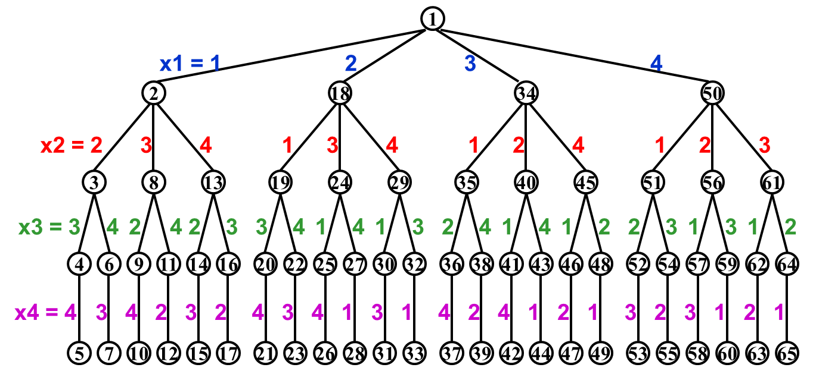
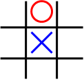
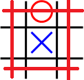
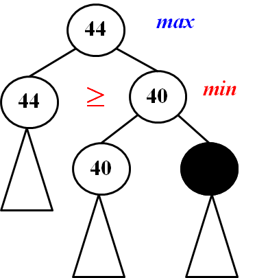

# **Chpater 6 ---Backtracking | 回溯**

## **Template**

```C
bool Backtracking ( int i )
{   Found = false;
    if ( i > N )
        return true; /* solved with (x1, …, xN) */
    for ( each xi in Si ) { 
        /* check if satisfies the restriction R */
        OK = Check((x1, …, xi) , R ); /* pruning */
        if ( OK ) { 	
            Count xi in;
            Found = Backtracking( i+1 );
            if ( !Found )
                Undo( i ); /* recover to (x1, …, xi-1) */
        }
        if ( Found ) break; 
    }
    return Found;
}

```


## **Eight Queens | 八皇后问题**

（以四皇后问题为例）

（1）建立决策树

（2）DFS




## **The Turnpike Reconstruction Problem | 收费公路重构问题**

​	在 $x$ 粥上有 $N$ 个点， $x_1<x_2<x_3<\cdots<x_N$ , 假设 $x_1=0$ 。给出 $N(N-1)$ 个距离，重构出每个点的位置。


**Code**

```C
bool Reconstruct ( DistType X[ ], DistSet D, int N, int left, int right )
{ /* X[1]...X[left-1] and X[right+1]...X[N] are solved */
    bool Found = false;
    if ( Is_Empty( D ) )
        return true; /* solved */
    D_max = Find_Max( D );
    /* option 1：X[right] = D_max */
    /* check if |D_max-X[i]|D is true for all X[i]’s that have been solved */
    OK = Check( D_max, N, left, right ); /* pruning */
    if ( OK ) { /* add X[right] and update D */
        X[right] = D_max;
        for ( i=1; i<left; i++ )  Delete( |X[right]-X[i]|, D);
        for ( i=right+1; i<=N; i++ )  Delete( |X[right]-X[i]|, D);
        Found = Reconstruct ( X, D, N, left, right-1 );
        if ( !Found ) { /* if does not work, undo */
            for ( i=1; i<left; i++ )  Insert( |X[right]-X[i]|, D);
            for ( i=right+1; i<=N; i++ )  Insert( |X[right]-X[i]|, D);
        }
    }
    /* finish checking option 1 */
    if ( !Found ) { /* if option 1 does not work */
        /* option 2: X[left] = X[N]-D_max */
        OK = Check( X[N]-D_max, N, left, right );
        if ( OK ) {
            X[left] = X[N] – D_max;
            for ( i=1; i<left; i++ )  Delete( |X[left]-X[i]|, D);
            for ( i=right+1; i<=N; i++ )  Delete( |X[left]-X[i]|, D);
            Found = Reconstruct (X, D, N, left+1, right );
            if ( !Found ) {
                for ( i=1; i<left; i++ ) Insert( |X[left]-X[i]|, D);
                for ( i=right+1; i<=N; i++ ) Insert( |X[left]-X[i]|, D);
            }
        }
        /* finish checking option 2 */
    } /* finish checking all the options */
    
    return Found;
}

```

### **MiniMax**

Tic-tac-toe：井字棋

**基本思路：**

​	决策树的一层代表己方，一层代表对方。
​	
​	记W是位置P的**potential wins** 数量。$f(p)=W_{Computer}-W_{Human}$		
​	
​	从最底层向上搜索：在己方决策层，即Max层，选取子节点中最大的一个；对方决策层，即Min层，选择子节点中最小的一个。


!!!NOTE
    **potential wins**

    以这张图为例，蓝线为X的potential wins，红线为O的potential wins。
    
    $\Rightarrow f(p)=6-4=2$
    
     


​    
#### **$\alpha$-$\beta$ prunning | $\alpha$-$\beta$剪枝**

**$\alpha$剪枝：**在Max层的决策过程中，若找到比以找节点更小的值，则不需要继续向下搜索。

 

**$\beta$剪枝：**在Min层的决策过程中，若找到比以找节点更大的值，则不需要继续向下搜索。

 

在实践中，同时使用 $\alpha$ 剪枝和 $\beta$ 剪枝，能够将搜索从 $O(N)$ 减小到 $O(\sqrt{N})$ ，其中N为决策树的规模。