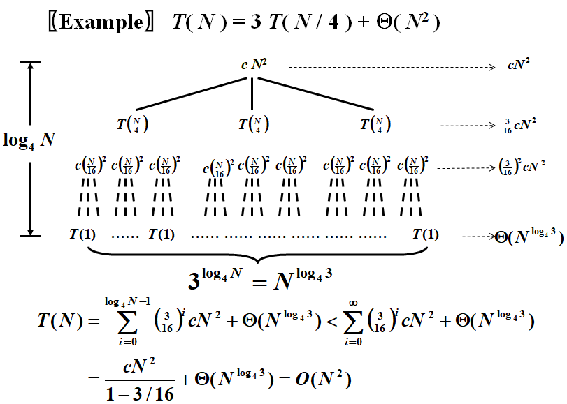
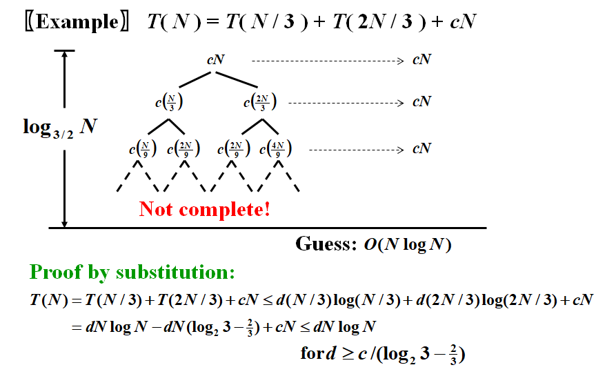

# **Chapter 7 ---Divide and Conquer | 分治**

## **递归式**

$$
T(N)=a~T(N/b)~+~f(N)
$$

## **求解方法**

### **Substitution method | 代入法**

**Example :** $T(N)=2~T(\lfloor N/2\rfloor)+N$

$$
\begin{aligned}
Guess:&T(n)=O(NlogN)\\\\
Proof:&Assume~it~is~true~for~all~m<N,~in~particular~for~m=\lfloor N / 2\rfloor.\\\\
&Then~there~exists~a~constant~c~>~0~so~that~T(\lfloor N~/~2\rfloor)\leqslant c \lfloor N / 2\rfloor log \lfloor N / 2\rfloor \\\\
&Substituting~into~the~recurrence:\\\\
&T( N ) = 2~T( \lfloor N / 2\rfloor ) + N\\\\
&~~~~~~~~~~\leqslant 2~c \lfloor N / 2\rfloor log \lfloor N / 2\rfloor + N\\\\
&~~~~~~~~~~\leqslant c~N (log N – log 2) + N\\\\
&~~~~~~~~~~\leqslant c~N log N~~~~for~c \leqslant 1
\end{aligned}
$$

### **Recursion-tree method | 递归树法**

 

 

### **Master method | 主方法**

对于$T(N)=a~T(N/b)~+~f(N)$，满足$a\geq1,b>1,p\geq0$ (**判断能否使用主方法**)，则有以下关系：

$\bullet$ **Case1**: $f(N)=O(N^{\log_b a-\varepsilon}) \Rightarrow T(N)=\Theta(N^{\log_ba})$

$\bullet$ **Case2:** $f(N)=\Theta(N^{\log_ba}\log^pN)\Rightarrow T(N)=\Theta(N^{\log_ba}\log^{p+1} N)$

$\bullet$ **Case3**:  $f(N)=\Omega(N^{\log_ba+\varepsilon}),and~af(N/b)\leqslant cf(N)\Rightarrow T(N)=\Theta(f(N))$