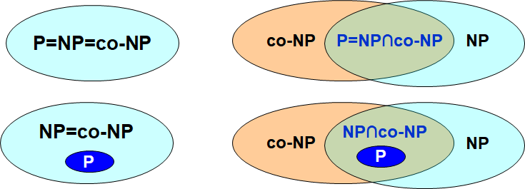

# **Chapter10 ---NP-Completeness**

## **Polynomial time**

$f(N)=O(N^k)$

$\Rightarrow \log(f(N))=O(\log N)$

## **Defination**

### **Language**

对于一个problem $X$,对应的language $L$,为：

	If $x\in L$  then are supposed to answer "Yes" and if $x\notin L$, we are supposed to answer "No".

### **P** (Polynomial)

The set of decision problems that can be solved in polynomial time

### **NP** (Nondeterminism polynomial)

The set of decision problems with the following property: If the answer is "Yes", then there is a proof of this fact that can be checked in polynomial time.

### **co-NP**

The set of decision problems $X$ such that $\overline{X}\in NP$.

Essentially the opposite of NP. If the answer to a problem in co-NP is "No", then there is a proof of this fact that can be checked in polynomial time.

!!!Note
	四种可能的关系
	

!!!Note
	不确定图灵机可以用来验证NP问题的解是否是正确的，确定图灵机可以用来求解P问题。

## **NP-complete problems**

### $L_1\leqslant_TL_2$

如果解决$L_2$的算法可以解决$L_1$，那么问题$L_1$可以reduce到$L_2$

### $L_1\leqslant_pL_2$ **(polynomial-time reducible)**

存在多项式时间的函数$f:\{0,1\}^*\rightarrow \{0,1\}^*$使得对于所有$x\{0,1\},x\in L_1~iff~f(x)\in L_2$

- $f$: reduction function

- 执行$f$的多项式时间算法$F$: reduction algorithm

### **NP-complete**

$1.L\in Np$

$2.L'\leqslant _pL~for~every~L'\in NP$

### **NP-hard**

$L'\leqslant_pL~for~every~L'\in NP$

### **传递性**

$L_1\leqslant_p L_2~and~L_2\leqslant_p L_3~~~~\Rightarrow~~~~L_1\leqslant_p L_3$

### **Examples(NP-complete)**

- Clique problem

- Vertex cover problem
- Hamiltonian cycle problem
- Traveling salesman problem()
- Satisfiability problem(SAT)

## **Proof**

### $A\leqslant_p B$

1.找到映射函数$f$，证明$f$可以在多项式时间内运行。

2.证明$\forall x\in A,~f(x)\in B$

3.证明$\forall f(x)\in B,~A \in x$

### **Y is NP-Complete**

1.证明$Y\in NP$

2.找到一个NP-complete problem $X$，证明$X\leqslant_p Y$