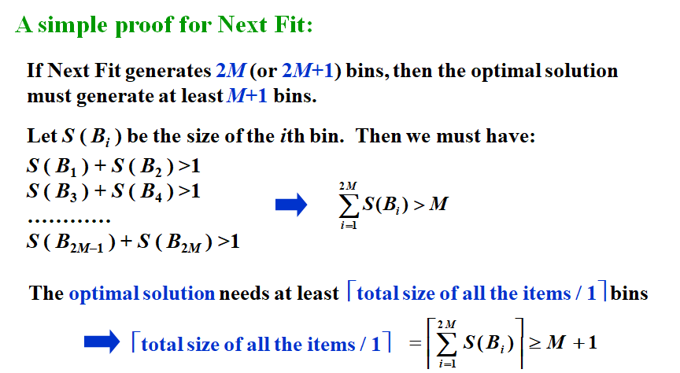
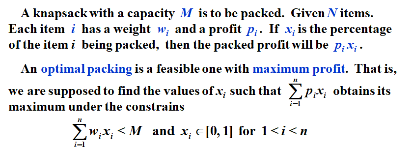
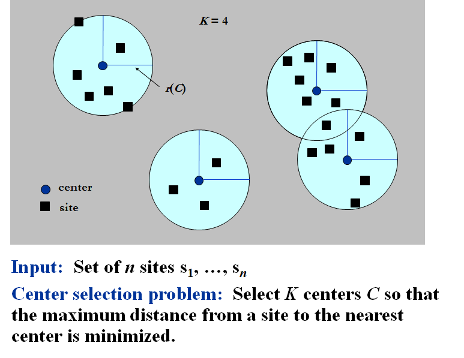

# **Chapter11 ---Approximation | 近似算法**  

## **Approximation Ratio | 近似率**

### **Definition**

对于一个输入规模为 $n$ 的算法，记算法的approximation ratio为 $\rho(n)$。

记近似算法给出的结果为 $C$ ，最优算法给出的结果为 $C^*$ ，则有以下关系：

$$
max(\frac{C}{C^*},\frac{C^*}{C})\leqslant \rho(n)~~~~~~~~~~~~~~~~~~~~~~~~~~~~~~~~~~~~~~~~~
$$

对于一个可以达到 $\rho(n)$ 的算法，我们称之为 $\rho(n)$-**approximation algorithm**.

### **Minimum Probelm**

上式可写为 $C\leqslant \rho(n)C^*$ ，其中 $\rho(n)> 1$。

**Proof**

1. $C^*\geqslant x$
2. $C\leqslant x\rho(n) \leqslant \rho(n)C^*$

### **Maximum Probelm**

上式可写为 $C\geqslant \rho(n)C^*$ ，其中 $0<\rho(n)< 1$。

**Proof**

1. $C^*\leqslant x$
2. $C\geqslant x\rho(n) \geqslant \rho(n)C^*$


## **Approximation scheme | 近似方案**

### Definition

Approximation scheme是一种近似算法，它的输入值除了算法输入以外，还有一个值 $\varepsilon$ 。对于任何 $\varepsilon$ ，这个scheme是一个 (1+$\varepsilon$)-approximation algorithm. 

### **PTAS**

Polynomial-time approximation scheme

- **Example**: $O(n^{2/\varepsilon})$

### **FPTAS**

Fully polynomial-time approximation scheme 

- **Example**: $O((1/\varepsilon)^2n^3)$

!!!Note

	注意区分PTAS和FPTAS。PTAS的 $1/\varepsilon$ 在指数部分，而FPTAS的 $1/\varepsilon$ 在外部。


## **Approximate Bin Packing**

  

### **Next Fit**

每次放不下之后都新建一个bin，并放到新的bin里。

```c
void NextFit ( )
{   read item1;
    while ( read item2 ) {
        if ( item2 can be packed in the same bin as item1 )
	place item2 in the bin;
        else
	create a new bin for item2;
        item1 = item2;
    } /* end-while */
}

```

!!!Theorem

	Let $M$ be the optimal number of bins required to pack a list $I$ of items. Then next fit never uses more than $2M – 1$ bins.   There exist sequences such that next fit uses $2M  – 1$ bins.



### **First Fit**

每次都把物品放入第一个可以放得下的bin中。算法的时间复杂度可以利用二叉搜索树减小到 $O(N\log N)$，搜索树中以下标为排序依据，同时每个节点存储子树的最大剩余容量以及本节点的剩余容量。

```C
void FirstFit ( )
{   while ( read item ) {
        scan for the first bin that is large enough for item;
        if ( found )
	place item in that bin;
        else
	create a new bin for item;
    } /* end-while */
}

```

!!!Theorem

	Let $M$ be the optimal number of bins required to pack a list $I$ of items.  Then first fit never uses more than $17M / 10$ bins.  There exist sequences such that first fit uses $17(M – 1) / 10$ bins.

### **Best Fit**

每次都把物品放到能容得下的且剩余空间最少的bin中。

$T=O(N\log N)$，使用的bin $\leqslant 1.7M$


### **On-line Algorithms**

每次输入后都不知道算法是否结束，并且不能修改已经做出的决定。

!!!Therom

	There are inputs that force any on-line bin-packing algorithm to use at least $5/3$ the optimal number of bins.

### **Off-line Algorithms**

在知道所有输入数据的前提下进行处理。

在Bin Packing中，可以对所有数据先进行排序来优化后序操作。

!!!Therom

	Let $M$ be the optimal number of bins required to pack a list $I$ of items.  Then first fit decreasing never uses more than $11M / 9 + 6/9$ bins.  There exist sequences such that first fit decreasing uses $11M / 9 + 6/9$ bins.


## **The Knapsack Problem | 背包问题**

   

对于背包问题，我们有以下三种贪心策略：

1. maximum profit(最大价值)
2. minimum weight(最小重量)
3. maximum profit density $p_i / w_i$ (最高性价比) 

对于每一种贪心策略，都可以构造特殊数据使得近似率达到无穷大。

对于0-1背包问题，如果同时采用最大价值和最高性价比贪心，并且取两者最大值。则可以使近似率达到2。

**Proof**

$$
\begin{aligned}
记&p_{max}=max\{p_{mp},p_{pd}\}\\
记&若采用分数化物品的贪心得到的结果为p_{frac}\\
则&可知p_{max}\leq p_{opt} \leq p_{frac}\\
假&设使用最大性价比贪心选取的为w_1,w_2,……,w_k。下一个没有被选取的为w_{k+1}\\
则&p_{frac}=w_1+w_2+……+w_k+\alpha w_{k+1}\\
&\Rightarrow \frac{p_{opt}}{p_{max}}\leq \frac{p_{frac}}{p_{max}} \leq \frac{p_{mp}+p_{pd}}{p_{max}} \leq 2
\end{aligned}
$$

### **Dynamic Programming Solution**


对于$p_{max}$很大的情况，可以对所有p除以一个数来进行估计计算


## **The K-center Problem**

 

**Distant定义**

- $dist(x, x) = 0$			                     (identity)
- $dist(x, y) = dist(y, x)$	                      (symmetry)
- $dist(x, y) \leq dist(x, z) + dist(z, y)$	(triangle inequality)

### **A Greedy Solution** 

首先通过二分法猜测最优解的$r(C^*)$

 

然后使用贪心算法，每次任选一个点加入C，并删除所有距离该点$\leq 2r(C^*)$ 的点。(**2-approximation**)

```C
Centers  Greedy-2r ( Sites S[ ], int n, int K, double r )
{   Sites  S’[ ] = S[ ]; /* S’ is the set of the remaining sites */
    Centers  C[ ] = empty();
    while ( S’[ ] != empty() ) {
        Select any s from S’ and add it to C;
        Delete all s’ from S’ that are at dist(s’, s) <= 2r;
    } /* end-while */
    if ( |C|  K ) return C;
    else ERROR(No set of K centers with covering radius at most r);
}

```

!!!Therom

	Suppose the algorithm selects more than $K$ centers.  Then for any set $C^*$ of size at most $K$, the covering radius is $r(C^*) > r$.

### **A smarter solution — be far away**

先任意选取一个s，然后每次都选取剩余点中距离最远的一个点，直到选满。

```C
Centers  Greedy-Kcenter ( Sites S[ ], int n, int K )
{   Centers  C[ ] = empty();
    Select any s from S and add it to C;
    while ( |C| < K ) {
        Select s from S with maximum dist(s, C);
        Add s it to C;
    } /* end-while */
    return C;
}

```

!!!Therom
	The algorithm returns a set $C$ of $K$ centers such that $r(C) \leq 2r(C^*)$ where $C^*$ is an optimal set of K centers.

	$\Rightarrow$ **2-approximation**


!!!Therom

	Unless P = NP, there is no $\rho$ -approximation for center-selection problem for any $\rho$ < 2.
	
	