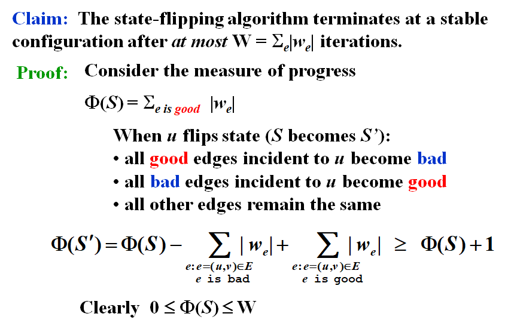

# **Chapter12 ---Local Search | 局部搜索** 

用于在给定问题的搜索空间中找到接近最优解或全局最优解的过程。

Local Search是一种启发式算法，解的质量具有不稳定性。

## Framework

### Local

- 在可行集(Feasible solution set)里定义邻域(neighborhoods)
- 局部最优(local optimum)就是邻域里的最优解

### Search

- 从一个可行解开始在邻域里找一个更好的解
- 如果不能再优化，那就找到的优解


## Template

- $S \sim S'$ :  $S'$ is a neighboring solution of $S$ —— $S'$ can be obtained by a small modification of $S$.

- $N(S)$:  neighborhood of $S$ —— the set $\{ S': S \sim S' \}$.

```c
SolutionType Gradient_descent()
{   Start from a feasible solution S in FS ;
    MinCost = cost(S);
    while (1) {
        S’ = Search( N(S) ); /* find the best S’ in N(S) */
        CurrentCost = cost(S’);
        if ( CurrentCost < MinCost ) {
            MinCost = CurrentCost;    S = S’;
        }
        else  break;
    }
    return S;
}

```


## **Vertex Cover Problem**

给定一个无向图 $G = (V, E)$，找到 $V$ 的**最小**子集 $S$ ，满足对于 $E$  中所有的边 $(u, v)$， 都有 $u\in S$ 或 $v\in S$ 。 

### Define

- **Feasible solution set**：$F(S)$：所有包含的顶点

- $cost(S)=|S|$

- $S \sim S'$：$S'$ 由 $S$ 删除（或增加）一个节点得到

### Search

从 $S=V$ 开始，删除一个节点，并检查 $S'$ 是否为 $cost$ 更小的顶点覆盖。

如图所示在Case1如果中删除了中间点将会得到一个worst solution。


## **The Metropolis Algorithm (Improve)**

```c
SolutionType Metropolis()
{   Define constants k and T;
    Start from a feasible solution S in FS ;
    MinCost = cost(S);
    while (1) {
        S’ = Randomly chosen from N(S); //Adding is allowed
        CurrentCost = cost(S’);
        if ( CurrentCost < MinCost ) {
            MinCost = CurrentCost;    S = S’;
        }
        else {
            With a probability e^{-d cost/(KT)}  , let S = S’;
            else  break;
        }
    }
    return S;
}

```


## **Hopfield Neural Networks**

给定图 $G = (V， E)$，边权为整数 $w$（可正可负)。

如果 $w_e< 0$，其中 $e = (u, v)$，那么 $u$ 和 $v$ 要有相同的状态($\pm1$)；

如果$w_e> 0$，那么 $u$ 和 $v$ 要有不同的状态。

输出：每个顶点 $u$ 的状态 $s_u$。

!!!Note

	可能不存在使所有边都满足需求，因此只需找到一个足够好的解

### Definition

- In a configuration $S$, edge $e = (u, v)$ is **good** if $w_e s_u s_v < 0$ ($w_e < 0~iff~s_u = s_v$ ); otherwise, it is **bad**.

- In a configuration $S$, a node $u$ is **satisfied** if the weight of incident good edges $\geq$ weight of incident bad edges.

$$
\sum_{v:e=(u,v)\in S}w_eu_ev_e\leq 0
$$

- A configuration is **stable** if all nodes are satisfied.

### **State-flipping Algorithm**

```C
ConfigType State_flipping()
{
    Start from an arbitrary configuration S;
    while ( ! IsStable(S) ) {
        u = GetUnsatisfied(S);
        su = - su;
    }
    return S;
}

```

### **Solution**

 


### **Related to Local Search**

- 目标：求最大的 $\Phi$
- 可行集 $F(S)$：configurations 
- $S\sim S'$：$S'$ 可以通过改变 $S$ 中的一个状态获取

!!!Claim

	Any local maximum in the state-flipping algorithm to maximize $\Phi$ is a stable configuration.

!!!Note

	该算法是否多项式可解仍然未知。


## **The Maximum Cut Problem**

给定一个无向图 $G=(V,E)$ ，每条边的权重都为正整数 $w_e$，找到一个node partition $(A,B)$，使得穿过分割线的边的总权重最大。

$$
w(A,B)=\sum_{u\in A,v\in B}w_e
$$

### **Related to Local Search**

- 目标：求最大的 $w(A,B)$
- 可行集 $F(S)$：任意切分 $(A,B)$
- $S\sim S'$：$S'$ 可以通过把一个点从 $A$ 移到 $B$（或从 $B$ 移到 $A$ ）得到

### **Solution**

 

!!!Reference

	$\bullet$ [Sahni-Gonzales 1976]  There exists a 2-approximation algorithm for MAX-CUT.
	
	$\bullet$ [Goemans-Williamson 1995]  There exists a 1.1382($\max_{0\leq \theta \leq \pi}\frac{\pi}{2}\frac{1-\cos \theta}{\theta}$)-approximation algorithm for MAX-CUT.
	
	$\bullet$ [Håstad 1997]  Unless P = NP, no 17/16 approximation algorithm for MAX-CUT.

### Big-improvement-flip

（对于原算法可能无法在多项式时间完成的优化）

只有在value至少增加 $\frac{2\epsilon}{|V|}w(A,B)$ 时才进行 flip 操作。

!!!Claim

	直到结束, Big-improvement-flip的结果满足$(2+\epsilon)w(A,B)\geq w(A^*,B^*)$

!!!Claim

	直到结束, Big-improvement-flip至多进行O($n/\epsilon \log w$)次 flips