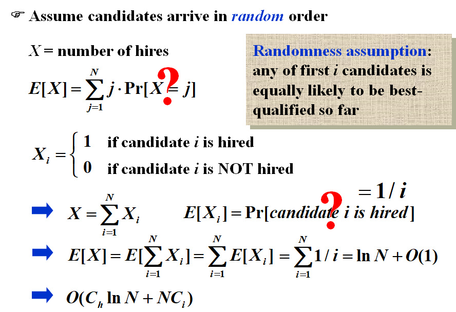

# Chapter13 ---Randomized Algorithm | 随机算法

- **Las Vegas**：结果正确，但是时间随机。（比如快排）
- **Monte Carlo**：时间确定，但是结果随机，有概率正确。（比如Online Hiring、Max-cut)


## **Hiring Problem**

- Hire an office assistant from headhunter 
- Interview a different applicant per day for N days
- Interviewing $Cost = Ci  <<  Hiring Cost = C_h$
- Analyze interview & hiring cost instead of running time

假设M个人被雇佣，则总计花费为 $O(NC_i+MC_h)$

### **Radomized Algorithm**



```c
int RandomizedHiring ( EventType C[ ], int N )
{   /* candidate 0 is a least-qualified dummy candidate */
    int Best = 0;
    int BestQ = the quality of candidate 0;

    randomly permute the list of candidates;

    for ( i=1; i<=N; i++ ) {
        Qi = interview( i ); /* Ci */
        if ( Qi > BestQ ) {
            BestQ = Qi;
            Best = i;
            hire( i );  /* Ch */
        }
    }

/*Radomized Permutation Algorithm*/
void PermuteBySorting ( ElemType A[ ], int N )
{
    for ( i=1; i<=N; i++ )
        A[i].P = 1 + rand()%(N^3); 
        /* makes it more likely that all priorities are unique */
    Sort A, using P as the sort keys;
}

```

​	

### **Online Hiring Algorithm** 

```C
int OnlineHiring ( EventType C[ ], int N, int k )
{
    int Best = N;
    int BestQ = -  ;
    for ( i=1; i<=k; i++ ) {
        Qi = interview( i );
        if ( Qi > BestQ )   BestQ = Qi;
    }
    for ( i=k+1; i<=N; i++ ) {
        Qi = interview( i );
        if ( Qi > BestQ ) {
            Best = i;
            break;
        }
    }
    return Best;
}

```

### Probability

$$
\begin{aligned}
&记S_i为事件：第i个候选人是最好的，并且他被雇佣了\\
&记事件A为：第i个候选人是最好的；事件B为看k+1\sim i-1个候选人没有被选上\\
&则Pr(S_i)=Pr(A\cap B)=Pr(A)Pr(B)\\
&易知Pr(A)=\frac{1}{N}\\
&对于事件B，则需保证前i-1个候选人里面最好的在前k个里，即Pr(B)=\frac{k}{i-1}\\
&\Rightarrow Pr(S_i)=\frac{k}{N(i-1)}\\
&\Rightarrow Pr(S)=\sum^{N}_{i=k+1}Pr(S_i)=	\sum^{N}_{i=k+1}\frac{k}{N(i-1)}=\frac{k}{N}\sum^{N-1}_{i=k}\frac{1}{i}\\
&\Rightarrow \frac{k}{N}\ln (\frac{k}{N})\leq Pr(S)\leq \frac{k}{N}\ln(\frac{k-1}{N-1})\\
&取k=\frac{N}{e},此时取到了最大概率值\Rightarrow Pr(s)\geq \frac{1}{e}
\end{aligned}
$$


## **Quick Sort**

### **Deterministic Quicksort**

- $\Theta(N^2)$: worst case
- $\Theta(N\log N)$: average case running time, assuming every input permutation is equally likely 


### 随机优化

**Central splitter** ：分割时两边至少都有 $n/4$ 个数。

**Modified Quicksort** ：每次分割时都选取Central splitter


### **Proof**

$$
\begin{aligned}
&记S为Quick~Sort的子问题\\
&定义Type~j:如果满足N(\frac{3}{4})^{j+1}\leq |S|\leq N(\frac34)^{j}，则称S的子问题为type~j\\
&对于每一级子问题，能够取到type~j的概率为\frac12，则每个子问题的期望时间为E(S)=|S|/p=O(|S|)\\
&同时，对于每一级子问题，type~j的子问题个数不多于(\frac43)^{j+1}个。\\
&\Rightarrow对于每一个j,E(type~j)=O(|S|)\times (\frac43)^{j+1}=O(N(\frac34)^{j})\times (\frac43)^{j+1}=O(N)\\
&在这个子问题拆分前提下，递归深度为O(\log_{4/3}N)\\
&\Rightarrow 总体期望时间复杂度为O(N\log N)
\end{aligned}
$$

!!!Note
	Markov's inequalty
	
	$Pr(x\geq a)\leq \frac{E(x)}{a}$

