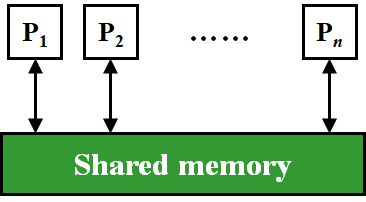
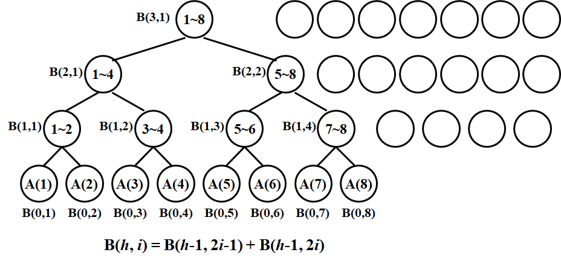
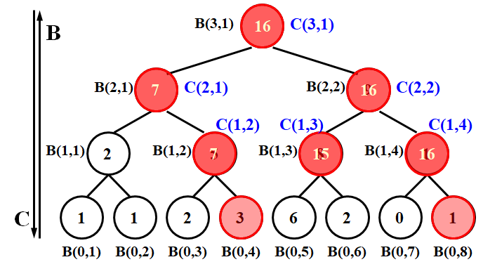
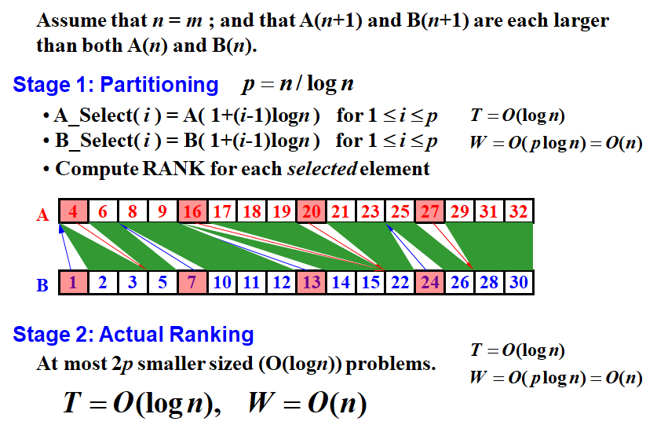
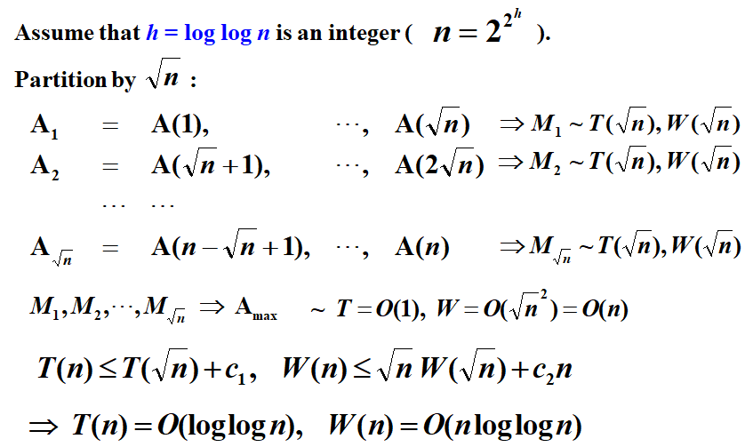
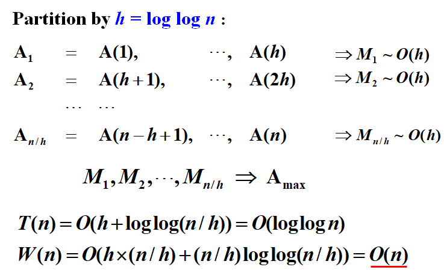
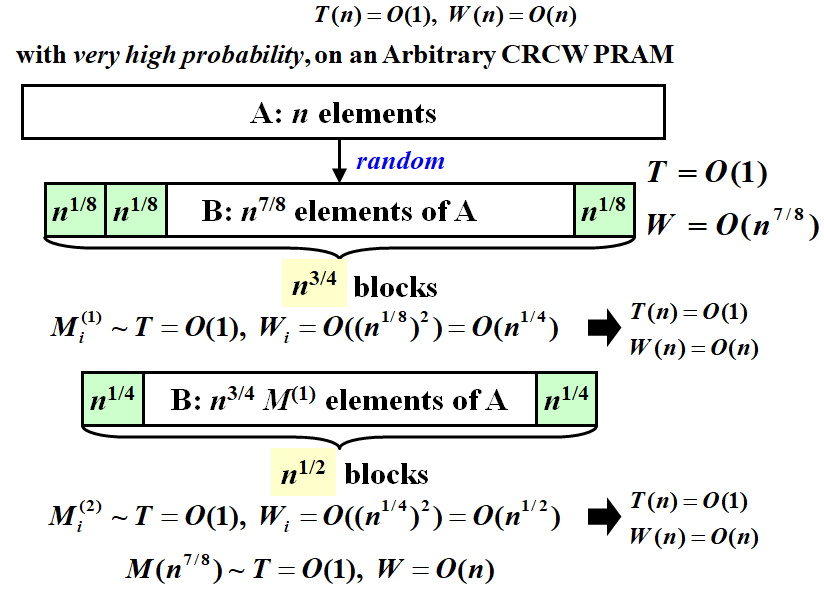

# **Chapter14 ---Parallel Algorithms | 并行算法**

## 描述并行算法

### **Parallel** Random Access Machine (PRAM) 

 

```C
for P_i, 1<=i<=n pardo
	A(i):=B(i)	 
```

!!!Note
	Define:
	

	  Exclusive:只有一个processor可以同时访问同一内存空间。
	  
	  Concurrent:多个processors可以同时访问同一内存空间。
	  
	解决访问矛盾问题：
	
	- Exclusive-Read Exclusive-Write (EREW)
	- Concurrent-Read Exclusive-Write (CREW)
	- Concurrent-Read Concurrent-Write (CRCW)
		- Arbitrary rule
	    - Priority rule (P with the smallest number)
	    - Common rule (if all the processors are trying to write the same value)

#### 描述规则

对于算法需要使用的最多processors数量 $P$ ，以及所需的worst time $T$：

仅使用 $T$ 来描述并行算法的cost。

**缺陷**

- 无法揭示算法在具有不同处理器数量的PRAMs上将如何运行。
- 完全指定处理器的指令分配需要一定程度的细节，这可能是不必要的。

### **Work-Depth (WD)**

定义以下两个概念：

- **Work Load**: 总共需要的操作数 $W(n)$
- **Worst-case running time**: $T(n)$

两者共同用于评价并行算法

以下概念近似等价：

- $W(n)$ operations and $T(n)$ time
- $P(n) = W(n)/T(n)$ processors and $T(n)$ time (on a PRAM)
- $W(n)/p$ time using any number of $p \leq W(n)/T(n)$ processors (on a PRAM)
- $W(n)/p + T(n)$ time using any number of p processors (on a PRAM)

!!!Note
	**【WD-presentation Sufficiency Theorem】**An algorithm in the WD mode can be implemented by any $P(n)$ processors within $O(W(n)/P(n) + T(n))$ time, using the same concurrent-write convention as in the WD presentation.


## **The summation problem**

- $Input:  A(1), A(2), …, A(n)$
- $Output: A(1) + A(2) + … +A(n)$

 

### **PRAM model**

```C
for P_i, 1<=i<=n pardo
  B(0,i) := A(i)
  for h = 1 to log n do
    if i <= n/2^h
      B(h,i) := B(h-1,2i-1) + B(h-1,2i)
    else stay idle
  for i = 1: output B(log n, 1); for i > 1: stay idle

```

$$
T(n)=\log n+2
$$


### **WD Presentation**

```C
for P_i , 1<=i<=n pardo
   B(0,i) := A(i)
for h = 1 to log n 
    for Pi, 1<=i<=n/2^h  pardo
        B(h,i) := B(h-1,2i-1) + B(h-1,2i)
for i = 1 pardo
   output  B(log n,1)

```

$$
\begin{aligned}
T(n)&=\log n\\
W(n)&=n+n/2+n/2^2+…+n/2^k+1,where~2^k=n\\
&=2n
\end{aligned}
$$


## **Prefix-Sums**

- $Input:  A(1), A(2), …, A(n)$
- $Output:\sum^1_{i=1}A(i),\sum^2_{i=1}A(i),…,\sum^n_{i=1}A(i)$

 

```C
for Pi , 1<=i<=n pardo
  B(0,i) := A(i)
for h = 1 to log n
  for i , 1<=i<=n/2^h pardo
    B(h,i) := B(h-1,2i-1) + B(h-1,2i)
for h = log n to 0
  for i even, 1<=i<=n/2^h pardo
    C(h,i) := C(h+1,i/2)
  for i=1 pardo
    C(h,1) := B(h,1)
  for i odd, 3<=i<=n/2^h pardo
    C(h,i) := C(h+1,(i-1)/2) + B(h, i)
for Pi , 1<=i<=n pardo
  Output C(0,i)

```

$$
\begin{aligned}
T(n)&=O(\log n)\\
W(n)&=O(n)
\end{aligned}
$$

## **Merging**

Merge two non-decreasing arrays $A(1), A(2), …, A(n)$ and $B(1), B(2), …, B(m)$ into another non-decreasing array $C(1), C(2), …, C(n+m)$.

为了简化问题，作以下假设：

1. $A$ 和 $B$ 中的所有元素都不相同
2. $n=m$
3. $\log n$ 和 $n/\log n$ 都为整数

定义 $RANK$ 函数：

$$
\begin{aligned}
&RANK( j, A) = i,   ~if ~A(i) < B(j) < A(i + 1), for ~1 \leq i < n\\
&RANK( j, A) = 0,  ~if ~B(j) < A(1) \\
&RANK( j, A) = n,  ~if ~B(j) > A(n)
\end{aligned}
$$

则通过以下操作即可完成Merge

```C
for P_i , 1<=i<=n pardo
    C(i+RANK(i,B)) := A(i)
for P_i , 1<=i<=n pardo
    C(i+RANK(i,A)) := B(i)
```

!!!Claim
	Given a solution to the ranking problem, the merging problem can be solved in $O(1)$ time and $O(n+m)$ work.

 

#### **求解RANK问题**

- **Binary Search**

```C
for P_i , 1<=i<=n pardo
    RANK(i,B) := BS(A(i),B)
    RANK(i,A) := BS(B(i),A)
```

$$
\begin{aligned}
T(n)&=O(\log n)\\
W(n)&=O(n\log n)
\end{aligned}
$$

- **Serial Ranking**

```C
i = j = 0; 
while ( i<=n || j<=m ) {
    if ( A(i+1) < B(j+1) )
        RANK(++i,B) = j;
    else RANK(++j,A) = i;
}

```

$$
\begin{aligned}
T(n)=W(n)=O(m+n)
\end{aligned}
$$

- **Parallel Ranking**

 


## **Maximum Finding**

将summation problem中的“+”替换成“max，可得

​	$T(n)=O(\log n),W(n)=O(n)$

- **Compare all pairs**

```C
for P_i , 1<=i<=n  pardo
    B(i) := 0
for i and j, 1<=i, j<=n  pardo
    if ( (A(i) < A(j)) || ((A(i) = A(j)) && (i < j)) )
            B(i) = 1
    else B(j) = 1
for Pi , 1<=i<=n  pardo
    if B(i) == 0
       A(i) is a maximum in A
```

$$
\begin{aligned}
T(n)&=O(1)\\
W(n)&=O(n^2)
\end{aligned}
$$

- **A Doubly-logarithmic Paradigm**

**Partition by** $\sqrt n$

 


**Partition by** $h=\log \log n$

 


- **Random Sampling**

 

```C
while (there is an element larger than M) {
     for (each element larger than M)
         Throw it into a random place in a new B(n^{7/8});
     Compute a new M;
}

```

!!!Theorem
	The algorithm finds the maximum among $n$ elements.  With very high probability it runs in $O(1)$ time and $O(n)$ work.  The probability of not finishing within this time and work complexity is $O(1/n^c)$ for some positive constant $c$.


