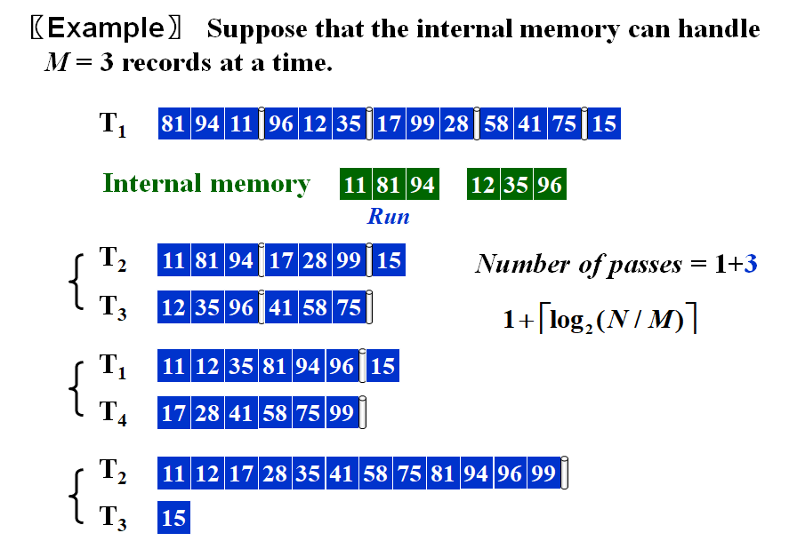
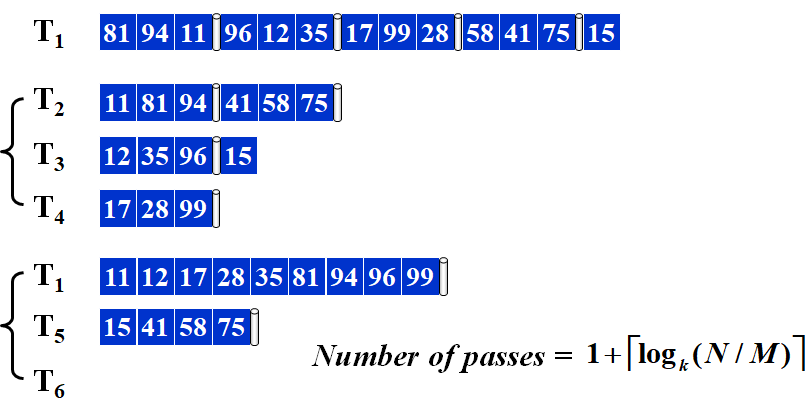
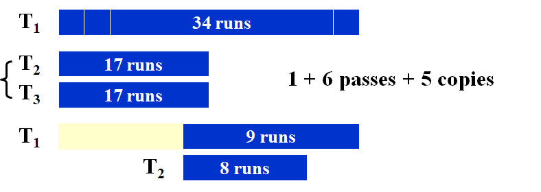
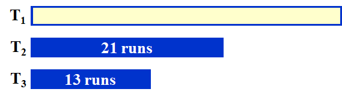
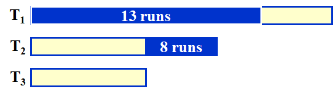
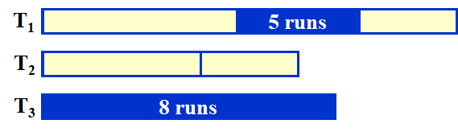
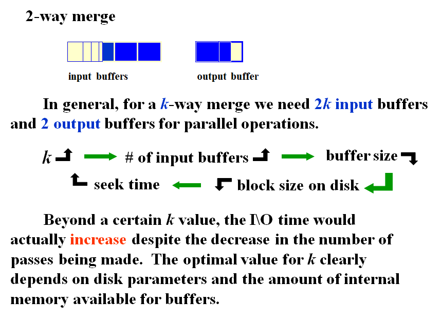
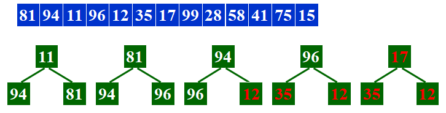
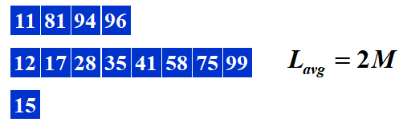
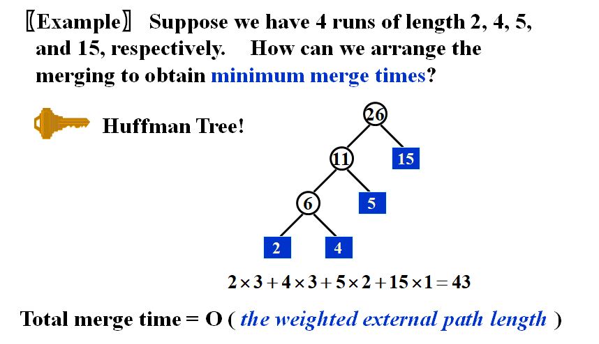

# **Chapter15 ---External Sorting | 外部排序**

排序方法：Merge Sort

简化问题：

- 假设数据存储在磁带tapes上（只能顺序获取）
- 可以使用至少3个tape drivers

 

## **k-way Merge**

- 目的：减少passes的数量
- 缺点：需要使用2k个tapes

 

## **Split Unevenly**

对于34runs，使用3tapes，2-way merge，所需的 

$$
cost=1+6passes+5copies
$$

 

而使用split unevenly

  

 

 

以此类推向下拆分，能够避免重复copy数据，使 

$$
cost=1+7passes
$$

!!!Claim
	If the number of runs is a Fibonacci number $F_N$, then the best way to distribute them is to split them into $F_{N–1}$ and $F_{N–2}$ .

!!!Claim
	For a k-way merge, $F^{(k)}_N=F^{(k)}_{N-1}+…+F^{(k)}_{N-k}$, where $F^{(k)}_N=0(0\leq N \leq k-2), F^{(k)}_{k-1}=1$

$$
\begin{aligned}
\text{例如}&\text{，对于3-way merge，需取以下关系}\\
&\left\{ \begin{array}{l}
T_1=F_{n-1}+F_{n-2}+F_{n-3}\\
T_2=F_{n-1}+F_{n-2}\\
T_3=F_{n-1} 
\end{array}\right.\\
\text{则第}&\text{一轮合并}F_{n-1}后变为以下关系\\
&\left\{ \begin{array}{l}
T_1=F_{n-2}+F_{n-3}\\
T_2=F_{n-2}\\
T_4=F_{n-1}=F_{n-2}+F_{n-3}+F_{n-4} 
\end{array}\right.\\
\text{如此}&\text{循环直到排序结束}
\end{aligned}
$$

## **Buffers Handle**

 

## **Longer Run**

 

按照如图所示的方式生成run，则可以得到以下runs：

 

- 这种方式在原数据接近有序的情况下效果较好。

### **最小化Merge Time**

使用Huffman树可以使得不同长度run的Merge Time达到最小。

    

