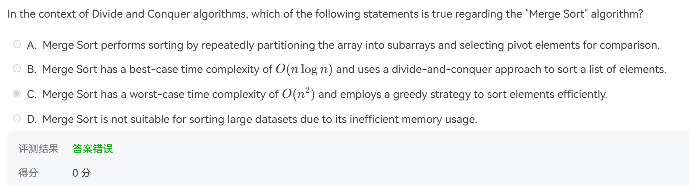
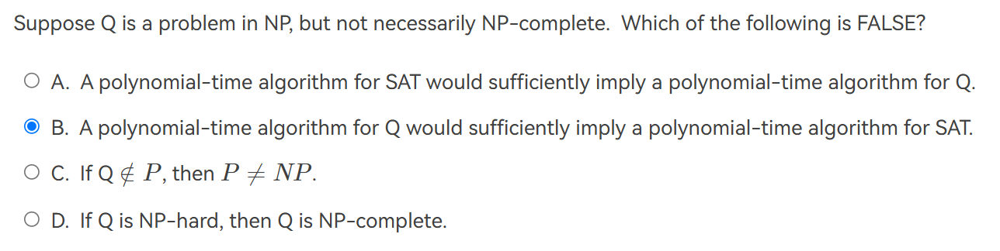
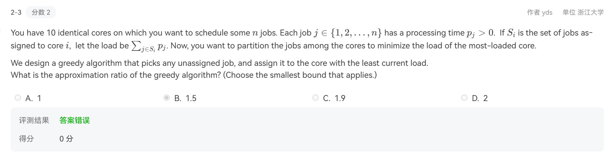
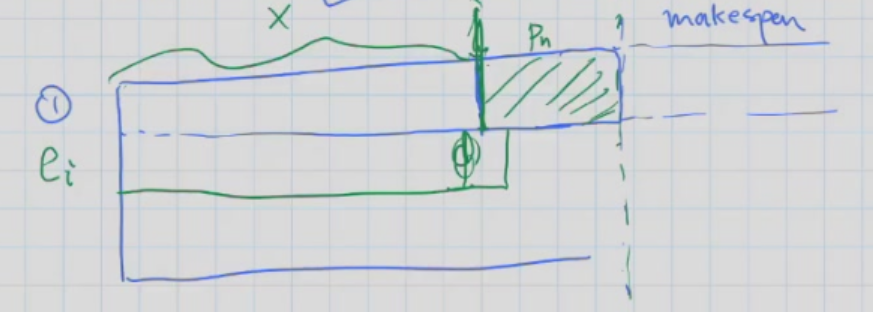
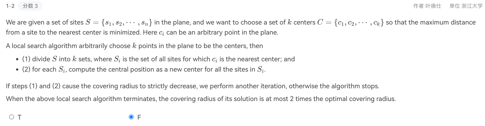

# **习题**

 

Right Answer: **B**

- Proof

 

$$
\begin{aligned}
假设&使用Greedy分配的工作形式如上图.则有以下关系：\\
&L_i\geq x,~i=1,2,……,m\\
&T_{OPT}\geq max\{p_i\} \Rightarrow P_n\leq T_{OPT}\\
&T_{OPT}\geq \frac{\sum^n_{i=1}p_i}{m}\geq \frac{mx+p_n}{m}=x+\frac{p_n}{m} \\
\Rightarrow&T=x+p_n\leq x+\frac{p_n}{m}+(1-\frac{1}{m})p_n\leq T_{OPT}+(1-\frac{1}{m})T_{OPT}\\
\Rightarrow&\alpha=\frac{T}{T_{OPT}}\leq 2-\frac{1}{m}\\
构造&(m-1)m个p_i=1的工作和一个p_i=m的工作。\\
此时&T=2m-1,T_{OPT}=m\\
\Rightarrow&\alpha\geq \frac{2m-1}{m}=2-\frac{1}{m}\\
\Rightarrow&\alpha=2-\frac{1}{m}\\
\end{aligned}
$$

!!!Note

	可以使用排序是，近似比可优化到$\alpha=1+\frac{1}{3}(1-\frac{1}{m})=\frac{4}{3}-\frac{1}{3m}$

