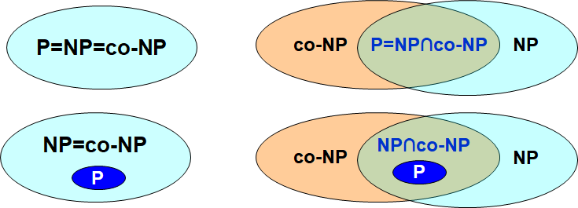

# 高级数据结构与算法分析

## **Grading Policy**

#### **平时（<=60）**

• Homework    10%

• Discussions    10%

• Research Project    30%  (Project1: 14% + Presentation  6%  ;  Project2: 10%)

• Midterm    10%

• Bonus 

#### **Final    40%**


## **Chapter 1 ---AVL Trees, Splay Trees, and Amortized Analysis**

• height:  该节点向下的最长路径长度

• depth:  根节点到该节点的距离

• balance factor:  左右子树高度差

### **AVL Tree**

#### **Definition**

1. 左右子树高度差不超过1

2. 所有子树都是AVL Tree


#### **The Minimum number of nodes**

$$
\begin{align*}
n_h为&height为h的AVL~Tree的最小节点个数\\\\
&n_h=n_{h-1}+n_{h-2}+1\\\\
&n_{-1}=0,~n_0=1\\\\
Fibo&nacii~numbers:\\\\
&F_i=F_{i-1}+F_{i-2}\\\\
&F_0=0,~F_1=1\\\\
\Rightarrow&n_h=F_{h+3}-1,~for~h\geq0\\\\
\Rightarrow&n_h\approx\frac{1}{\sqrt5}(\frac{1+\sqrt5}{2})^{h+2}-1~~\\\\
\Rightarrow&h=O(ln(n))\\\\
&&&&&&&&&&&&&&&&&&&&
\end{align*}
$$


#### **Single Rotation**

 

 


#### **Double Rotation**

 

 

#### **Time Complexity**

$$
\begin{aligned}
&Search&&O(logN)&&\\
\\
&Insertion&&O(logN)&&\\
\\
&Deletion&&O(logN)&&&&&&&&&&&&&&&&&&&&&&&&&\\
\end{aligned}
$$


### **Splay Tree  |  伸展树**

#### **Definition**

从空树开始连续M次操作时间不会超过O(M log N)

**核心思想：一个节点被访问后，通过一系列rotation操作将这个节点转移至根节点**


#### **Operation**

   

#### **Deletion**

 


### **Amortized Analysis  |  摊还分析**

求数据结构的一个操作序列中执行的所有操作的平均时间，来评价操作的代价。


#### **Aggregate analysis | 聚合分析**

证明对所有n个操作，一个包含n个操作的序列总共花费最坏情况时间$T(n)$。在最坏的情况下，每次操作的平均成本或平摊成本因此是$\frac{T(n)}{n}$。

#### **Accounting method | 核算法**

对于每一种操作，赋予一个**摊还代价(amortized cost)**。赋予某些操作的摊还代价可能多于或少于其实际代价。当一个操作的摊还代价超出其实际的代价的时候，我们将差额存入数据结构的特定对象中，存入的差额称为**信用（Credit)**。对于后续操作中小于其实际代价的时候，预存的信用可以用来支付差额。

$$
\begin{align*}
如果&用c_{i}表示第i个操作的真实代价，用\hat{c_i}代表第i个操作的摊还代价，需满足：&&&&&&\\\\
&\sum_{i=1}^n\hat{c_i}\geqslant\sum_{i=1}^nc_i\\\\
&T_{amortized}=\frac{\sum_{i=1}^n\hat{c_i}}{n} =O(?)\\\\
那么&可知,摊还成本为O(?)
\end{align*}
$$

     

#### **Potential method | 势能法**

使用**势函数$\Phi$**来表示credit。

$$
\begin{align*}
\hat{c_i}-c_i&=Credit_i=\Phi(D_i)-\Phi(D_{i-1}) ~~\Leftarrow~~Potential~Funciton\\\\
\sum_{i=1}^n\hat{c_i}&=\sum_{i=1}^n(c_i+\Phi(D_i)-\Phi(D_{i-1}))&&&&&&&&&\\\\
&=(\sum_{i=1}^nc_i)+\Phi(D_n)-\Phi(D_0)\\\\
为满足&Accounting~method的条件，只需满足\Phi(D_n)-\Phi(D_0)\geqslant0\\\\
\end{align*}
$$

!!!NOTE
    $$
    假设需证明\sum_{i=1}^nc_i=O(n),~则当满足\Phi(D_n)-\Phi(D_0)=-n时也可也可满足，无须大于0~~~~~~~~~~~~~~~~~~~~~~~\\
    $$


    


## **Chapter 2 ---Red-Black Trees and B+ Trees**

### **Red-Black Trees**

#### **Definition**

1.红黑树是一个二叉排序树

2.每个节点都是红色或者黑色

3.根节点为黑色

4.叶子节点（外部节点、NULL节点、失败的节点）都为黑色

5.红色节点的父节点和孩子节点都为黑色

6.对于每个节点，从该节点到任一叶子节点的路径上的黑色节点数量相同

#### **black-height**

用 $bh(x)$ 表示，指从任意 $x$ 开始的任意简单路径上的黑色节点数量（不包括 $x$)

$bh(NULL)=0$

#### **Insert**

每次插入都插入红色节点，对称同理

 

#### **Delete**

**Case 1 ：$x_0$的兄弟节点$w$为红色。**

• 交换父节点和兄弟节点的颜色。($w$变为黑色)

• 对删除的节点的方向进行一次rotation。

• 前往Cases 2.1 / 3 / 4。


**Case 2.1 $x_0$的兄弟节点$w$为黑色, 并且$w$的子节点为黑色。 同时, $x$的父节点为红色。**

• 交换$x_0$父节点和兄弟节点的颜色，完成删除。

 

**Case 2.2 $x_0$的兄弟节点$w$为黑色，并且$w$的子节点都为黑色。并且$x_0$的父节点为黑色。**

• 把$x_0$的兄弟节点设为红色

• $x_0$的父节点变为新的删除节点$z$，递归至根节点。


**Case 3 $x_0$的兄弟节点$w$为黑色，$w$有一个红色的子节点，并且"outer nephew"为黑色。**

• 交换$w$和"inner nephew"的颜色。

• 对$x_0$的兄弟节点$w$向"outer nephew"的方向进行一次rotation。

• 前往case 4。


**Case 4 $x_0$的兄弟节点$w$为黑色，$w$至少有一个红色的子节点，并且 "outer nephew"为红色。**

• 将兄弟节点$w$设为父节点的颜色；将父节点和"outer nephew"的颜色设为黑色.

• 将父节点向被删除节点的方向进行一次rotation。


!!!NOTE
    最多的rotation次数：Case 1  $\rightarrow$  Case 3  $\rightarrow$  Case 4   (3次)

#### **Numbers of Rotations**

$$
\begin{aligned}
&&~~~~~~~~&AVL&~~~~~~~~Red-&Black~Trees&&&&&&&&&&&\\
\\
&Insertion&&\leqslant2&&\leqslant2&\\
\\
&Deletion&&O(logN)&&\leqslant3
\end{aligned}
$$

#### **Time Complexity**

$$
\begin{aligned}
&Search&&O(logN)&&\\
\\
&Insertion&&O(logN)&&\\
\\
&Deletion&&O(logN)&&&&&&&&&&&&&&&&&&&&&&&&&\\
\end{aligned}
$$


### **B+ Trees**

#### **Definition**

**M阶B+树 (B+ Trees of order M)**  具有以下性质：

1.根节点是一个叶节点或者有 $2-M$ 个子节点。

2.所有非叶节点（除了根节点）都有 $\lceil M/2\rceil-M$ 个子节点。

3.所有叶节点都在同一层，假设每个非根叶也有 $\lceil M/2\rceil-M$个键。


## **Chapter 3 ---Inverted File Index | 倒排文件索引**

在建立索引时就确定字符串在哪里出现过。即在查找时用关键词为索引查找文档。

 

#### **生成算法**

 

#### **处理方法**

 

#### **Precision | Recall**

**Precison：查询到的文件中相关的比例**

**Recall：有关的文件中被查询到的比例**

 

 

!!!NOTE
     

## **Chapter 4 ---Leftist Heaps and Skew Heaps**

### **Leftist Heaps | 左式堆**

#### **Null path length | 零路径长**

从X到一个不具有两个儿子的结点的最短路径的长。

定义 $Npl(NULL) = -1$。

$$
Npl(X) = min \{ Npl(C) + 1~for~all~C~as~children~of~	X \}~~~~~~~~~~~~~~~~~~~~~~~~~~~~~~~~~~~~~~~~~~~~~~~
$$

#### **性质**

堆中的任何节点，其左儿子的零路径长>=右儿子的零路径长。

#### **定理**

右路径上有 $r$ 个节点的 leftist tree 至少有 $2^r-1$ 个节点

#### **Merge**

 

 

#### **DeleteMin**

1.删除根节点

2.Merge左右子树

#### **Time Complexity**

$$
\begin{aligned}
&Merge&&O(logN)&&\\
\\
&Insertion&&O(logN)&&\\
\\
&Deletion&&O(logN)&&&&&&&&&&&&&&&&&&&&&&&&&\\
\end{aligned}
$$


### **Skew Heaps  | 斜堆**

#### **目标**

任何M次连续的操作的时间复杂度为O(MlogN)

#### **Heavy node**

右子树节点 > 左子树节点

否则为 **light node**

#### **Merge**

(case1) 如果一个空斜堆与一个非空斜堆合并，返回非空斜堆。

(case2) 如果两个斜堆都非空，那么比较两个根节点，取较小堆的根节点为新的根节点。将”较小堆的根节点的右孩子”和”较大堆”进行合并。

(case3) 合并后，**交换新堆根节点的左孩子和右孩子**。

#### **Amortized Analysis for Skew Heaps**

 

 


## **Chapter 5 ---Binomial Queue | 二项堆** 

#### **Definition**

二项堆是堆的集合，每个堆都是**二项树(binomial tree)**。

#### **Binomial Tree | 二项树**

$•~height~为~0~的二项树为一个节点$

$•~高度为~k~的二项树~B_k~,由~B_{k-1}~连接到~B_{k-1}~的根节点构成$

 

!!!NOTE
    $•~B_k~有~k~个节点，分别为~B_0,B_1,……,B_{k-1}$

​    $•~B_k~有2^k个节点$

​    $•~深度为d的节点数为\left( \begin{array}{c}k \\ d \end{array} \right)$


#### **Merge**

 


#### **Insert**

特殊的Merge

• 如果最小的空二项树为 $B_i$ ，则 $T_p=Const\times(i+1)$。

• 对一个空二项堆，N次Inseet操作的worst case为 $O(N)$ 。因此平均时间复杂度为常数。


#### **FindMin**

最小值一定是其中一颗二项树的根节点。由于至多存在 $\lceil logN \rceil$ 个根节点，$T_p=O(logN)$。

!!!Note
    可以通过记忆并实时更新最小值所在位置，使时间复杂度到达$O(1)$。


#### **DeleteMin**

​    

#### **Proof**

$$
\begin{align*}
记~&C_i::=第~i~次操作的代价\\\\
&\Phi_i::=在第~i~次操作后二项树的数量(\Phi_0=0)\\\\
假&设第~i~次操作前第一个空二项树为B_d，则：\\\\
&C_i=d+1\\\\
&\Phi_i-\Phi_{i-1}=d-1\\\\
\Rightarrow&C_i+(\Phi_i-\Phi_{i-1})=2，i=1,2,…,N\\\\
\Rightarrow&\sum^N_{i=1}C_i=2N-\Phi_N\leqslant2N=O(N)\\\\
\Rightarrow &T_{Worst}=O(logN)~,~T_{Amortized}=2&&&&&&&&&&&&&&&&&&\\
\end{align*}
$$


#### **Time Complexity**

$$
\begin{aligned}
&Merge&&O(logN)&&\\
\\
&Insertion&&O(logN)(从零开始插入平均O(1))&&\\
\\
&Delete~Min&&O(logN)&&\\
\\
&Decrease~Key&&O(logN)&&\\
\\
&Find~Min&&O(logN)(可以通过标记变为O(1))&&\\
\\
&Deletion&&O(logN)&&&&&&&&&&&&&&&&\\
\end{aligned}
$$


#### **Code**

```C
typedef struct BinNode *Position;
typedef struct Collection *BinQueue;
typedef struct BinNode *BinTree;  /* missing from p.176 */

struct BinNode 
{ 
	ElementType	    Element;
	Position	    LeftChild;
	Position 	    NextSibling;
} ;

struct Collection 
{ 
	int	    	CurrentSize;  /* total number of nodes */
	BinTree	TheTrees[ MaxTrees ];
} ;

BinTree CombineTrees( BinTree T1, BinTree T2 )
{  /* merge equal-sized T1 and T2 */
	if ( T1->Element > T2->Element )
		/* attach the larger one to the smaller one */
		return CombineTrees( T2, T1 );
	/* insert T2 to the front of the children list of T1 */
	T2->NextSibling = T1->LeftChild;
	T1->LeftChild = T2;
	return T1;
}
//Merge
BinQueue  Merge( BinQueue H1, BinQueue H2 )
{	BinTree T1, T2, Carry = NULL; 	
	int i, j;
	if ( H1->CurrentSize + H2-> CurrentSize > Capacity )  ErrorMessage();
	H1->CurrentSize += H2-> CurrentSize;
	for ( i=0, j=1; j<= H1->CurrentSize; i++, j*=2 ) {
	    T1 = H1->TheTrees[i]; T2 = H2->TheTrees[i]; /*current trees */
	    switch( 4*!!Carry + 2*!!T2 + !!T1 ) { 
		case 0: /* 000 */
	 	case 1: /* 001 */  break;	
		case 2: /* 010 */  H1->TheTrees[i] = T2; H2->TheTrees[i] = NULL; break;
		case 4: /* 100 */  H1->TheTrees[i] = Carry; Carry = NULL; break;
		case 3: /* 011 */  Carry = CombineTrees( T1, T2 );
			            H1->TheTrees[i] = H2->TheTrees[i] = NULL; break;
		case 5: /* 101 */  Carry = CombineTrees( T1, Carry );
			            H1->TheTrees[i] = NULL; break;
		case 6: /* 110 */  Carry = CombineTrees( T2, Carry );
			            H2->TheTrees[i] = NULL; break;
		case 7: /* 111 */  H1->TheTrees[i] = Carry; 
			            Carry = CombineTrees( T1, T2 ); 
			            H2->TheTrees[i] = NULL; break;
	    } /* end switch */
	} /* end for-loop */
	return H1;
}
//DeleteMin
ElementType  DeleteMin( BinQueue H )
{	BinQueue DeletedQueue; 
	Position DeletedTree, OldRoot;
	ElementType MinItem = Infinity;  /* the minimum item to be returned */	
	int i, j, MinTree; /* MinTree is the index of the tree with the minimum item */

	if ( IsEmpty( H ) )  {  PrintErrorMessage();  return –Infinity; }

	for ( i = 0; i < MaxTrees; i++) {  /* Step 1: find the minimum item */
	    if( H->TheTrees[i] && H->TheTrees[i]->Element < MinItem ) { 
		MinItem = H->TheTrees[i]->Element;  MinTree = i;    } /* end if */
	} /* end for-i-loop */
	DeletedTree = H->TheTrees[ MinTree ];  
	H->TheTrees[ MinTree ] = NULL;   /* Step 2: remove the MinTree from H => H’ */ 
	OldRoot = DeletedTree;   /* Step 3.1: remove the root */ 
	DeletedTree = DeletedTree->LeftChild;   free(OldRoot);
	DeletedQueue = Initialize();   /* Step 3.2: create H” */ 
	DeletedQueue->CurrentSize = ( 1<<MinTree ) – 1;  /* 2MinTree – 1 */
	for ( j = MinTree – 1; j >= 0; j – – ) {  
	    DeletedQueue->TheTrees[j] = DeletedTree;
	    DeletedTree = DeletedTree->NextSibling;
	    DeletedQueue->TheTrees[j]->NextSibling = NULL;
	} /* end for-j-loop */
	H->CurrentSize  – = DeletedQueue->CurrentSize + 1;
	H = Merge( H, DeletedQueue ); /* Step 4: merge H’ and H” */ 
	return MinItem;
}

```

## **Chpater 6 ---Backtracking | 回溯**

### **Template**

```C
bool Backtracking ( int i )
{   Found = false;
    if ( i > N )
        return true; /* solved with (x1, …, xN) */
    for ( each xi in Si ) { 
        /* check if satisfies the restriction R */
        OK = Check((x1, …, xi) , R ); /* pruning */
        if ( OK ) { 	
            Count xi in;
            Found = Backtracking( i+1 );
            if ( !Found )
                Undo( i ); /* recover to (x1, …, xi-1) */
        }
        if ( Found ) break; 
    }
    return Found;
}

```


### **Eight Queens | 八皇后问题**

（以四皇后问题为例）

（1）建立决策树

（2）DFS


### **The Turnpike Reconstruction Problem | 收费公路重构问题**

​	在 $x$ 粥上有 $N$ 个点， $x_1<x_2<x_3<\cdots<x_N$ , 假设 $x_1=0$ 。给出 $N(N-1)$ 个距离，重构出每个点的位置。


**Code**

```C
bool Reconstruct ( DistType X[ ], DistSet D, int N, int left, int right )
{ /* X[1]...X[left-1] and X[right+1]...X[N] are solved */
    bool Found = false;
    if ( Is_Empty( D ) )
        return true; /* solved */
    D_max = Find_Max( D );
    /* option 1：X[right] = D_max */
    /* check if |D_max-X[i]|D is true for all X[i]’s that have been solved */
    OK = Check( D_max, N, left, right ); /* pruning */
    if ( OK ) { /* add X[right] and update D */
        X[right] = D_max;
        for ( i=1; i<left; i++ )  Delete( |X[right]-X[i]|, D);
        for ( i=right+1; i<=N; i++ )  Delete( |X[right]-X[i]|, D);
        Found = Reconstruct ( X, D, N, left, right-1 );
        if ( !Found ) { /* if does not work, undo */
            for ( i=1; i<left; i++ )  Insert( |X[right]-X[i]|, D);
            for ( i=right+1; i<=N; i++ )  Insert( |X[right]-X[i]|, D);
        }
    }
    /* finish checking option 1 */
    if ( !Found ) { /* if option 1 does not work */
        /* option 2: X[left] = X[N]-D_max */
        OK = Check( X[N]-D_max, N, left, right );
        if ( OK ) {
            X[left] = X[N] – D_max;
            for ( i=1; i<left; i++ )  Delete( |X[left]-X[i]|, D);
            for ( i=right+1; i<=N; i++ )  Delete( |X[left]-X[i]|, D);
            Found = Reconstruct (X, D, N, left+1, right );
            if ( !Found ) {
                for ( i=1; i<left; i++ ) Insert( |X[left]-X[i]|, D);
                for ( i=right+1; i<=N; i++ ) Insert( |X[left]-X[i]|, D);
            }
        }
        /* finish checking option 2 */
    } /* finish checking all the options */
    
    return Found;
}

```

### **MiniMax**

Tic-tac-toe：井字棋

**基本思路：**

​	决策树的一层代表己方，一层代表对方。

​	记W是位置P的**potential wins** 数量。$f(p)=W_{Computer}-W_{Human}$		

​	从最底层向上搜索：在己方决策层，即Max层，选取子节点中最大的一个；对方决策层，即Min层，选择子节点中最小的一个。


!!!NOTE
    **potential wins**

    以这张图为例，蓝线为X的potential wins，红线为O的potential wins。
    
    $\Rightarrow f(p)=6-4=2$
    
     


#### **$\alpha$-$\beta$ prunning | $\alpha$-$\beta$剪枝**

**$\alpha$剪枝：**在Max层的决策过程中，若找到比以找节点更小的值，则不需要继续向下搜索。

 

**$\beta$剪枝：**在Min层的决策过程中，若找到比以找节点更大的值，则不需要继续向下搜索。

 

​	在实践中，同时使用 $\alpha$ 剪枝和 $\beta$ 剪枝，能够将搜索从 $O(N)$ 减小到 $O(\sqrt{N})$ ，其中N为决策树的规模。


## **Chapter 7 ---Divide and Conquer | 分治**

### **递归式**

$$
T(N)=a~T(N/b)~+~f(N)
$$


### **求解方法**

#### **Substitution method | 代入法**

**Example :** $T(N)=2~T(\lfloor N/2\rfloor)+N$

$$
\begin{aligned}
Guess:&T(n)=O(NlogN)\\\\
Proof:&Assume~it~is~true~for~all~m<N,~in~particular~for~m=\lfloor N / 2\rfloor.\\\\
&Then~there~exists~a~constant~c~>~0~so~that~T(\lfloor N~/~2\rfloor)\leqslant c \lfloor N / 2\rfloor log \lfloor N / 2\rfloor \\\\
&Substituting~into~the~recurrence:\\\\
&T( N ) = 2~T( \lfloor N / 2\rfloor ) + N\\\\
&~~~~~~~~~~\leqslant 2~c \lfloor N / 2\rfloor log \lfloor N / 2\rfloor + N\\\\
&~~~~~~~~~~\leqslant c~N (log N – log 2) + N\\\\
&~~~~~~~~~~\leqslant c~N log N~~~~for~c \leqslant 1
\end{aligned}
$$

#### **Recursion-tree method | 递归树法**

 

 

#### **Master method | 主方法**

对于$T(N)=a~T(N/b)~+~f(N)$

$\bullet$ **Case1**: $f(N)=O(N^{\log_b a-\varepsilon}) \Rightarrow T(N)=\Theta(N^{\log_ba})$

$\bullet$ **Case2:** $f(N)=\Theta(N^{\log_ba}\log^pN)\Rightarrow T(N)=\Theta(N^{\log_ba}\log^{p+1} N)$

$\bullet$ **Case3**:  $f(N)=\Omega(N^{\log_ba+\varepsilon}),and~af(N/b)\leqslant cf(N)\Rightarrow T(N)=\Theta(f(N))$


## **Chapter 8 ---Dynamic Programming | 动态规划**

适用于具有重叠子问题和最优子结构性质的问题。在求解过程中保存子问题的解，避免子问题重复计算，即用空间换时间。

### **求解**

1.Characterize an optimal solution

2.Recursively define the optimal values

3.Compute the values in some order

4.Reconstruct the solving strategy

### **经典问题**

$\bullet$ **Fibonacci Numbers**

$\bullet$ **Ordering Matrix Multiplications**

$\bullet$ **Optimal Binary Search Tree**

$\bullet$ **Optimal Binary Search Tree**

$\bullet$ **背包问题**


## **Chapter 9 ---Greedy | 贪心**

在每一步选择中都采取最优的选择，后续阶段的选择不会改变前面已经做出的选择。

!!!NOTE
	贪心算法仅在局部最优等于全局最优时可行。

### **Activity Selection Problem** 


**Solution:** 每次选择结束最早且与已选择的不重复的时间段。


### **Huffman Code** (用于文件压缩)

```c
void Huffman ( PriorityQueue  heap[ ],  int  C )
{   consider the C characters as C single node binary trees,
     and initialize them into a min heap;
     for ( i = 1; i < C; i++ ) { 
        create a new node;
        /* be greedy here */
        delete root from min heap and attach it to left_child of node;
        delete root from min heap and attach it to right_child of node;
        weight of node = sum of weights of its children;
        /* weight of a tree = sum of the frequencies of its leaves */
        insert node into min heap;
   }
}

```

$$
T=O(C\log C)
$$


## **Chapter 10 ---NP-Completeness**

### **Polynomial time**

$f(N)=O(N^k)$

$\Rightarrow \log(f(N))=O(\log N)$

### **Defination**

#### **Language**

对于一个problem $X$,对应的language $L$,为：

​	If $x\in L$  then are supposed to answer "Yes" and if $x\notin L$, we are supposed to answer "No".

#### **P** (Polynomial)

The set of decision problems that can be solved in polynomial time

#### **NP** (Nondeterminism polynomial)

The set of decision problems with the following property: If the answer is "Yes", then there is a proof of this fact that can be checked in polynomial time.

#### **co-NP**

The set of decision problems $X$ such that $\overline{X}\in NP$.

Essentially the opposite of NP. If the answer to a problem in co-NP is "No", then there is a proof of this fact that can be checked in polynomial time.

!!!Note
	四种可能的关系
	

!!!Note
	不确定图灵机可以用来验证NP问题的解是否是正确的，确定图灵机可以用来求解P问题。

### **NP-complete problems**

#### $L_1\leqslant_TL_2$

如果解决$L_2$的算法可以解决$L_1$，那么问题$L_1$可以reduce到$L_2$

#### $L_1\leqslant_pL_2$ **(polynomial-time reducible)**

存在多项式时间的函数$f:\{0,1\}^*\rightarrow \{0,1\}^*$使得对于所有$x\{0,1\},x\in L_1~iff~f(x)\in L_2$

- $f$: reduction function

- 执行$f$的多项式时间算法$F$: reduction algorithm

#### **NP-complete**

$1.L\in Np$

$2.L'\leqslant _pL~for~every~L'\in NP$

#### **NP-hard**

$L'\leqslant_pL~for~every~L'\in NP$

#### **传递性**

$L_1\leqslant_p L_2~and~L_2\leqslant_p L_3~~~~\Rightarrow~~~~L_1\leqslant_p L_3$

#### **Examples**

- Vertex cover problem
- Hamiltonian cycle problem
- Satisfiability problem

### **Proof**

#### $A\leqslant_p B$

1.找到映射函数$f$，证明$f$可以在多项式时间内运行。

2.证明$\forall x\in A,~f(x)\in B$

3.证明$\forall f(x)\in B,~A \in x$

#### **Y is NP-Complete**

1.证明$Y\in NP$

2.找到一个NP-complete problem $X$，证明$X\leqslant_p Y$


## **Chapter11 ---Approximation | 近似算法**  

### **Approximation Ratio | 近似率**

#### **Definition**

对于一个输入规模为 $n$ 的算法，记算法的approximation ratio为 $\rho(n)$。

记近似算法给出的结果为 $C$ ，最优算法给出的结果为 $C^*$ ，则有以下关系：

$$
max(\frac{C}{C^*},\frac{C^*}{C})\leqslant \rho(n)~~~~~~~~~~~~~~~~~~~~~~~~~~~~~~~~~~~~~~~~~
$$

对于一个可以达到 $\rho(n)$ 的算法，我们称之为 $\rho(n)$-**approximation algorithm**.

#### **Minimum Probelm**

上式可写为 $C\leqslant \rho(n)C^*$ ，其中 $\rho(n)> 1$。

**Proof**

1. $C^*\geqslant x$
2. $C\leqslant x\rho(n) \leqslant \rho(n)C^*$

#### **Maximum Probelm**

上式可写为 $C\geqslant \rho(n)C^*$ ，其中 $0<\rho(n)< 1$。

**Proof**

1. $C^*\leqslant x$
2. $C\geqslant x\rho(n) \geqslant \rho(n)C^*$


### **Approximation scheme | 近似方案**

#### Definition

Approximation scheme是一种近似算法，它的输入值除了算法输入以外，还有一个值 $\varepsilon$ 。对于任何 $\varepsilon$ ，这个scheme是一个 (1+$\varepsilon$)-approximation algorithm. 

#### **PTAS**

Polynomial-time approximation scheme

- **Example**: $O(n^{2/\varepsilon})$

#### **FPTAS**

Fully polynomial-time approximation scheme 

- **Example**: $O((1/\varepsilon)^2n^3)$

!!!Note

	注意区分PTAS和FPTAS。PTAS的 $1/\varepsilon$ 在指数部分，而FPTAS的 $1/\varepsilon$ 在外部。


### **Approximate Bin Packing**

  

#### **Next Fit**

每次放不下之后都新建一个bin，并放到新的bin里。

```c
void NextFit ( )
{   read item1;
    while ( read item2 ) {
        if ( item2 can be packed in the same bin as item1 )
	place item2 in the bin;
        else
	create a new bin for item2;
        item1 = item2;
    } /* end-while */
}

```

!!!Theorem

	Let $M$ be the optimal number of bins required to pack a list $I$ of items. Then next fit never uses more than $2M – 1$ bins.   There exist sequences such that next fit uses $2M  – 1$ bins.


#### **First Fit**

每次都把物品放入第一个可以放得下的bin中。算法的时间复杂度可以利用二叉搜索树减小到 $O(N\log N)$，搜索树中以下标为排序依据，同时每个节点存储子树的最大剩余容量以及本节点的剩余容量。

```C
void FirstFit ( )
{   while ( read item ) {
        scan for the first bin that is large enough for item;
        if ( found )
	place item in that bin;
        else
	create a new bin for item;
    } /* end-while */
}

```

!!!Theorem

	Let $M$ be the optimal number of bins required to pack a list $I$ of items.  Then first fit never uses more than $17M / 10$ bins.  There exist sequences such that first fit uses $17(M – 1) / 10$ bins.

#### **Best Fit**

每次都把物品放到能容得下的且剩余空间最少的bin中。

$T=O(N\log N)$，使用的bin $\leqslant 1.7M$


#### **On-line Algorithms**

每次输入后都不知道算法是否结束，并且不能修改已经做出的决定。

!!!Therom

	There are inputs that force any on-line bin-packing algorithm to use at least $5/3$ the optimal number of bins.

#### **Off-line Algorithms**

在知道所有输入数据的前提下进行处理。

在Bin Packing中，可以对所有数据先进行排序来优化后序操作。

!!!Therom

	Let $M$ be the optimal number of bins required to pack a list $I$ of items.  Then first fit decreasing never uses more than $11M / 9 + 6/9$ bins.  There exist sequences such that first fit decreasing uses $11M / 9 + 6/9$ bins.


### **The Knapsack Problem | 背包问题**

   

对于背包问题，我们有以下三种贪心策略：

1. maximum profit(最大价值)
2. minimum weight(最小重量)
3. maximum profit density $p_i / w_i$ (最高性价比) 

对于每一种贪心策略，都可以构造特殊数据使得近似率达到无穷大。

对于0-1背包问题，如果同时采用最大价值和最高性价比贪心，并且取两者最大值。则可以使近似率达到2。

**Proof**

$$
\begin{aligned}
记&p_{max}=max\{p_{mp},p_{pd}\}\\
记&若采用分数化物品的贪心得到的结果为p_{frac}\\
则&可知p_{max}\leq p_{opt} \leq p_{frac}\\
假&设使用最大性价比贪心选取的为w_1,w_2,……,w_k。下一个没有被选取的为w_{k+1}&&&&&&&\\
则&p_{frac}=w_1+w_2+……+w_k+\alpha w_{k+1}\\
&\Rightarrow \frac{p_{opt}}{p_{max}}\leq \frac{p_{frac}}{p_{max}} \leq \frac{p_{mp}+p_{pd}}{p_{max}} \leq 2
\end{aligned}
$$

#### **Dynamic Programming Solution**


对于$p_{max}$很大的情况，可以对所有p除以一个数来进行估计计算


### **The K-center Problem**

 

**Distan定义**

- $dist(x, x) = 0$			                     (identity)
- $dist(x, y) = dist(y, x)$	                      (symmetry)
- $dist(x, y) \leq dist(x, z) + dist(z, y)$	(triangle inequality)

#### **A Greedy Solution** 

首先通过二分法找到最优解的$r(C^*)$

 

然后使用贪心算法，每次任选一个点加入C，并删除所有距离该点$\leq 2r(C^*)$ 的点。(**2-approximation**)

```C
Centers  Greedy-2r ( Sites S[ ], int n, int K, double r )
{   Sites  S’[ ] = S[ ]; /* S’ is the set of the remaining sites */
    Centers  C[ ] = empty();
    while ( S’[ ] != empty() ) {
        Select any s from S’ and add it to C;
        Delete all s’ from S’ that are at dist(s’, s) <= 2r;
    } /* end-while */
    if ( |C|  K ) return C;
    else ERROR(No set of K centers with covering radius at most r);
}

```

!!!Therom

	Suppose the algorithm selects more than $K$ centers.  Then for any set $C^*$ of size at most $K$, the covering radius is $r(C^*) > r$.

#### **A smarter solution — be far away**

先任意选取一个s，然后每次都选取剩余点中距离最远的一个点，直到选满。

```C
Centers  Greedy-Kcenter ( Sites S[ ], int n, int K )
{   Centers  C[ ] = empty();
    Select any s from S and add it to C;
    while ( |C| < K ) {
        Select s from S with maximum dist(s, C);
        Add s it to C;
    } /* end-while */
    return C;
}

```

!!!Therom
	The algorithm returns a set $C$ of $K$ centers such that $r(C) \leq 2r(C^*)$ where $C^*$ is an optimal set of K centers.

	$\Rightarrow$ **2-approximation**


!!!Therom

	Unless P = NP, there is no $\rho$ -approximation for center-selection problem for any $\rho$ < 2.
	
	


## **习题**

 


Right Answer: **B**


