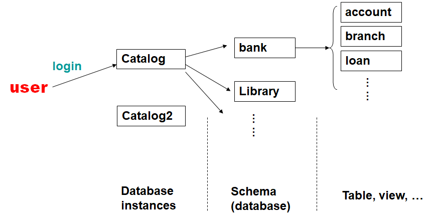
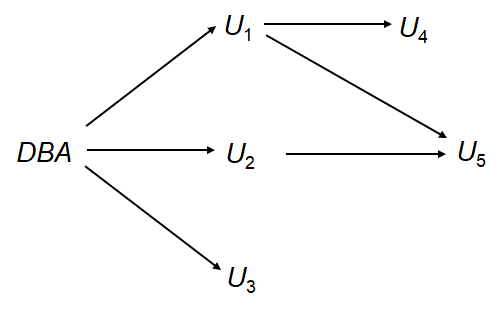
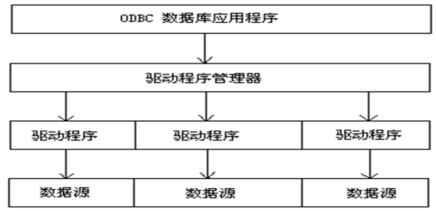

# Advanced SQL 

## Joined Relations

用于实现连接运算。

### Types

- `Natural join`
- `Inner join`
- `Outer join`

### Natural Join 

为所有公共属性匹配具有相同值的元组，并且只保留每个公共列的一个副本。

#### Example

$$
\begin{aligned}
&branch(\underline{branch\_ name}, branch\_ city, assets)\\
&account(\underline{account\_ number}, branch\_ name, balance)
\end{aligned}
$$

列出账号及其分支城市

```sql
SELECT account_number, branch_city
FROM account
NATURAL JOIN branch
```

#### Using

用于指定应该等同的列

```sql
SELECT account_number, branch_city
FROM account
JOIN branch USING (branch_name)
```

#### On

允许在连接的关系上使用一般谓词

```sql
SELECT account_number, branch_city
FROM account
JOIN branch ON account.branch_name = branch.branch_name
```

### Outer Join

计算连接，然后将一个关系中不匹配另一个关系中的元组的元组添加到连接的结果，并填充空值。

#### Types

- `left outer join`
- `right outer join`
- `full outer join`


## Views

提供了一种机制，可以在某些用户的视图中隐藏某些数据。

### 创建

```sql
CREATE VIEW <v_name> AS 
	SELECT c1, c2, … From … 
```

```sql
CREATE VIEW <v_name> (c1, c2, …) AS 
	SELECT e1, e2, … FROM … 
```

### 删除

```sql
DROP VIEW <V_NAME> 
```

### Materialized Views | 物化视图

某些数据库系统允许对视图关系进行物理存储。在更新数据表时，物化视图不会跟着一起更新。

### 更新

对视图的更新必须转化为对原数据表的更新。

#### Example

$$
instructor(ID, name, dept\_ name, salary)
$$


```sql
CREATE VIEW faculty AS
SELECT ID, name, dept_name
FROM instructor;

INSERT INTO faculty (ID, name, dept_name)
VALUES (30765, 'Green', 'Music');
```

对于以上的语句，有两种可能的处理方式：

- 拒绝插入
- 插入元组`(30765, 'Green', 'Music', null)`

#### Addition

大多数SQL实现只允许对简单视图进行更新：

- from子句只有一个数据库关系。
- select子句只包含关系的属性名，没有任何表达式、聚合或不同的规范。
- 任何未在select子句中列出的属性都可以设置为null
- 查询没有组by或having子句。


## SQL Data Types and Schemas 

### Default Values 

如果没有传入参数则自动设置为默认值

```sql
CREATE TABLE student (
    ID        VARCHAR(5),
    name      VARCHAR(20) NOT NULL,
    dept_name VARCHAR(20),
    tot_cred  NUMERIC(3,0) DEFAULT 0,
    PRIMARY KEY (ID)
);
```

### Large-Object Types | 大对象类型	

- **blob**: binary large object -- 对象是未解释的二进制数据的大集合

- **clob**: character large object -- 对象是字符数据的大集合

#### Example

```sql
CREATE TABLE students (
    sid    CHAR(10) PRIMARY KEY,
    name   VARCHAR(10),
    gender CHAR(1),
    photo  BLOB(20MB),
    cv     CLOB(10KB)
)
```

!!!Note
	当查询返回一个大对象时，返回的是指针而不是大对象本身。


### User-defined Types | 自定义类型

#### 创建

```sql
Create type person_name as varchar (20) 
```

#### 使用

```sql
CREATE TABLE student (
    sno      CHAR(10) PRIMARY KEY,
    sname    person_name,
    ssex     CHAR(1),
    birthday DATE
)
```

#### 删除

```sql
Drop type person_name 
```

### Domains

与type不同，domain可以对数据进行限制，确保值满足条件。

#### 创建

```sql
CREATE DOMAIN Dollars AS NUMERIC(12, 2) NOT NULL;
CREATE DOMAIN Pounds AS NUMERIC(12, 2);

CREATE TABLE employee (
    eno    CHAR(10) PRIMARY KEY,
    ename  VARCHAR(15),
    job    VARCHAR(10),
    salary Dollars,
    comm   Pounds
)
```

#### Constraint

添加数据限制条件

```sql
CREATE DOMAIN YearlySalary AS NUMERIC(8, 2)
    CONSTRAINT salary_value_test CHECK (VALUE >= 29000.00);

CREATE DOMAIN degree_level AS VARCHAR(10)
    CONSTRAINT degree_level_test CHECK (VALUE IN ('Bachelors', 'Masters', 'Doctorate'));
```

### Schemas, Catalogs, and Environments

 

## Integrity Constraints

数据库完整性约束是用于确保数据库中数据的准确性、一致性和可靠性的一系列规则或条件。

数据完整性约束指的是为了防止不符合规范的数据进入数据库，在用户对数据进行插入、修改、删除等操作时，DBMS自动按照一定的约束条件对数据进行监测，使不符合规范的数据不能进入数据库，以确保数据库中存储的数据正确、有效、相容。

- 实体完整性
- 参照完整性
- 用户定义完整性

### Constraints on a single relation 

- `Not null`

- `Primary key`

- `Unique (A1, A2, …, Am)`: Unique声明的属性A1、A2、…、Am构成一个candidate key。

- `check (P)`: check (P)子句指定一个谓词P，关系中的每个元组都必须满足该谓词P。E.g

  ```sql
  CREATE TABLE branch2 (
      branch_name VARCHAR(30) PRIMARY KEY,
      branch_city VARCHAR(30),
      assets INTEGER NOT NULL,
      CHECK (assets >= 100)
  )
  ```

### Referential Integrity 

#### Definition

设关系 $r1(R1)$ 和 $r2(R2)$ 的主键 $K1$ 和 $K2$。$R2$ 的子集 $\alpha$ 是引用 $r1$ 中 $K1$ 的外键。那么，需要满足以下关系：
$$
\Pi_{\alpha}(r2)\subseteq \Pi_{K1}(R1)
$$

####  Operation

- **Insert**：如果把元组 $t2$ 插入到 $r2$ 中，系统必须确保在 $r1$中存在一个元组 $t1$，使得 $t1[K1] = t2[\alpha]$，即：

- **Delete**: 如果把元组 $t1$ 从 $r1$中删除，系统必须计算 $r2$ 中引用 $t1$ 的元组集合，如果计算出的集合不为空：
  1. 拒绝删除指令。
  2. 或者同时在 $r2$ 中删除引用的元组。（*cascading deletions*级联删除）
- **Update**: 如果元组 $t2$ 在关系 $r2$ 中被更新，并且更新修改了外键 $\alpha$ 的值，则进行类似于插入操作的测试。

#### Cascading

```sql
CREATE TABLE account (
    ...,
    branch_name VARCHAR(30),
    FOREIGN KEY (branch_name) REFERENCES branch(branch_name)
        ON DELETE CASCADE
        ON UPDATE CASCADE,
    ...
)
```

!!!Note
      如果有一个跨多个关系的外键依赖链，并且为每个依赖指定了一个删除级联，那么在链的一端的删除或更新可以传播到整个链。但是，如果级联更新或删除导致无法由进一步的级联操作处理的约束违反，则系统将中止操作。同时，所有由这次操作引起的更新都会无效。

!!!Note
      引用完整性只在操作结束时检查。即：允许中间步骤违反引用完整性，前提是稍后的步骤在操作结束时删除这种违反。否则，就不可能创建一些数据库状态，例如，插入两个元组，它们的外键彼此指向对方。

##### Alternative to cascading

- `on delete set null `
- `on delete set default `

### Complex Check

`Check`子句中的谓词可以是任意谓词，可以包含子查询。E.h.

```sql
check (time_slot_id in (select time_slot_id from time_slot))
```

### Domain Constraints 

#### 创建

```sql
CREATE DOMAIN hourly_wage NUMERIC(5, 2)
    CONSTRAINT value_test CHECK (VALUE >= 4.00);
```

### 删除

```sql
ALTER DOMAIN hourly_wage DROP CONSTRAINT value_test;
```

### Assertions

断言是表示我们希望数据库始终满足的条件的谓词。用于多个关系的复杂检查条件。

#### 标准格式

```sql
CREATE ASSERTION <assertion-name> 
	CHECK <predicate>; 
```

!!!Note
      每次更新时都会对Assertion进行判断，会造成巨大的开销。因此，使用Assertion需谨慎。
      

#### Example

- Example1: 每个分行的所有贷款金额之和必须小于该分行的所有账户余额之和。 

```sql
CREATE ASSERTION sum_constraint 
CHECK (
    NOT EXISTS (
        SELECT * 
        FROM branch B 
        WHERE (
            SELECT SUM(amount) 
            FROM loan 
            WHERE loan.branch_name = B.branch_name
        ) > (
            SELECT SUM(balance) 
            FROM account 
            WHERE account.branch_name = B.branch_name
        )
    )
)
```

- Example2: 对每一笔借款, 至少有一个借款人有存款$1000以上

```sql
CREATE ASSERTION balance_constraint 
CHECK (
    NOT EXISTS (
        SELECT * 
        FROM loan L 
        WHERE NOT EXISTS (
            SELECT * 
            FROM borrower B, depositor D, account A 
            WHERE L.loan_number = B.loan_number 
                AND B.customer_name = D.customer_name 
                AND D.account_number = A.account_number 
                AND A.balance >= 1000
        )
    )
)
```


## Trigger

触发器是由系统自动执行的语句，在修改数据库时自动触发。可以触发 `INSERT`, `DELETE`, `UPDATE`。

### Example

*loan*(*loan-number*, *branch-name*, *amount*) 

*borrower*(*customer-name*, *loan-number*) 

*account*(*account-number*, *branch-name*, *balance*) 

*depositor*(*customer-name*, *account-number*)

```sql
CREATE TRIGGER overdraft_trigger 
AFTER UPDATE ON account 
REFERENCING NEW ROW AS nrow 
FOR EACH ROW 
WHEN (nrow.balance < 0) 
BEGIN ATOMIC 
    INSERT INTO borrower 
    SELECT customer_name, account_number 
    FROM depositor 
    WHERE nrow.account_number = depositor.account_number;

    INSERT INTO loan 
    VALUES (nrow.account_number, nrow.branch_name, -nrow.balance);

    UPDATE account 
    SET balance = 0 
    WHERE account.account_number = nrow.account_number;
END
```

- 对于特定列

```sql
CREATE TRIGGER overdraft-trigger 
AFTET UPDATE OF balance ON account … 
```

- 使用`AFTER`和`BEFORE`来确定触发时机

```sql
REFERENCING OLD ROW AS: --for deletes and updates 
REFERENCING NEW ROW AS: --for inserts and updates 
```

### 状态管理

对于不同的数据库管理系统可能会不同。

#### 启用

```sql
ALTER TRIGGER trigger_name ENABLE
```

```sql
ENABLE TRIGGER trigger_name
```

#### 禁用

```sql
ALTER TRIGGER trigger_name DISABLE
```

```sql
DISABLE TRIGGER trigger_name
```

#### 删除

```sql
DROP TRIGGER trigger_name
```

### External World Actions 

触发器不能直接用于实现外部世界的动作、但是，触发器可用于在单独的表中记录要执行的操作，通过一个外部进程来重复扫描表，执行外部操作并从表中删除操作。

#### Example

```sql
CREATE TRIGGER reorder_trigger 
AFTER UPDATE OF level ON inventory 
REFERENCING OLD ROW AS orow, NEW ROW AS nrow 
FOR EACH ROW 
WHEN (
    nrow.level <= (SELECT level FROM minlevel WHERE minlevel.item = nrow.item) 
    AND orow.level > (SELECT level FROM minlevel WHERE minlevel.item = orow.item)
) 
BEGIN 
    INSERT INTO orders 
    SELECT item, amount 
    FROM reorder 
    WHERE reorder.item = orow.item;
END
```


## Authorization 

### Security 

防止恶意企图窃取或修改数据。

#### Database system level

-  利用身份验证和授权机制，只允许特定用户访问所需的数据。

#### Operating system level

- 操作系统的super-users可以对数据库做任何他们想做的事情，因此需要良好的操作系统级安全性。

#### Newwork level

必须使用加密来防止:

- 窃听*Eavesdropping*（未经授权读取消息）
- 伪装*Masquerading*（假装是授权用户或从授权用户发送消息）

####  Physical level

- 对计算机的物理访问允许入侵者破坏数据；传统的锁钥安全是必需的
- 电脑也必须防止洪水、火灾等

#### Human level

- 必须对用户进行筛选，以确保授权用户不会向入侵者提供访问权限
- 用户应该接受密码选择和保密方面的培训

### 权限分类

#### 对于数据

- **Read authorization**：允许读取数据，但是不能修改
- **Insert authorization**：允许插入数据，但是不能修改已有数据
- **Update authorization**：允许修改数据，但是不能删除数据
- **Delete authorization**：允许删除数据

#### 对于scheme

- **Index authorization**：允许创建和删除索引。
- **Resources** **authorization**：允许创建新的relations. 
- **Alteration** **authorization**：允许添加或修改relation中的attributes 。
- **Drop** **authorization**：允许删除relations.

### GRANT

#### 标准格式

```sql
GRANT <privilege_list> ON <table_or_view> TO <user_list>
```

 其中的`user_list`可以为：

- user-ids
- public：授权所有有效用户
- A role

#### 更多使用

- 多权限多用户

```sql
GRANT select, insert ON branch TO U1, U2, U3
```

- 特定列

```sql
GRANT update(branch_name) ON branch TO U1, U2, U3 
```

#### With grant option

允许被授权用户给其他用户授权

- Example

```sql
GRANT SELECT ON branch TO U1 WITH GRANT OPTION
```

### REVOKE

#### 标准格式

```sql
REVOKE <privilege_list> ON <table_or_view> FROM <user_list> [restrict or cascade] 
```

- `cascade`：被撤销权力的用户之前所授权的用户的权力也被撤销。
- `restrict`：只撤销当前用户的权力

### Authorization Grant Graph 

一般不允许出现闭环。



### Roles 

一类拥有相同权力的用户。

#### 创建

```sql
CREATE A ROLE <name>
```

### Authorization on Views 

用户通过视图访问数据时，通常不需要直接对基础表拥有权限。这是因为视图提供了一种**权限隔离机制**，允许数据库管理员限制用户对底层表的直接访问，同时仍然可以通过视图向用户提供经过筛选或加工的数据。

### SQL Authorization的缺陷

- SQL不支持tuple层的权限管理
- 对于应用程序，用于通过网络访问数据库，没有数据库id，而是被映射到同一个数据库id，导致权限不方便管理。
- 在上述情况下，授权任务落在应用程序上，不需要SQL的支持。可以由应用程序实现对单个元组的授权。但是授权必须在应用程序代码中完成，并且可以分散在整个应用程序中，不便于管理。

### Audit Trails | 审计跟踪

审计跟踪是对数据库的所有更改（插入/删除/更新）以及执行更改的用户和执行更改的时间等信息的日志。用于跟踪错误/欺诈性更新。可以使用触发器实现，但许多数据库系统提供直接支持。

## Embedded SQL

由于SQL的功能不完备，SQL标准定义了各种编程语言（如C、c++、Java、Fortran和PL/1）中SQL的嵌入。插入SQL查询的语言被称为**宿主语言**。

!!!Note
	嵌入式SQL通常是在编译期间就已知的，并且会通过特殊的预处理器转换为宿主语言的函数调用。


## Dynamic SQL 

允许程序在运行时构造和提交SQL查询。

#### Example

```C
char *sqlprog = “update account 
	set balance = balance * 1.05 
	where account_number = ?” 
EXEC SQL PREPARE dynprog  FROM :sqlprog; 
char v_account [10] = “A_101”; 
……
```


## ODBC and JDBC 

#### ODBD

Open DataBase Connectivity (开放数据库互连)

ODBC提供了一个公共的、与具体数据库无关的应用程序设计接口API 。它为开发者提供单一的编程接口，这样同一个应用程序就可以访问不同的数据库服务器。

 

#### JDBC

JDBC是一种用于与支持SQL的数据库系统通信的Java API。


## Other Topics

#### Functions and Procedures 

- 函数定义

```sql
create function dept_count(dept_name varchar(20))
    returns integer
    begin
    declare d_count integer;
    select count(*) into d_count
    from instructor
    where instructor.dept_name = dept_name
    return d_count;
end
```

- 函数调用

```sql
select dept_name, budget
from department
where dept_count(dept_name) > 12;
```

####   Recursive Queries 

- 递归查询

```sql
with recursive rec_prereq(course_id, prereq_id) as (  
    select course_id, prereq_id  
    from prereq  
union  
    select rec_prereq.course_id, prereq.prereq_id  
    from rec_prereq, prereq  
    where rec_prereq.prereq_id = prereq.course_id  
)  
select *  
from rec_prereq;
```

#### Advanced Aggregation Features 

- Ranking
- Windowing
- Pivoting
- Rollup and Cube