# Concurrency Control

## Lock-Based Protocols

lock是一种控制并发访问同一数据项的机制。

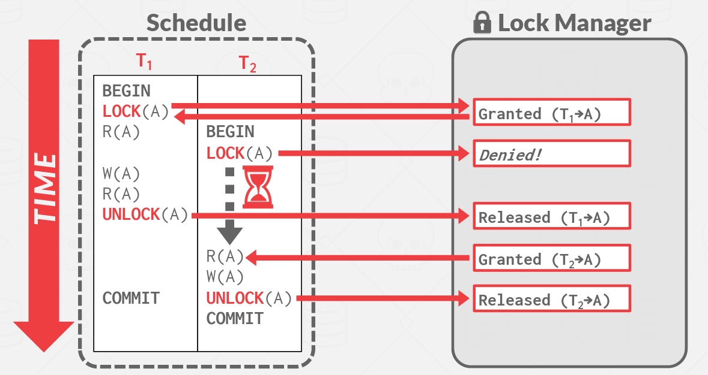

Lock有以下两张模式：

- **Exclusive (X)**: 数据项既可以读也可以写。使用Lock-X指令请求X锁。
- **Shared (S)**: 只能读取数据项。使用Lock-S指令请求S锁。

如果请求的锁和其他事务对这个数据项已经有的锁不冲突，那么就可以给一个事务批准一个锁。

对于一个数据项，可以有任意多的事务持有S锁，但是如果有一个事务持有X锁，其他的事务都不可以持有这个数据项的锁。

### Pitfalls of Lock-Based Protocols

如下图所示，lock_S(B)导致T4需要等待T3完成，lock-X(A)导致T3需要等待T4完成。这种现象被称为**死锁(*Deadlock*)**

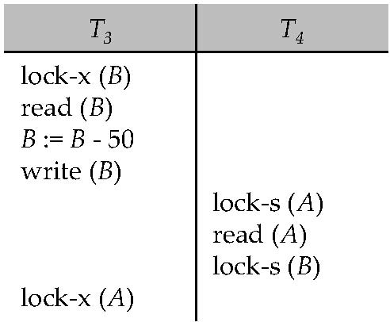 

在大多数锁定协议中都存在死锁的可能性。

### The Two-Phase Locking Protocol

一个确保冲突序列化调度的协议。这个协议把事务分成了两个阶段：

- **Phase 1: Growing Phase**: 只能获得锁，或者将S锁升级成X锁，不能释放。
- **Phase 2: Shrinking Phase**: 只能释放锁，或者将X锁降级成S锁，不能获得。

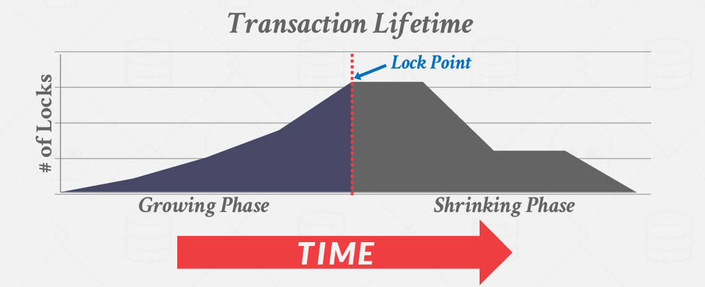

两阶段锁定不能确保避免死锁。在两阶段锁定下，级联回滚是可能的。为了避免这个问题，有了以下的改进：

- **strict two-phase locking**: 要求事务的X锁必须在事务提交的时候释放。

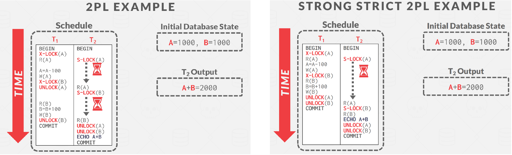

但是两阶段锁仍存在以下问题：

- 存在一些冲突可串行化的调度，它们不遵循两阶段锁定协议的规则
- 两阶段锁定协议是冲突可串行化的充分条件(所有遵循2PL的调度都是冲突可串行化的)，但不是必要条件

### Implementation of Locking

Lock Manager 可以被作为一个独立的进程来接收事务发出的锁和解锁请求，且会回复申请锁的请求。发出请求的事务会等待请求被回复再继续处理。

- 锁管理器维护一个称为Lock Table的数据结构，用于记录授予的锁和挂起的请求。

- Lock Table通常使用一个内存中的哈希表来实现，以被锁数据项的名称作为索引。

### Lock Table

- 新的加锁请求置于队列末端，当且仅当和其他锁兼容时会被授予。
- 收到解锁的请求后，Lock Manager 会删除对应的请求，并逐一检查后面的请求是否可以被授权。
- 如果一个事务终止了，所有该事务正在等待加锁的请求都会被删除。
- Lock Manager 会维护一个记录每个事务上锁情况的表来提高操作的效率。

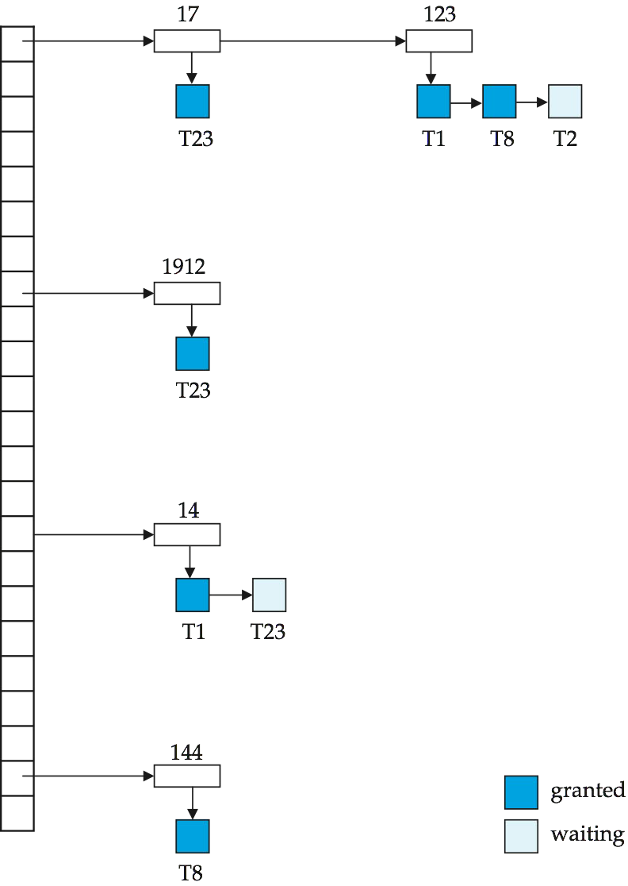 

### Graph-Based Protocols

假设我们知道数据是按偏序访问的。即如果有一条边 $d_i\rightarrow d_j$，则任何同时需要访问 $d_i$ 和 $d_j$ 的事务，都要先访问 $d_i$，再访问 $d_j$。

- tree-protocol是一种简单的graph protocol

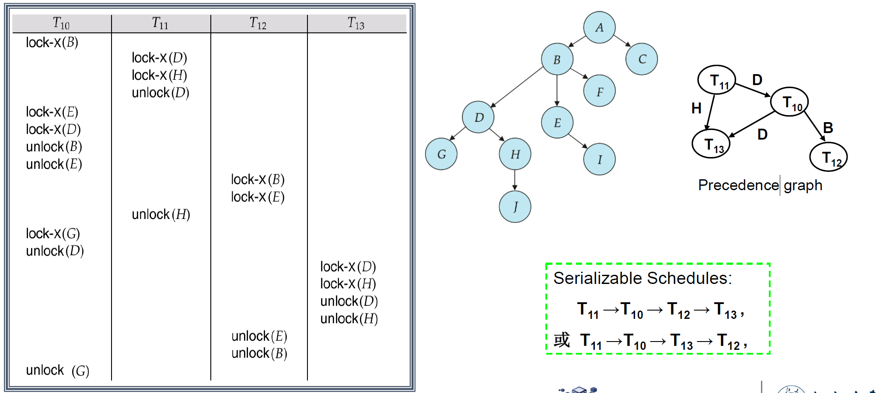

优点：

- 树协议确保了冲突的可序列化性以及免于死锁。
- 在树锁定协议中，解锁可能比在两阶段锁定协议中更早发生。更短的等待时间，并增加并发性，协议无死锁，不需要回滚。

缺点：

- 不保证可恢复性或级联自由，需要引入提交依赖项以确保可恢复性。
- 事务必须锁定它们不能访问的数据项，即需要保证偏序访问。增加的锁定开销和额外的等待时间，潜在地降低并发性。

## Deadlock Handling

死锁防止协议(*Deadlock prevention protocols*)确保系统永远不会进入死锁状态。

一些预防措施：

- 要求每个事务在开始执行之前锁定其所有数据项（预声明）——保守的2PL。

  	缺点：并发性差，难以预测

- 对所有数据项实行偏序排序，并要求事务只能按顺序锁定数据项（基于图的协议）

### More Deadlock Prevention Strategies

定义执行早的为老事务(old transactions)，执行晚的为新事务(new transactions)

- **Wait-die scheme**: 老事务会等待新事物释放数据，但是新事务在冲突时会自己回滚。（一个事务可能会回滚很多次）
- **Wound-wait scheme**: 老事务会强制让新事务回滚，新事务会等待老事务。

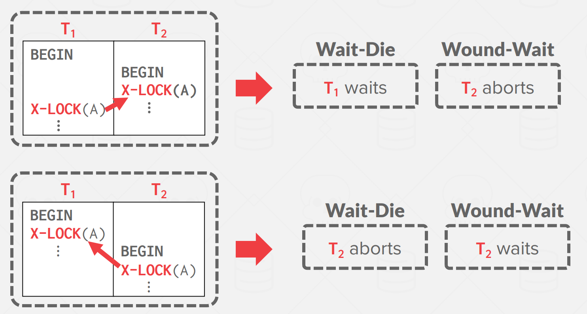

- **Timeout-Based Schemes**: 事务只在指定的时间内等待锁。在此之后，等待超时并回滚事务。

  容易实现，但是会导致starvation，也很难确定好超时间隔。

### Deadlock Detection

可以使用wait-for graph来表示：

- 每个节点表示一个事务
- 一条边 $T_i\rightarrow T_j$ 表示 $T_i$ 等待 $T_j$ 释放锁。

如果wait-for graph中存在环，则表示存在死锁。

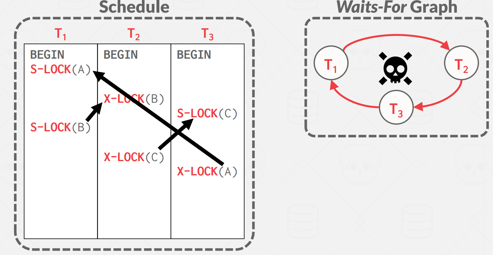

### Deadlock Recovery

- **Total rollback**: 中止事务，然后重新启动它。
- **Partial rollback**: 回滚一部分事务，然后尝试重新执行未完成的查询。

同一个事务经常发生死锁会导致starvation，因此避免starvation的过程中cost要考虑回滚的次数。

## Multiple Granularity

使用粒度(*Granularity*)来表示层级

- **Coarse granularity** (粗粒度，higher in tree): 低锁开销，低并发性
- **Fine granularity** (细粒度，lower in tree): 高锁开销，高并发性

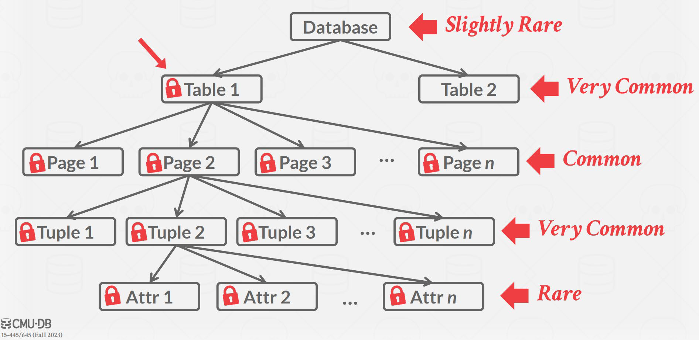

### Intention Lock

意向锁的主要作用是用于支持行级锁与表级锁的并存。通过提供表级的锁定信息，避免了系统去逐行检查是否可以加表锁。

- **Intention-shared** (IS，共享型意向锁): 表明其后代存在S锁
- **Intention-exclusive**(IX ，排它型意向锁): 表明其后代存在X锁
- **Shared and intention-exclusive**(SIX，共享排它型意向锁): 自身存在S锁，后代存在X锁 (SIX=S+IX)

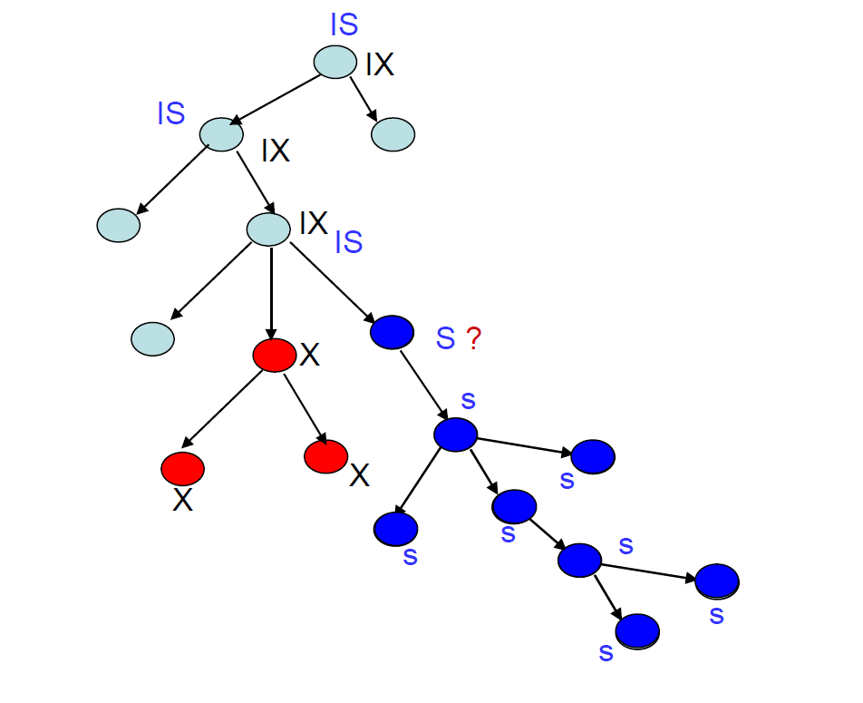 

#### Compatibility Matrix with Intention Lock Modes

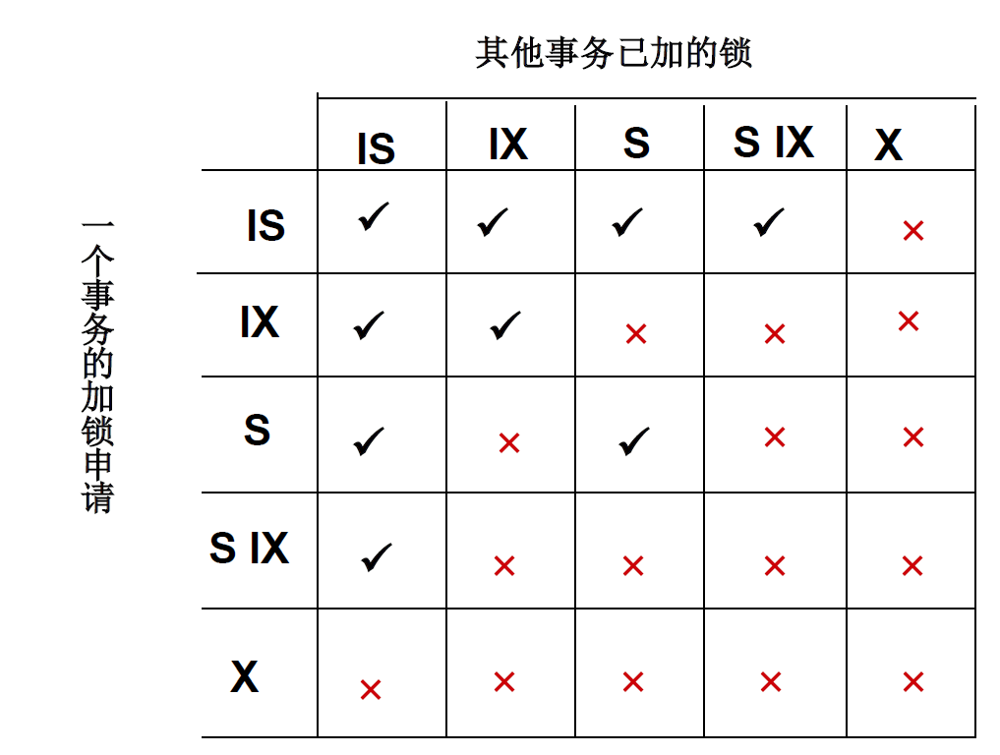 

#### Example

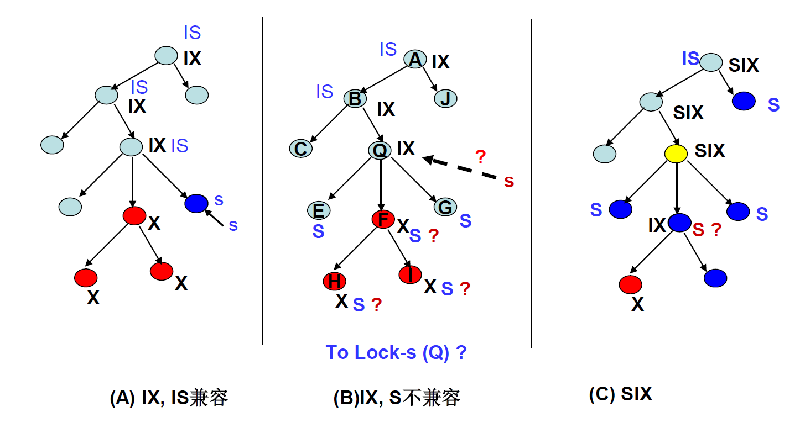

## Insert and Delete Operations

如果使用两阶段锁：

- 只有当删除元组的事务对要删除的元组具有X锁时，才可以执行删除操作。
- 将新元组插入数据库的事务将被赋予该元组X锁。

如果只对元组设锁，那么可能会出现幻读(*phantom*)

!!!Note
	幻读，指的是当某个事务在读取某个范围内的记录时，另外一个事务又在该范围内插入了新的记录，当之前的事务再次读取该范围的记录时，会产生幻行（Phantom Row）

### Index Locking Protocol

- 每个关系至少有一个索引。

- 事务只有在通过关系上的一个或多个索引找到元组后才能访问元组。

- 执行查找事务 Ti 必须在 S 模式下锁定它访问的所有索引节点。

  > 即使叶节点不包含任何满足索引查找的元组（例如，对于范围查找，叶中没有元组在范围内）、

- 在关系 r 中插入、更新或删除元组 ti 的事务 Ti：1. 必须将所有索引更新为 R；2. 必须在受插入/更新/删除影响的所有索引叶节点上取独占锁。

- 必须遵守两相锁协议的规则。

#### Example

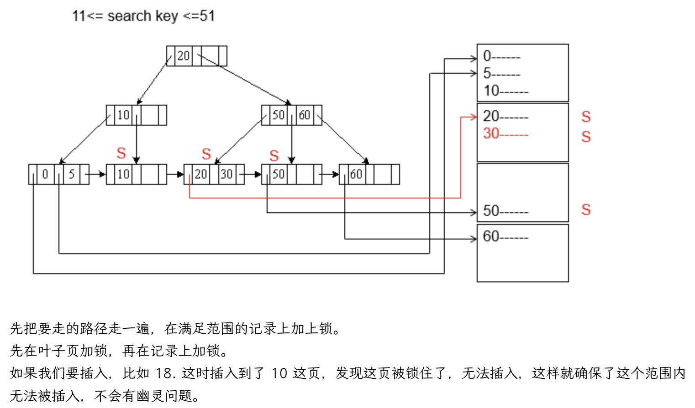

### Next-Key Locking Protocol

- 锁定满足索引查找的所有值（匹配查找值，或落在查抄范围内，而不锁叶子）
- 同时锁定索引的下一个键值 甚至对于插入/查找
- 锁定模式：S 表示查找， X表示插入/更新/删除

#### Example

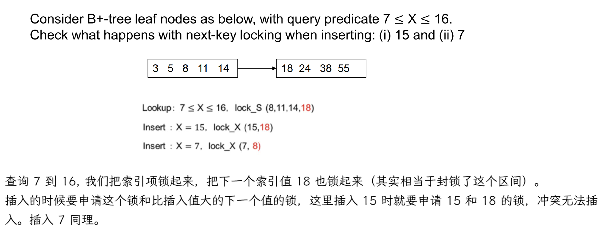
