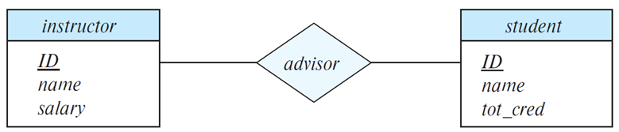
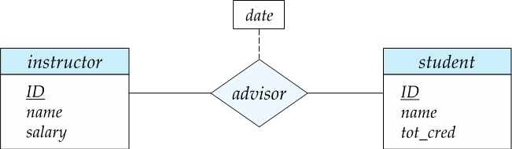

# Entity-Relationship Model

开发ER model是为了方便数据库设计，它允许指定表示数据库整体逻辑结构的企业模式。

三个基本概念：

- Entity sets
- Relationship sets
- Attributes

## Entity Sets 

实体集(*entity sets*)是一组共享相同属性(*attributes*)的相同类型的实体(*entities*)。

### Example

- Entity Sets *customer* and *loan* 

 

### ER Diagram 

实体集可以用图形表示如下：

- 矩形表示实体集。
- 在实体矩形内列出的属性
- 下划线表示主键属性

 

### Attributes

属性分为以下几种类型：

- 简单属性(*simple attributes*)和复合属性(*composite attributes*)（如图中address）
- 单值属性(*single-valued attributes*)和多指属性(*multi-valued attributes*)（如图中*phone_number*用`[]`表示）
- 派生属性(*derived attributes*)：可以由其他属性计算得到（如图中*age*后加`()`）

 

#### Composite Attributes 

 

## Relationship Sets 

**联系**(*relationship*)是二个或多个不同类实体之间的关联。

一个**联系集**表示二个或多个实体集之间的关联 ，包含多个同类联系。

### Example

 

### ER Diagram 表示

 

### 关系集属性

关系集也可以有自己的属性，在ER图中用虚线表示：

 

### Roles 

- 关系的实体集可以是相同的
- 实体集的每次出现都在关系中扮演一个**角色**(*roles*)
- 实体在关系中所起的作用称为该实体的角色。
- 如图中标签“course_id”和“preeq_id”被称为角色。

 

### 联系的度

一个关系集可以关联多个实体集，联系的度(*Degree of a Relationship Set*)指一个联系集中关联的实体集的数量。

大多数联系集都是二元的。一些看似非二元的关系可能使用二元关系更好地表示。

例如，一个三元关系的父母，一个孩子与他/她的父亲和母亲，最好被两个二元关系，父亲和母亲所取代。即 *parents*(*he*, *she*, *child*) => *father*(*he*, *child*), *mother*(*she*, *child*) 。使用两个二元关系能够允许部分信息，例如，只知道母亲。

但也有一些关系自然是非二元的，例如，*works-on*(*employee*, *branch*, *job*)。

### 多元转二元

通常，任何多元关系都可以通过创建人工实体集来使用二元关系表示。

 

#### Example

 

### 映射基数

**映射基数**(*Mapping Cardinalities*)用于表示一个联系集中，一个实体可以与另一类实体相联系的实体数目。其中数目是指最多一个还是多个。

在描述二元关系集是最有效。对于一个二元关系集，有以下几种类型：

- One to one (1 : 1)，如：现任总统（总统，国家） 

- One to many (1 : n)，如：分班情况（班级，学生） 

- Many to one (n : 1)，如：就医（病人，医生） 

- Many to many (n : m)，如：选课（学生，课程） 

 

 

!!!Note
	允许存在某一些元素没有被映射到任何另外一个元素。

### 基数的ER图表示

在ER图中，使用$\rightarrow$来表示只能关联一个，用$-$来表示可以关联多个。

#### One to One

 

#### One to Many

 

#### Many to Many

 

!!!Note
	最多允许在三元（或更大程度）关系中使用一个箭头来表示基数约束，若使用一支以上箭头容易造成混淆。

### Total/Partial Participation

- **Total** 表示实体集中的每个实体至少参与关系集中的一个关系
- **Partial** 表示一些实体可能不参与关系集中的任何关系

在ER图中Partial用单线表示，Total用双线表示。

 

### More Complex Constraints

使用一行可以有关联的最小和最大基数来表示，如 $l..h$ 所示。其中 $l$ 是最小基数，表示实体至少参与 $l$ 个关系；$h$ 是最大基数，表示实体至多参与 $h$ 个关系。

- 最小基数为1则表示 Total Participation
- 最大基数为1则表示实体至多参与一个关系。
- 最大基数为*则表示没有任何限制。

 

​	

## Keys 

*super key, candidate key, primary key*等概念同关系模型。

### 关系集的keys

关系集的主码由所有参与关系的实体集的主码组合而成。

!!!Note
	这意味着一对实体在一个特定的关系集中最多只能有一个关系。

对于一下几种关系集，主码为：

- Many-to-Many：两边的主码的并集。
- Many-to-One：Many边的主码
- One-to-Many：Many边的主码
- One-to-One：任意一个参与集的主码

### 弱实体集

- **弱实体集**(*weak entity sets*)依赖于其他实体集存在的实体集，即部分主码可以通过联系从其他实体集获取。被依赖的实体成为该弱实体集的**标识性实体**(*identifying entity*)，这样的联系被称为**标识性联系**(*identifying relationship*)。
- 弱实体集的主码为从标识性实体获取的属性以及其他**分辨符**(*discriminator*)（也被称为*partial key*）组成。
- 如果一个实体集不是弱实体集，那么这个实体集为**强实体集**(*strong entity sets*)。

如图所示，section中的course_id可以通过sec_course联系从course中获取，有获取的course_id和其他分辨符semester, year, sec_id共同组成section的主码。

 

在ER图中，使用双层菱形来表示标识性联系：

 

!!!Note
	每个弱实体集一定会有一个与其他实体集的标识性联系。

## Extended E-R Features 

### Stratum of the entity set 

- **Specialization**：即**特殊化、具体化**，是一种自上而下的设计流程：从一个高级实体一层一层向下拆分出更低级的子组。
- **Generalization**：即**泛化、普遍化**，是一种自下而上的设计流程：将多个具有相同特性的实体集组合成一个更高级的实体集。

 

!Note
	Specialization和Generalization是彼此的简单反转；它们以同样的方式在E-R图中表示。

### Constraints

#### 条件约束

- **Condition-defined** (条件定义的) 
- **User-defined**

#### 重复约束

- **Disjoint**（不相交）：一个实体只能属于一个低级实体集。在E-R图中，在ISA三角形旁边写disjoint。
- **Overlapping** (可重叠)：一个实体可以属于多个低级实体集。

	  

#### 完全性约束

- **Total**：实体必须属于较低级别的实体集之一。
- **Partial**：实体不必属于较低级别的实体集之一。

 

### Aggregation

即把几个相互联系的实体集聚合成一个复合实体集，用于简化与其他实体集的联系。

#### Example

- 聚合前

 

- 聚合后

 

## E-R Diagram 

### 符号总结

 

 

 

 

### Example

 

## Design Issues

#### 常见错误

- (a) dept_name作为department的主码，不允许再作为student的属性，而是可以通过联系来获取该属性。
- (b)  assignmet marks是一个多指属性，不允许作为联系的属性

 

以下是对错误(b)的修正 ：

 

## Reduction of an E-R Schema to Tables 

符合E-R图的数据库可以用一组表来表示。对于每个实体集和关系集，都有一个唯一的表，该表被分配了相应的实体集或关系集的名称。

### 集合

- 强实体集：对应一张单独的表格
- 弱实体集：对应一张表格，属性包含标识性实体的属性。

!!!Note
	联系弱实体集及其标识性实体集的联系集对应的表是冗余的，即对应identifying relationship的表是多余的。

- 关系集：表示为一个表，其中包含两个参与实体集的主码（这里是外码）和关系集本身的任何描述性属性的列。

!!!Note
	对于多对一的联系，可以把联系所对应的表，合并到对应“多”端实体的表中。

### 属性

- 复合属性：对每一个子属性都创建一个单独的属性。（扁平化操作）
- 多值属性：创建另外一个单独的表格进行存储。

### Specialization

#### Method1

- 高级的实体形成一个表。
- 每个较低级实体集形成一个表，包括较高级实体集的主键和本地属性。

缺点：获取信息时需要访问多个表。

#### Method2

- 为包含所有本地属性和继承属性的每个实体集形成一个表。

缺点：数据冗余较多。

### Example

