# Indexing and Hashing

## Basic Concepts

### Index Design

- 搜索键(*Search Key*): 用于查找文件中的记录的属性或属性集
- Index文件通常包含多个记录位置(called *index entries*)
- Index文件通常比原始文件小很多

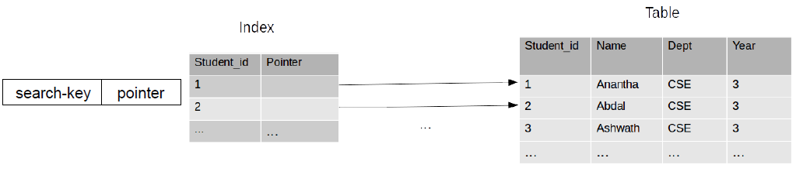

### Typical Indices

- Ordered indices(顺序索引): 搜索键有序存储
- Hash indices(散列/哈希索引): 搜索键使用“哈希函数”在“buckets”中均匀分布。


## Ordered Indices

### Primary Index / Secondary Index

#### Primary Index | 主索引

搜索键是有序数据的列。也被称为clustering index。

- 主索引的搜索键通常是但是主键（不一定）
- index-sequential file: 在搜索键上按顺序排序的文件，并且在该搜索键上有clustering index。

#### Secondary Index | 辅助索引

搜索键是无序数据的列。也被称为non-clustering index。

### Dense Index / Sparse Index

#### Dense Index | 稠密索引

对于数据文件中的每个搜索键值，都有一个索引记录。

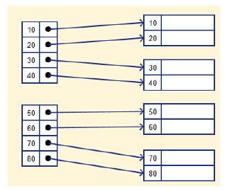 

!!!Note
	如果有重复索引值，那只需要每个索引值有搜索键对应即可，不需要每条记录都有搜索键对应。如下图是一个稠密索引：
	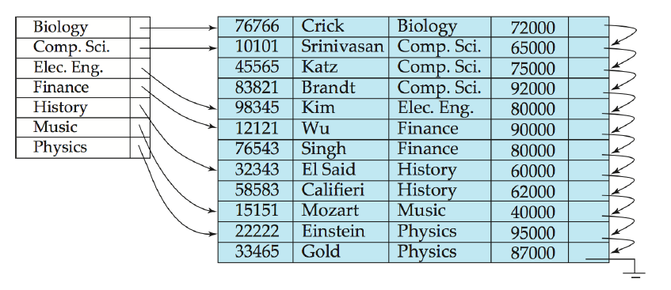

#### Sparse Index | 稀疏索引

索引记录只出现在数据文件中的几个搜索键中。通常一个index entry对应一块数据，一块数据包括多个记录。

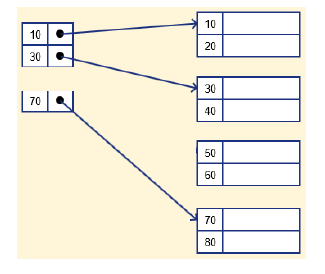 

!!!Note
	稀疏索引仅适用于按搜索键顺序排序的数据文件记录，如下图：
	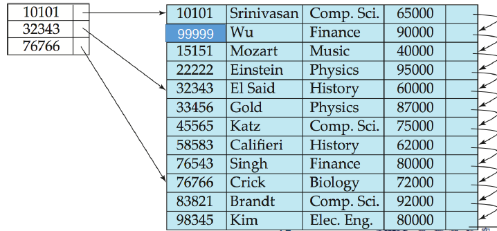

### Multilevel Index 

为了减少对索引记录的磁盘访问次数，可以将保存在磁盘上的主索引视为顺序文件，并在其上构造另一个稀疏索引。如下图所示：

- outer index：对于主索引的稀疏索引
- inner index：主索引文件

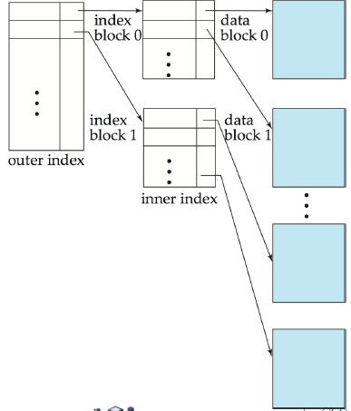 

### Deletion

#### dense indices

- 如果这个索引只对应一条记录，则删除相应索引
- 如果这个索引对应多条记录：如果该索引指向第一条记录，则把指针指向下一条记录；否则不做改动。

#### Sparse Indices

- 如果删除的记录没有在索引中，则不做改动。
- 否则，将对应索引修改成被删除记录的下一条记录的索引。

### Insertion

#### Dense indices

- 如果搜索键的值不在索引中，则插入索引。
- 否则：如果是多指针，加一个指针到这条记录；否则不做改动。

#### Sparse indices

（假设一个index entry对应一个block)

- 如果创建了新的block，则把新block的第一个搜索键插入索引。
- 如果新记录是一个block中的最小搜索键，则更新索引。
- 否则，不做改动。

### Secondary Indices

辅助索引不能使用稀疏索引，每条记录都必须有指针指向。

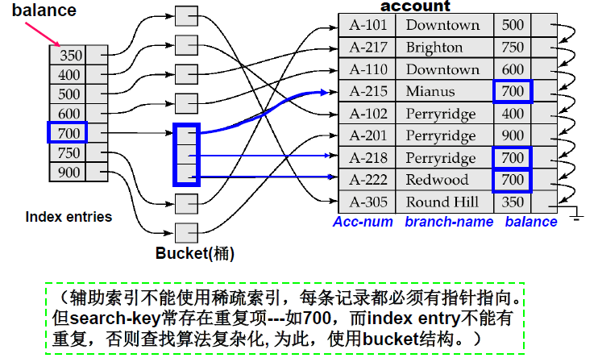 


## B+-Tree Index Files

### B-Tree / B+-Tree

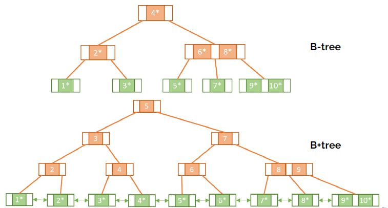

### B+-Tree

从根到叶的所有路径都是相同长度的平衡树，满足一下性质：

- 叶节点值的数量在 $\lceil (n-1)/2\rceil$ 和 $(n-1)$ 之间

- 根节点有 $[2，n]$ 个子节点
- 每个非叶节点（根节点除外）的子节点数在 $\lceil n/2\rceil$ 和 $n$ 之间

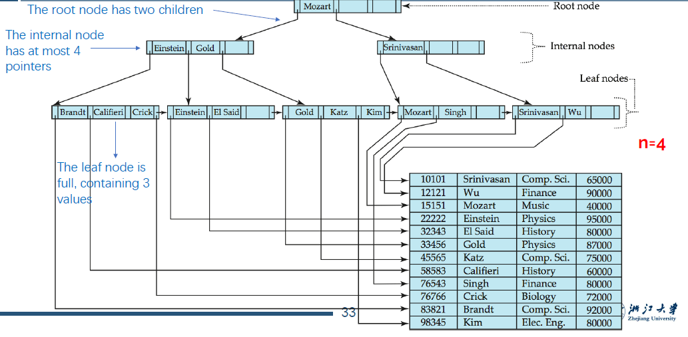 

#### Node结构

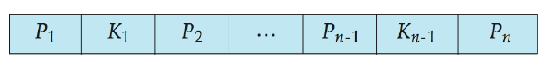

- $K_i$ 表示搜索键的值。
- 对于非叶节点 $P_i$ 表示指向子节点的指针；对于叶节点 $P_i$ 表示指向相应记录或者buckets的指针。

- 通常，一个节点对应一个block/page。

- 搜索键的值是有序的。

### Insertion

- 进行搜索找到需要插入的bucket。
- 如果bucket未满，则插入该bucket。
- 否则，分裂叶节点。

#### 分裂

- 叶节点分裂

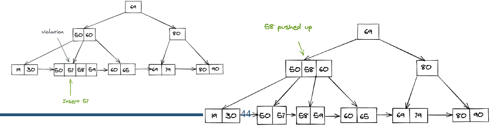 

- 非叶节点分裂

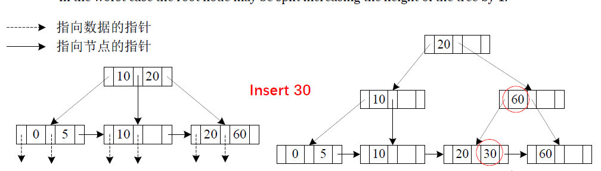

### Deletion

找到要删除的记录，并将其从主文件和bucket中删除。

如果没有bucket或bucket已变为空，则从叶节点删除（搜索键值，指针）

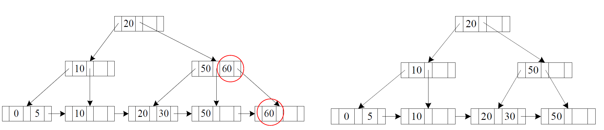 

如果由于删除而节点的entries太少，并且节点和同级节点中的entries适合单个节点，则合并同级节点：

- 将两个节点中的所有搜索键值插入到一个节点中（左侧的节点），并删除另一个节点
- 递归地从父节点删除相应指针。

否则，如果该节点由于删除而拥有的entries太少，但该节点及其兄弟节点中的entries无法装入单个节点，则重新分发指针：

- 在节点和兄弟节点之间重新分配指针，使它们都具有大于最小entries数的指针
- 更新节点父节点中相应的搜索键值

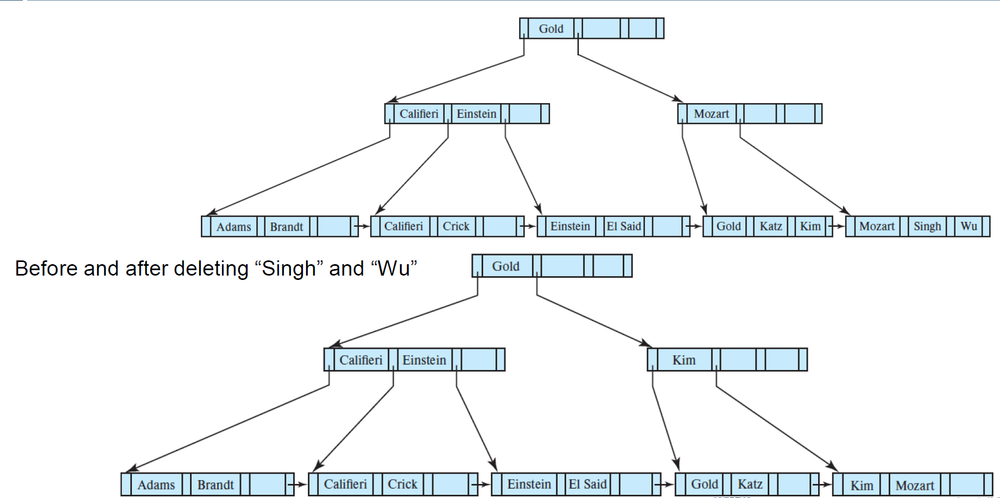

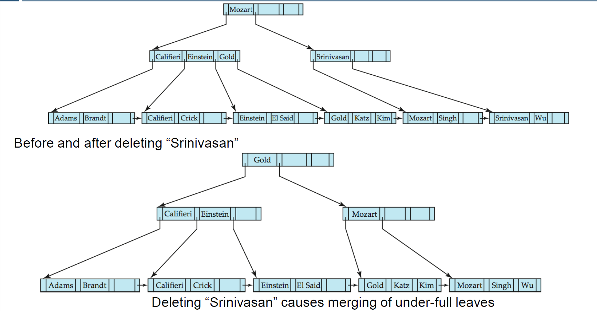 


## Write-optimized indices

### Log Structured Merge (LSM) Tree

- 尽可能使用顺序访问
- 牺牲读性能

#### 整体结构

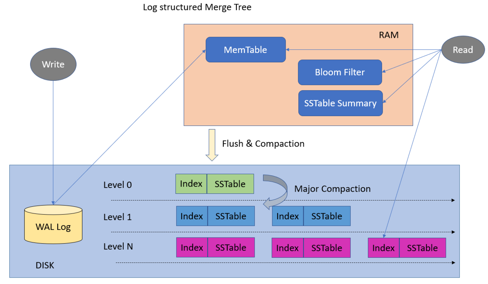  

#### Mem Table

在内存中管理数据的结构，相当于内存的SSTable。

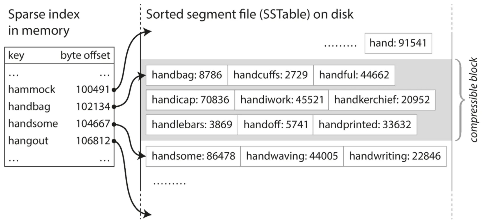 

#### Sorted String Tables(SSTable)

SStable顺序存储数据，以实现高效的查询和范围扫描。

#### Levels

为了有效地管理数据，SStable被组织成不同的级别。

- 较低级别包含最近的数据，而较高级别存储压缩数据。
- 这种分层方法平衡了读写性能，避免了瓶颈。

#### 写操作

- 首先插入in-memory tree (L0 tree)
- 当in-memory tree已满时，记录移动到磁盘(L1 tree): 通过合并已有的L1 tree和L0 tree中的记录来实现。
- 当L1 tree已满时，同理合并到L2 tree。以此类推到Ln tree

!!!Note
	每个SSTable都是不可变的，合并的时候，同一个key可能对应多个SSTable，取最新的数据。
	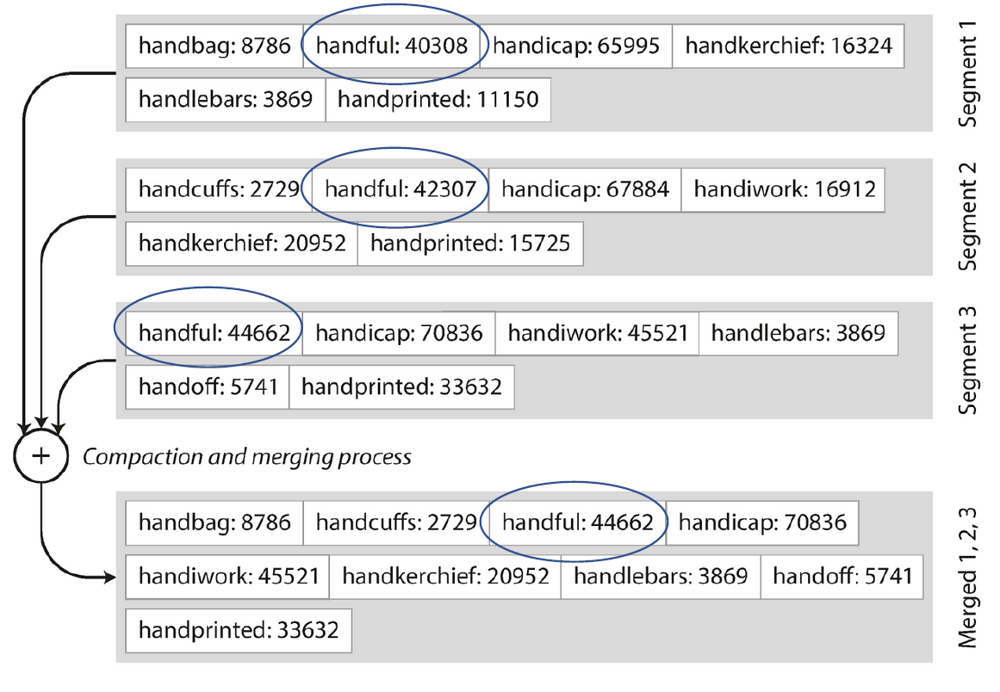

#### 读操作

逐层访问数据，直到找到。在最坏情况下需要把所有level都访问一遍。可以使用Bloom Filter来排除一部分不需要扫描的数据。

#### Bloom Filter

 是一个在内存内的二进制数组。对于每一条记录，通过三次hash分别映射到3个位置并设为1。

- 需要读时，先检验3个hash位置的值，如果出现0，则一定不存在；否则需要扫描相应的SSTable。

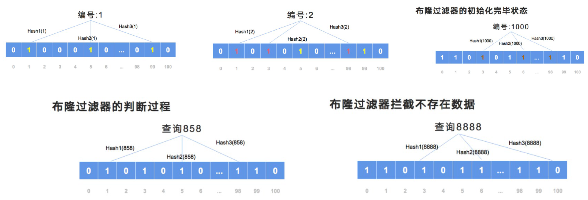

#### 优点

- 插入只使用顺序I/O操作完成
- 叶节点饱满，避免空间浪费
- 与普通B+树相比，每条插入记录的I/O操作次数减少（达到一定大小）

#### 缺点

- 查询必须搜索多个树
- 每个lebel的全部内容复制多次

### Buffer Tree

B+树的每个内部节点都有一个缓冲区来存储插入

- 当缓冲区已满时，把数据推入下一层
- 使用大缓冲区时，每次都会将许多记录移到下一层
- 每条记录的I/O相应减少

#### 优点

- 更少的查询开销
- 可用于任何树索引结构
- 用于PostgreSQL的GiST索引


## Index Definition in SQL

### Create an index

```sql
CREATE (UNIQUE) INDEX idx_userid ON user(userid);
```

### Drop an index

```sql
DROP INDEX <index-name>
```

