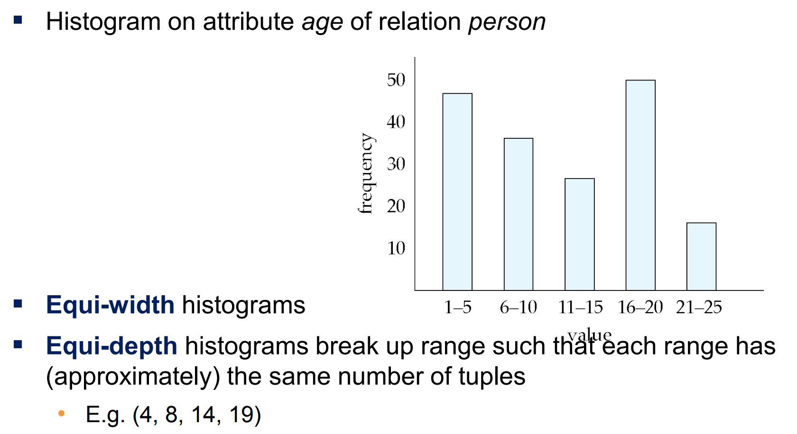

# Query Optimization

## Introduction

从处理给定查询的许多策略中选择最有效的查询评估计划的过程，特别是在查询很复杂的情况下

### Two Aspects

- 在关系代数层面，找到与给定表达式等价但执行效率更高的表达式
- 在实现层面，选择处理查询的详细策略，例如选择用于执行操作的算法、选择要使用的特定索引，等等。

### Steps in cost-based query optimization

- 使用等价规则生成逻辑等价的表达式
- 注释结果表达式以获得备选查询计划
- 根据估计成本选择最便宜的计划

## Transformation of Relational Expressions

如果两个关系代数表达式对于任何数据库的instance都能生成相同的元组集合，则这两个表达式是等价的

### Equivalence Rules

#### R1

- $\sigma_{\theta_1\wedge\theta_2}(E)=\sigma_{\theta_1}(\sigma_{\theta_2}(E))$

#### R2

- $\sigma_{\theta_1}(\sigma_{\theta_2}(E))=\sigma_{\theta_2}(\sigma_{\theta_1}(E))$

#### R3

- $\Pi_{L_1}(\Pi_{L_2}(…(\Pi_{L_n}(E))…))=\Pi_{L_1}(E),~where~L_1\subseteq L_2\subseteq …\subseteq L_n$

#### R4

- $\sigma_\theta(E_1\times E_2)=E_1\Join_\theta E_2$
- $\sigma_{\theta_1}(E_1\Join_{\theta_2}E_2)=E_1\Join_{\theta_1\wedge\theta_2}E_2$

#### R5

- $E_1\Join_\theta E_2=E_2\Join_\theta E_1$

#### R6

- $(E_1\Join E_2)\Join E_3=E_1\Join (E_2\Join E_3)$

- $(E_1\Join_{\theta_1}E_2)\Join_{\theta_2 \wedge\theta_3}E_3=E_1\Join_{\theta_1\wedge\theta_3}(E_2\Join_{\theta_2}E_3)$

#### R7

- $\sigma_{\theta_1}(E_1\Join_\theta E_2)=(\sigma_{\theta_1}(E_1))\Join_\theta E_2$

- $\sigma_{\theta_1\wedge\theta_2}(E_1\Join_{\theta}E_2)=(\sigma_{\theta_1}(E_1))\Join_\theta(\sigma_{\theta_2}(E_2))$

#### R8

- $\Pi_{L_1\cup L_2}(E_1\Join_\theta E_2)=(\Pi_{L_1}(E_1))\Join_\theta(\Pi_{L_2}(E_2))$

#### R9

- $E_1\cup E_2=E_2\cup E_1$
- $E_1\cap E_2=E_2\cap E_1$

#### R10

- $(E_1\cup E_2)\cup E_3=E_1\cup (E_2\cup E_3)$
- $(E_1\cap E_2)\cap E_3=E_1\cap (E_2\cap E_3)$

#### R11

- $\sigma_\theta(E_1\cup E_2)\equiv \sigma_\theta(E_1)\cup\sigma_\theta(E_2)$
- $\sigma_\theta(E_1\cap E_2)\equiv \sigma_\theta(E_1)\cap\sigma_\theta(E_2)$
- $\sigma_\theta(E_1- E_2)\equiv \sigma_\theta(E_1)-\sigma_\theta(E_2)$
- $\sigma_\theta(E_1\cap E_2)\equiv \sigma_\theta(E_1)\cap E_2$
- $\sigma_\theta(E_1- E_2)\equiv \sigma_\theta(E_1)- E_2$

#### R12

- $E_1⟗ E_2=E_2⟗ E_1$
- $E_1⟕ E_2=E_2⟖ E_1$

!!!Note
	**Cross Join**操作返回两张表的笛卡尔积

#### R13

- $\sigma_{\theta_1}(E_1⟕_{\theta_2}E_2)=(\sigma_{\theta_1}(E_1))⟕_\theta E_2$
- $\sigma_{\theta_1}(E_1⟖_{\theta_2}E_2)=(E_2⟖_\theta(\sigma_{\theta_1}(E_1)))$

### Enumeration of Equivalent Expressions

**1. Repeat**

- Apply all applicable equivalence rules on every subexpression of every equivalent expression found so far
- Add newly generated expressions to the set of equivalent expressions

**2. Until no new equivalent expressions are generated above**

可以这样找到所有的等价表达式。

但是实际中我们基于一些经验规则进行启发式的优化

## Statistics for Cost Estimation

### 变量意义

- $n_r$：关系 $r$ 中的元组数量
- $b_r$：关系 $r$ 所需要的block数量
- $l_r$：关系 $r$ 中一个元组的长度（单位为byte）
- $f_r$：对于关系 $r$ 中的元组，一个block可以放下的元组数量

$$
b_r=\lceil\frac{n_r}{f_r}\rceil
$$

- $V(A,r)$：在关系 $r$ 中不同属性 $A$ 的数量，与 $\Pi_A(r)$  的大小相等。如果 $A$ 是关系 $r$ 的key，则 $V(A,r)=n_r$

### Selection

#### $\sigma_{A=v}(r)$

如果 $A$ 为key，则size为1

否则满足条件的记录数估计为：$\frac{n_r}{V(A,r)}$

#### $\sigma_{A\le v(r)}$

用 $c$ 来表示满足条件的元组估计数

假设 $min(A,r)$ 和 $max(A,r)$ 存在，则

- $c=0~\text{if }v<min(A,r)$
- $c=n_r\frac{v-min(A,r)}{max(A,r)-min(A,r)}$

#### 直方图

### Complex Selections

以下式子中 $s_i$ 为满足条件 $\theta_i$ 的元组数

#### Conjunction $\sigma_{\theta_1\wedge\theta_2\wedge…\wedge\theta_n}(r)$

$$
n_r\times\frac{s_1\times s_2\times…\times s_n}{n_r^n}
$$

#### Disjunction $\sigma_{\theta_1\vee\theta_2\vee…\vee\theta_n}(r)$

$$
n_r\times(1-(1-\frac{s_1}{n_r})\times(1-\frac{s_2}{n_r})\times…\times(1-\frac{s_n}{n_r}))
$$

#### Negation $\sigma_{\lnot\theta}(r)$

$$
n_r-\text{size}(\sigma_\theta(r))
$$

###  Joins

#### $R\cap S=\phi$

$r\Join s$ 等价于 $r\times s$

#### $R\cap S$ 是 $R$ 的key

此时 $s$ 最多对应一个 $r$ ，则size不会超过 $s$ 的元组数

#### $R\cap S$ 对于 $S$ 来说是引用 $R$ 的外码

此时size等于 $s$ 中的元组数

#### $R\cap S=\{A\}$ 不是 $R$ 或 $S$ 的key

- 假设所有 $R$ 中的元组 $t$ 都会在 $R\Join S$ 中生成元组：

$$
\frac{n_r\times n_s}{V(A,s)}
$$

- 假设所有 $S$ 中的元组 $t$ 都会在 $R\Join S$ 中生成元组：

$$
\frac{n_r\times n_s}{V(A,r)}
$$

- 通常来说两者之中的更小值是更准确的估计

### Other Operations

#### Projection

$\Pi_A(r)=V(A,r)$

#### Aggregation

$_G \gamma_A(r)=V(G,r)$

#### Set Operations

**不同关系**

- $r\cup s =\text{size of } r+\text{size of }s$
- $r\cap s= min(\text{size of } r,\text{size of } s)$ 

- $r-s =r$

- 以上三个估计不一定准确，但是提供了上界

**Outer Join**

- $r⟕s=\text{size of } r\Join s+\text{size of }r$
- $r⟗s=\text{size of }r\Join s+\text{size of }r+\text{size of }s$

### Estimation of Number of Distinct Values

对于Selection：$\sigma_\theta(r)$

- $\theta$ 条件为 $A$ 指定一个值：$V(A,\sigma_\theta(r))=1$

- $\theta$ 条件指定 $A$ 为多个值：$V(A,\sigma_\theta(r))=指定值的个数$

- $\theta$ 条件指定格式 $A \text{ op }v$：$V(A,\sigma_\theta(r))=V(A,r)\times s,\text{where }s\text{ is the selectivity of the selection}$

- 对于其他情况，使用一下值来估计：$min(V(A,r),n_{\sigma_{\theta}(r))}$

对于Join：$r\Join s$

- 如果 $A$ 的属性全部来自 $r$

$$
V(A,r\Join s)=min(V(A,r),n_{r\Join s})
$$

- 如果 $A$ 的属性包括来自 $r$的 $A_1$ 和来自 $s$ 的 $A_2$

$$
V(A,r\Join s)=min(V(A_1,r)\times V(A_2-A_1,s),V(A_1-A_2,r)\times V(A_2,s),n_{r\Join s})
$$

​	
