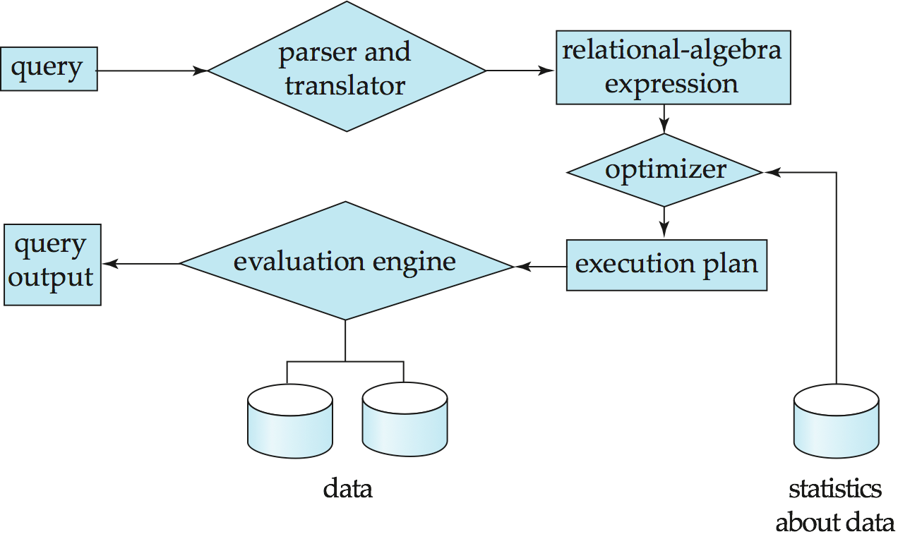
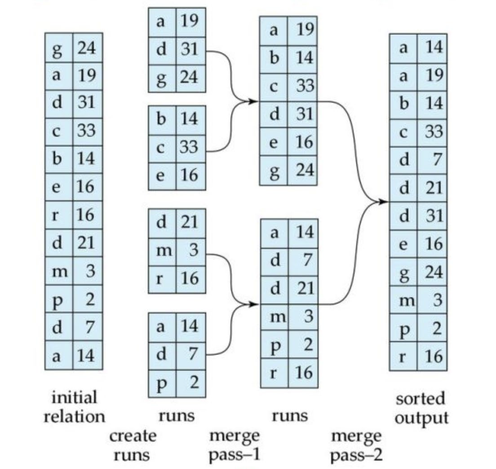
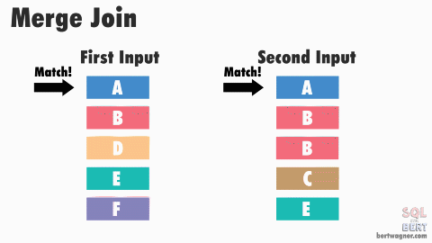
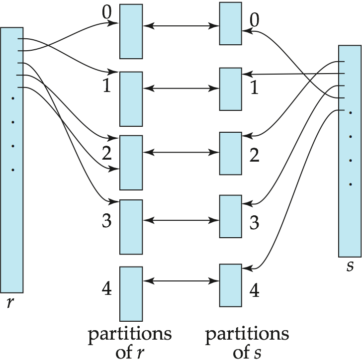

# Query Processing

## Overview

### Basic Steps in Query Processing

1. Parsing and translation
2. Optimization
3. Evaluation/Execution

### Query Optimization

1. 应用基于等价规则的转换。
2. 生成多个可能的执行计划。
3. 使用统计数据来估计每个计划的成本。
4. 选择最有效的执行计划。

## Measures of Query Cost

通常，磁盘访问是主要的成本，并且相对容易估计。通常包括以下几个成本：

- seek操作的数量
- block读取次数 $\times$ average-block-read-cost
- block写次数 $\times$ average-block-write-cost (写block的成本大于读block的成本，数据写入后需要回读，以确保写入成功)

成本也取决于主存中缓冲区的大小：

- 拥有更多内存，减少对磁盘访问的需求
- 可用于缓冲的实际内存量取决于其他并发操作系统进程，在实际执行之前很难确定
- 我们经常使用**最坏情况**估计（假设只有操作所需的最小内存量可用）和**最佳情况**估计。
- 所需的数据可能已经驻留在缓冲区中，避免了磁盘I/O。但是很难考虑到成本估算

## Selection Operation

以下参数意义：

- $t_T$ ：替换block消耗的时间
- $t_S$ ：在磁盘中进行seek操作的时间
- $b_r$ ：记录 $r$ 的block数量

### Linear Search

线性查找所有数据。

- 查找所有的cost：$t_S+t_T\times b_r$
- 查找特定值的平均cost：$t_S+t_T\times b_r/2$

### Clustering/Primary Index + B+-tree + Equality on Key

通过B+树建立的主索引来查找特定值。需要访问 $h_i$ 次B+树再访问一次数据。

- cost：$(h_i+1)\times(t_S+t_T)$ ，其中 $h_i$ 是B+树的高度。

### Clustering/Primary Index + B+-tree + Equality on Non-Key

通过B+树建立的主索引来查找特定值，且相应的值可以对应多条记录。需要访问 $h_i$ 次B+树再访问多个连续block的数据。

- cost：$h_i\times(t_S+t_T)+t_S+t_T\times b$ ，其中 $b$ 是对应查询到的记录的block数。

### Secondary Index + B+-tree + Equality on Key

通过B+树建立的二级索引来查找特定值。由于查找一个值，等同于主索引的B+树查找。

- cost：$(h_i+1)\times(t_S+t_T)$

### Secondary Index + B+-tree + Equality on Non-Key

通过B+树建立的二级索引来查找特定值，且相应的值可以对应多条记录。需要访问 $h_i$ 次B+树再访问多个不连续block的数据。

- cost：$(h_i+n)\times(t_S+t_T)$，其中 $n$ 是查询到的记录条数。 

### Clustering Index + B+-tree + Comparison

通过B+树建立的主索引来查找大于（小于）特定值的数据。需要访问 $h_i$ 次B+树再访问从当前位置开始的后续所有连续数据。（小于时先取反再排除）

- cost：$h_i\times(t_S+t_T)+t_S+t_T\times b$ 

### Secondary Index + B+-tree + Comparison

通过B+树建立的二级索引来查找大于（小于）特定值的数据。需要访问 $h_i$ 次B+树再访问从当前位置开始的后续所有不连续数据。

- cost：$(h_i+n)\times(t_S+t_T)$

### Conjunctive Selection Using One Index

Conjunction：$\sigma_{\theta1\wedge\theta2\wedge…\theta n}(r)$

先从n个条件 $θ1… θn$ 中选择代价最小的 $θi$ 先执行，返回元组放内存。然后遍历选出的结果选出符合条件的。

### Conjunctive Selection Using Composite Index

与前者类似，注意可以在过程中使用 $\Pi$ 操作来省去不必要的列的访问。

### Conjunctive Selection By Intersection of Identifiers

- 需要带记录指针的索引
- 对每个条件使用相应的索引，取得到的所有记录指针集合的交集。
- 然后从文件中获取记录
- 如果某些条件没有合适的索引，请在内存中应用test。

### Disjunctive Selection By Union of Identifiers

Disjunction：$\sigma_{\theta1\vee \theta2\vee…\theta n}(r)$

与前者类似，也可以使用 $\sigma_{\neg\theta}(r)$ 来转换成Conjunctive操作。

## *Sorting

以下参数意义：

- $N$ ：run的数量
- $M$ ：内存可以放下的block数
- $b_b$  ：buffer里可以放下的block数

### Merge Sort

- 最初的runs数量为 $\lceil b_r/M\rceil$
- Merge passes的数量为 $\lceil \log_{M-1}(b_r/M)\rceil$

#### Total Number of Block Transfers

$$
b_r(2\lceil\log_{M-1}(b_r/M)+1)
$$

#### Total Number of Seeks

$$
2\lceil b_r/M\rceil+\lceil b_r/b_b\rceil(2\lceil\log_{M-1}(b_r/M)-1)
$$

## Join Operation

以下全部以 $r\Join s$ 为例：

- $b_r$ ： $r$ 的block数
- $b_s$ ： $s$ 的block数
- $n_r$ ： $r$ 的记录数
- $n_s$ ： $s$ 的记录数

### Nested-loop join

简单的二重循环，对应 $r$ 中的每一条记录，都对 $s$ 进行一次完整遍历。

- block transfers：$n_r\times b_s +b_r$
- disk seeks：$n_r+b_r$

### Block Nested-Loop Join

以block为单位进行Join操作，即每读入一个 $s$ 的block，都把这个block和已经读入的所有 $r$ 的记录进行Join。

- block transfers：$\lceil\frac{b_r}{M-2}\rceil\times b_s +b_r$
- disk seeks：$2\lceil\frac{b_r}{M-2}\rceil$

### Indexed Nested-Loop Join

对于外部关系 $r$ 中的每个元组 $t_r$，使用索引查找 $s$ 中满足的元组元组 $t_r$ 的连接条件。

- Time Cost：$b_r\times(t_T+t_S)+n_r\times c$，其中 $c$ 是每次通过索引在 $s$ 中寻找匹配元组的时间，可以估计为使用连接条件对 $s$ 进行一次选择的成本。

### Merge-Join

先对数据进行排序，然后按序进行匹配。

 

- block transfers：$b_s +b_r$
- disk seeks：$\lceil b_r/b_b\rceil+\lceil b_s/b_b\rceil$，其中 $b_b$ 为给相应的关系分配的buffer blocks数。

（对于无序数据的完整cost还包括Merge Sort的cost）

#### Hybrid Merge-Join

- 如果一个关系已排序，而另一个关系在连接属性上有一个辅助B+树索引
- 将排序后的关系与B+树的叶节点的相应entries进行merge。
- 结果文件包含来自排序关系的元组和未排序关系的元组的地址
- 然后根据未排序关系的元组地址对结果文件进行排序，从而允许有效地检索相应的元组顺序扫描比随机查找更有效

### Hash-Join

将 $r$ 和 $s$ 中需要Join的数据通过一个Hash函数映射到不同的partition，然后对于Hash值一样的partition进行Join。

- block transfers：$3(b_s +b_r)+4n_h$，其中 $n_h$ 是Hash后的partition数量，通常远小于 $b_s+b_r$
- disk seeks：$2(\lceil b_r/b_b\rceil+\lceil b_s/b_b\rceil)+2n_h$
