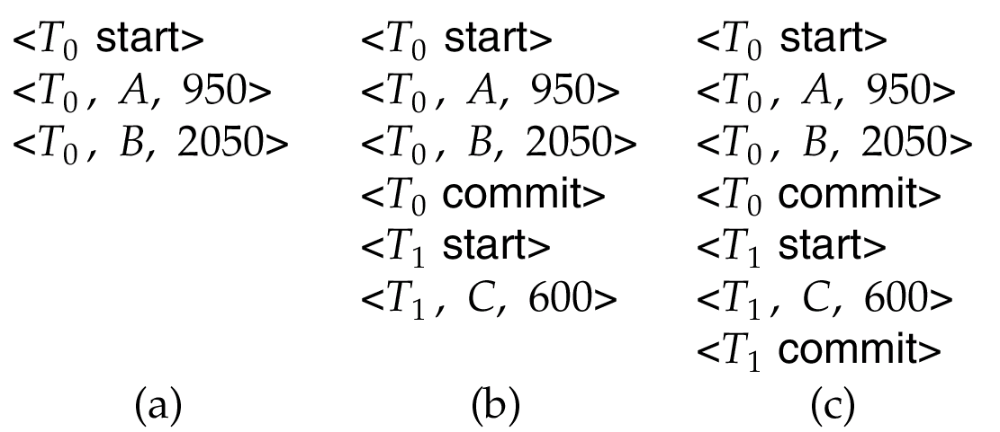
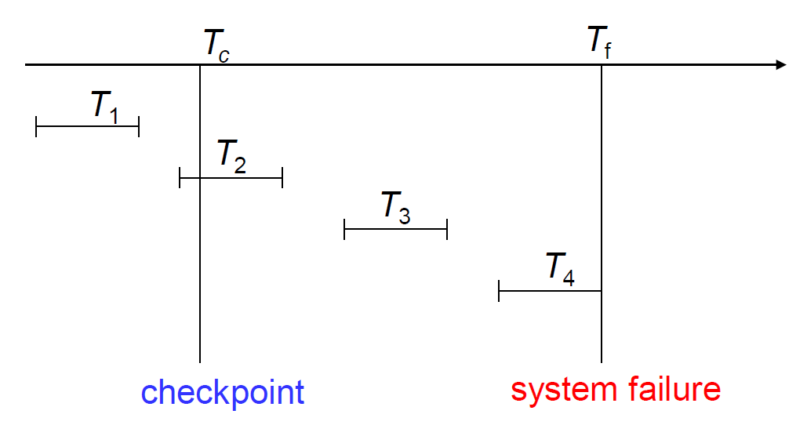
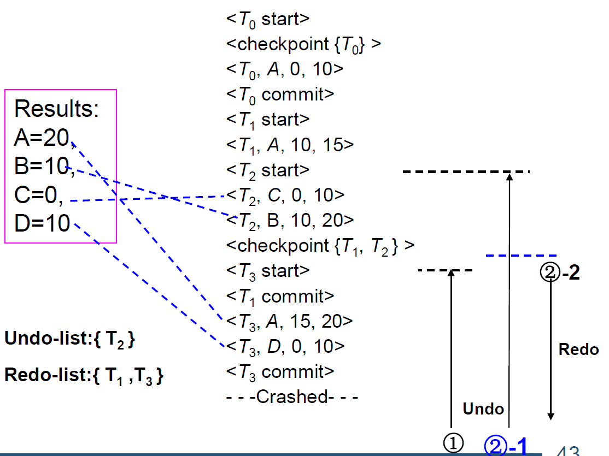
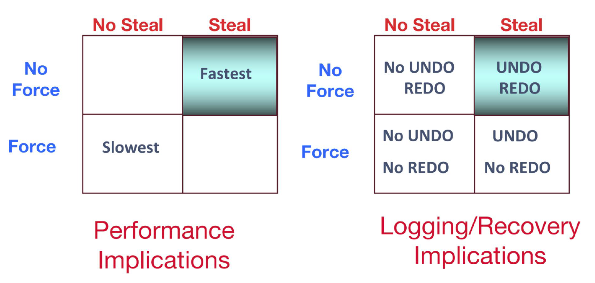
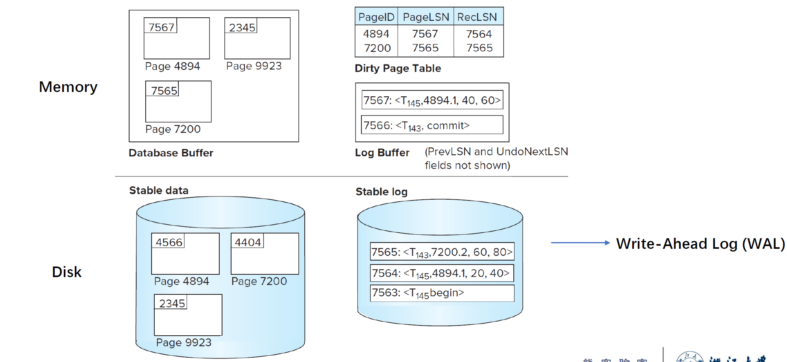
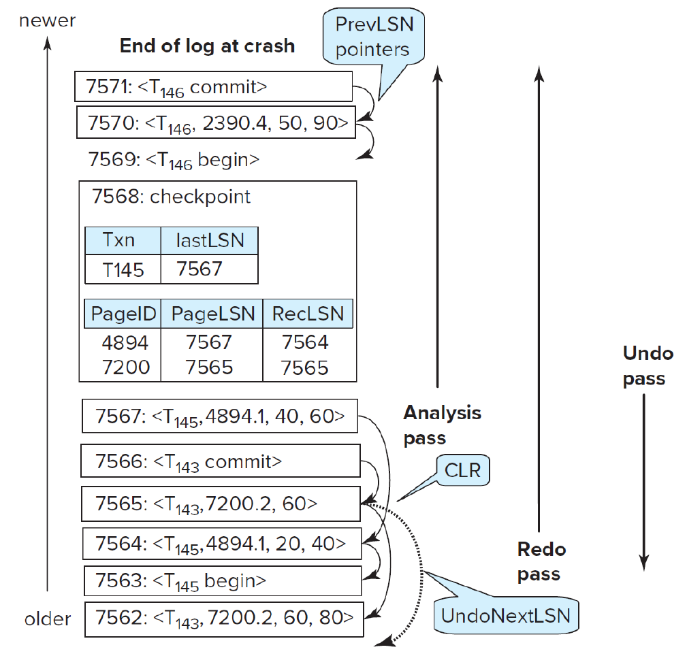

# Recovery System

## Failure Classification

**1. Transaction Failure**: 

- 逻辑错误：由于某些内部错误条件导致事务无法完成：溢出，错误输入，未找到数据，…
- 系统错误：由于错误情况（例如死锁），数据库系统必须终止一个活动事务。

**2. System Crash**: 

- 电源故障或其他硬件或软件故障导致的系统崩溃

**3. Disk Failure**

### Recovery Algorithms

分为两个部分：

- 在正常事务处理期间采取的操作，以确保存在足够的信息以从故障中恢复
- 将数据库内容恢复到确保原子性、一致性和持久性的状态失败后所采取的操作

## Log-Based Recovery

通过一系列日志记录，维护数据库上的更新活动记录

- 事务开始: `<Ti start>`

- 写数据: `<Ti, X, V1, V2>` (在事务Ti中把X的值由V1更新为V2)
- 事务结束: `<Ti commit>`

对于日志的使用，用两种方式：

- **Deferred database modification(延迟修改)**
- **Immediate database modification(立即修改)**

主要区别在于何时将事务的修改写入物理数据库

### Deferred Database Modification

事务直到提交的那一刻才对数据库进行修改。

对于以上三种情况的处理：

(a) 不需要进行redo

(b) 由于 $T_0$ 已经commit了，需要对 $T_0$ 进行redo

(c) 由于 $T_0$ 比 $T_1$ 先commit，对于 $T_1$ 的redo需要在 $T_0$ 之前

### Immediate Database Modification

在事务活跃期间便对数据库进行修改。

!!!Note
	更新日志必须在写入数据库项之前写入

相比于延迟修改，立即修改有两种恢复操作：

- `undo(Ti)`: 从 Ti 的最后一条日志记录开始，将 Ti 所有更新的数据项都恢复到旧值。在log包含`<Ti start>`但是不包含`<Ti commit>`时进行。
- `redo(Ti)`: 从 Ti 的第一条日志记录开始，将 Ti 所有更新的数据项设置成新值。在log同时包含`<Ti start>`和`<Ti commit>`时进行。

> undo操作优先于redo操作

### Checkpoints

- `<checkpoint L>`，其中 `L` 为活跃事务表。

在进行checkpoint时需要把之前所有已经commit的事务写入磁盘。

当系统发生崩溃时，仅需从最后一个checkpoint开始进行redo，此时维护一个undo list，在初始状态下为 `L`，此后在redo过程中事务开始则加入undo list，事务提交或终止则移除undo list。当redo执行完后，再对undo list中的所有事务进行undo，完成恢复。（详细见[Recovery With Concurrent Transactions])

对于以上情况：

- $T_1$ 不做处理
- $T_2.T_3$ 进行redo
- $T_4$ 进行undo

## Recovery With Concurrent Transactions

1. 将 undo-list 和 redo-list 设为空

2. 从下往上进行扫描，直到找到第一个`<checkpoint T>`，在此过程中：

   > 如果遇到`<Ti commit>`，则将 Ti 加入redo-list；
   >
   > 如果遇到`<Ti start>`且 Ti 不在redo-list里，则加入undo-list；
   >
   > 如果遇到`<Ti abort>`，则将 Ti 加入undo-list。

3. 对于所有位于活跃事务表 `L` 中的 Ti，如果不在 redo-list 里，则加入 undo-list

4. 从日志文件的末尾向后扫描日志，并进行undo操作。当所有undo-list里的Ti对应的`<Ti start>`记录都遇到后停止。

5. 找到最近的`<checkpoint L>`

6. 从`<checkpoint L>`开始向下，对所有关于redo-list中事务的日志记录执行redo。

#### Example

 

## Buffer Management

如果要缓冲日志记录，必须遵守以下 4 条规则：

1. 日志记录按创建顺序输出到稳定存储区。
2. 只有当日志记录 `<Ti commit> `被输出到稳定存储时，事务才会进入提交状态。
3. 在 `<Ti commit> `输出到稳定存储之前，与 Ti 相关的所有日志记录必须已输出到稳定存储区。
4. 在将主内存中的数据块输出到数据库之前，与该数据块中的数据有关的所有日志记录必须已输出到稳定存储器。(日志应先于数据写到磁盘）。此规则称为先写日志规则（write-ahead logging rule）或 WAL。

将数据块输出到磁盘：

1. 首先获取数据块上的独占锁存，确保数据块上没有正在进行的更新
2. 然后执行日志刷新
3. 然后将数据块输出到磁盘
4. 最后释放块上的锁

## Failure with Loss of Nonvolatile Storage

定期对整个数据库进行备份(*dump*)，在稳定存储的log中加入`<dump>`记录。

出现损坏时，从备份的上一个`<dump>`开始恢复数据。

## ARIES Recovery Algorithm

### Policy

#### Steal/No-Steal Policy

- **No-Steal Policy**: 在事务提交之前，不能将页面从内存中删除（因此也不能写入磁盘）
- **Steal Policy**: 可以提前将数据写回磁盘（会增大恢复难度）

#### Force/No-Force Policy

- **Force Policy**: 当事务结束时，在事务提交前将所有修改过的数据页强制存入磁盘。（更容易恢复）
- **No-Force Policy**: 事务提交时，数据不一定已经全部写回（速度更快，但会增大恢复难度）

在ARIES算法中，采用了 **Steal+No-Force** 策略。

### ARIES Data Structures

- **Log sequence number (LSN)**: 表示每条log记录（必须顺序增加；通常是从日志文件开头开始的偏移量，以便快速访问）
- 不同类型的Log records 
- Dirty page table
- PageLSN: 最后哪条log记录动了这个page

### Checkpoint

包含Dirty Page Table和活跃事务表

对于每个活动事务，LastLSN 是事务写入的最后一条日志记录的 LSN

（磁盘上的固定位置注有最后完成的检查点日志记录的 LSN）

#### Fuzzy Checkpoint

ARIES算法使用模糊检查点。

脏页不会在检查点时间写出，而是在后台持续刷新。因此，检查点的开销非常低，可以经常进行。

### Recovery Algorithm

#### 分析阶段

找到最后的完整检查点日志记录，读出 Dirty Page Table，从中获取 redo 的起点 RedoLSN（即Dirty Page Table中所有RecLSN的最小值）。将 undo-list 写为活跃事务表，然后开始向下扫描，遇到不在 undo-list 中的则加入，遇到事务结束则从 undo-list 中移除，同时加入 Dirty Table Page 并将 RecLSN 设为当前的LSN。

#### redo阶段

从RedoLSN开始向下扫描，跳过不在脏页表中或 LSN 小于脏页表中该页 RecLSN 的日志记录，其余的全部重做。

#### undo阶段

反向扫描，对 undo-list 内的记录进行 undo 操作，并在日志里加入只读记录 `<Ti, Xj, V1>`，如果遇到 `<Ti start>`，则写入 `<Ti abort>`并将 Ti 从 undo-list中删除。直到 undo-list 为空。

 

### Features

#### Recovery Independence

页面可以独立于其他页面进行恢复。

如果某些磁盘页面发生故障，可以在其他页面正在使用时从备份中恢复 。

#### Savepoints

事务可以记录保存点，并回滚到保存点。

- 对于复杂事务很有用
- 也可用于回滚到足以释放死锁的锁

#### Fine-grained locking

可以使用允许对索引进行元组级锁定的索引并发算法。

- 这些算法需要逻辑撤销，而不是物理撤销，如早期的恢复算法。

#### Recovery optimizations

在重做过程中，可以使用脏页表来预取页面。

可以不按顺序重做：

- 可以在从磁盘获取页面时推迟重做，并在获取页面时执行重做。
- 同时可以继续处理其他日志记录
