# Relational Database Design 

关系数据库设计的目标是生成一组关系模式。这可以通过设计适当的标准形式(*normal form*)的模式来实现。

## First Normal Form | 第一范式

如果关系模式R的所有属性的域都是原子(*atomic*)的，那么关系模式R就是第一范式（1NF）。即域的元素可以被认为是不可分割的单位。

对于以下情况，不满足原子性：

- 复合属性(*composite attributes*)   --- set of names 
- 多值属性(*multi-value attributes*)   --- a person’s phones 
- 复杂数据类型(*complex data type*)   --- object-oriented 

!!!Note
	对于关系型数据库，要求所有关系都是第一范式。

## Functional Dependencies | 函数依赖

对于 $R$ 的函数依赖 $\alpha \rightarrow \beta$ 需要满足对于任何合法关系 $r(R)$ ，当R的任意两个元组 $t1$和 $t2$ 在属性 $\alpha$ 上一致时，它们也在属性 $\beta$ 上也一致，即满足映射关系：

$$
t_1[\alpha]=t_2[\alpha]~~ \Rightarrow ~~t_1[\beta]=t_2[\beta]
$$

对于以下关系：

- $A\rightarrow B$ 一定不成立
- $B\rightarrow A$ 可能成立

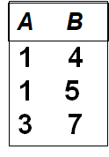 

### Key

- 当且仅当满足 $K\rightarrow R$ 时，$K$ 是超码
- 当且仅当满足  $K\rightarrow R$ 且不存在 $\alpha \subset K,\alpha \rightarrow R$时，$K$ 是候选码

### Trivial / Non-Trivial 

- Trivial: $\alpha \rightarrow \beta ,\text{if}~\beta \subseteq \alpha$（平凡的函数依赖）
- Non-trivial: $\alpha \rightarrow \beta ,\text{if}~\beta \not\subseteq \alpha$（非平凡的函数依赖）

### Armstrong’s Axioms 

- 如果 $\beta \subseteq \alpha$，则 $\alpha\rightarrow\beta$       			（reflexivity, **自反律**）--- travial
- 如果 $\alpha\rightarrow\beta$，则 $\gamma\alpha\rightarrow\gamma\beta$ ($\gamma\alpha\rightarrow\beta$)       （augmentation, **增补律**）

- 如果 $\alpha\rightarrow\beta$，且 $\beta\rightarrow\gamma$，则 $\alpha\rightarrow\gamma$         （transitivity, **传递律**）

#### 补充定律 

- 如果 $\alpha\rightarrow\beta$，且 $\alpha\rightarrow\gamma$，则 $\alpha\rightarrow\beta\gamma$    （union, **合并律**）

- 如果 $\alpha\rightarrow\beta\gamma$   ，则$\alpha\rightarrow\beta$，且 $\alpha\rightarrow\gamma$  （decomposition, **分解律**）

- 如果 $\alpha\rightarrow\beta$ ，且 $\gamma\beta\rightarrow\delta$，则 $\alpha\gamma\rightarrow\delta$  （pseudotransitivity, **伪传递律**）

### Closure

给定一个函数依赖集 $F$ ， $F$ 在逻辑上蕴含了某些其他的函数依赖。

- E.g. 如果 $F=\{A\rightarrow B,B\rightarrow C\}$则蕴含了函数依赖$A\rightarrow C$

对于一个函数依赖集 $F$ ，其闭包形式(*closure of F*)，用 $F^+$ 表示，定义为包含所有 $F$ 所蕴含的函数依赖的函数依赖集。

#### 计算
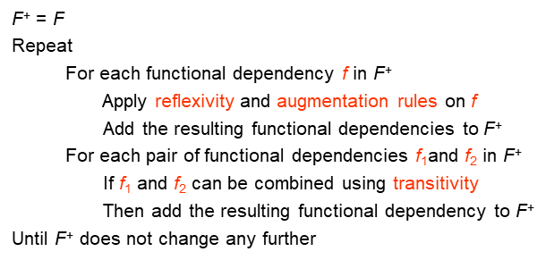

!!!Note
	对于一个有n属性的函数依赖集，其闭包至多有 $2^{n}\times 2^{n}$个函数依赖关系。

### Closure of Attribute Sets 

给定一个属性集 $\alpha$，在 $F$ 下的 $\alpha$ 的闭包用 $\alpha^+$ 表示，定义为在 $F$ 下所有可以由 $\alpha$ 函数直接或间接决定的属性集。

#### 计算

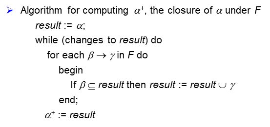 

#### Example

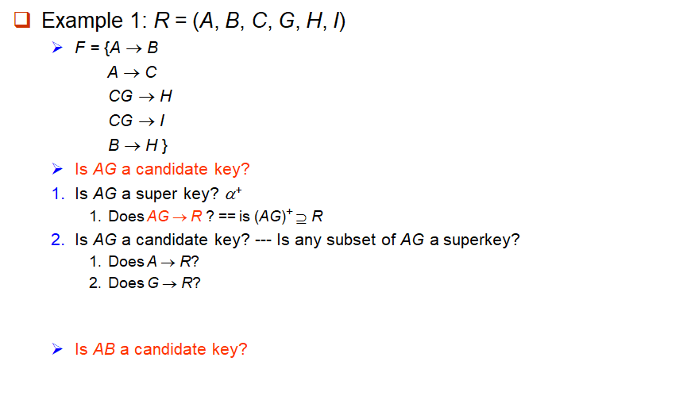 

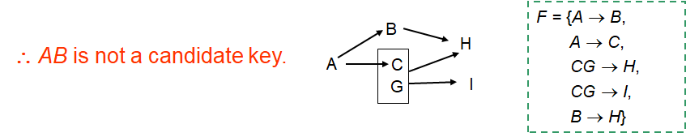 

### Canonical Cover | 正则覆盖

正则覆盖 $F_c$ 是函数依赖集 $F$ 的最小化。得到 $F_c$ 的关键步骤是消去现有函数依赖中的extraneous（无关的、多余的）属性，从而排除相应的函数依赖，使函数依赖集最小化。

#### Extraneous Attributes | 无关属性

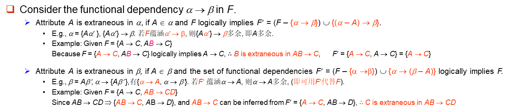 

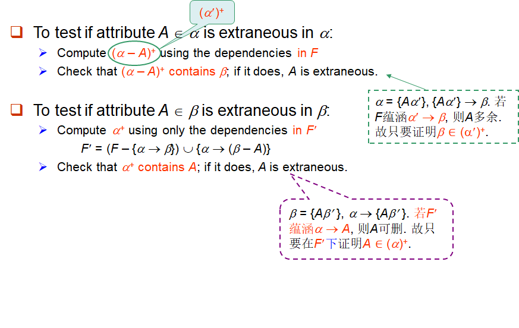

## Decomposition | 分解

### Goals of Normalization 

在关系 $R$ 不是 "good" form ，则将其分解为一组关系 ${R1， R2，…， Rn}$使得：

- 该分解是一个**无损连接分解**(*lossless-join decomposition*)。
- 分解是**依赖保存**(*dependency preservation*)。
- 每个关系 $Ri$ 都是 good form —— **BCNF**或**第三范式** ——没有冗余。

### Lossless-join

- Lossless-join decomposition (无损连接分解)：$r=\Pi_{R1}(r)\Join \Pi_{R2}(r)$

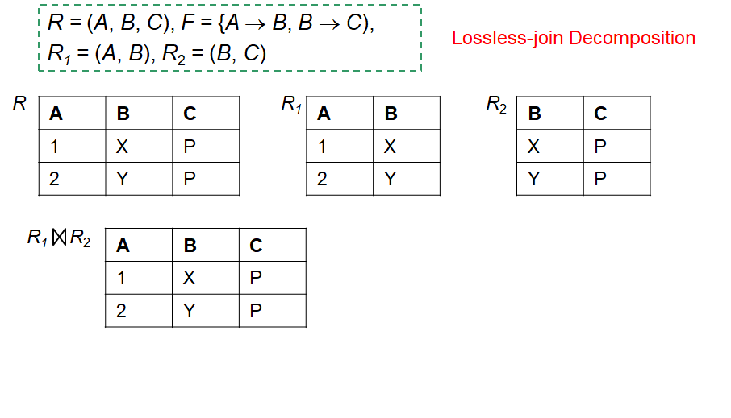 

- lossy-join decomposition (有损连接分解)：$r\subset\Pi_{R1}(r)\Join \Pi_{R2}(r)$

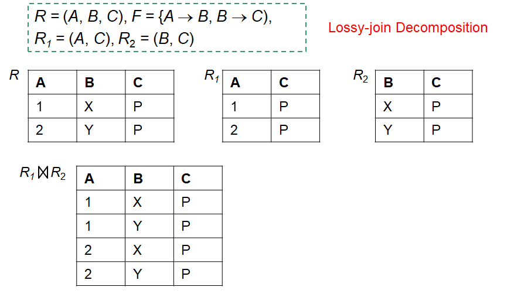

$R$ 分解为 $R1$ 和 $R2$ 是无损连接的，当且仅当 $F^+$中至少满足下列依赖项之一：

- $\{R1~\cap R2\}\rightarrow R1$
- $\{R1~\cap R2\}\rightarrow R2$

### Dependency preservation 

设 $F$ 是对模式 $R$ 的依赖合；设 $R1， R2，…Rn$ 是 $R$ 的分解，$F1，F2，…Fn$是分解对应的依赖集。则需要满足：
$$
(F1 ~\cap~F2~\cap ~…~\cap~Fn )^+=F^+
$$

## Boyce-Codd Normal Form | BC范式

如果一个关于函数依赖集 $F$ 的关系模式 $R$ 符合BCNF，则对于所有 $F^+$ 中的函数依赖 $\alpha \rightarrow \beta,\text{where} ~\alpha\subseteq R\text~{and}~\beta \subseteq R$， 

至少满足以下条件的其中一个：

- $\alpha \rightarrow \beta$ 是平凡(*trabial*)的（即 $\beta \subseteq \alpha$）
- $\alpha$ 是 $R$ 的超码（即 $R\subseteq\alpha ^+，\alpha \rightarrow R$）

### Example

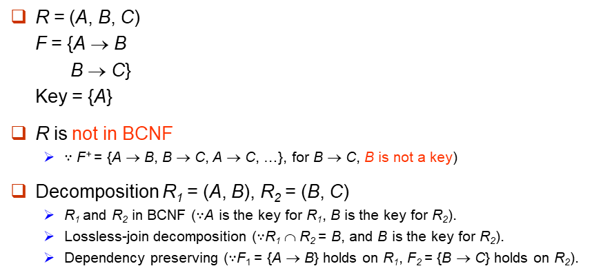 

### 检验

#### 单个依赖

对于一个非平凡函数依赖 $\alpha\rightarrow\beta$ ：

- 计算 $\alpha^+$ 
- 验证 $\alpha^+$ 是否包含 $R$ 中的所有属性，即 $\alpha$ 是 $R$ 的超码

#### 整个关系模式

要检查关系模式 $R$ 是否是BC范式，只需检查给定依赖集 $F$ 中的依赖项是否违反BC范式，而不必检查 $F^+$ 中的所有依赖项。

- 如果 $F$ 中的依赖项都不会导致违反BC范式，那么 $F^+$ 中的依赖项也不会导致违反BC范式。

!!!Note
	$F^+$ 是由Armstrong的3个公理从 $F$ 推出的, 而任何公理都不会使Functional Dependency (FD)左边变小(拆分), 故如果F中没有违反BCNF的FD (即左边是superkey), 则 $F^+$ 中也不会. 

!!!Note
	可在 $F$ 下判别 $R$ 是否违反BCNF, 但必须在 $F^+$ 下判别 $R$ 的分解式是否违反BCNF. 

### BCNF分解算法

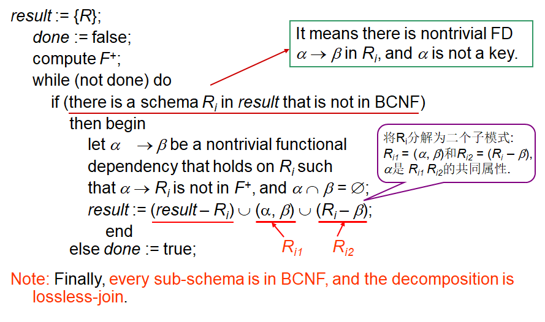 

#### Example

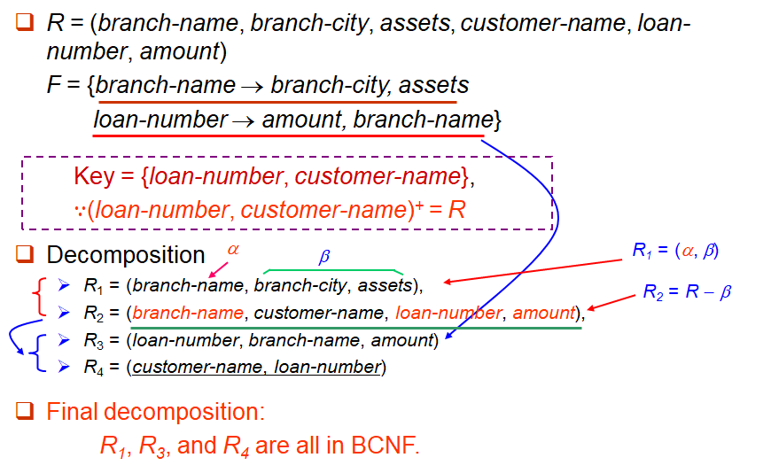 

!!!Note
	在BCNF分解中不一定满足所有三个设计目标：
	- Lossless join 
	- BCNF
 	- Dependency preservation 

## Third Normal Form 

如果一个关于函数依赖集 $F$ 的关系模式 $R$ 符合第三范式(3NF)，则对于所有 $F^+$ 中的函数依赖 $\alpha \rightarrow \beta,\text{where} ~\alpha\subseteq R\text~{and}~\beta \subseteq R$， 

至少满足以下条件的其中一个：

- $\alpha \rightarrow \beta$ 是平凡(*trabial*)的（即 $\beta \subseteq \alpha$）
- $\alpha$ 是 $R$ 的超码（即 $R\subseteq\alpha ^+，\alpha \rightarrow R$）
- $\beta - \alpha$ 中的每个属性 $A$ 都包含在 $R$ 的候选码中（不一定在同一个候选码中）

即当 $\beta$ 为非主属性时, $\alpha$ 必须是码； 但当 $\beta$ 为主属性时, 则 $\alpha$ 无限制。（其中主属性为候选码中的所有属性）

### 冗余

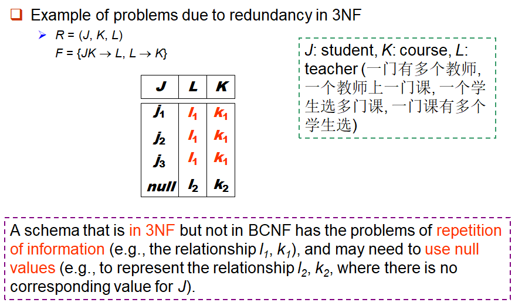 

### 检验

只需要检查 $F$ 中的 FD，不需要检查 $F^+$ 中的所有FD。

### 3NF分解算法

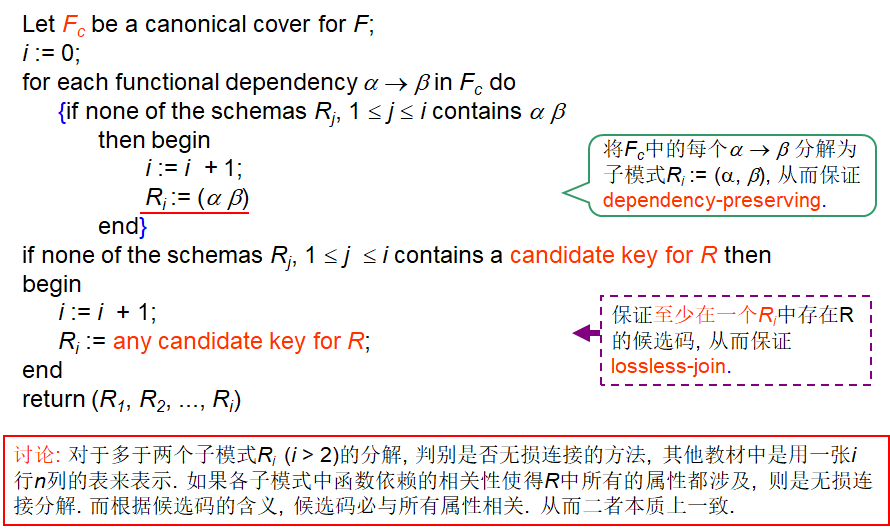 

### 3NF和BCNF的区别

总是可以将关系分解为3NF且满足：

- 分解是无损的
- 依赖关系被保留

对于BCNF的分解可以满足：

- 分解是无损的
- 但是保持依赖关系可能做不到的

## Multivalued Dependencies 

在多值依赖中，如果对于关系模式 $R$ 中的属性集 $X$ 、$Y$，对于 $X$ 的每一个确定值，都存在 $Y$ 的一组值与之对应，且这组 $Y$ 的值与其他属性 $U-X-Y$ 无关，则称 $Y$ 多值依赖于 $X$，记作 $X→→Y$

### 性质

- 互补性：如果 $X→→Y$ ，则 $X→→(U *–* X *–* Y)$

- 自反性：如果 $Y ⊆ X$，则 $X→→Y$

- 增广性：如果 $X→→Y$ 且 $V ⊆ W$，则 $WX→→VY$

- 传递性：如果 $X→→Y$ 且 $Y→→Z$ ，则 $X→→(Z – Y)$

### 多值依赖与函数依赖的区别

- 函数依赖 $(X→Y)$ 表示 $X$ 唯一决定 $Y$ ，而多值依赖 $(X→→Y)$ 表示 $X$ 决定 $Y$ 的一组值

- 所有函数依赖都是多值依赖的特例

- 多值依赖描述的是更一般的独立性关系

## Fourth Normal Form 

如果一个关于函数依赖与多值依赖集 $D$ 的关系模式 $R$ 符合4NF，则对于所有 $D^+$ 中的多值依赖 $\alpha \rightarrow\rightarrow \beta,\text{where} ~\alpha\subseteq R\text~{and}~\beta \subseteq R$， 

至少满足以下条件的其中一个：

- $\alpha \rightarrow \beta$ 是平凡(*trabial*)的（即 $\beta \subseteq \alpha$）
- $\alpha$ 是 $R$ 的超码（即 $R\subseteq\alpha ^+，\alpha \rightarrow R$）

!!!Note
	如果一个关系是4NF，那么一定是BCNF

### 分解算法

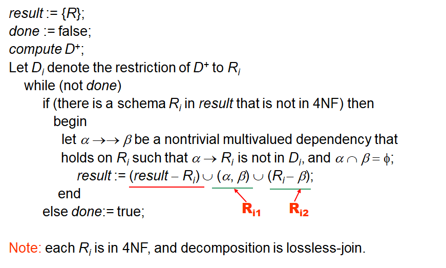 
