# Relational Model

## Structure of Relational Databases 

### Relation | 关系

给定集合$D_1,D_2,…,D_n$, relation **r** 是$D_1\times D_2\times…\times D_n$的一个子集

- relation是一个由n-tuples组成的集合($a_{1j},a_{2j},…,a_{nj})$,$a_{ij}\in D_i(i\in[1,n])$


#### Attribute Type | 属性

关系的每个属性都有一个名称。每个属性允许的值的集合称为属性的域(*domain*)。

属性值（通常）需要是**原子(*atomic*)**的，即不可分割的

- e.g., multivalued attribute（多值属性）不具有原子性
- e.g., composite attribute（复合属性）不具有原子性

使用**null**来标识字段没有存储实际值（count 数据丢失，distinct数据丢失……）

#### Relation Schema

描述relation的结构。

假设$A_1,A_2,…,A_n$为attributes，则$R=(A_1,A_2,…,A_n)$是一个relation schema.

$r(R)$表示对于relation schema $R$ 的一个 ralation $r$

- E.g.,`instructor(instructor-schema) = instructor(ID, name, dept_name, salary)`

#### Relation Instance

由relation定义的表中的数据。

**tuple（元组）**表示表中的一行。

若 $t$ 表示一个tuple变量，则 $t[name]$ 表示 $t$ 的相应属性的值。

#### Relation的特性

- 元组(*tuples*)的顺序是无关的（即，元组可以存储在任意的位置）。
- 关系中没有重复的元组。
- 属性值是原子的。


### Key | 键/码

#### Super Key | 超码

对于一个关系$r(R)$，如果 $R$ 的一个子集 $K$ 足以分辨 $r$ 中的所有不同元组，则 $K$ 是$R$ 的一个超码。即能够唯一标识元组的属性集，**可以包含冗余属性**。

- E.g., `{ID}`和`{ID, name}`都是关系`instructor`的超码。

#### Candidate Key | 候选码

**最小的超码**，能够唯一标识元组，但不能删除任何属性。 

- E.g., `{ID}`是关系`instructor`的一个候选码，因为它是一个超码并且没有同为超码的更小子集。

#### Primary Key | 主码

在候选码中选出一个作为关系的主码。通常使用下划线来标识。

- e.g., *classroom(<u>building</u>, <u>room number</u>, capacity)*

!!!Note
	主码的值不能为null。

#### Foreign Key | 外码

假设存在两个关系 $r$ 和 $s$: $r(\underline{A},B,C),s(\underline{B},C)$，那么可以认为关系 $r$ 中的属性 $B$ 是一个**引用(*referencing*)** $s$ 的外码(*foreign key*)，$r$ 是一个**参照/引用关系(*referencing relation*)**，$s$ 是一个被**引用/被参照关系(*referenced relation*)**。

- E.g., 学生(<u>学号</u>，姓名，性别，专业号，年龄)  ---参照关系
  	专业(<u>专业号</u>，专业名称)  ---被参照关系
  其中属性**专业号**称为关系**学生**的外码

!!!Note
	参照关系中外码的值必须在被参照关系中实际存在, 或为null。

##### **完整性约束**

- Primary key constraints 主码约束：确保表中的每一行都有一个唯一标识符。
- Foreign key constraint 外码约束：确保外码字段的值必须是另一个表主码（或候选码）中的一个有效值。
- Referential integrity constraint 引用完整性约束：外码字段的值必须对应于目标表中的有效主码值。

##### Example

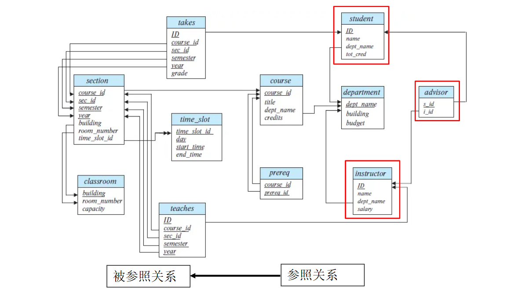

### Query Languages | 查询语言

用户从数据库请求信息时使用的语言。

**Pure query languages（纯查询语言）**：使用纯查询语言执行的查询不会对数据库的状态产生任何改变，只会基于输入数据生成输出结果。


## Fundamental Relational-Algebra Operations 

### Select(选择) $\sigma$

选择符合条件的tuples，即行方向选择。

#### 表示

$\sigma _p (r) = \{r| t\in r~and~p(t)\}$

其中 $p$ 被称为*selection predicate*

- 比较符： $=,\neq,>,\geq,<,\leq$
- 连接符：$\wedge(and),\vee(or),\urcorner(not)$

#### Example

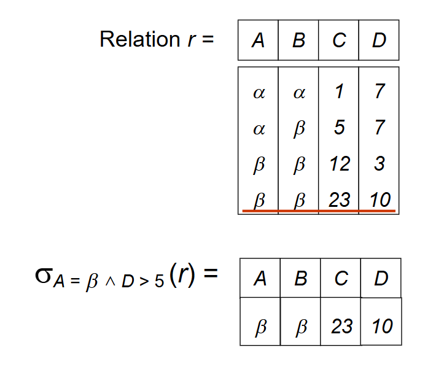 

### Project(投影) $\Pi$

选择关系中某几个属性的值，即列方向选择。

#### 表示

$\Pi_{A_1,A_2,…,A_k}(r)$

其中$A_1,A_2,…,A_k$为属性名，$r$为关系名

!!!Note
	投影操作后重复的行会被删除

#### Example

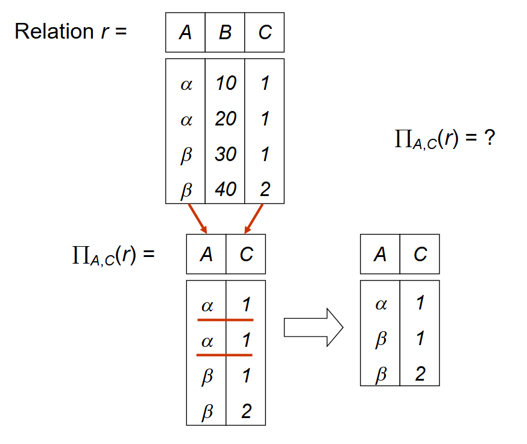

### Union(并) $\cup$

用于合并两个关系。

#### 表示

$r\cup s=\{t|t\in s~or~t\in r\}$

#### 有效条件

- $r$ 和 $s$ 必须具有相同数量的属性
- 属性域必须兼容

#### Example

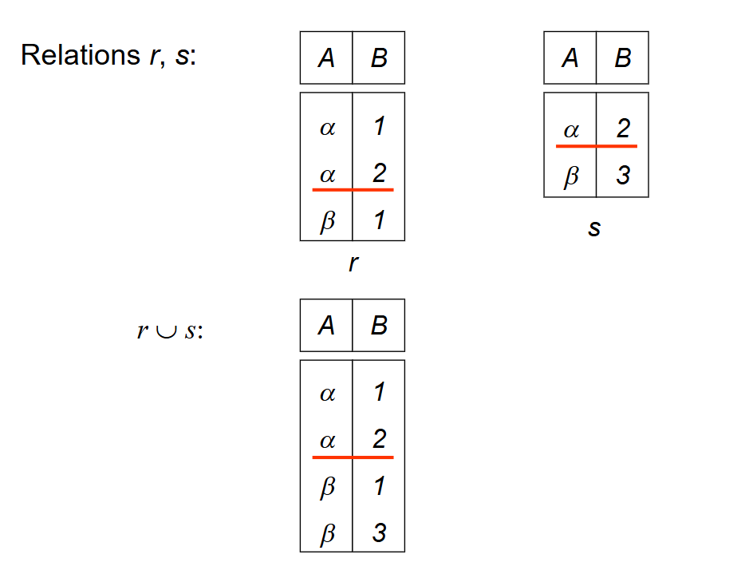

### Set Difference | 差 $-$

用于查找在一个关系中但不在另一个关系中的元组。

#### 表示

$r-s=\{t|t\in r~and~t\notin s\}$

#### 有效条件

- $r$ 和 $s$ 必须具有相同数量的属性
- 属性域必须兼容

#### Example

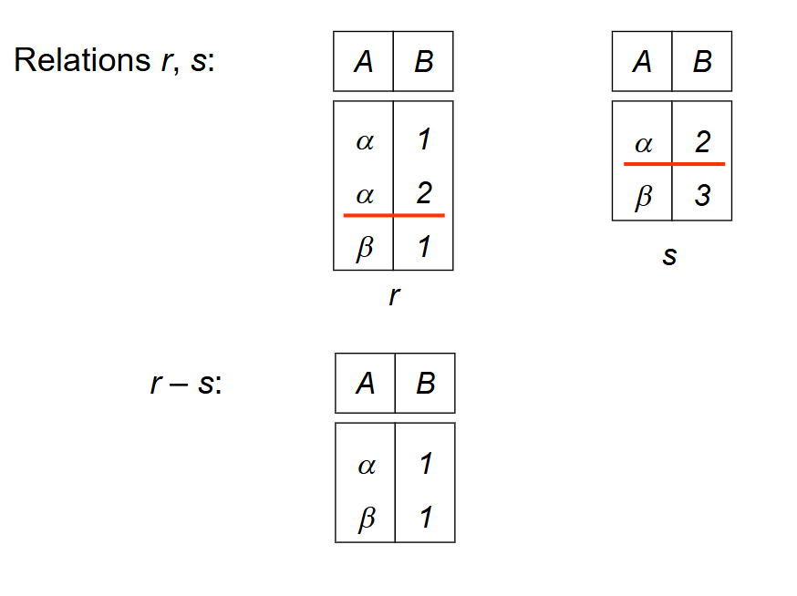 

### Cartesian-Product(笛卡儿积) $\times$

用于组合来自任意两个关系的信息。

#### 表示

$r\times s=\{\{t~q\}|t\in r~and~q\in s\}$

如果 $r$ 和 $s$ 的属性有交集，则需要对属性进行重命名。

#### Example

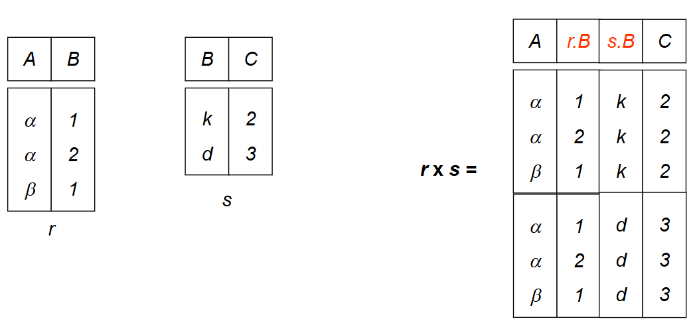

### Rename(重命名) $\rho$

命名并引用关系代数表达式的结果。

#### 表示

$\rho_X(E)$	返回命名为 $X$ 的表达式 $E$。

$\rho_{X(A_1,A_2,…,A_n)}(E)$ 	对关系 $E$ 和 $E$ 的属性都重命名

#### Example

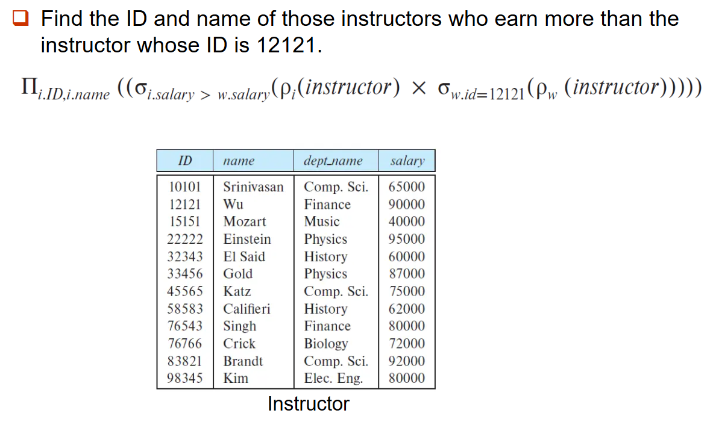 

### Example Queries

```sql
loan(loan-number, branch-name, amount) 
```

- Example1：找出所有超过$1200的贷款。
  $$
  \sigma_{amount>1200}(loan)
  $$

- Example2：找出每笔金额大于$1200的贷款的贷款编号。
  $$
  \Pi_{loan-number}(\sigma_{amount>1200}(loan))
  $$
  


```sql
depositor(customer-name, account-number) 
borrower(customer-name, loan-number) 
```

- Example3：从银行找到所有有贷款或账户的客户的姓名，或两者兼而有之。
  $$
  \Pi_{customer-name}(borrower)\cup \Pi_{customer-name}(depositor)
  $$

- Example4：找出所有至少在银行有贷款和账户的客户的名字。
  $$
  \Pi_{customer-name}(borrower)\cap \Pi_{customer-name}(depositor)
  $$


```sql
loan(loan-number, branch-name, amount) 
borrower(customer-name, loan-number) 
```

- Example5：找出所有在Perryridge有贷款的客户名单
  Query1：
  $$
  \Pi_{customer-name}(\sigma_{branch-name = 'Perryridge'}(\sigma_{borrower.loan-number = loan.loan-number}(borrower\times loan)))
  $$
  Query2：
  $$
  \Pi_{customer-name}(\sigma_{borrower.loan-number = loan.loan-number}(borrower\times (\sigma_{branch-name = 'Perryridge'}(loan)))
  $$

	Query2更好
	
	


```sql
loan(loan-number, branch-name, amount) 
borrower(customer-name, loan-number) 
depositor(customer-name, account-number) 
```

- Example6：找出所有在Perryridge分行有贷款但在该银行任何分行都没有账户的客户的名字。
  Query1:
  $$
  \Pi_{customer-name}(\sigma_{branch-name = 'Perryridge'}(\sigma_{borrower.loan-number = loan.loan-number}(borrower\times loan)))
  - \Pi_{customer-name}(depositor)
  $$
  Query2:
  $$
  \Pi_{customer-name}(\sigma_{borrower.loan-number = loan.loan-number}(borrower\times (\sigma_{branch-name = 'Perryridge'}(loan)))
- \Pi_{customer-name}(depositor)
  $$
  
  Query2更好
  
  

```sql
account(account-number, branch-name, balance)
```

- Example7：找到最大的账户余额

  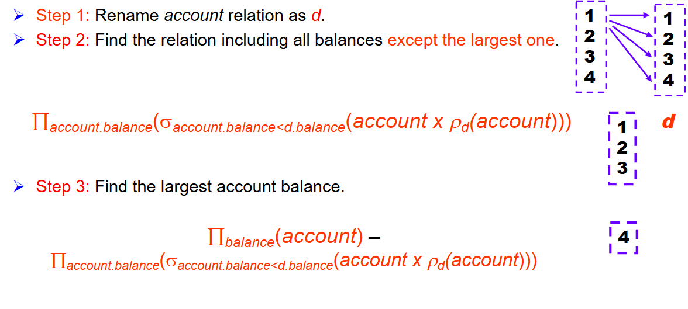

## Additional Relational-Algebra Operations 

### Set-Intersection（交）$\cap$

找到同时存在于两个关系中的元组。

#### 表示

$r\cap s = \{t|t\in r~and~t\in s\}$

#### Note

$r\cap s = r-(r-s)$


### Join(连接) $\bowtie$

将选择操作和笛卡尔积操作合并为单个操作。

#### 表示

$t\bowtie_{\theta} s=\sigma_\theta (r\times s)$

#### Example

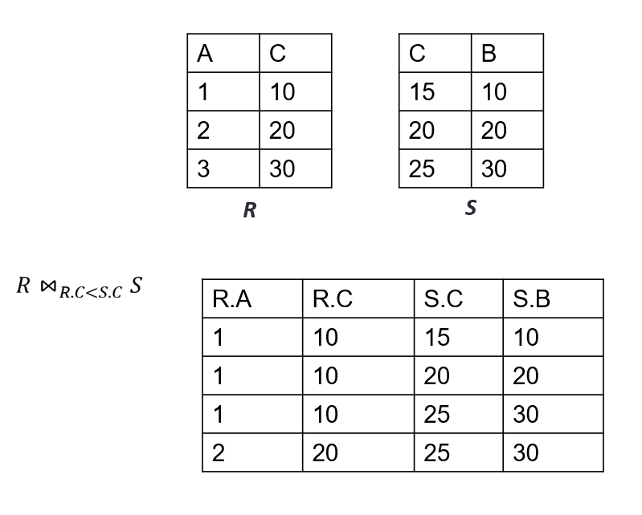 

### Natural Join (自然连接)

自然连接操作用隐式谓词替换了谓词θ，该谓词要求在左右关系的模式中出现的那些属性之间相等。

#### 表示

$r\bowtie s$

#### Example

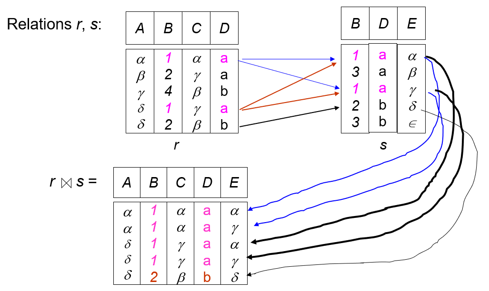

### Division(除) $\div$

决定一个集合是否包含另一个集合。

#### 表示

$r\div s=\{t|t\in\Pi_{R-S}(r)\wedge[\forall u\in s,(tu\in r)]\}$

#### Example

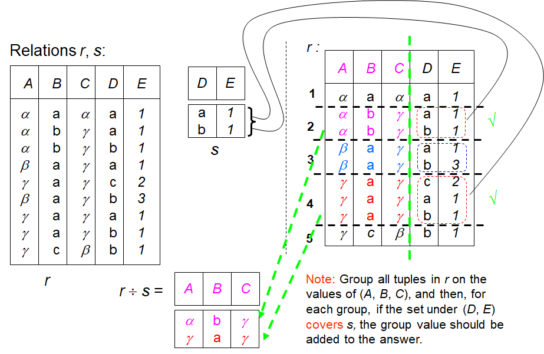 

### Assignment(赋值) $\leftarrow$

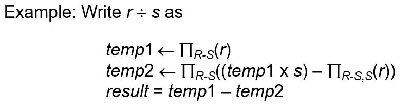 

## Extended Relational-Algebra Operations 

### Generalized Projection (广义投影)

允许在投影列表中使用算术函数来扩展投影操作。

#### 表示

$\Pi_{F1,F2,…,Fn}(E)$

#### Example

对于关系*credit_info*(*customer_name*, *limit*, *credit_balance*)

$$
\Pi_{customer \_ name, limit–credit \_ balance}(credit \_ info)
$$

### Aggregate

#### 聚合函数

接受一组值，并返回单个值作为结果。

- **avg**: average value 

- **min**: minimum value 

- **max**: maximum value 

- **sum**: sum of values 

- **count**: number of values 

#### 表示

$ _{G_1, G_2, …, G_n} g_{F1(A1), F2(A2), …, Fn An)}(E) $

#### Example

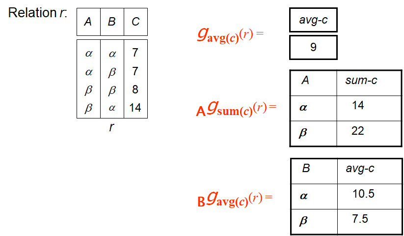 

### Other Join 

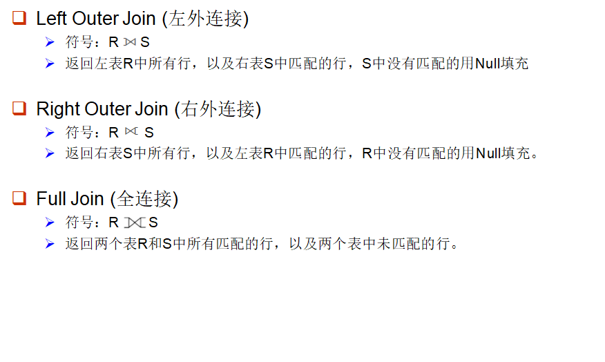 

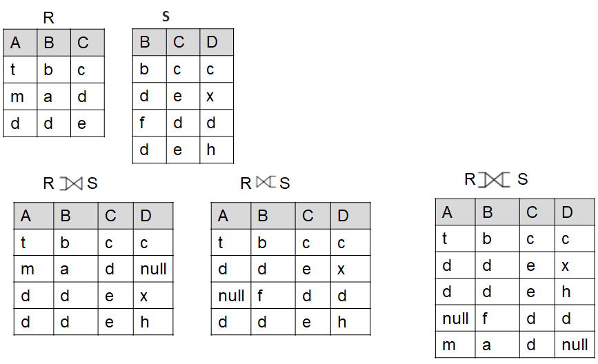

## Modification of the Database 

### Deletion 删除

$r\leftarrow r-E$

### Insertion 插入

$r\leftarrow r\cup E$

### Updata 更新

$r\leftarrow \Pi_{F1,F2,…,Fn}(r)$
