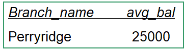
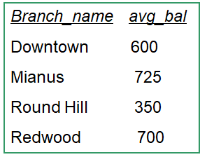
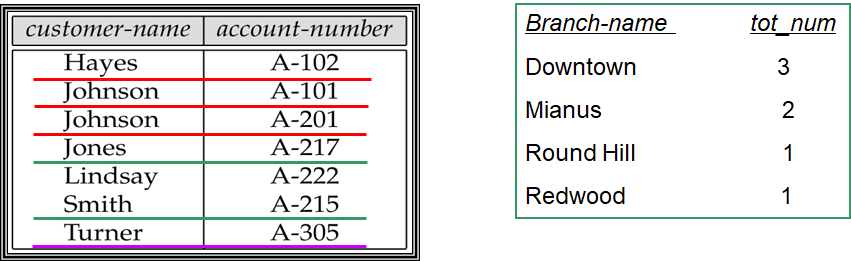
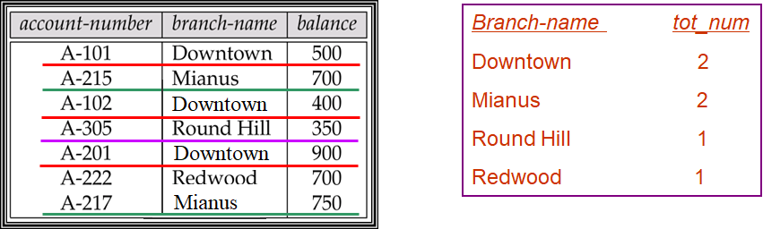

# SQL

## Data Definition Language (DDL)

### Domain Types

- `char(n)`: 固定长度的字符串，长度由用户指定。
- `varchar(n)`: 可变长度的字符串，最大长度为n。
- `int`: 整数（与机器相关的整数的有限子集）。
- `smallint`: 小整数（与机器相关的整数域类型的子集）。
- `numeric(p, d)`: 定点数，用户指定精度为p位，小数点右边有d位。
- `real, double precision`: 浮点数和双精度浮点数，具有与机器相关的精度。
- `float(n)`: 浮点数，用户指定的精度至少为n位。
- `Null`: 在所有域类型中都允许空值。将属性声明为非空将禁止该属性的空值。
- `date`: 日期，包含（4位）年、月、日。例如, date “2007-2-27”
- `Time`: 一天中的时间，以小时、分和秒为单位。例如，time '11:18:16', time ‘11:18:16.28’
- `timestamp`: 日期加时间。例如，timestamp ‘2011-3-17 11:18:16.28’

### Create Table

```sql
CREATE TABLE customer
	(customer_name char(20),
	customer_street char(30),
	customer_city char(30),
	primary key (customer_name));
	
CREATE TABLE branch
	(branch_name char(15),
	branch_city char(30),
	assets integer,
	primary key(branch_name),
	CHECK(assets>=0));
	
CREATE TABLE account
	(account_number char(10),
	branch_name char(15),
	balance integer,
	primary key(account_number),
	foreign key(branch_name) references branch,
	CHECK(balance>=0));
	
CREATE TABLE depositor
	(customer_name char(20),
	account_number char(10),
	primary key(customer_name,account_number),
	foreign key(customer_name) references customer,
	foreign key(account_number) references account);	
```

### Drop and Alter Table 

#### Drop

删除数据库中被删除关系的所有信息。

```sql
DROP TABLE branch2 
```

#### Alter

用于向已存在的关系添加属性或删除属性。

- 添加

```sql
ALTER TABLE r ADD A Type; 
ALTER TABLE r ADD (A1 Type1, …, An Typen); 
```

- 删除

```sql
ALTER TABLE r DROP A 
```

- 修改

```sql
ALTER TABLE branch MODIFY (branch_name char(30), assets not null)
```


### Create Index 

- CREATE INDEX *<i-name>* ON <*table-name*> (*<attribute-list>*); 

  ```sql
  CREATE INDEX b_index ON branch(branch_name);
  CREATE INDEX cust_strt_city_index ON customer (customer_city, customer_street); 
  ```

- CREATE UNIQUE INDEX *<i-name>* ON <*table-name*> (*<attribute-list>*); ——指定candidate key

  ```sql
  CREATE UNIQUE INDEX uni_acnt_index ON account(account_name)
  ```

- DROP INDEX *<i-name>* ——删除index

  

## Basic Structure 

### SELECT

$\Pi_{A1,A2,…,An}(\sigma_P(r1\times r2\times…\times rm))$ 等价与以下结构

```sql
SELECT A1, A2, ..., An 
FROM r1, r2, ..., rm
WHERE P 
```

- 不重复

```sql
SELECT distinct branch_name
FROM loan 
```

- 重复（默认）

```sql
SELECT all branch_name 
FROM loan 
```

- 全部

```sql
SELECT * FROM loan 
```

- 算数运算

```sql
SELECT loan_number, branch_name, amount * 100 
FROM loan 
```


### WHERE

相当于选择 $\sigma$ ，逻辑关系使用`AND`,`OR`,`NOT`。

```sql
SELECT loan_number
FROM loan
WHERE branch_name = ‘Perryridge’ AND amount > 1200 
```

- BETWEEN AND

```sql
SELECT loan_number  
FROM loan 
WHERE amount BETWEEN 90000 AND 100000 
```

### FROM

- 笛卡尔积

$$
borrower \times loan
$$

```sql
SELECT * 
FROM borrower, loan 
```

- Example

$$
\Pi_{customer\_name, loan\_number, amount}(\sigma _{branch\_name='Perryridge’} (borrower \Join loan))
$$


```sql
SELECT customer_name, borrower.loan_number, amount 
FROM borrower, loan  
WHERE borrower.loan_number = loan.loan_number and branch_name = ‘Perryridge’ 
```


### Rename

```sql
old_name as new_name 
```

- Example1: Find the name, loan number and loan amount of all customers, and rename the column name *loan_number* as *loan_id.* （重命名）

```sql
SELECT customer_name, borrower.loan_number as loan_id, amount  
FROM borrower, loan 
WHERE borrower.loan_number = loan.loan_number 
```

- Example2: Find the customer names, their loan numbers and amount for all customers of the bank. （分辨）

```sql
SELECT customer_name, T.loan_number, S.amount 
FROM borrower as T, loan as S 
WHERE T.loan_number = S.loan_number 
```


### String操作

#### LIKE

- `%`匹配字符串
- `_`匹配单个字符

```sql
//查找名称包含子字符串“泽”的所有客户的名称。
SELECT customer_name
FROM customer
WHERE customer_name LIKE ‘%泽%’ 
```
- 使用转义符将%作为字符。

```sql
LIKE ‘Main\%’ escape  ‘\’
```

#### 其他操作

- 连接(`||`)

```sql
SELECT ‘客户名=’ || customer_name 
FROM customer 
WHERE … 
```

- 大小写转换：`lower()`, `upper`

### 排序

默认升序

```sql
SELECT distinct customer_name 
FROM borrower A, loan B 
WHERE A.loan_number = B.loan_number and branch_name = ‘Perryridge’ 
ORDER BY customer_name 
```

- 降序使用`desc`

```sql
SELECT * FROM customer 
ORDER BY customer_city, customer_street desc, customer_name 
```

### 重复

在进行 $\sigma _{\theta},\Pi _{A},\times$等操作时重复的数据不会自动删除。

- 消除重复: `distinct`

```sql
SELECT distinct A1, A2, ..., An 
FROM r1, r2, ..., rm 
WHERE P 
```


## Set Operations 

### 基本操作

- `UNION` - $\cup$
- `INTERSECT` - $\cap$

- `EXCEPT` - $-$

!!!Note
	以上三种操作会自动删除重复。

### 保留重复

使用`UNION ALL`, `INTERSECT ALL`, `EXCEPT ALL`。

假设一个元组 `a` 在 `r` 中出现m次，在 `s` 中出现n次，则有以下关系：

- 在 `r UNION ALL s` 中出现m+n次
- 在`r INTERSECT ALL s` 中出现min(m,n)次
- 在`r EXCEPT ALL s` 中出现max(0,m-n)次

### Example

$$
\begin{aligned}
&depositor(customer\_name, account\_number)\\
&borrower(customer\_name, loan\_number) 
\end{aligned}
$$

#### Example1

查找所有有贷款或有账户或两者兼而有之的客户

```sql
(SELECT customer_name FROM depositor) 
UNION
(SELECT customer_name FROM borrower) 
```

#### Example2

查找同时拥有贷款和账户的所有客户

```sql
(SELECT customer_name FROM depositor) 
INTERSECT
(SELECT customer_name FROM borrower) 
```

#### Example3

查找所有有账户但没有贷款的客户

```sql
(SELECT customer_name FROM depositor) 
EXCEPT
(SELECT customer_name FROM borrower) 
```


## Aggregate Functions 

对关系列的多集值进行操作，并返回一个值

- Avg (col)：平均值
- Min (col)：最小值
- Max (col)：最大值
- Sum (col)：值的和
- Count (col)：值的个数

### Example

$$
\begin{aligned}
&account(account\_number, branch\_name, balance)\\
&depositor(customer\_name, account\_number) 
\end{aligned}
$$


#### Example1

找出Perryridge分行的平均账户余额。

```sql
SELECT avg(balance) avg_bal 
FROM account 
WHERE branch_name = ‘Perryridge’ 
```

 

- 错误样例：select子句中的聚合函数以外的属性必须出现在group by列表中。

```sql
SELECT branch_name, avg(balance) avg_bal
FROM account
WHERE branch_name = ‘Perryridge’ 
```

#### Example2

找出每个分支的平均账户余额。

```sql
SELECT branch_name, avg(balance) avg_bal 
FROM account 
GROUP BY brach_name 
```

 

#### Example3

求每个分行的存款人数目。（两段代码区别在`disdinct`）

```sql
SELECT branch_name, count(customer_name) tot_num 
FROM depositor, account 
WHERE depositor.account_number=account.account_number 
GROUP BY branch_name 
```

 

```sql
SELECT branch_name, count(distinct customer_name) as tot_num 
FROM depositor D, account A	
WHERE D.account_number = A.account_number 
GROUP BY branch_name 
```

 

#### Example4 (HAVING)

找出位于Brooklyn的所有平均账户余额超过$1200的分行名称

$$
\begin{aligned}
&branch(branch\_ name, branch\_ city, assets)\\ 
&account(account\_ number, branch\_ name, balance)
\end{aligned}
$$

```sql
SELECT A.branch_name, avg(balance) 
FROM account A, branch B 
WHERE A.branch_name = B.branch_name and 
	branch_city =‘Brooklyn’ 
GROUP BY A.branch_name 
HAVING avg(balance) > 1200 
```

!!!Note
	SELECT语句的执行顺序如下:
	
	From → where → group (aggregate) → having → select → distinct → order by 


## Null Values 

用于表示未知数据或数据不存在。

### 算数运算

关于 `null` 的算数运算都返回 `null`。

- E.g., 5 + null returns null. 

### 逻辑运算

#### OR

- (*unknown* or *true*) = *true* 
-  (*unknown* or *false*) = *unknown* 
- (*unknown* or *unknown*) *= unknown* 

#### AND

- (*true* and *unknown*) *= unknown* 
- (*false* and *unknown*) *= false*  
- (*unknown* and *unknown*) *= unknown* 

#### NOT

- (not *unknown*) *= unknown* 

### WHERE语句

```sql
SELECT loan_number 
FROM loan 
WHERE amount is (not) null 
```

!!!Note
	不能使用`WHERE amount = null`

### Aggregate Functions

聚合函数会忽略null值。


## Nested Subqueries 

子查询是嵌套在另一个查询中的select_from_where表达式。

### 常见形式

```sql
Select … from …  where   ... 
	(select … from … where …) 
```

### in语句

#### Example

$$
\begin{aligned}
&branch(branch\_name, branch\_city, assets)\\ 
&borrower(customer\_name, loan\_number)\\
&account(account\_number, branch\_name, balance)\\
&depositor(customer\_name, account\_number) 
\end{aligned}
$$


找出所有在Perryridge分行有账户和贷款的客户。(`not in`的使用同理)

- Query1

```sql
SELECT DISTINCT customer_name
FROM borrower B, loan L
WHERE B.loan_number = L.loan_number 
      AND L.branch_name = 'Perryridge' 
      AND (L.branch_name, customer_name) IN (
          SELECT A.branch_name, D.customer_name
          FROM depositor D, account A
          WHERE D.account_number = A.account_number)
```

- Query2

```sql
SELECT DISTINCT customer_name
FROM borrower B, loan L
WHERE B.loan_number = L.loan_number 
      AND L.branch_name = 'Perryridge' 
      AND customer_name IN (
          SELECT customer_name
          FROM depositor D, account A
          WHERE D.account_number = A.account_number 
                AND A.branch_name = 'Perryridge')
```

- Query3

```sql
SELECT DISTINCT customer_name 
FROM borrower B, loan AS t 
WHERE B.loan_number = t.loan_number 
      AND branch_name = 'Perryridge' 
      AND customer_name IN 
        (SELECT customer_name 
         FROM depositor D, account A 
         WHERE D.account_number = A.account_number 
               AND branch_name = t.branch_name)
```

### 比较语句

#### Example

查找每个分支的最大余额的account_number。

```sql
SELECT account_number AN, balance
FROM account A
WHERE balance >= (
    SELECT MAX(balance)
    FROM account B
    WHERE A.branch_name = B.branch_name
)
ORDER BY balance;
```

### SOME /ALL

#### Some

$$
\begin{aligned}
&C <comp> some \Leftrightarrow \exists~t \in r,C<comp>t~holds
\end{aligned}
$$


!!!Note
	$(\neq all) \Leftrightarrow not in$
	

	$(= all) \nLeftrightarrow in$

#### All

$$
\begin{aligned}
&C <comp> all \Leftrightarrow \forall ~t \in r,C<comp>t~holds
\end{aligned}
$$

!!!Note
	$(=some) \Leftrightarrow in$
	

	$(\neq some) \nLeftrightarrow not in$

#### Example

找出所有比位于Brooklyn的所有分行拥有更多资产的分行的名称。

```sql
SELECT branch_name
FROM branch
WHERE assets > ALL (
    SELECT assets
    FROM branch
    WHERE branch_city = 'Brooklyn'
)
```

### EXISTS

如果参数子查询非空，exists构造返回值true。

- `exists r`  $\Leftrightarrow$  $r\neq \phi$

- `not exists r`  $\Leftrightarrow$  $r = \phi$

#### Example

$$
section(course\_ id, sec\_ id, semester, year, building, room\_  number, time\_ slot\_ id)
$$


查找2017年秋季学期和2018年春季学期的所有课程

```sql
SELECT course_id
FROM section AS S
WHERE semester = 'Fall' AND year = 2017
      AND EXISTS (
          SELECT *
          FROM section AS T
          WHERE semester = 'Spring' AND year = 2018
                AND S.course_id = T.course_id)
```

### UNIQUE

用于测试子查询的结果中是否有重复元组。

#### Example

- Example1: 找出所有在Brooklyn分行**至多有一个**账户的客户。

```sql
SELECT customer_name 
FROM depositor AS T 
WHERE UNIQUE (
    SELECT R.customer_name 
    FROM account, depositor AS R 
    WHERE T.customer_name = R.customer_name 
          AND R.account_number = account.account_number 
          AND account.branch_name = 'Perryridge')
```

- Example2: 找出所有在Brooklyn分行**至少有两个**账户的顾客。

```sql
SELECT DISTINCT T.customer_name 
FROM depositor T 
WHERE NOT UNIQUE (
    SELECT R.customer_name 
    FROM account, depositor AS R 
    WHERE T.customer_name = R.customer_name 
          AND R.account_number = account.account_number 
          AND account.branch_name = 'Perryridge')
```

### FROM语句Subquery

#### Example

- Example1: 找出那些平均账户余额大于$500的分支机构的平均账户余额。

```sql
SELECT branch_name, avg_bal 
FROM (
    SELECT branch_name, AVG(balance) 
    FROM account 
    GROUP BY branch_name
) AS result (branch_name, avg_bal) --即使不使用也要进行命名 
WHERE avg_bal > 500
```

- Example2: **LITERAL**关键字用于访问前序表的属性或同一from子句中的子查询。

```sql
SELECT name, salary, avg_salary
FROM instructor I1, 
LATERAL (
    SELECT AVG(salary) AS avg_salary
    FROM instructor I2
    WHERE I2.dept_name = I1.dept_name
) AS subquery
```

### WITH语句

提供了一种定义临时关系的方法，该临时关系的定义仅对出现with子句的查询可用。

#### Example

找到所有余额最大的账户

```sql
WITH max_balance(value) AS (
    SELECT MAX(balance) 
    FROM account
)
SELECT account_number 
FROM account, max_balance 
WHERE account.balance = max_balance.value
```


## Modification of the Database 

### Deletion	

从表或视图中删除元素。

#### 标准格式

```sql
DELETE FROM <table | view> 
[WHERE <condition>] 
```

#### Example

- 删除Needham各分行所有账户及相关存款人信息。

```sql
DELETE FROM depositor 
WHERE account_number IN (
    SELECT account_number 
    FROM branch B, account A  
    WHERE branch_city = 'Needham' 
          AND B.branch_name = A.branch_name
);

DELETE FROM account 
WHERE branch_name IN (
    SELECT branch_name 
    FROM branch 
    WHERE branch_city = 'Needham'
);
```

!!!Note
	语句前后顺序不可调换

#### 错误样例（以下代码为错误代码）

- 对多个表的删除需要分多条语句进行

```sql
 DELETE FROM account, depositor, branch 
 WHERE account.accont_number = depositor.account_number 
     AND branch.branch_name = account.branch_name 
     AND branch_city = ‘Needham’ 
```

- 删除元组的过程中平均值发生了变化

```sql
DELETE FROM account 
WHERE balance < (SELECT avg(balance) 
				FROM account) 
```


### Insertion

#### 标准格式

```sql
INSERT INTO <table|view> [(c1, c2,…)] 
      VALUES (e1, e2, …) 
```

```sql
INSERT INTO <table|view> [(c1, c2,…)] 
SELECT e1, e2, … 
FROM … 
```

#### Example

- Example1: 向帐户添加一个新的元组，余额设置为null（以下两块代码等价）

```sql
INSERT INTO account 
   VALUES (‘A_777’, ‘Perryridge’, null) 
```

```sql
INSERT INTO account (account_number, branch_name) 
   VALUES (‘A_777’, ‘Perryridge’) 
```

- Example2: 为Perryridge分行的所有贷款客户提供一个$200的储蓄账户作为礼物。让贷款号作为新储蓄账户的账号。

```sql
--step1
INSERT INTO account 
SELECT loan_number, branch_name, 200 
FROM loan 
WHERE branch_name = 'Perryridge';

--step2
INSERT INTO depositor 
SELECT customer_name, A.loan_number 
FROM loan A, borrower B 
WHERE A.branch_name = 'Perryridge' 
      AND A.loan_number = B.loan_number;
```


### Update

#### 标准格式

```sql
UPDATE <table | view> 
SET <c1 = e1 [, c2 = e2, …]> [WHERE <condition>] 
```

#### Example

- 所有余额超过1万美元的账户增加6%，其他账户增加5%。

```sql
UPDATE account 
SET balance = balance * 1.06 
WHERE balance > 10000;

UPDATE account 
SET balance = balance * 1.05 
WHERE balance >= 10000;
```

!!!Note
	语句前后顺序不可调换

#### Case语句

```sql
UPDATE account  
SET balance = CASE  
                WHEN balance <= 10000 THEN balance * 1.05  
                ELSE balance * 1.06  
              END;
```

