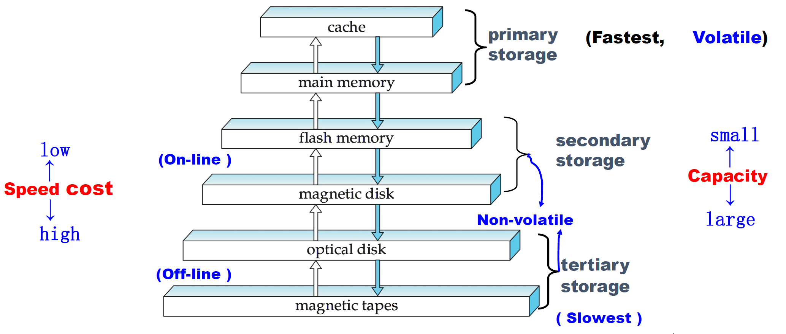
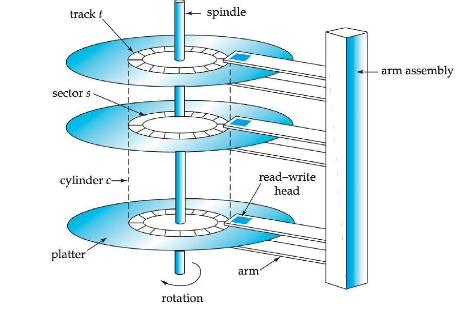
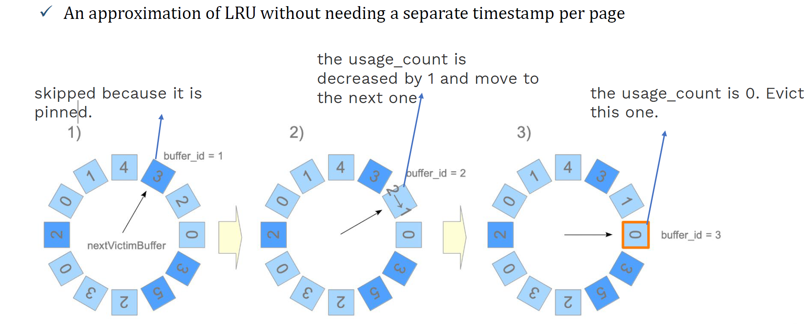
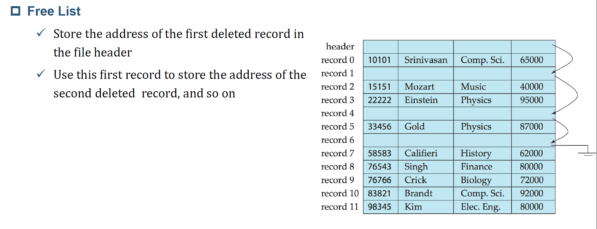
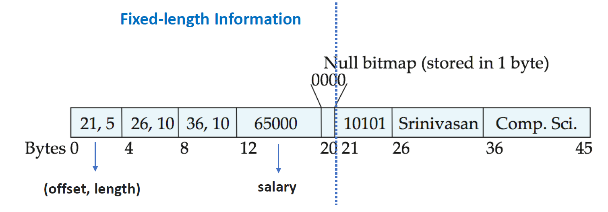
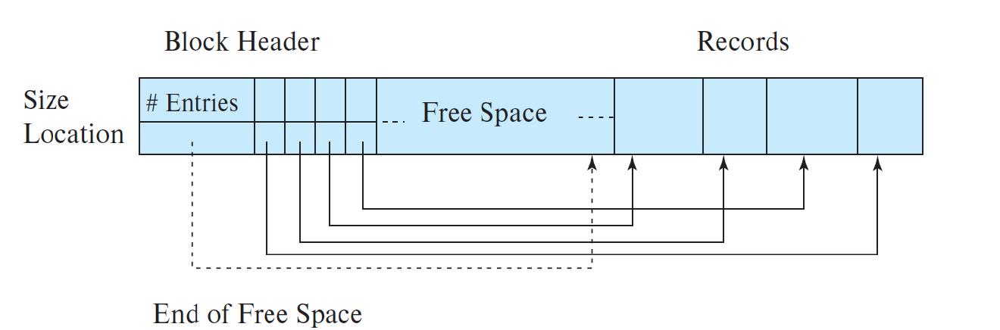
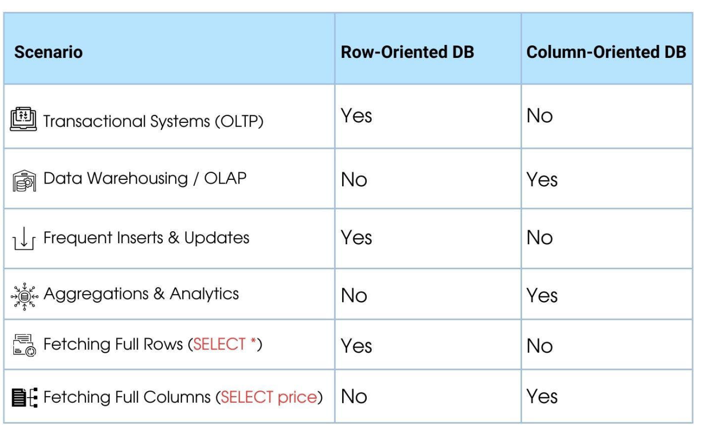

# Storage and File Structure

## Overview of Physical Storage Media

### 存储介质

- Volatile Storage (易失性存储)：断电后数据丢失，如Cache, DRAM
- Non-Volatile Storage (非易失性存储)：断电后数据保留，如Flash Memory, Disk, Tape

 

## Magnetic Disks

- Spindle: 转轴，硬盘的转速越快，寻找文件的速度也就越快，传输速度也就得到了提高
- Platter: 盘面
- Track: 磁道
- Sector: 扇区，每个磁道都被划分为多个扇区
- Cylinder: 所有盘面上相同编号的磁道构成一个柱面，柱面编号方便寻址和定位数据

 

### Performance Measures of Disks

#### Access time

$$
Access~time = Seek~time(寻道时间) + Rotational~latency(旋转等待时间)
$$

- Seek Time(寻道时间): 找到正确磁道的时间，平均寻道时间是最坏情况寻道时间的1/3。
- Rotational Latency(旋转等待时间)：找到正确扇区的时间，平均延迟是最坏情况延迟的1/2。

#### Data-transfer rate

- 从磁盘检索数据或将数据存储到磁盘的速率
- 机械硬盘的数据传输速率一般在100 MB/s~200MB之间

#### Mean time to failure (MTTF,平均故障时间)

- 预期磁盘连续运行而不出现任何故障的平均时间
- 通常是3到5年

### Optimization of Disk-Block Access

#### Block

来自单个磁道的连续扇区序列

- 更小的block：从磁盘传输次数更多
- 更大的block：由于部分填充块而浪费的空间更多

#### Disk-arm-scheduling algorithms (磁盘臂调度算法)

- 对磁道的访问重新排序，使磁盘臂运动最小化。

- Elevator algorithm (电梯算法)：移动磁盘臂在一个方向（从外部到内部轨道或反之亦然），处理下一个在该方向的请求，直到没有更多该方向的请求，然后反向并重复。

#### File organization

将分散在磁盘中的文件碎片，重新写在一个连续的块中，使得访问这个文件的数据时，效率提高。（反碎片化）

#### Nonvolatile write buffers (非易失性写缓存)

当数据库系统（或操作系统）请求将一个块写入磁盘时，磁盘控制器将该块写入一个非易失性写缓冲区， 先继续进行后续操作。

#### Log disk

把对磁盘块的修改，以日志的形式，记在一个专门的日志磁盘中，这个磁盘只支持顺序访问。

## Storage Access

### Buffer Pool

一个缓冲区，用于减少硬盘的访问。

#### 替换策略

- LRU

- Use Cases: 缓存数据库查询结果，其中某些查询始终更频繁，保留这部分内容。
- CLOCK strategy

 

- MRU (Most recently used,最近最常用策略)

## File Organization

### Fixed-Length Records

- 优点：访问简单

#### 删除策略

- 移动记录i+ 1, . . ., n 到 i, . . . , n –1（成本过高）
- 把最后一条记录移动到删除位置
- 不移动记录，把所有空闲位置放入free list

 

### Variable-Length Records

#### 管理

- 对于每一个变长变量，使用 (offset, length) 来标识
- Fixed-attribute values
- 用null bitmap来表示null值

 

#### 插入

由两边向中间扩展，插入数据时在左边向右插入entry，指示新record的位置；在右边向左分配内存来存储record的内容。

- 删除：删除相应的记录后将记录块整体向右推至填充删除的位置。

## Column-Oriented Storage

方便整列求和计算等操作。

 