# Transactions

## Transaction Concept

A **transaction**(事务) is a unit of program execution that accesses and possibly updates
various data items

一个Transaction通常由几句SQL语句组成，在commit(提交)或rollback(回滚)结束。

### ACID Properties

- **Atomicity(原子性)**：全有或全无，由数据库恢复功能来保证。
- **Consistency(一致性)**：隔离地执行事务来保证数据库数据的一致性。
- **Isolation(隔离性)**：虽然多个事务可以并发执行，但每个事务必须不知道其他并发执行的事务。事务的中间结果必须对其他并发执行的事务隐藏。
- **Durability(持久性)**：事务成功完成后，即使出现系统故障，它对数据库所做的更改也会持续存在。


## Transaction State

- **Active**：最初状态

  事务在执行时保持此状态

- **Partially committed**：最后一个语句成功执行后

  此时要输出的结果数据可能还在内存buffer

- **Failed**：在发现不能正常执行之后

  在这个状态下必须进行回滚操作，然后进入aborted状态

- **Aborted**：在事务回滚并且数据库恢复到事务开始之前的状态之后

  事务终止后有两种选择：①重启事务（逻辑错误除外）②终止事务（如数据问题）

- **Committed**：成功完成之后

  事务一旦提交，我们就不能撤销它的影响

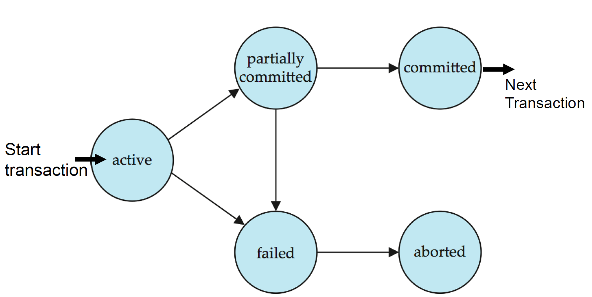


## Implementation of Atomicity and Durability

### Approach1: Logging

- 数据库管理系统（DBMS）记录所有操作，以便能够撤销已中止事务的操作。
- 在内存和磁盘上同时维护撤销记录。
- 可以将其类比为飞机上的黑匣子

几乎所有DBMS都使用Logging：

- 审计追踪
- 效率原因

### Approach2: Shadow Paging

- 数据库管理系统（DBMS）创建页面的副本，事务对这些副本进行修改。
  只有当事务提交时，修改后的页面才对其他用户可见。
- 最初由IBM System R提出。

少数系统采用此方法：

- CouchDB
- Tokyo Cabinet
- LMDB（OpenLDAP）


## Concurrent Executions

允许多个事务在数据库系统中并发运行。

并发运行有以下好处：

- **提高处理器和磁盘利用率**，从而提升事务吞吐量：当一个事务使用CPU时，另一个事务可以同时进行磁盘读写操作。
- **缩短事务的平均响应时间**：短事务无需在长事务后等待

同时也存在以下问题：

- 尽管每个单独的事务都是正确的，但并发可能会破坏数据一致性（例如并发售票问题）。

### Schedules | 调度

调度是指明并发事务指令按时间顺序执行的序列。

- 一个事务集合的调度必须包含这些事务的所有指令
- 必须保持每个单独事务中指令出现的原有顺序

### Example Schedules

对于以下两个事务 T1 和 T2：

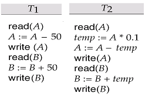 

#### Serial Schedule | 串行调度

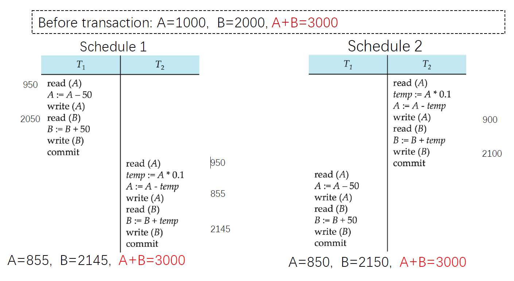 

#### Concurrent Schedule

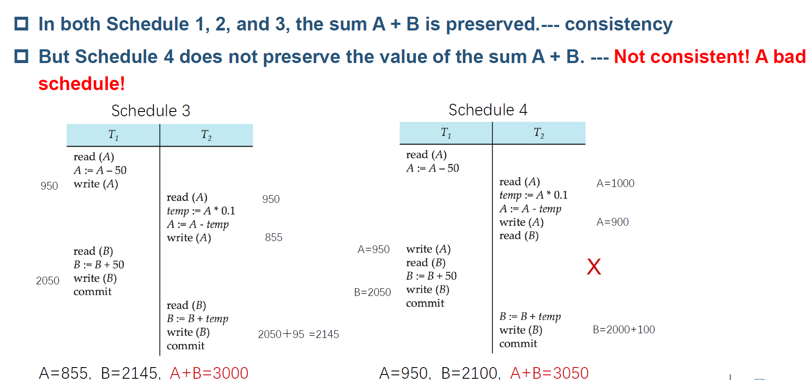


## Serializability

如果一个事务（可能是并发的）可以等价于一个串行调度，那么这个事务是可串行化的。不同形式的调度等价性产生了以下概念：

- 冲突串行化（大多数DBMSs尽力支持）

- 视图串行化（没有DBMS能支持）

### 简化事务

- 我们忽略除读和写指令之外的操作。
- 在对某个数据项 Q 的 `read(Q)` 指令和 `write(Q)` 指令之间，一个事务可能会在其本地缓冲区中的 Q 的副本上执行任意序列的操作。
- 在该模型中，从调度的角度来看，一个事务中唯一重要的操作是其读和写指令。因此，我们简化后的调度仅包含读和写指令。

### 冲突类型

#### Read-Write Conflict: Unrepeatable Read

$l_i = read(Q), l_j = write(Q).$

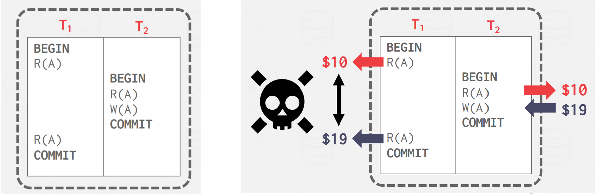

#### Write-Read Conflict: Dirty Read

$l_i = write(Q), l_j = read(Q).$

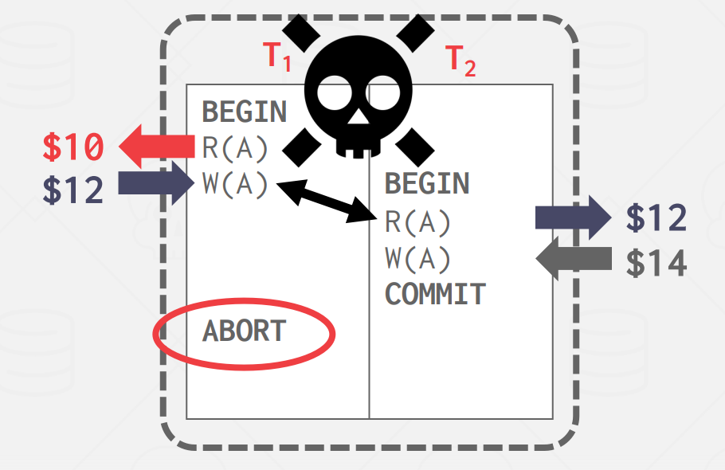 

#### Write-Write Conflict: Lost Update

$l_i = write(Q), l_j = write(Q).$

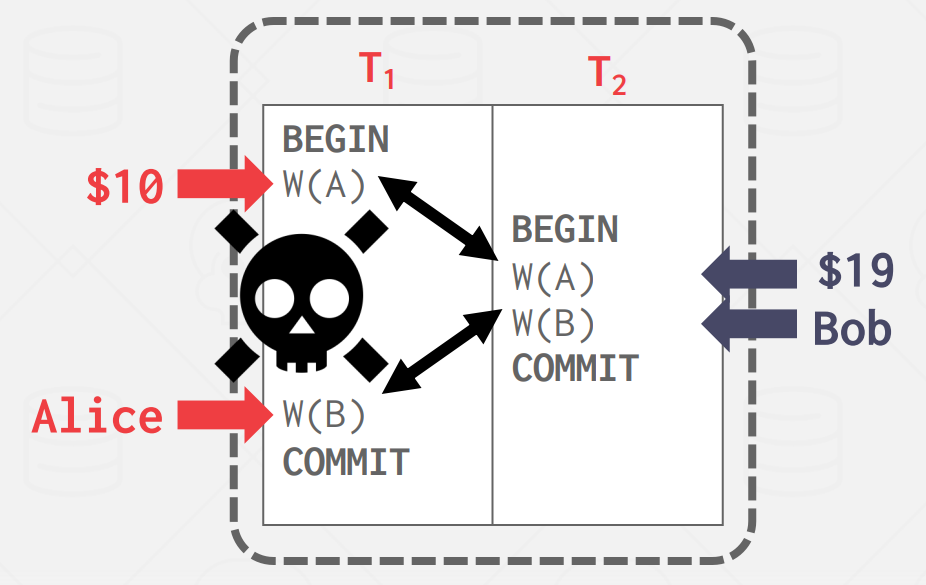

### Conflict Serializability | 冲突可串行化

如果一个调度 $S$ 可以通过一系列不冲突指令的交换转换为另一个调度 $S'$，我们称 $S$ 和 $S'$ 是**冲突等价**的。我们称一个调度 $S$ 是**冲突可串行化的**，如果它与某个串行调度**冲突等价**。

如图所示，调度 3 可以通过一系列不冲突指令的交换，转换为调度 6——一个串行调度，其中事务 T2 在事务 T1 之后执行。因此，调度 3 是**冲突可串行化的**。

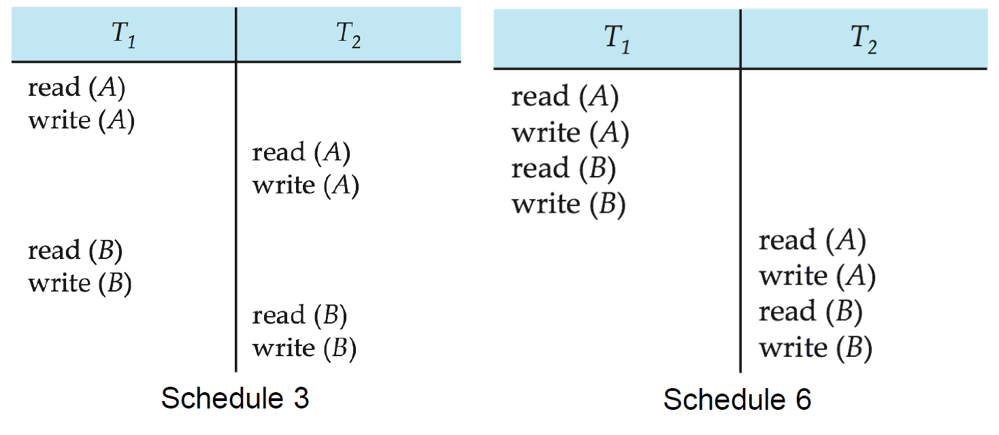


## Recoverability

### Recoverable Schedules

需要解决**事务失败**对并发运行事务的影响。

**可恢复调度（Recoverable Schedule）**

- 如果一个事务 $T_j$ 读取了由另一个事务 $T_i$ 先前写入的数据项，那么 $T_i$ 的提交操作必须出现在 $T_j$ 的提交操作之前。

如果事务 $T_9$ 在读取之后立即提交，则如下调度**不可恢复**。

- 如果事务 $T_8$ 此时中止，那么 $T_9$ 就可能已经读取了一个**不一致的数据库状态**（甚至已经将其展示给用户）。因此，数据库必须确保所有调度是**可恢复的**。

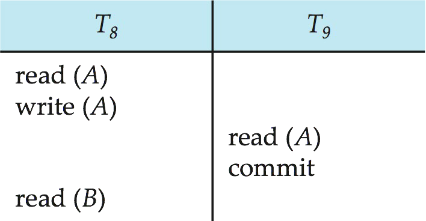 

### Cascadeless Schedules

#### 级联回滚 | Cascading Rollback

—指一个事务的失败会导致一系列其他事务也必须回滚。

- 例如，考虑以下调度：虽然其中没有任何事务提交（因此该调度是**可恢复的**），
  但如果事务 $T_{10}$ 失败，那么 $T_{11}$ 和 $T_{12}$ 由于读取了 $T_{10}$ 写入的数据，也必须回滚。

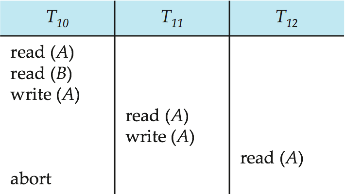 

- 这种情况可能会导致大量已完成工作的撤销，代价较高，系统效率下降。

因此，**避免级联回滚**是调度设计中的一个重要目标，通常通过采用**无级联调度（Cascadeless Schedule）**来实现。

#### 无级联调度 | Cascadeless Schedule

不会发生级联回滚

- 对于每一对事务 $T_i$ 和 $T_j$，如果 $T_j$ 读取了一个由 $T_i$ 先前写入的数据项，那么 $T_i$ 的提交操作必须出现在 $T_j$ 的读取操作之前。

每一个无级联调度都是**可恢复的**。

因此，理想情况下应将调度限制为**无级联调度**，以避免由于事务失败而引发的连锁回滚。


## Implementation of Isolation

- 一种**每次只允许一个事务执行**的策略可以生成**串行调度**，但**并发性极差**，无法充分利用系统资源。
- 为了保证数据库的一致性，调度必须是**冲突可串行化**或**视图可串行化**，并且是**可恢复的**，最好还是**无级联的**。
- **并发控制机制**在“允许的并发程度”与“产生的系统开销”之间做出权衡。
- 有些机制**只允许生成冲突可串行化的调度**，而另一些机制则允许生成**不是冲突可串行化但视图可串行化的调度**。


## Transaction Definition in SQL

数据操作语言（DML）必须包含用于指定**事务操作集合**的结构。

在 **SQL** 中，事务是**隐式开始**的。

SQL 中一个事务的结束方式包括：

- `COMMIT WORK`：提交当前事务，并**隐式开始一个新事务**。
- `ROLLBACK WORK`：使当前事务**中止并回滚**。

在几乎所有数据库系统中，默认情况下，**每条 SQL 语句成功执行后会自动提交（隐式提交）**。

- 可以通过数据库配置指令关闭隐式提交。

- 例如在 **JDBC** 中，可以使用：

  ```java
  connection.setAutoCommit(false);
  ```

  来关闭自动提交机制，实现显式控制事务提交。


## Testing for Serializability

考虑一组事务 $T_1, T_2, \dots, T_n$ 的某个调度：

- **前驱图（Precedence Graph）**：一个有向图，其**顶点表示事务的名称**。
- 如果两个事务之间存在**冲突操作**，且事务 $T_i$ **先于**事务 $T_j$ 访问了产生冲突的数据项，则从 $T_i$ 指向 $T_j$ 画一条有向边。
- 可以选择用**产生冲突的数据项**来标注这条边。

> 前驱图用于判断调度是否**冲突可串行化**：
> **若图中无环（即为有向无环图 DAG），则该调度是冲突可串行化的。**

### Example

#### 冲突不可串行化

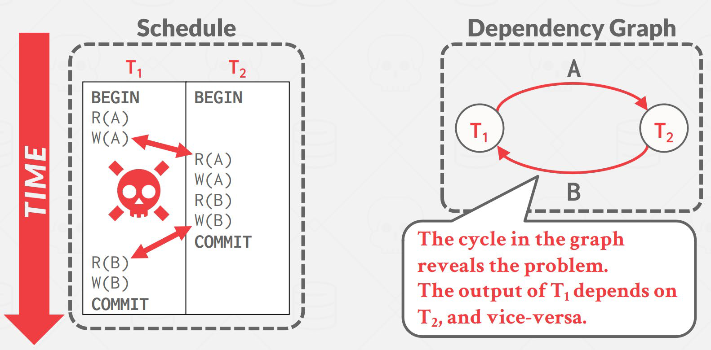 

#### 冲突可串行化

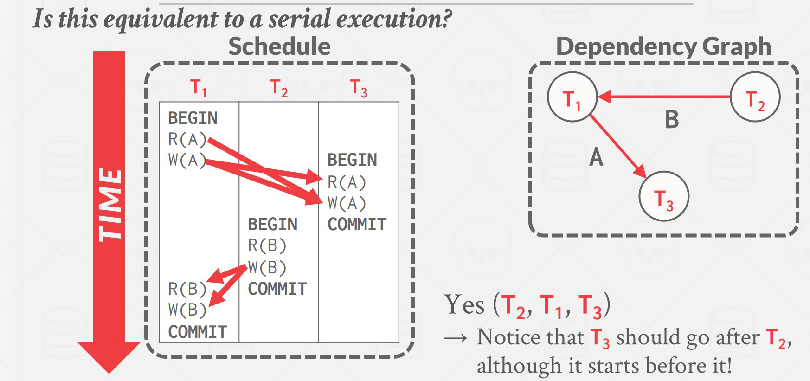