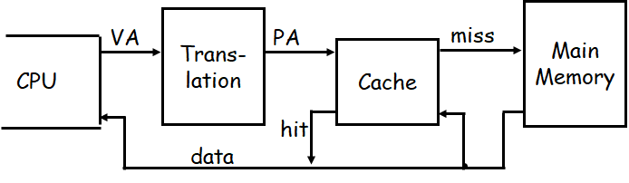
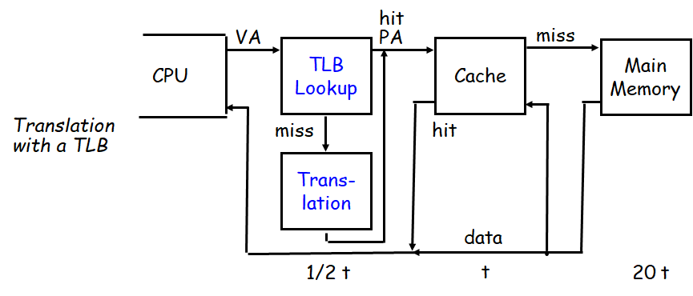
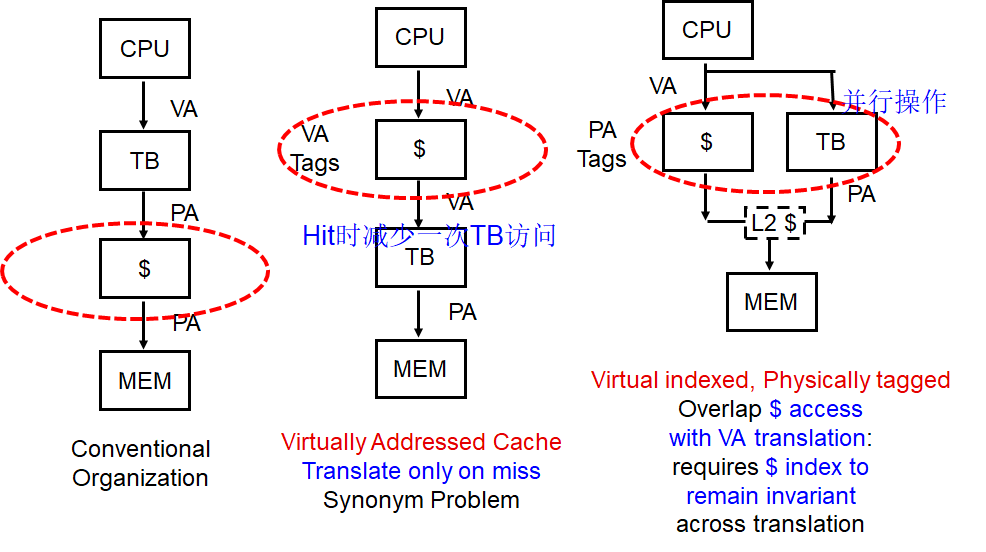
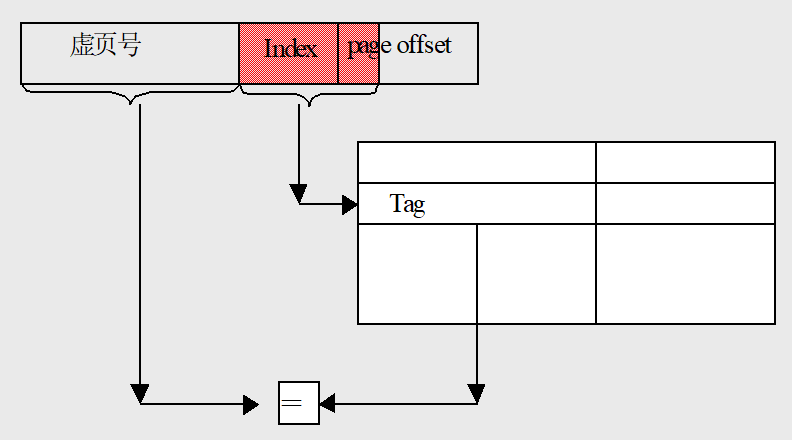
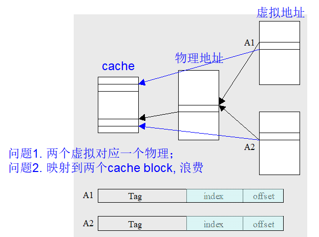
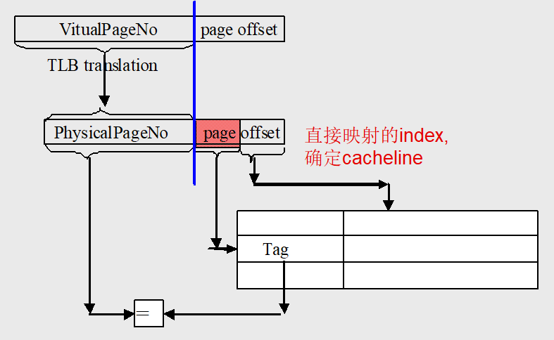
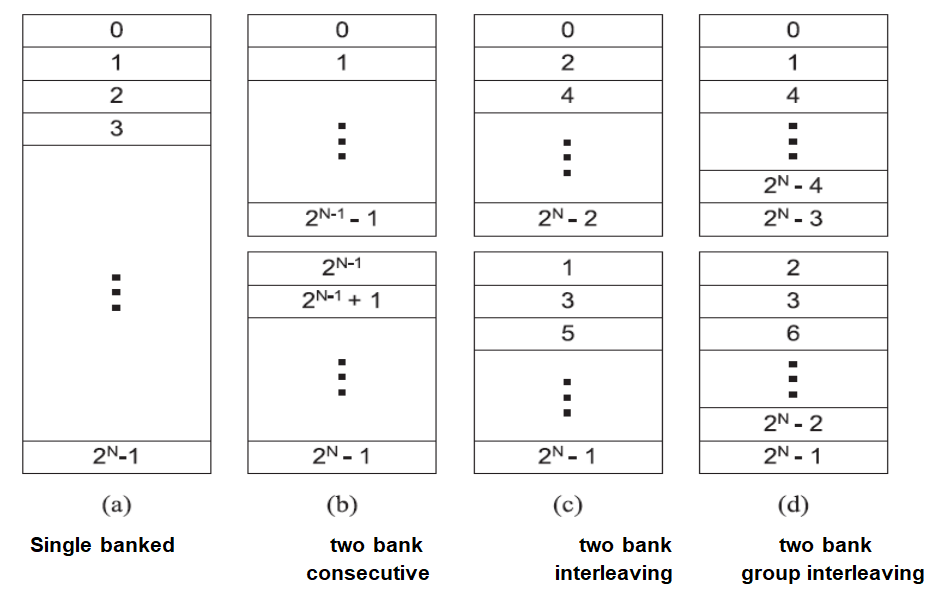
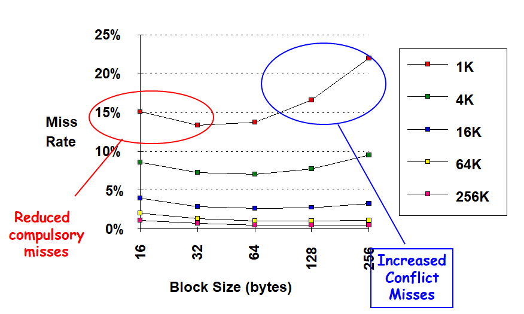
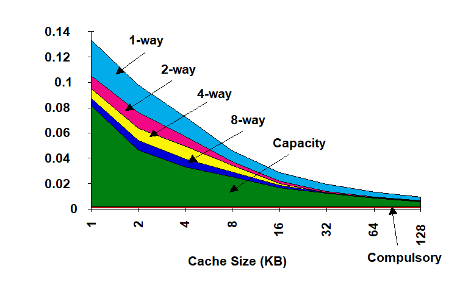
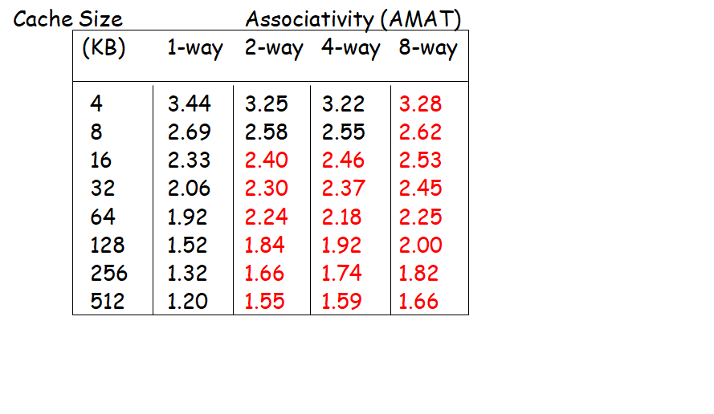

# Cache

## Cache Performance

### Average Memory Access Time (AMAT)

$$
\begin{aligned}
AMAT=&\frac{Whole~accesses~time}{All~memory~accesses~in~program}
\\\\=&\frac{Accesses~time~on~hitting+Accesses~time~on~miss }{All~memory~accesses~in~program}
\\\\=&Hit~time+(Miss~Rate\times Miss~penalty)
\\\\=&(HitTime_{Inst}+Miss~Rate_{Inst}\times Miss~penalty_{Inst})
\\&+(HitTime_{Data}+Miss~Rate_{Data}\times Miss~penalty_{Data})
\end{aligned}
$$

### CPU Time

$$
\begin{aligned}
&CPU~Time=(CPU~clock~cycles+Memory~stall~cycles)\times Clock~cycle~time\\\\
&Memory~stall~cycles=IC\times Mem~refs~per~inst\times Miss~rate\times ~Miss~penalty\\
&(其中IC表示指令数量)\\
\end{aligned}
$$

则有以下公式

$$
\begin{aligned}
&CPU~Time = IC\times(CPI_{Execution}+\frac{MemAccess}{Inst}\times Miss~rate\times Miss~penalty)\times Cycle~Time\\\\
&CPU~Time = IC\times(CPI_{Execution}+\frac{MemMisses}{Inst}\times Miss~penalty)\times Cycle~Time\\\\
&CPU~Time = IC\times(\frac{AluOps}{Inst}\times CPI_{AluOps}+\frac{Memory~Access}{Inst}\times AMAT)\times Cycle~Time
\end{aligned}
$$

## Improve Cache Performance

### Reduce the time to hit in the cache (4种)

#### 1. Small and Simple Caches

使用小型的，direct-mapped的cache

- 实现缓存所需的硬件越少，通过硬件的关键路径就越短。
- 无论是读还是写，direct-mapped都比set-associative快。
- cache和CPU芯片配合对于快速访问时间也非常重要。

#### 2. Way Prediction 

- 使用额外的位来预测下一个cache访问的方式或block。
- 如果预测器是正确的，则指令cache latency是1个时钟周期。
- 如果没有正确，则尝试另一个block，改变预测器的方式，并有一个额外的1个时钟周期的cache latency。

#### 3. Avoiding Address Translation during Indexing of the Cache

 

- 页表是内存中的大型数据结构，每次加载、存储或指令读取都需要两次内存访问。

##### TLB

使用TLB来加快虚拟地址到物理地址的转换。

 

##### Virtually Addressed Cache

把cache的访问放到TLB前面，只当cache miss的时候再访问TLB。

   

- Virtual cache

 

- 存在*aliases*问题

1.当某个进程修改了这个数据时，只在Cache中修改了自己的那一份，实际上Cache中其他有着相同物理地址的地方都需要被修改，这就引起了数据一致性的问题。

2.相同的物理内存会被映射到多个cache block，占用cache内存。

 

- 软件解决方法：将两个aliases的索引位和偏移位被强制为相同，那么别名地址将映射到缓存中的相同块。

##### Virtual indexed, physically tagged

由于虚拟地址和物理地址的page offset是相同的，那么可以将page offset作为cache的index，实现TLB和cache的并行访问。

 

- 存在问题：对于直接映射，cache的最大大小就是页的大小，这样会导致cache过小。
- 改进：使用组相连，例如对于4路组相连，最大大小就页大小的4倍。

#### 4. Trace caches

把连续执行的多条指令，一次打包放到cache, 而且是译码后的指令，节省cache空间和译码时间。

### Increase cache bandwidth (3种)

#### 1. Pipelined Caches 

通常来说，将数据写入cache有两步：

- 一个周期用来比较标签（Tag）

- 一个周期用来写入数据（如果命中）

使用流水线cache，将两步操作流水化，即添加一个缓冲块。当遇到下一个 Store 指令的时候，在其比较标签 Tag 的时候，来自上一个 Store 指令的数据就可以完成第二步：从缓冲区写入缓存。

#### 2. Nonblocking Caches

允许在当前 Cache Miss 仍未完成时继续处理其他内存访问请求，即允许CPU继续执行指令。

#### 3. Multibanked Caches

将cache划分为多个独立的bank每个 Bank 作为一个小型 Cache **可独立访问**。能够**并行处理多个访存需求**，减少数据争用。

### Reduce the miss penalty (4种)

#### 1. Multilevel Caches

在cache和主存中间再加一层更大但是相对慢的cache，减小miss penalty。

- AMAT计算

$$
\begin{aligned}
&AMAT = Hit Time_{L1} + Miss Rate_{L1} \times Miss Penalty_{L1}\\\\
&Miss Penalty_{L1} = Hit Time_{L2} + Miss Rate_{L2} \times Miss Penalty_{L2}\\\\
&\Longrightarrow\\\\
&AMAT= Hit Time_{L1} +  Miss Rate_{L1} \times (Hit Time_{L2} + Miss Rate_{L2} \times Miss Penalty_{L2})

\end{aligned}
$$

对于两层cache，有以下两个概念：

- **Local miss rate**: misses in this cache divided by the total number of memory accesses.
- **Global miss rate**: misses in this cache divided by the total number of memory accesses generated by the CPU 

对于第一层cache，两者都是$MissRate_{L1}$。

对于第二次cache，Local miss rate为$MissRate_{L2}$，Global miss rate为$MissRate_{L1}\times MissRate_{L2}$。

#### 2. Critical Word First and Early Restart

- **Critical Word First**: 在加载block时，优先加载需要的word，再加载剩余的words
- **Early Restart**: 一旦需要的word被加载，CPU就继续执行。

#### 3. Giving Priority to Read Misses over Writes

由于Read Miss会对CPU造成阻塞，因此在当Read Miss和Write竞争主存资源时，将Write的数据先放入Write Buffer，优先处理Read Miss，减少CPU等待时间。

#### 4. Merging write Buffer

- 如果地址与 Buffer 中已有写入数据相同，则合并（Merge），避免重复写入主存。

- 如果地址相邻且在同一 Cache Line 内，也可合并，减少主存访问次数。

### Reduce the miss rate (5种)

#### Miss rate产生原因

- **Compulsory**: 对块的第一次访问不在缓存中，因此必须将块放入缓存中。也被称为*cold start misses*或*first reference misses*。
- **Capacity**: Cache不足以放下程序所需的所有blocks，有的block会被替换掉再被重新读取。
- **Conflict**: 在使用direct-mapped或set-associative时，不同的block可能会对应同一个cache位置，造成竞争。也被称为*collision misses*或*interference misses*。
- **Coherence**: 由cache coherence产生的miss。

#### 1. Larger Block Size 

通过增大Block Size，能够增大一次读入的数据量，减少Compulsory造成的Miss Rate。

- 缺点：由于一次需要读取更多的数据，会增大Miss Penalty。同时，由于block增大导致cache里可以放下的blocks数量减少，会导致Conflict造成的Miss Rate增大

  

#### 2. Larger Caches

 

#### 3. Higher Associativity

通过使用更多的组相连，可以减少Conflict造成的miss rate。

- 缺点：组相连电路复杂，比较时间长，一个Cycle可能比较不完，周期加长，影响整个效率。

 

#### 4. Way Prediction and Pseudo-Associative Cache

- **Way Prediction**: 在多路组相连中，使用额外的位来对最可能命中的way进行预测，优先进行访问，提高组相连的运行速度。
- **Pseudo-Associative Cache**: 在direct-mapped中，在发生失效时提供一个或多个后备位置来减少Conflict造成的miss。在实现上使用一个不同的索引函数来查找另一个可能的缓存行位置。但是hit可能会需要多个周期。

#### 5. Compiler Optimizations

**Instructions**

- 在内存中对指令进行重新排序
- 利用开发工具分析冲突

**Data**

- **Merging Arrays**: 将多个单独的数组合并为一个包含复合元素的数组，提高spatial locality。
- **Loop Interchange**: 改变嵌套循环的顺序，使数据按照存储顺序访问。
- **Loop Fusion**: 将两个独立的循环合并，减少对数据的重复访问。
- **Blocking**: 在处理大规模数据时，避免一次性遍历整列或整行，而是以小块(Block)式处理，以提高temporal locality。

### Reduce the miss penalty and miss rate via parallelism (2种)

#### 1. Hardware Prefetching of Inst. and data

通过提前读取CPU所需的指令和数据来减少Compulsory造成的miss。

- 缺点：提前读取可能会替换掉其他有用的block，进而造成miss。
- 解决：将提前读取的blocks放到一个特殊的buffer，直到用到时再放入cache。

#### 2. Compiler-controlled prefetch

通过编译器插入提前读取数据的指令来提前进行数据读取。

- **Binding Prefetch**: 提前将数据直接写入寄存器。（必须是正确的地址和寄存器）
- **Non-Binding Prefetch**: 将数据写入cache。（允许出现错误）
